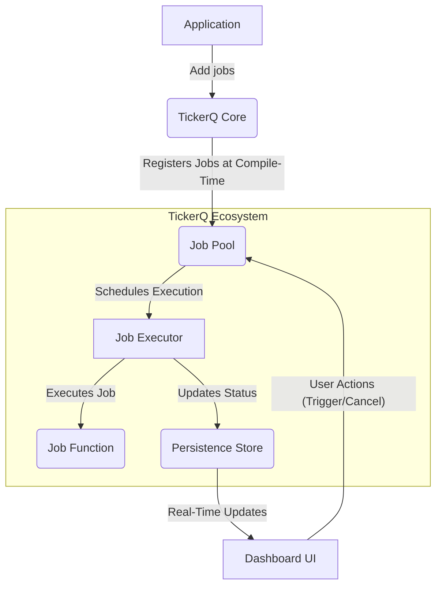

# ⏰TickerQ

### 1\. Core Principles: The Lightweight .NET Scheduler 🚀

TickerQ is designed as a modern, high-performance background task scheduler for .NET applications. Its core principles revolve around:

  * **Reflection-Free Architecture:** Unlike many other schedulers, TickerQ avoids using reflection at runtime. It leverages **C\# Source Generators** to discover and register jobs at compile time. This leads to faster startup times and better performance.
  * **Minimalistic and Dependency-Free Core:** The `TickerQ` core library is extremely lightweight, with no external dependencies. This makes it easy to integrate and reduces the overhead on your application.
  * **Flexibility with Persistence:** While the core is in-memory by default, it offers seamless integration with **Entity Framework Core** for persistent job storage, execution history, and distributed coordination.

-----

### 2\. Benefits: Why Choose TickerQ? ✨

  * **High Performance:** By eliminating runtime reflection, TickerQ offers superior performance and faster cold starts, which is crucial for modern, cloud-native applications.
  * **Developer-Friendly:** It uses simple C\# attributes (`[TickerFunction]`) to define jobs, making the code clean and easy to read. It also has excellent support for Dependency Injection (DI), allowing you to inject services directly into your jobs.
  * **Real-Time Dashboard:** A standout feature is its built-in, real-time dashboard. This web UI, powered by SignalR, provides live visibility into your jobs, allowing you to monitor status, view execution history, and even trigger or cancel jobs on the fly.
  * **Distributed Coordination:** With the EF Core integration, TickerQ provides native support for running across multiple application instances, using database-based distributed locking to ensure that jobs are executed only once.

-----


### 3\. Implementation Steps: Getting Started with TickerQ 🛠️

To implement TickerQ, you typically follow these steps:

1.  **Install NuGet Packages:** Add the necessary packages to your .NET project.

      * `TickerQ` (core library)
      * `TickerQ.EntityFrameworkCore` (for database persistence, optional)
      * `TickerQ.Dashboard` (for the real-time UI, optional)

2.  **Configure in `Program.cs`:**

      * Register TickerQ services in your `Program.cs` or `Startup.cs` file.
      * If using EF Core, configure the operational store and apply migrations to create the necessary tables.
      * Add the dashboard middleware if you want to use the UI.

3.  **Define Jobs:** Create a class and use the `[TickerFunction]` attribute to mark methods that should be scheduled. You can define both **Cron jobs** (recurring) and **Time jobs** (one-time).

    ```csharp
    // Example of a Cron Job
    public class CleanupJobs
    {
        [TickerFunction(FunctionName = "CleanupLogs", CronExpression = "0 0 * * *")]
        public void CleanupLogs()
        {
            // This method runs every midnight
        }
    }
    ```

-----

### 4\. Business Use Cases/Applications: Where TickerQ Shines 🏢

  * **E-commerce:** Schedule jobs to process abandoned shopping carts, send daily sales reports, or update product inventory overnight.
  * **Data Processing:** Run recurring tasks to clean up temporary files, aggregate daily metrics, or perform data synchronization with external services.
  * **Financial Services:** Schedule daily report generation, nightly data backups, or automated checks for fraudulent transactions.
  * **IoT & Monitoring:** Poll IoT devices for status updates at regular intervals or execute maintenance tasks on a schedule.

-----

### 5\. Data Flow Diagram: How TickerQ Works 🌊



  * **Explanation:** The application registers jobs with TickerQ. These jobs are managed in a central pool. The Job Executor then picks up and runs the scheduled tasks. Their status and history are stored in a persistence layer (like EF Core), which in turn feeds a real-time dashboard for monitoring and control.

-----

### 6\. When to Use and When Not to Use 🚦

**✅ Use TickerQ When:**

  * You need a fast, low-overhead job scheduler for .NET.
  * You prefer compile-time safety and performance over runtime reflection.
  * Your application uses Entity Framework Core and you want to leverage your existing database for persistence and distributed locking.
  * You need a simple, real-time dashboard out-of-the-box.

**❌ Avoid TickerQ When:**

  * You need persistence with a different database technology that doesn't have an EF Core provider (e.g., a specific NoSQL database that isn't supported).
  * Your job queuing needs are extremely high-volume and complex, potentially requiring a dedicated message broker like RabbitMQ or Kafka.

-----

### 7\. Best Practices: How to Get the Most Out of TickerQ ✅

  * **Keep Jobs Idempotent:** Design your jobs to be safely run multiple times without causing issues. This is a general best practice for all background tasks and helps with retry policies.
  * **Separate Concerns:** Keep your job logic lean. Inject services into your job methods to handle the business logic, rather than putting everything inside the job method itself.
  * **Use the Dashboard:** Don't just schedule jobs blindly. Use the dashboard to monitor performance, debug failed jobs, and get a clear picture of your background processing health.

-----

### 8\. TickerQ vs. Other Schedulers: A Quick Comparison 🆚

TickerQ's main competitors are Hangfire and Quartz.NET. Here’s a quick table to show the difference:

| Feature | TickerQ | Hangfire | Quartz.NET |
| :--- | :--- | :--- | :--- |
| **Job Discovery**| Compile-time (Source Gen) | Runtime (Reflection) | Runtime (Reflection) |
| **Performance**| Excellent (due to no reflection) | Good | Good |
| **DI Support**| Native & Seamless | Partial | Requires extra config |
| **Dashboard**| First-party, real-time | Basic | Third-party required |
| **EF Core**| Native Integration | Community-driven | N/A |

-----

### 9\. Summary: A Modern .NET Scheduler for Today's Apps 💡

TickerQ is an excellent choice for .NET developers who need a fast, modern, and developer-friendly background task scheduler. Its use of source generators and native EF Core integration makes it a powerful alternative to older, reflection-based libraries, providing a clean architecture and a useful dashboard right out of the box.

-----

### 10\. Related Topics 📚

  * **.NET Background Services:** The foundation for running long-running tasks in .NET.
  * **C\# Source Generators:** A powerful new feature in C\# that TickerQ uses for compile-time code generation.
  * **Distributed Systems & Locking:** The concepts behind ensuring a job runs only once in a multi-instance environment.
  * **Hangfire & Quartz.NET:** The established background job libraries that TickerQ aims to improve upon.


