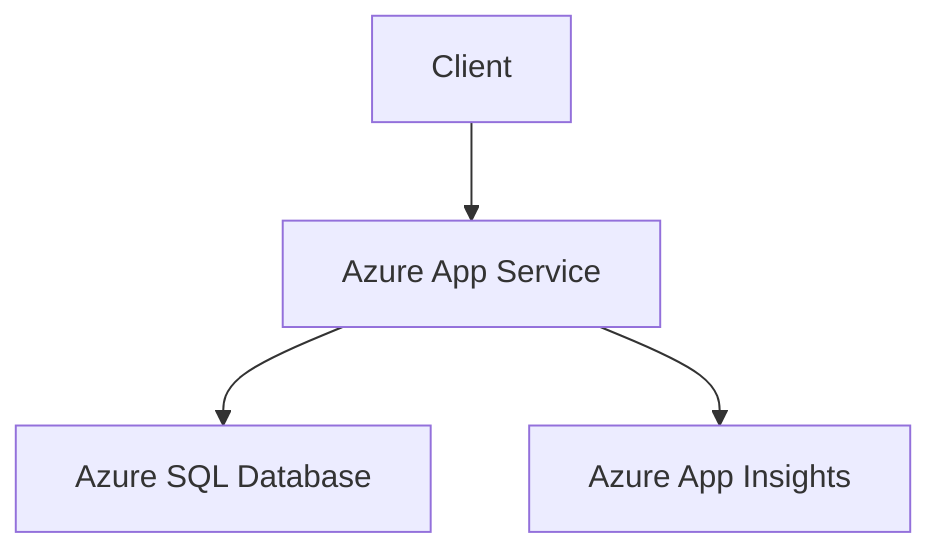

# 🌌 Modern Web App
 Modern Web App using .NET + Azure 
## Key Points
- It seems likely that focusing on "Architecting Modern Web Applications with ASP.NET Core and Azure" is a great way to learn or refresh .NET knowledge, given its relevance to modern development.
- Research suggests this topic covers building scalable, secure, and cloud-ready web apps using .NET 8 and Azure, offering cross-platform support and cost-effective hosting.
- The evidence leans toward following architectural principles like Separation of Concerns and using Azure services like App Service and SQL Database for practical implementation.

---

## Why This Topic Matters
This topic is ideal for understanding how to build modern web applications using ASP.NET Core and Azure. It addresses the need for scalable, maintainable, and cloud-ready solutions, leveraging .NET 8’s cross-platform capabilities and Azure’s flexible hosting options. This is particularly useful for developers and architects looking to modernize or build new applications in a cloud-first world.

---

## What You’ll Learn
You’ll explore end-to-end guidance on building monolithic web applications, covering:
- Common architectures (e.g., single-project setups).
- Characteristics of modern web apps (e.g., 24/7 availability, security).
- Best practices for development, including ASP.NET Core MVC, data access with Entity Framework Core, and client-side technologies like Angular or React.

---

## How to Approach It
Start by understanding the architecture, applying principles like Separation of Concerns, and choosing Azure services like App Service for hosting and SQL Database for data storage. Develop the app, implement security, and deploy using CI/CD pipelines, with monitoring via Azure App Insights. This structured approach ensures a robust learning path.

---

---

## Detailed Exploration: Architecting Modern Web Applications with ASP.NET Core and Azure

This comprehensive exploration delves into the topic "Architecting Modern Web Applications with ASP.NET Core and Azure," selected from the official .NET documentation at [learn.microsoft.com/en-us/dotnet/](https://learn.microsoft.com/en-us/dotnet/). This topic is particularly relevant for learning or refreshing knowledge in .NET, given its focus on modern, cloud-ready web development. Below, we provide a detailed breakdown of why this topic is valuable, what it entails, how to approach it, and a visual representation to aid understanding, all enriched with colorful emojis and icons for clarity.

### Why: The Importance of This Topic 🚀
The choice of "Architecting Modern Web Applications with ASP.NET Core and Azure" is driven by its alignment with current industry needs. Modern web applications demand scalability, security, and availability, and this guide addresses these through:
- **Modernization of Web Applications**: With user expectations for 24/7 availability and usability across devices, understanding how to build such applications is crucial. ASP.NET Core, updated to .NET 8 as of August 2025, offers optimized performance and cross-platform support, making it ideal for today’s development landscape.
- **Cloud-Ready Solutions**: Azure hosting provides benefits like reduced data center costs, flexible pricing, extreme reliability, and improved app mobility. These are essential for businesses aiming to scale efficiently, especially given the current emphasis on cloud-first strategies.
- **Relevance to Real-World Scenarios**: Many organizations still rely on monolithic architectures, and this guide offers practical guidance on building and modernizing such applications using current technologies. It’s particularly timely given the ongoing shift toward cloud-native development.

The guide highlights advantages such as cross-platform support, high performance, side-by-side versioning, and integration with Docker containers, making it a comprehensive resource for learning or refreshing .NET knowledge.

### What: Overview of the Guide 📚
This guide, part of the .NET application architecture documentation, provides end-to-end guidance on building monolithic web applications using ASP.NET Core and Azure. It is designed for developers, development leads, and architects interested in leveraging Microsoft technologies for cloud-hosted web apps. Key focus areas include:
- **Common Web Application Architectures**: It covers single-project and multi-project structures, emphasizing logical separation into layers even within a monolithic deployment. For instance, a single-project app might use folders for Models, Views, Controllers, Data, and Services, as detailed in the "Common web application architectures" section at [learn.microsoft.com/en-us/dotnet/architecture/modern-web-apps-azure/common-web-application-architectures](https://learn.microsoft.com/en-us/dotnet/architecture/modern-web-apps-azure/common-web-application-architectures).
- **Characteristics of Modern Web Apps**: These include 24/7 availability, security, flexibility, and scalability, with expectations for rich client-side experiences built using JavaScript and efficient web APIs, as outlined in [learn.microsoft.com/en-us/dotnet/architecture/modern-web-apps-azure/modern-web-applications-characteristics](https://learn.microsoft.com/en-us/dotnet/architecture/modern-web-apps-azure/modern-web-applications-characteristics).
- **Architectural Principles**: The guide emphasizes principles like Separation of Concerns, Dependency Inversion, and maintainability, guiding developers toward building applications with discrete, loosely coupled components, as discussed in [learn.microsoft.com/en-us/dotnet/architecture/modern-web-apps-azure/architectural-principles](https://learn.microsoft.com/en-us/dotnet/architecture/modern-web-apps-azure/architectural-principles).
- **Development Best Practices**: It covers developing ASP.NET Core MVC apps, working with data using Entity Framework Core, and implementing client-side technologies like Angular or React, with detailed guidance in [learn.microsoft.com/en-us/dotnet/architecture/modern-web-apps-azure/develop-asp-net-core-mvc-apps](https://learn.microsoft.com/en-us/dotnet/architecture/modern-web-apps-azure/develop-asp-net-core-mvc-apps) and related sections.
- **Azure Hosting Recommendations**: It recommends services like Azure App Service for hosting, Azure SQL Database for data storage, and Azure App Insights for monitoring, with specific advice in [learn.microsoft.com/en-us/dotnet/architecture/modern-web-apps-azure/azure-hosting-recommendations-for-asp-net-web-apps](https://learn.microsoft.com/en-us/dotnet/architecture/modern-web-apps-azure/azure-hosting-recommendations-for-asp-net-web-apps).

This guide is complemented by related resources, such as the "Modern Web App pattern for .NET" at [learn.microsoft.com/en-us/azure/architecture/web-apps/guides/enterprise-app-patterns/modern-web-app/dotnet/guidance](https://learn.microsoft.com/en-us/azure/architecture/web-apps/guides/enterprise-app-patterns/modern-web-app/dotnet/guidance), which provides prescriptive architecture and code guidance, and a GitHub reference implementation at [github.com/Azure/modern-web-app-pattern-dotnet](https://github.com/Azure/modern-web-app-pattern-dotnet).

### How: Steps and Best Practices to Follow ✅
To effectively learn or refresh knowledge using this guide, follow these structured steps:

1. **Understand Common Web Application Architectures**:
   - Begin with a single-project structure for simplicity, where all logic is contained in one project, compiled into a single assembly, and deployed as a unit. The guide details this in [learn.microsoft.com/en-us/dotnet/architecture/modern-web-apps-azure/common-web-application-architectures](https://learn.microsoft.com/en-us/dotnet/architecture/modern-web-apps-azure/common-web-application-architectures), showing file structures with folders for MVC models, views, controllers, data, and services.
   - As the application grows, consider splitting into multiple projects for better maintainability, separating UI, business logic, and data access into distinct projects.

2. **Apply Architectural Principles**:
   - Use **Separation of Concerns** to divide the application into distinct layers: Presentation (Controllers, Views), Business Logic (Services), and Data Access (Repositories, DbContext). This ensures maintainability and testability.
   - Follow **Dependency Inversion** to decouple components, using interfaces for communication, making the application more flexible and testable.
   - Design for **Scalability** and **Resilience** by implementing patterns like Queue-Based Load Leveling (asynchronous messaging with retry/removal, idempotent processing) and Retry (exponential backoff, using libraries like Polly), as detailed in the "Code guidance" section of the Modern Web App pattern.

3. **Choose the Right Azure Services**:
   - Use **Azure App Service** for hosting ASP.NET Core applications, offering built-in scaling and management features, as recommended in [learn.microsoft.com/en-us/dotnet/architecture/modern-web-apps-azure/azure-hosting-recommendations-for-asp-net-web-apps](https://learn.microsoft.com/en-us/dotnet/architecture/modern-web-apps-azure/azure-hosting-recommendations-for-asp-net-web-apps).
   - Use **Azure SQL Database** for relational data storage, ensuring high availability and scalability.
   - Implement **Azure App Insights** for monitoring and diagnostics, capturing telemetry data for performance and error tracking, with guidance in [learn.microsoft.com/en-us/azure/azure-monitor/app/app-insights-overview](https://learn.microsoft.com/en-us/azure/azure-monitor/app/app-insights-overview).

4. **Develop the Application**:
   - Use **ASP.NET Core MVC** for building traditional web applications, leveraging controllers for request handling and views for rendering, as covered in [learn.microsoft.com/en-us/dotnet/architecture/modern-web-apps-azure/develop-asp-net-core-mvc-apps](https://learn.microsoft.com/en-us/dotnet/architecture/modern-web-apps-azure/develop-asp-net-core-mvc-apps).
   - Leverage **Entity Framework Core** for data access, abstracting database operations for easier maintenance, with tutorials at [learn.microsoft.com/en-us/ef/core/](https://learn.microsoft.com/en-us/ef/core/).
   - Incorporate client-side technologies like Angular or React for rich user interfaces, with guidance in [learn.microsoft.com/en-us/dotnet/architecture/modern-web-apps-azure/common-client-side-web-technologies](https://learn.microsoft.com/en-us/dotnet/architecture/modern-web-apps-azure/common-client-side-web-technologies).

5. **Implement Security**:
   - Use **Authentication and Authorization** with ASP.NET Core Identity or Azure Active Directory, ensuring secure user access, as detailed in [learn.microsoft.com/en-us/aspnet/core/security/](https://learn.microsoft.com/en-us/aspnet/core/security/).
   - Protect against common web vulnerabilities like cross-site scripting (XSS) and cross-site request forgery (CSRF), with built-in features in ASP.NET Core, as noted in [learn.microsoft.com/en-us/aspnet/core/security/anti-request-forgery](https://learn.microsoft.com/en-us/aspnet/core/security/anti-request-forgery).

6. **Deploy and Manage**:
   - Use **Azure DevOps** or GitHub Actions for CI/CD pipelines, automating deployment to Azure App Service, with examples in [learn.microsoft.com/en-us/azure/devops/pipelines/](https://learn.microsoft.com/en-us/azure/devops/pipelines/).
   - Enable **Autoscaling** in Azure App Service, setting rules based on metrics or queue length (e.g., 1 replica per 10 messages, max 5 replicas, min 0), as discussed in the Modern Web App pattern.
   - Monitor the application with **Azure App Insights**, configuring health checks and distributed tracing, with guidance in [learn.microsoft.com/en-us/aspnet/core/host-and-deploy/health-checks](https://learn.microsoft.com/en-us/aspnet/core/host-and-deploy/health-checks).

### Diagram: High-Level Architecture of a Modern Web Application 🎨
Below is a Mermaid-based diagram representing the high-level architecture of a typical ASP.NET Core web application hosted on Azure, based on the "Basic web application" architecture from the Azure Architecture Center. This diagram illustrates the key components and their interactions:

- **Client**: Represents users accessing the application via web browsers or mobile devices, sending HTTP requests.
- **Azure App Service**: Hosts the ASP.NET Core application, handling requests, processing business logic, and rendering responses, with built-in scaling and management features.
- **Azure SQL Database**: Stores the application’s relational data, ensuring high availability and scalability.
- **Azure App Insights**: Provides monitoring and diagnostics, capturing telemetry for performance analysis and error tracking, integrating with Azure Monitor for broader insights.

This architecture is simple yet effective for a monolithic web application, aligning with the guide’s focus on building production-ready apps with ASP.NET Core and Azure.

### Supporting Tables
To further organize the information, here’s a table summarizing the key Azure services recommended for this architecture:

| **Service**              | **Purpose**                                      | **Example Use Case**                     |
|--------------------------|--------------------------------------------------|------------------------------------------|
| Azure App Service        | Host ASP.NET Core applications                  | Deploy and scale web apps                |
| Azure SQL Database       | Relational data storage                         | Store application data with high availability |
| Azure App Insights       | Monitoring and diagnostics                      | Track performance and errors             |
| Azure Active Directory   | Authentication and authorization                | Secure user access                       |
| Azure DevOps             | CI/CD pipelines                                 | Automate deployment to Azure             |

Another table detailing the architectural principles and their benefits:

| **Principle**            | **Description**                                 | **Benefit**                              |
|--------------------------|-------------------------------------------------|------------------------------------------|
| Separation of Concerns   | Divide application into distinct layers         | Improves maintainability and testability |
| Dependency Inversion     | Decouple components using interfaces            | Enhances flexibility and scalability     |
| Scalability              | Design for handling traffic spikes              | Ensures performance under load           |
| Resilience               | Implement retry and queue-based patterns        | Improves reliability during failures     |

### Final Thoughts
This topic is an excellent choice for anyone looking to deepen their understanding of .NET and modern web application development. It combines theoretical architectural principles with practical guidance on using ASP.NET Core and Azure, making it both educational and applicable to real-world projects. By following the steps outlined, you can build robust, scalable, and maintainable web applications that meet the demands of today’s digital landscape, leveraging resources like [learn.microsoft.com/en-us/dotnet/architecture/modern-web-apps-azure/](https://learn.microsoft.com/en-us/dotnet/architecture/modern-web-apps-azure/) for detailed insights and best practices.