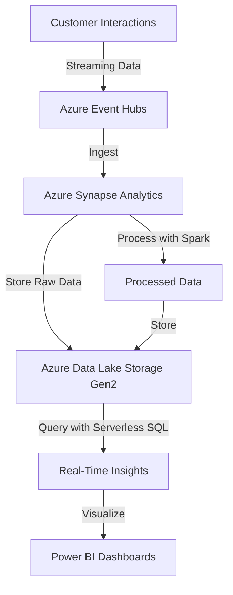

# Azure Synapse Analytics for Real-Time Data Analytics

## Concept Title
**Real-Time Data Analytics with Azure Synapse Analytics** 🛠️

This topic focuses on leveraging **Azure Synapse Analytics** to enable real-time data processing and analytics, combining big data and data warehousing capabilities for actionable insights. 🚀

## Problem Statement & Business Use Cases
**Problem Statement**: A retail e-commerce company needs to analyze customer behavior in real time to personalize product recommendations, optimize inventory, and detect fraudulent transactions. The company struggles with siloed data sources, high latency in traditional data warehouses, and the need for scalable analytics to handle peak shopping seasons.

**Business Use Cases**:
- **E-commerce**: Personalize customer experiences by analyzing browsing patterns and purchase history in real time.
- **Financial Services**: Detect fraudulent transactions by processing payment data streams instantly.
- **IoT**: Monitor and analyze sensor data from devices (e.g., smart warehouses) for predictive maintenance.
- **Healthcare**: Process patient data streams for real-time monitoring and alerts in telehealth platforms.

## Core Principles
Azure Synapse Analytics is a unified analytics platform that integrates data ingestion, storage, processing, and visualization. Key principles include:
- **Unified Analytics**: Combines data lakes, data warehouses, and big data analytics in one platform.
- **Serverless and Dedicated Resources**: Offers serverless SQL for ad-hoc queries and dedicated SQL pools for predictable performance.
- **Scalability**: Scales compute and storage independently to handle massive datasets and peak loads.
- **Real-Time Processing**: Supports streaming data via integration with Azure Event Hubs or Apache Kafka.
- **AI/ML Integration**: Enables advanced analytics with built-in machine learning capabilities.

## Pre-Requirements
The following Azure services and tools are required:
- **Azure Synapse Analytics** 🛠️: Unified analytics platform for data processing and querying.
- **Azure Event Hubs** 🛠️: Ingests real-time streaming data from customer interactions.
- **Azure Data Lake Storage Gen2** 🛠️: Stores raw and processed data for scalability and cost-efficiency.
- **Azure Synapse Pipelines** 🛠️: Orchestrates data ingestion and transformation workflows.
- **Microsoft Entra ID** 🛠️: Manages identity and access control for secure data access.

## Implementation Steps
1. **Set Up Azure Data Lake Storage**:
   - Create a Data Lake Storage Gen2 account in the Azure portal.
   - Configure a container to store raw and processed data.
2. **Configure Azure Event Hubs**:
   - Create an Event Hub namespace and an event hub for streaming customer data.
   - Set up a consumer group for Synapse to read data streams.
3. **Create Azure Synapse Workspace**:
   - Provision a Synapse workspace in the Azure portal.
   - Link the Data Lake Storage account as the primary storage.
4. **Ingest Streaming Data**:
   - Use Synapse Pipelines to create a pipeline that connects to Event Hubs.
   - Configure a streaming input to capture real-time data (e.g., customer clicks).
5. **Process Data with Synapse Spark**:
   - Create a Spark pool in Synapse to process streaming data.
   - Write a Spark job (e.g., in PySpark) to aggregate customer behavior (e.g., page views, add-to-cart events).
6. **Store and Query Data**:
   - Save processed data to Data Lake Storage in Parquet format.
   - Use serverless SQL pools to query data for real-time dashboards or reports.
7. **Visualize Insights**:
   - Integrate with Power BI (via Synapse integration) to create real-time dashboards for business users.
8. **Schedule and Monitor**:
   - Use Synapse Pipelines to schedule data workflows and monitor execution.

## Data Flow Diagram

## Security Measures
- **Encryption**: Enable encryption at rest using Azure Data Lake Storage’s built-in encryption and in-transit using TLS 1.2.
- **Identity and Access Management (IAM)**: Use Microsoft Entra ID to enforce least privilege access with role-based access control (RBAC) for Synapse resources.
- **Network Security**: Restrict access to Synapse workspaces using private endpoints and Azure Firewall.
- **Data Masking**: Apply dynamic data masking in Synapse SQL to protect sensitive customer data (e.g., PII).
- **Monitoring**: Enable Azure Monitor and Microsoft Defender for Cloud to detect and respond to threats in real time.

## Benefits
- **Scalability**: Handles massive data volumes during peak traffic (e.g., Black Friday sales) with auto-scaling compute.
- **Cost Efficiency**: Serverless SQL and pay-as-you-go pricing reduce costs for ad-hoc queries.
- **Real-Time Insights**: Enables instant personalization and fraud detection, improving customer satisfaction and security.
- **Unified Platform**: Simplifies analytics by integrating data ingestion, processing, and visualization in one tool.
- **Automation**: Synapse Pipelines automate data workflows, reducing manual overhead.

## Summary
Azure Synapse Analytics provides a powerful, unified platform for real-time data analytics, enabling e-commerce companies to process customer data instantly, personalize experiences, and detect fraud. By leveraging serverless and dedicated resources, businesses achieve scalability, cost efficiency, and robust security with minimal infrastructure overhead. 🚀