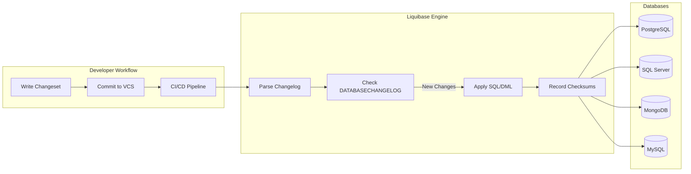

# 🏬 Liqubase - Schema Management

# 🔄 Liquibase: A Multi-Database Schema Change Management Solution

Liquibase is an open-source library and CLI tool that automates database schema changes across a variety of relational and NoSQL databases. It enables teams to version control, review, and deploy database changes in a reliable, repeatable fashion—eliminating manual SQL scripts and drift between environments.

---

## 🧐 1. What or Overview

- Liquibase tracks database changes in **changelogs** (XML, YAML, JSON, or SQL files).  
- Each change is defined as a **changeset**, which includes DDL or DML instructions (e.g., create table, add column, insert data).  
- It records applied changes in a **DATABASECHANGELOG** table to ensure idempotent deployments.  
- Native support for major databases:  
  - PostgreSQL 🐘 
  - MySQL & MariaDB 🐬 
  - Oracle 🐂 
  - Microsoft SQL Server 🗄️  
  - MongoDB 🍃 
  - Cassandra, DB2, SQLite, and more.

---

## 🤔 2. Why It’s Required

- **Schema Versioning**  
  Keep track of “who changed what and when” via VCS. No more hidden SQL scripts.  
- **Environment Consistency**  
  Automatically apply only missing changesets—avoiding drift between dev, QA, staging, and production.  
- **Rollback Support**  
  Define rollback logic per changeset to revert unwanted changes safely.  
- **Continuous Delivery**  
  Integrates with CI/CD pipelines (Jenkins, GitHub Actions, Azure Pipelines) for zero-touch deployments.  
- **Multi-Language & Multi-Platform**  
  Use one changelog to manage schemas across .NET, Java, Python, and more.

---

## 🛠️ 3. How to Implement

### A. Install Liquibase CLI

```bash
# macOS (Homebrew)
brew install liquibase

# Windows (Scoop)
scoop install liquibase

# Docker
docker pull liquibase/liquibase
```

### B. Create a Changelog

`changelog/db.changelog-master.yaml`  
```yaml
databaseChangeLog:
  - changeSet:
      id: 1
      author: ganesh
      changes:
        - createTable:
            tableName: person
            columns:
              - column:
                  name: id
                  type: BIGINT
                  autoIncrement: true
                  constraints:
                    primaryKey: true
              - column:
                  name: name
                  type: VARCHAR(100)
```

### C. Configure Connection

`liquibase.properties`  
```
url: jdbc:postgresql://localhost:5432/mydb
username: postgres
password: secret
changeLogFile: changelog/db.changelog-master.yaml
driver: org.postgresql.Driver
```

### D. Run Migrations

```bash
liquibase update
```

### E. Integrate in CI/CD (GitHub Actions Example)

```yaml
name: Database Migrations

on: push

jobs:
  migrate:
    runs-on: ubuntu-latest
    steps:
      - uses: actions/checkout@v3
      - name: Run Liquibase
        uses: liquibase-github-actions/run@v2
        with:
          liquibase-env-args: |
            --url=jdbc:postgresql://${{ secrets.DB_HOST }}:5432/${{ secrets.DB_NAME }}
            --username=${{ secrets.DB_USER }}
            --password=${{ secrets.DB_PASS }}
            update
```

> You can also use the Maven plugin in Java projects, Docker in Python/Node/.NET pipelines, or invoke the CLI directly in PowerShell for .NET apps.

---

## 📈 4. Architecture Diagram (Mermaid)



---

## ✨ 5. Summary

Liquibase empowers teams to bring **developer-friendly** version control to database schema changes, supporting both SQL and NoSQL systems. Its changelog model, robust rollback features, and seamless CI/CD integrations make it an essential tool for any organization aiming to deliver reliable, repeatable database updates across environments.

---

## 🔗 Reference Links

- Official Liquibase GitHub: https://github.com/liquibase/liquibase  
- Quickstart Guide: https://www.liquibase.org/get-started  
- Maven Plugin Docs: https://docs.liquibase.com/tools-integrations/maven/  
- Community Extensions (MongoDB): https://github.com/liquibase/liquibase-mongodb  
- GitHub Actions for Liquibase: https://github.com/liquibase-github-actions/run  

Happy migrating! 🚀
