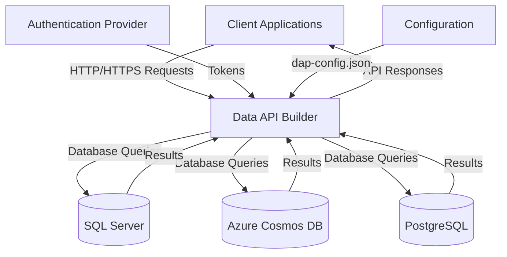
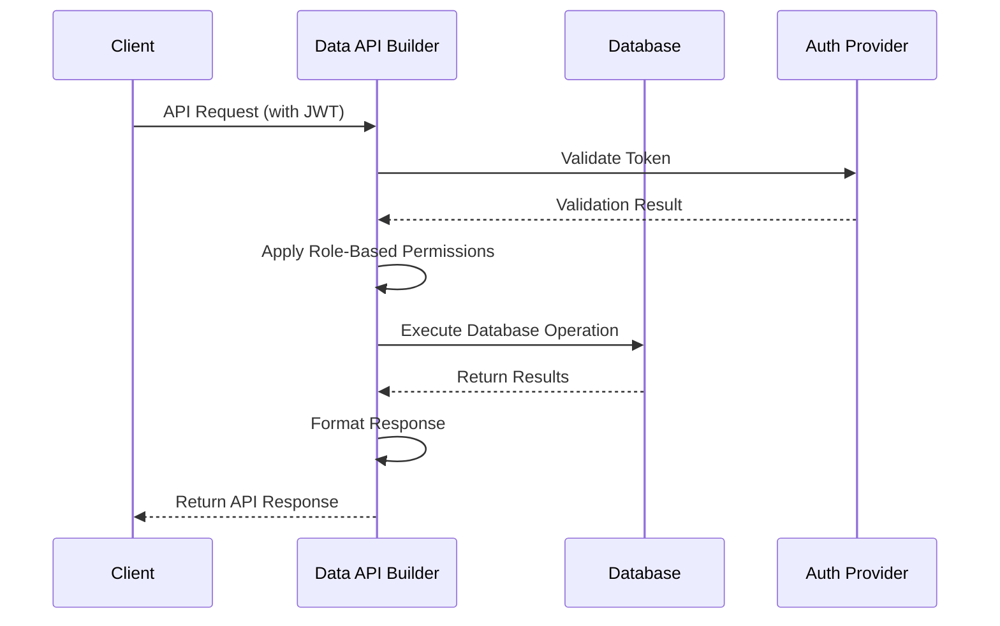
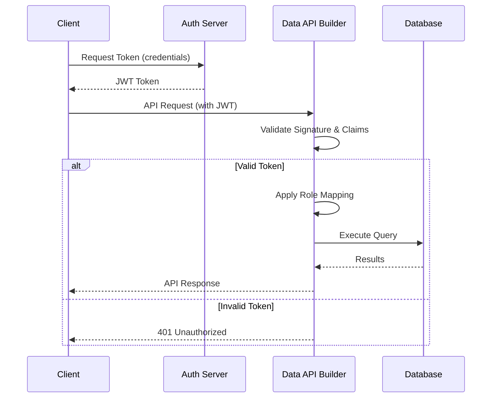
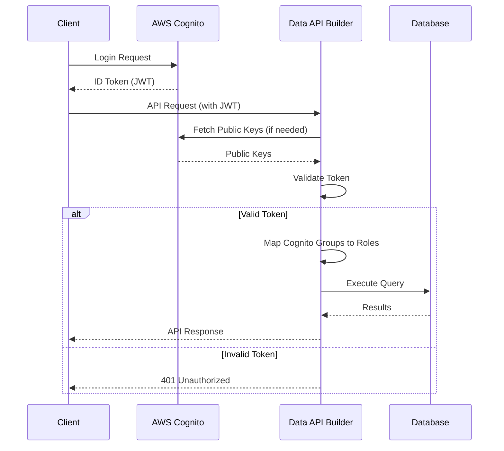

# 😈 Data API Builder

<font size=1> Microsoft Data API Builder: The Ultimate Guide to Rapid API Development
</font>

## What is Microsoft Data API Builder?

Microsoft Data API Builder (DAB) is an open-source engine designed to expose Azure databases to client applications and customers with minimal development effort.  It serves as a powerful middleware that automatically generates REST and GraphQL APIs directly from your database schema, eliminating the need for manual API development. 

Unlike traditional API development approaches that require significant backend coding, DAB operates as a lightweight service that sits between your database and client applications. It's platform-agnostic and works across various environments, making it suitable for both cloud and on-premises deployments.  

DAB supports multiple database platforms including SQL Server, Azure SQL Database, Azure Cosmos DB, PostgreSQL, and MySQL, providing a unified API layer regardless of your underlying data store.  This versatility makes it an ideal solution for organizations with heterogeneous database environments.

## Business Use Cases with Problem Statements

### Legacy Modernization
*Problem*: Many organizations struggle with modernizing legacy applications that directly connect to databases without proper API layers, creating security risks and maintenance challenges.

*Solution*: DAB provides an immediate API layer over existing SQL Server databases, allowing legacy systems to be gradually modernized while maintaining compatibility with new client applications.

### Rapid Prototyping
*Problem*: Development teams often waste valuable time building basic CRUD APIs during the early stages of application development.

*Solution*: With DAB, teams can instantly generate production-ready APIs from database schemas, accelerating the prototyping phase and allowing developers to focus on business logic rather than infrastructure.

### Microservices Integration
*Problem*: Creating consistent API interfaces across multiple database-backed services requires significant development effort and introduces inconsistencies.

*Solution*: DAB standardizes API creation across different database technologies, ensuring consistent authentication, authorization, and response formats regardless of the underlying data store.

## Architectural Overview



The architecture demonstrates how DAB acts as a unified API gateway that translates HTTP requests into database operations while handling authentication, authorization, and response formatting.

## Benefits of Data API Builder

1. **Accelerated Development**: Generate production-ready APIs in minutes rather than weeks
2. **Multi-Database Support**: Unified API layer across SQL Server, Cosmos DB, PostgreSQL, and MySQL 
3. **Built-in Security**: Comprehensive authentication via OAuth2/JWT and role-based authorization 
4. **Dual API Support**: Automatic generation of both REST and GraphQL endpoints from the same configuration
5. **Open Source**: Community-driven development with Microsoft backing, ensuring transparency and flexibility
6. **Cloud-Native**: Designed for containerization and easy integration with modern DevOps pipelines 
7. **Cost-Effective**: Eliminates the need for dedicated backend developers for basic API requirements

## Data Flow Overview



This diagram illustrates the complete request flow through DAB, highlighting the authentication, authorization, and data retrieval processes.

## Step-by-Step Implementation Guide

### 1. Hosting and Running Data API Builder in Docker

**Prerequisites**:
- Docker installed
- SQL Server instance running locally
- Sample databases (Northwind, Pub-Sub, Book-Author)

**Step 1: Create configuration file (dap-config.json)**
```json
{
  "$schema": "https://learn.microsoft.com/dotnet/azure/databases/data-api-builder/schemas/v1.0/dab-config.schema.json",
  "settings": {
    "cors": {
      "origins": ["*"]
    }
  },
  "database": {
    "connection-string": "Server=localhost;Database=Northwind;User Id=sa;Password=yourStrong(!)Password;",
    "provider": "mssql"
  },
  "runtime": {
    "host": {
      "mode": "development",
      "cors": true,
      "allow-headers": ["*"]
    }
  }
}
```

**Step 2: Run DAB in Docker**
```bash
docker run -d \
  -p 5000:5000 \
  -v $(pwd)/dap-config.json:/app/dap-config.json \
  --name dab-northwind \
  mcr.microsoft.com/azure-databases-data-api-builder:latest
```

**Step 3: Verify operation**
```bash
curl http://localhost:5000/Customers
```

**Multiple Database Configuration**:
To support multiple databases (Northwind, Pub-Sub, Book-Author), create separate DAB instances:

```bash
# Northwind
docker run -d -p 5000:5000 -v $(pwd)/northwind-config.json:/app/dap-config.json --name dab-northwind mcr.microsoft.com/azure-databases-data-api-builder:latest

# Pub-Sub
docker run -d -p 5001:5000 -v $(pwd)/pubsub-config.json:/app/dap-config.json --name dab-pubsub mcr.microsoft.com/azure-databases-data-api-builder:latest

# Book-Author
docker run -d -p 5002:5000 -v $(pwd)/bookauthor-config.json:/app/dap-config.json --name dab-bookauthor mcr.microsoft.com/azure-databases-data-api-builder:latest
```

Each configuration file would point to its respective database connection string.

### 2. Authenticating with Custom JWT Token

**Configuration**:
```json
"auth": {
  "provider": "custom",
  "jwt": {
    "issuer": "https://your-auth-server.com",
    "audience": "data-api-builder",
    "keys": [
      {
        "kty": "RSA",
        "use": "sig",
        "kid": "your-key-id",
        "n": "long-base64-encoded-modulus",
        "e": "AQAB"
      }
    ]
  }
}
```

**Authentication Flow**:



### 3. Authenticating with AWS Cognito

**Configuration**:
```json
"auth": {
  "provider": "cognito",
  "jwt": {
    "issuer": "https://cognito-idp.us-east-1.amazonaws.com/us-east-1_yourpoolid",
    "audience": ["your-client-id"],
    "discovery-uri": "https://cognito-idp.us-east-1.amazonaws.com/us-east-1_yourpoolid/.well-known/openid-configuration"
  }
}
```

**Authentication Flow**:



### 4. Role-Based API Access

Configure role-based access in dap-config.json:

```json
"entity": {
  "Customers": {
    "source": "Customers",
    "permissions": [
      {
        "role": "admin",
        "actions": ["*"]
      },
      {
        "role": "user",
        "actions": ["read", "update"],
        "fields": ["CustomerID", "CompanyName", "ContactName"]
      },
      {
        "role": "guest",
        "actions": ["read"],
        "fields": ["CustomerID", "CompanyName"]
      }
    ]
  }
}
```

Map JWT claims to roles using the "role-claim" setting:

```json
"auth": {
  "role-claim": "http://schemas.microsoft.com/ws/2008/06/identity/claims/role"
}
```

### 5. Performing Simple CRUD Operations

**Create (POST)**:
```bash
curl -X POST http://localhost:5000/Customers \
  -H "Content-Type: application/json" \
  -H "Authorization: Bearer <token>" \
  -d '{"CustomerID": "NEWCO", "CompanyName": "New Company"}'
```

**Read (GET)**:
```bash
curl http://localhost:5000/Customers?filter=Country eq 'USA'
```

**Update (PATCH)**:
```bash
curl -X PATCH http://localhost:5000/Customers(NEWCO) \
  -H "Content-Type: application/json" \
  -H "Authorization: Bearer <token>" \
  -d '{"ContactName": "John Doe"}'
```

**Delete (DELETE)**:
```bash
curl -X DELETE http://localhost:5000/Customers(NEWCO) \
  -H "Authorization: Bearer <token>"
```

### 6. Handling Multiple Joins/Complex Queries

For complex queries involving multiple tables:

```json
"entity": {
  "CustomerOrders": {
    "source": {
      "query": "SELECT c.CustomerID, c.CompanyName, o.OrderID, o.OrderDate, d.ProductID, p.ProductName, d.Quantity FROM Customers c JOIN Orders o ON c.CustomerID = o.CustomerID JOIN `Order Details` d ON o.OrderID = d.OrderID JOIN Products p ON d.ProductID = p.ProductID"
    },
    "permissions": [
      {
        "role": "user",
        "actions": ["read"]
      }
    ]
  }
}
```

Access the view via:
```bash
curl http://localhost:5000/CustomerOrders?filter=CompanyName eq 'Alfreds Futterkiste'
```

### 7. Executing Stored Procedures

Configure stored procedure access:

```json
"entity": {
  "GetCustomerOrders": {
    "source": "GetCustomerOrders",
    "permissions": [
      {
        "role": "user",
        "actions": ["execute"]
      }
    ],
    "parameters": {
      "CustomerID": "@CustomerID"
    }
  }
}
```

Execute the procedure:
```bash
curl "http://localhost:5000/GetCustomerOrders?CustomerID=ALFKI" \
  -H "Authorization: Bearer <token>"
```

### 8. Managing a Multi-Tenant Database

Implement multi-tenancy using row-level security:

```json
"entity": {
  "Customers": {
    "source": "Customers",
    "permissions": [
      {
        "role": "tenant-user",
        "actions": ["*"],
        "filter": "TenantID eq @claims.tenant_id"
      }
    ]
  }
}
```

In this configuration, DAB automatically applies the filter using the tenant_id claim from the JWT token, ensuring users only access their tenant's data.

### 9. Scaling and Caching

**Scaling**:
- Deploy multiple DAB instances behind a load balancer
- Use Docker Swarm or Kubernetes for orchestration
- Configure horizontal scaling based on API traffic

**Caching**:
While DAB doesn't provide built-in caching, integrate with:
- Azure API Management for response caching
- Redis cache in front of DAB
- CDN for static content

### 10. Auto-Configuration Reload

To automatically detect changes in dap-config.json without restarting:

```bash
docker run -d \
  -p 5000:5000 \
  -v $(pwd)/dap-config.json:/app/dap-config.json \
  mcr.microsoft.com/azure-databases-data-api-builder:latest \
  --watch
```

The `--watch` parameter enables file system monitoring, allowing DAB to reload configuration changes dynamically. 

### 11. Best Practices

1. **Security First**: Always use HTTPS, never expose DAB directly to the internet without API management
2. **Least Privilege**: Configure database accounts with minimal required permissions
3. **Environment Separation**: Use different configuration files for development, staging, and production
4. **Monitoring**: Implement logging and monitoring for API usage patterns and errors
5. **Version Control**: Store dap-config.json in source control with proper review processes
6. **Validation Rules**: Define field validation rules in configuration to prevent invalid data
7. **Performance Testing**: Test complex queries under load before production deployment
8. **Backup Configurations**: Maintain backups of working configuration files

## When to Use Data API Builder

**Use DAB when**:
- You need to rapidly expose database data via APIs
- Your application primarily requires standard CRUD operations
- You're working with relatively simple business logic that can be handled through database views or stored procedures
- You need to support both REST and GraphQL from the same data source
- You're modernizing legacy applications with minimal disruption
- Your team lacks backend development resources for custom API development

## When Not to Use Data API Builder

**Avoid DAB when**:
- You require complex business logic that cannot be implemented in the database layer
- You need custom API behaviors that don't map to database operations
- Your security requirements exceed DAB's role-based authorization capabilities
- You're working with highly sensitive data requiring specialized security controls beyond what DAB provides
- Your application requires extensive API customization that would be difficult to configure
- You need advanced API management features like quotas, rate limiting, or sophisticated transformation

## Conclusion

Microsoft Data API Builder represents a significant advancement in rapid API development, particularly for organizations looking to modernize database access without extensive development effort. By supporting multiple database platforms, providing dual REST and GraphQL interfaces, and offering robust security features including JWT authentication and role-based access control, DAB bridges the gap between traditional database applications and modern API-driven architectures.

While not suitable for every scenario, particularly those requiring complex business logic, DAB excels in situations where the primary need is to expose database content through well-structured APIs with minimal development overhead. Its open-source nature, container-friendly design, and integration with modern authentication systems make it a compelling option for many development teams.

As organizations continue their digital transformation journeys, tools like Data API Builder will play an increasingly important role in accelerating development while maintaining security and performance standards. By understanding both its capabilities and limitations, development teams can leverage DAB to significantly reduce time-to-market for data-driven applications.