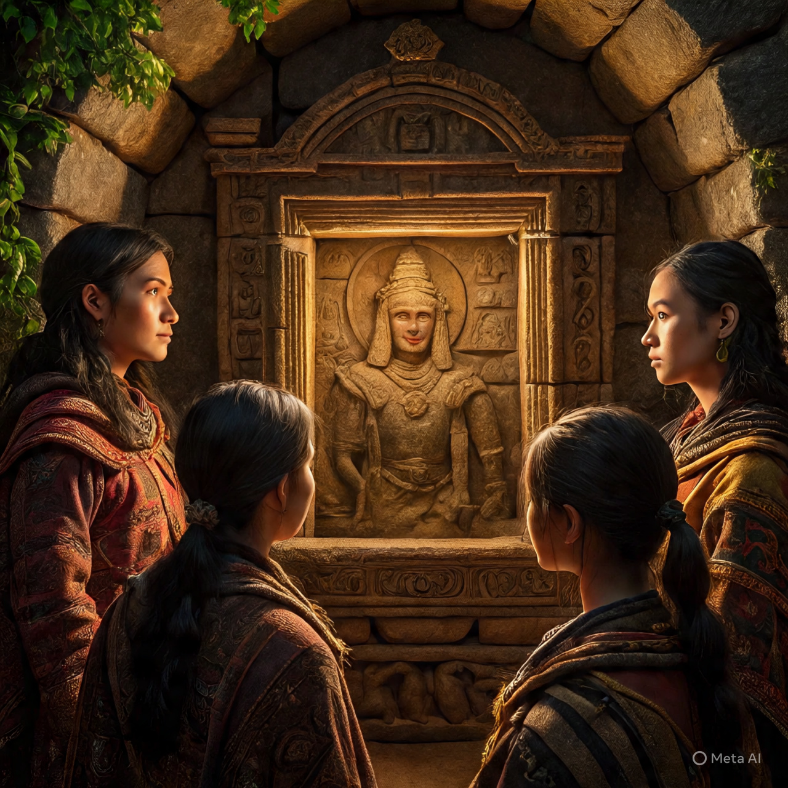
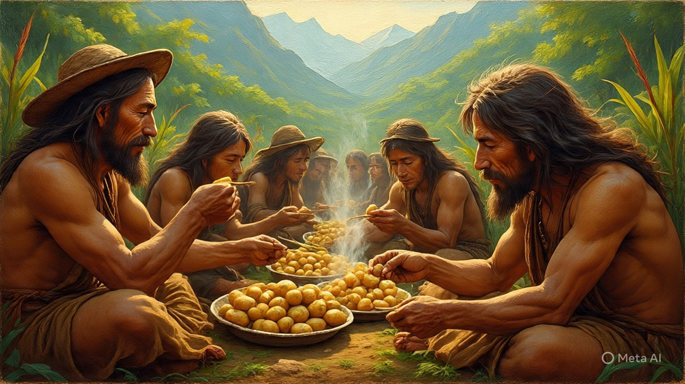

# 🥔 Incas Secret

## **Title: The Sweet Secret of the Incas** 🍬

**Category:** `History & Discovery of Things`

**Time Period:** `1500s`

**Once upon a time**, high up in the Andes Mountains of South America, lived the incredible Inca people. They were master builders, farmers, and astronomers. But they also had a special secret ingredient that was more valuable than gold to them: the `potato! 🥔`.

Now, you might be thinking, "What's so special about a potato?" Well, back in the `1500s`, people in Europe had never seen a potato before. They had no idea that this humble little vegetable even existed.

The `Incas` had been growing potatoes for thousands of years. They had learned how to grow them in the cold, rocky mountains. They even figured out how to freeze-dry them so they could be stored for a very long time! This was super important because it meant they always had food, even when the weather was bad. ❄️

Then, one day, explorers from `Spain` arrived. They were amazed by the Incan civilization and their wonderful food. They saw the Incas eating these strange, lumpy vegetables and decided to take some back to Europe with them.

At first, the Europeans were very suspicious of the potato. They thought it was weird and even believed it was `poisonous!` They would grow the plants but throw away the part we eat today and try to eat the poisonous leaves instead. Oops! 🤦‍♀️

But a few `brave` people started experimenting. They realized that if you cooked the potato, it was delicious and filling. Slowly but surely, the potato became popular. It was easy to grow and helped many people from going hungry.

**Factual Element:** It's a fact that potatoes were first cultivated in the `Andes Mountains` and were a staple food for the Inca people long before they were introduced to Europe by Spanish explorers in the 16th century.

**Moral of the Story:** Don't be afraid to try new things, especially if they are good for you! Sometimes, the greatest discoveries are hidden in plain sight. 🤩
