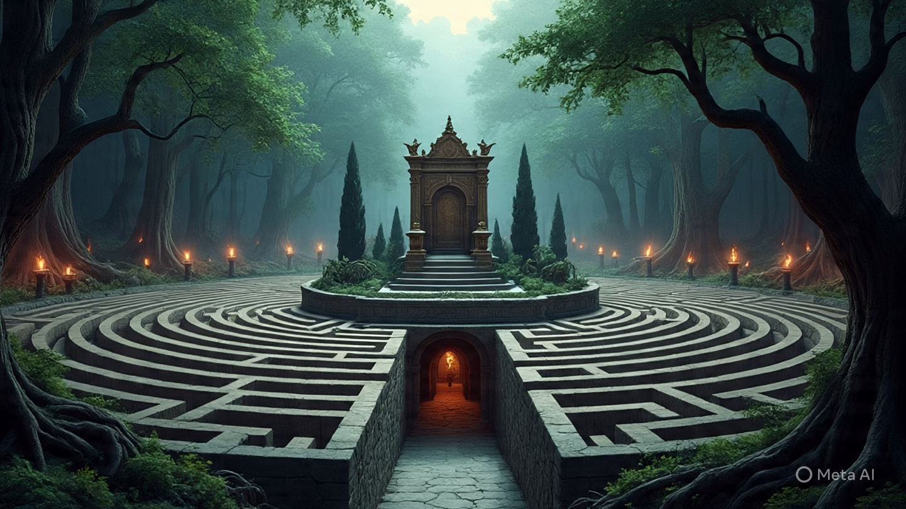

# Labyrinth's Secret 
 The Story of the Labyrinth's Secret 

**Genre:** Mythology, Adventure 🏛️

Long ago, in the glorious city of Athens, a shadow of fear loomed large. Every year, Athens had to send a tribute of seven young men and seven young women to the island of Crete. This was a terrible price to pay to King Minos, who would feed them to a terrifying creature called the **Minotaur**. 🐂

The Minotaur was half-man, half-bull, and it lived in a vast, twisting maze called the **Labyrinth**. The maze was so complicated that no one who entered had ever found their way out.

One year, a brave young prince named **Theseus** volunteered to go to Crete as one of the tributes. His father, the King of Athens, was heartbroken but knew he could not stop his son. As Theseus sailed away, his ship's sails were black, a sign of mourning. He promised his father that if he succeeded, he would change the sails to white on his return. ⛵

When Theseus arrived in Crete, the beautiful Princess **Ariadne**, daughter of King Minos, saw him and fell in love. She couldn't bear the thought of him being lost in the Labyrinth. Secretly, she gave him a magical ball of thread and a sharp sword. "Unroll the thread as you go," she whispered, "and you will always be able to find your way back out." 🧵

With the sword in hand and the magical thread tucked away, Theseus bravely entered the Labyrinth. He walked deeper and deeper into the stone maze, the thread unspooling behind him. Suddenly, he heard a loud, bellowing roar. The Minotaur! 😡

**[Preview: An image of a dark, stone maze with twisting passages, Theseus holding a glowing ball of thread and a sword.]**

A fierce battle began. Theseus fought with all his might, and with the help of the sharp sword, he managed to defeat the fearsome Minotaur. He had done it! The beast was gone forever.

He then followed the magical thread all the way back to the entrance, where Ariadne was waiting for him. Together, they sailed away, along with the other young Athenians, to freedom. In his haste and excitement, Theseus forgot to change the black sails of his ship to white.

**[Preview: An image of a ship with black sails sailing on a calm, blue sea.]**

Back in Athens, Theseus's father watched the sea every day. When he saw the black-sailed ship returning, he thought his son had been killed. Overcome with grief, he threw himself into the sea, which has been called the Aegean Sea ever since.

This story, like many myths, is rooted in some real-world history! While we don't know if a real Minotaur existed, archaeologists discovered the ruins of a massive palace on the island of Crete, called the **Palace of Knossos**. It had hundreds of rooms and complex corridors, which might have inspired the idea of the Labyrinth! 🏛️

**Moral of the Story:** Courage and cleverness are a powerful combination. It's not just physical strength that helps us overcome our biggest challenges—sometimes, a clever solution is the key to success! ✨