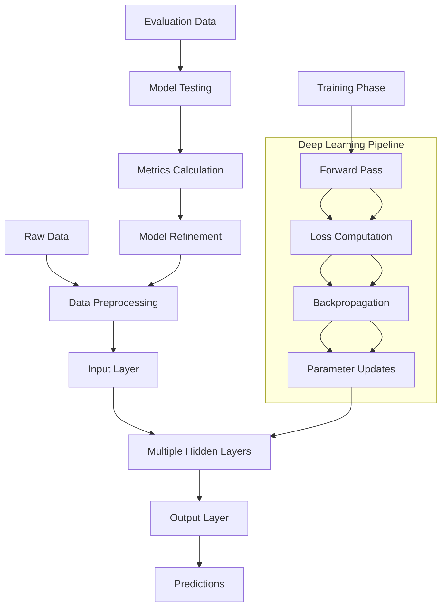

# Deep Learning

## Deep Learning

### What?

Deep learning is a subset of machine learning that utilizes multi-layered neural networks, known as deep neural networks, to model and extract high-level abstractions from complex data. These networks automatically learn hierarchical representations, enabling them to handle tasks involving large-scale, unstructured data like images, audio, and text.

### Why?

Deep learning is crucial because it surpasses traditional machine learning in accuracy for intricate problems by learning features directly from raw data, reducing the need for manual feature engineering. It drives breakthroughs in AI applications, such as real-time object detection and natural language understanding, making systems more intelligent and efficient.

### Where?

Deep learning is applied in fields like computer vision (e.g., medical imaging analysis), speech recognition (e.g., virtual assistants), natural language processing (e.g., sentiment analysis), recommendation systems (e.g., personalized content on streaming platforms), and robotics (e.g., autonomous navigation).

### How?

Deep learning works by stacking multiple layers of neurons in neural networks, where each layer transforms the input through weights, biases, and activation functions. Training involves forward propagation to compute outputs, loss calculation to measure errors, and backpropagation with optimizers like Adam to adjust parameters, often using large datasets and GPUs for computation.

### When?

Deep learning is employed when dealing with high-dimensional data and tasks requiring end-to-end learning, such as during the development of AI models for predictive analytics or in production environments for inference on edge devices. It's ideal for scenarios with abundant labeled data and computational resources available.

### Lifecycle

The lifecycle of deep learning models includes:

1. **Problem Formulation**: Define objectives and select appropriate architectures.
2. **Data Acquisition and Preparation**: Gather, augment, and preprocess datasets.
3. **Model Architecture Design**: Build layers, choose activations, and set hyperparameters.
4. **Training and Optimization**: Train on data, tune with techniques like dropout or regularization.
5. **Evaluation and Validation**: Assess performance using metrics like precision, recall, or mean average precision.
6. **Deployment**: Integrate into applications, often with model compression for efficiency.
7. **Monitoring and Iteration**: Monitor drift, retrain with new data, and refine as needed.

### Data Flow Diagram using Mermaid

### Cloud Provider

* **AWS**: Amazon SageMaker supports deep learning with built-in frameworks like TensorFlow, PyTorch, and MXNet, offering distributed training and inference endpoints.
* **Azure**: Azure Machine Learning provides deep learning tools with ONNX Runtime for interoperability and AutoML for hyperparameter tuning.
* **Google Cloud**: Vertex AI enables deep learning workflows with TensorFlow Extended (TFX) for production pipelines and TPUs for accelerated training.

### Related Topics

Neural Networks, Convolutional Neural Networks (CNNs), Generative Adversarial Networks (GANs).

### Innovation Spot Light

Emerging innovations include diffusion models for high-fidelity image generation, as seen in advanced text-to-image systems, and federated learning techniques that enable training on decentralized data while preserving privacy, enhancing scalability in edge computing environments.

### Things to Keep in Mind

* Manage overfitting with techniques like data augmentation and early stopping, especially with deep architectures.
* Address ethical concerns by auditing for biases in datasets and ensuring transparency in model decisions.
* Optimize for hardware, as deep learning demands significant memory and processing power; consider quantization for deployment.
* Stay updated on frameworks and libraries to leverage the latest efficiencies and pre-trained models.

### Conclusion

Deep learning revolutionizes AI by enabling machines to learn complex patterns autonomously, powering transformative applications across industries. By integrating it with cloud platforms and focusing on best practices, developers can create scalable, high-performance solutions that push the boundaries of intelligent systems.
