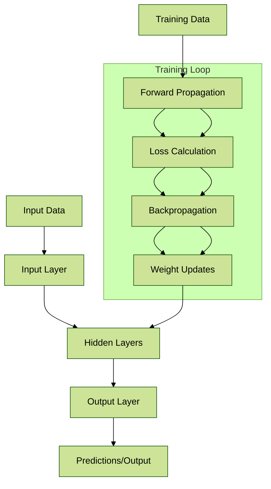

# Neural Networks

### What?

Neural networks are computational models inspired by the human brain's structure and function. They consist of interconnected layers of nodes (neurons) that process data through weighted connections, enabling the system to learn patterns, make predictions, or classify information from input data.

### Why?

Neural networks are essential because they excel at handling complex, non-linear relationships in data that traditional algorithms struggle with. They power advancements in automation, decision-making, and intelligent systems by learning from examples rather than explicit programming, leading to improved accuracy in tasks like image recognition and natural language processing.

### Where?

Neural networks are applied in various domains such as computer vision (e.g., facial recognition in security systems), natural language processing (e.g., chatbots and translation services), healthcare (e.g., diagnosing diseases from medical images), finance (e.g., fraud detection), and autonomous vehicles (e.g., object detection on roads).

### How?

Neural networks operate by feeding input data through layers: an input layer receives data, hidden layers perform computations using activation functions and weights adjusted via backpropagation, and an output layer produces results. Training involves minimizing a loss function using optimization algorithms like gradient descent, where the network iteratively adjusts parameters based on errors between predicted and actual outputs.

### When?

Neural networks are used when dealing with large datasets and tasks requiring pattern recognition or prediction, such as during model training phases in machine learning pipelines or real-time inference in deployed applications. They are particularly relevant in scenarios where data volume allows for effective learning without overfitting.

### Lifecycle

The lifecycle of a neural network includes:

1. **Problem Definition**: Identify the task and gather requirements.
2. **Data Preparation**: Collect, clean, and preprocess data.
3. **Model Design**: Choose architecture (e.g., feedforward, convolutional) and hyperparameters.
4. **Training**: Feed data, compute losses, and optimize weights.
5. **Evaluation**: Test on validation data using metrics like accuracy or F1-score.
6. **Deployment**: Integrate into production environments for inference.
7. **Monitoring and Maintenance**: Track performance, retrain with new data, and update as needed.

### Data Flow Diagram using Mermaid

### Cloud Provider

* **AWS**: SageMaker provides built-in algorithms and frameworks like TensorFlow and PyTorch for building, training, and deploying neural networks at scale.
* **Azure**: Azure Machine Learning offers automated ML tools and integration with ONNX for neural network experimentation and deployment.
* **Google Cloud**: Vertex AI supports end-to-end neural network workflows, including AutoML for automated architecture search and model optimization.

### Related Topics

Deep Learning, Convolutional Neural Networks (CNNs), Recurrent Neural Networks (RNNs).

### Innovation Spot Light

Recent innovations include transformer-based neural networks like those in GPT models, which have revolutionized natural language understanding, and neuromorphic computing hardware that mimics brain efficiency for edge devices, enabling faster, low-power AI processing.

### Things to Keep in Mind

* Ensure sufficient data quality and quantity to avoid overfitting or underfitting.
* Monitor for bias in training data to promote ethical AI outcomes.
* Consider computational resources, as deep networks require significant GPU/TPU power.
* Regularly validate models against new data to maintain performance over time.
* Be aware of interpretability challenges, as neural networks can act as "black boxes."

### Conclusion

Neural networks form the backbone of modern AI, enabling sophisticated learning from data to solve real-world problems efficiently. By understanding their mechanics and integrating them with cloud services, practitioners can build robust, scalable solutions that drive innovation across industries.
