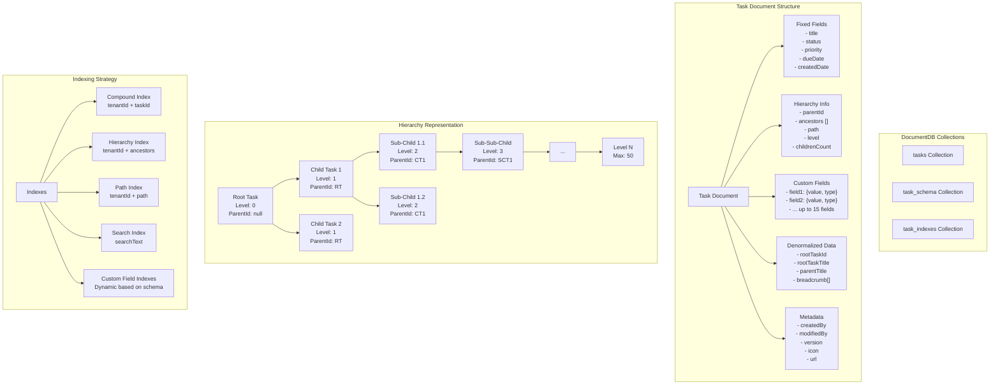
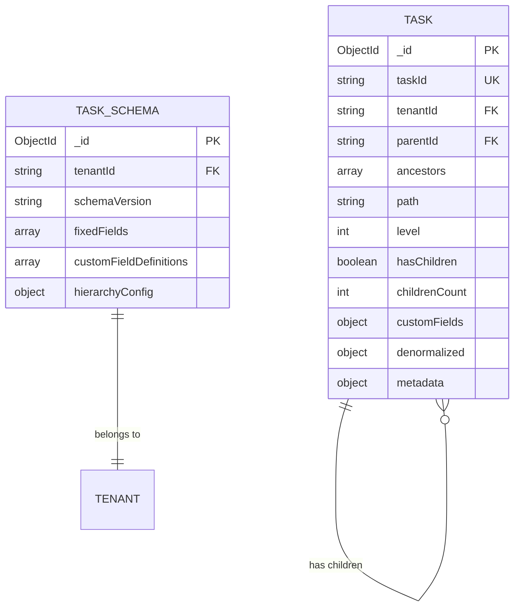

# Multi-Tenenet DB

## :bank: Multi-Tenent + Multi hierachial Schema

### :question:Problem Statement

Recently one of our client, has requested for an application design, which requires customization by the end-user itself. Such as the <mark style="color:$primary;">"end-user</mark>" can create,

1. Project
   1. The project can have multiple fields(static & custom), the custom fields can be defined by the end-user eg. "Estimated Hours", "Assigned By", "Tag", "Last Comments" etc.&#x20;
   2. The end-user can also define types for each custom fields, as "int", "string", "date" etc.
2. Tasks for the Project
   1. Each task also have custom filelds, which is again defined by the end-user similar to "Project".
   2. The task can have sub-tasks, similar to Task, each can have custom fields as well.
   3. The level of sub-task can go upto 50 or 100. our schema defintion should sustain this and should have flexibilty.
3. The system should be
   1. Searchable
   2. Filtering based on custom fields
   3. Sortings and all sort of DB Operations.

***

> :money\_with\_wings: Basically or at a high level we can think of it as a workflow appliation, similar to "Monday", "Asana" or "ClickUp", where we can defined multiple custom fields and custom levels can be achived.&#x20;


<details>

<summary>Example Screnario in Short</summary>

1. Task 1 (may have 5 fixed fields, 15 custom fields and each will have different data types available within C#)
   1. Sub-Task-1 of 'Task-1' (may have 5 fixed fields, 15 custom fields and each will have different data types available within C#)
   2. Sub-Task-2 of 'Sub-Task-1' and goes on up to 50.

</details>


> :money\_mouth: The worst part is that we can anticipate upto 80 million records, and each sub-task may have up to 10 million sub-tasks and it may goes on. With the given problem statement we have defined the schema which suits our workflow, yet to identify the performance but at a initial stage it is coming our very well.

***

### :person\_raising\_hand: Solution

#### Below is the schema structure for the given problem above.&#x20;

<details>

<summary>Collection: project/tasks</summary>

```json
{
  "_id": ObjectId("507f1f77bcf86cd799439011"),
  "tenantId": "tenant_001",
  "taskId": "TASK-2024-001",
  
  // Fixed Fields (5)
  "title": "Implement Authentication Module",
  "status": "in_progress",
  "priority": "high",
  "dueDate": ISODate("2024-12-31T23:59:59Z"),
  "createdDate": ISODate("2024-01-15T10:30:00Z"),
  
  // Hierarchy Information
  "parentId": "TASK-2024-000",  // null for root tasks
  "ancestors": ["TASK-2024-000"], // Array of all ancestor IDs for efficient queries
  "path": "/TASK-2024-000/TASK-2024-001", // Materialized path
  "level": 1, // Depth in hierarchy (0 for root)
  "hasChildren": true,
  "childrenCount": 3,
  
  // Custom Fields (up to 15, tenant-defined)
  "customFields": {
    "assignee": {
      "value": "john.doe@company.com",
      "type": "string",
      "displayName": "Assignee"
    },
    "estimatedHours": {
      "value": 40,
      "type": "number",
      "displayName": "Estimated Hours"
    },
    "department": {
      "value": "Engineering",
      "type": "string",
      "displayName": "Department"
    },
    "budget": {
      "value": 5000.00,
      "type": "decimal",
      "displayName": "Budget"
    },
    "isUrgent": {
      "value": true,
      "type": "boolean",
      "displayName": "Urgent Flag"
    },
    "tags": {
      "value": ["backend", "security", "Q1-2024"],
      "type": "array",
      "displayName": "Tags"
    },
    "attachments": {
      "value": [
        {
          "name": "requirements.pdf",
          "url": "https://storage.example.com/req.pdf",
          "size": 1024000
        }
      ],
      "type": "object_array",
      "displayName": "Attachments"
    },
    "completionDate": {
      "value": ISODate("2024-03-15T00:00:00Z"),
      "type": "date",
      "displayName": "Completion Date"
    }
  },
  
  // Denormalized data for performance
  "denormalized": {
    "rootTaskId": "TASK-2024-000",
    "rootTaskTitle": "Q1 2024 Product Development",
    "parentTitle": "Backend Development",
    "breadcrumb": [
      {"id": "TASK-2024-000", "title": "Q1 2024 Product Development"},
      {"id": "TASK-2024-001", "title": "Implement Authentication Module"}
    ]
  },
  
  // Metadata
  "metadata": {
    "createdBy": "admin@company.com",
    "modifiedBy": "john.doe@company.com",
    "modifiedDate": ISODate("2024-01-20T14:30:00Z"),
    "version": 2,
    "icon": "https://icons.example.com/task.png",
    "url": "https://app.example.com/tasks/TASK-2024-001"
  },
  
  // Search optimization
  "searchText": "implement authentication module backend development q1 2024 product development john.doe engineering"
}
```

</details>

#### <i class="fa-plus">:plus:</i>

<details>

<summary>Collection: task_schema (Per Tenant Configuration)</summary>

```json
{
  "_id": ObjectId("607f1f77bcf86cd799439012"),
  "tenantId": "tenant_001",
  "schemaVersion": "1.0",
  "fixedFields": [
    {"name": "title", "type": "string", "required": true, "searchable": true},
    {"name": "status", "type": "string", "required": true, "searchable": true},
    {"name": "priority", "type": "string", "required": true, "searchable": true},
    {"name": "dueDate", "type": "date", "required": false, "searchable": true},
    {"name": "createdDate", "type": "date", "required": true, "searchable": true}
  ],
  "customFieldDefinitions": [
    {
      "fieldName": "assignee",
      "displayName": "Assignee",
      "dataType": "string",
      "required": false,
      "searchable": true,
      "sortable": true,
      "defaultValue": null,
      "validation": {
        "pattern": "^[a-zA-Z0-9._%+-]+@[a-zA-Z0-9.-]+\\.[a-zA-Z]{2,}$"
      }
    },
    {
      "fieldName": "estimatedHours",
      "displayName": "Estimated Hours",
      "dataType": "number",
      "required": false,
      "searchable": true,
      "sortable": true,
      "defaultValue": 0,
      "validation": {
        "min": 0,
        "max": 999
      }
    },
    {
      "fieldName": "tags",
      "displayName": "Tags",
      "dataType": "array",
      "required": false,
      "searchable": true,
      "sortable": false,
      "defaultValue": [],
      "validation": {
        "maxItems": 10
      }
    }
  ],
  "hierarchyConfig": {
    "maxDepth": 50,
    "maxChildrenPerTask": 1000000
  }
}
```

</details>

### :exclamation: Example JSON Data Structure

#### Root Task Example (Level 0)

```json
{
  "_id": "507f1f77bcf86cd799439011",
  "tenantId": "tenant_001",
  "taskId": "TASK-2024-000",
  "title": "Q1 2024 Product Development",
  "status": "active",
  "priority": "high",
  "dueDate": "2024-03-31T23:59:59Z",
  "createdDate": "2024-01-01T00:00:00Z",
  "parentId": null,
  "ancestors": [],
  "path": "/TASK-2024-000",
  "level": 0,
  "hasChildren": true,
  "childrenCount": 5,
  "customFields": {
    "budget": {
      "value": 500000,
      "type": "decimal",
      "displayName": "Total Budget"
    },
    "projectManager": {
      "value": "sarah.johnson@company.com",
      "type": "string",
      "displayName": "Project Manager"
    }
  }
}
```

#### Child Task Example (Level 1)

```json
{
  "_id": "507f1f77bcf86cd799439012",
  "tenantId": "tenant_001",
  "taskId": "TASK-2024-001",
  "title": "Backend Development",
  "status": "in_progress",
  "priority": "high",
  "dueDate": "2024-02-28T23:59:59Z",
  "createdDate": "2024-01-05T00:00:00Z",
  "parentId": "TASK-2024-000",
  "ancestors": ["TASK-2024-000"],
  "path": "/TASK-2024-000/TASK-2024-001",
  "level": 1,
  "hasChildren": true,
  "childrenCount": 3,
  "customFields": {
    "team": {
      "value": "Backend Team Alpha",
      "type": "string",
      "displayName": "Team"
    },
    "sprint": {
      "value": 3,
      "type": "number",
      "displayName": "Sprint Number"
    }
  }
}
```

#### Sub-Child Task Example (Level 2)

```json
{
  "_id": "507f1f77bcf86cd799439013",
  "tenantId": "tenant_001",
  "taskId": "TASK-2024-002",
  "title": "Implement JWT Authentication",
  "status": "completed",
  "priority": "critical",
  "dueDate": "2024-01-31T23:59:59Z",
  "createdDate": "2024-01-10T00:00:00Z",
  "parentId": "TASK-2024-001",
  "ancestors": ["TASK-2024-000", "TASK-2024-001"],
  "path": "/TASK-2024-000/TASK-2024-001/TASK-2024-002",
  "level": 2,
  "hasChildren": false,
  "childrenCount": 0,
  "customFields": {
    "assignee": {
      "value": "developer1@company.com",
      "type": "string",
      "displayName": "Assignee"
    },
    "storyPoints": {
      "value": 8,
      "type": "number",
      "displayName": "Story Points"
    },
    "completedDate": {
      "value": "2024-01-28T16:30:00Z",
      "type": "date",
      "displayName": "Completed Date"
    }
  }
}
```

### :trident: Mermaid Diagram - Schema Structure



### :expressionless: Relationship Diagram Explanation

#### Parent-Child Relationships

The relationship model uses a **reference-based approach with denormalization** for optimal performance:



#### Relationship Types:

1. **Direct Parent-Child**:
   * Each task has a `parentId` field pointing to its immediate parent
   * Root tasks have `parentId: null`
2. **Ancestor Chain**:
   * `ancestors` array contains all parent IDs up to the root
   * Enables efficient queries for entire branches
3. **Materialized Path**:
   * `path` field stores the complete hierarchical path
   * Format: `/root/parent1/parent2/current`
   * Supports regex queries for subtree operations
4. **Level Tracking**:
   * `level` field indicates depth (0 for root, max 50)
   * Useful for level-specific queries and depth validation

### :heavy\_equals\_sign: Indexing Strategy

```javascript
// Essential Indexes
db.tasks.createIndex({ "tenantId": 1, "taskId": 1 }, { unique: true });
db.tasks.createIndex({ "tenantId": 1, "parentId": 1 });
db.tasks.createIndex({ "tenantId": 1, "ancestors": 1 });
db.tasks.createIndex({ "tenantId": 1, "path": 1 });
db.tasks.createIndex({ "tenantId": 1, "level": 1 });

// Search and Sort Indexes
db.tasks.createIndex({ "tenantId": 1, "status": 1, "priority": 1 });
db.tasks.createIndex({ "tenantId": 1, "dueDate": 1 });
db.tasks.createIndex({ "searchText": "text" });

// Custom Field Indexes (Dynamic)
db.tasks.createIndex({ "tenantId": 1, "customFields.assignee.value": 1 });
db.tasks.createIndex({ "tenantId": 1, "customFields.department.value": 1 });
db.tasks.createIndex({ "tenantId": 1, "customFields.tags.value": 1 });
```

### :thumbsup: Query Examples

#### Get All Children of a Task

```javascript
db.tasks.find({ 
  "tenantId": "tenant_001",
  "parentId": "TASK-2024-001" 
});
```

#### Get All Descendants of a Task

```javascript
db.tasks.find({ 
  "tenantId": "tenant_001",
  "ancestors": "TASK-2024-001" 
});
```

#### Get Tasks at Specific Level

```javascript
db.tasks.find({ 
  "tenantId": "tenant_001",
  "level": 2,
  "status": "in_progress" 
});
```

#### Search with Custom Fields

```javascript
db.tasks.find({ 
  "tenantId": "tenant_001",
  "customFields.department.value": "Engineering",
  "customFields.estimatedHours.value": { $gte: 20 }
}).sort({ "customFields.priority.value": -1 });
```

#### Full-Text Search

```javascript
db.tasks.find({ 
  "tenantId": "tenant_001",
  $text: { $search: "authentication security" }
});
```

***

### :performing\_arts: Performance Optimization Tips

1. **Denormalization**: Store frequently accessed parent/root information to avoid lookups
2. **Compound Indexes**: Always include `tenantId` as the first field in indexes
3. **Projection**: Only retrieve necessary fields in queries
4. **Aggregation Pipeline**: Use for complex hierarchical reports
5. **Sharding**: Consider sharding by `tenantId` for horizontal scaling
6. **Caching**: Implement application-level caching for frequently accessed hierarchies
7. **Batch Operations**: Use bulk operations for mass updates
8. **Connection Pooling**: Configure appropriate connection pool sizes


### :a: Advantages of This Design

* **Flexible**: Supports dynamic custom fields per tenant
* **Scalable**: Can handle millions of records with proper indexing
* **Performant**: Optimized for both read and write operations
* **Maintainable**: Clear structure with separation of concerns
* **Queryable**: Supports efficient searching and sorting on any field
* **Extensible**: Easy to add new features without schema changes

