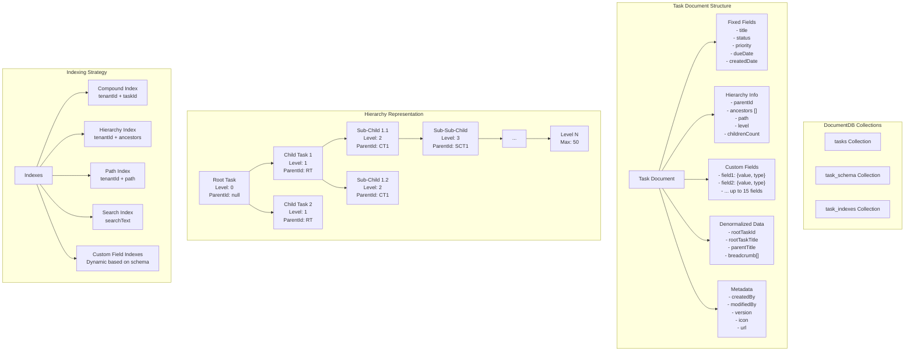
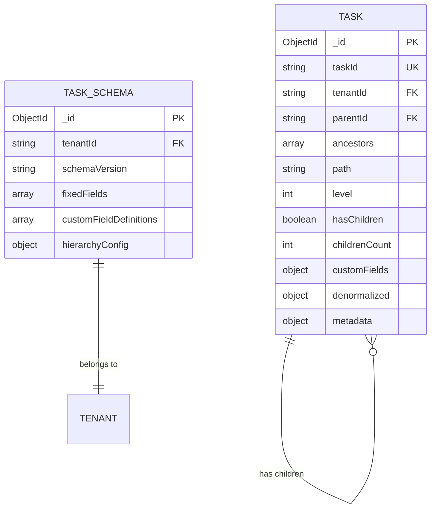
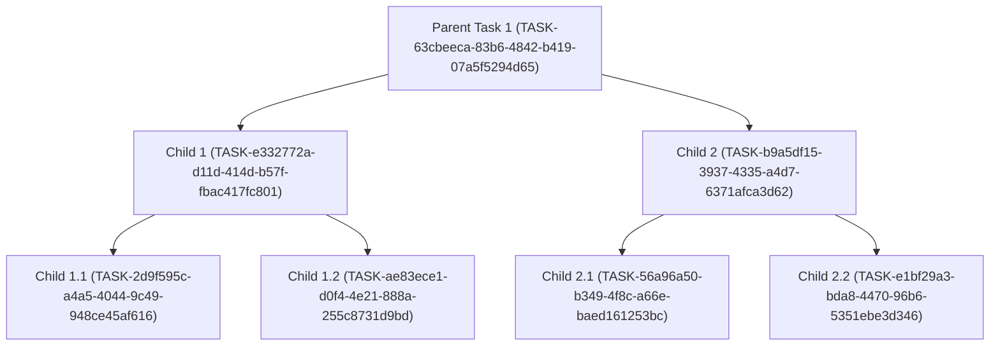
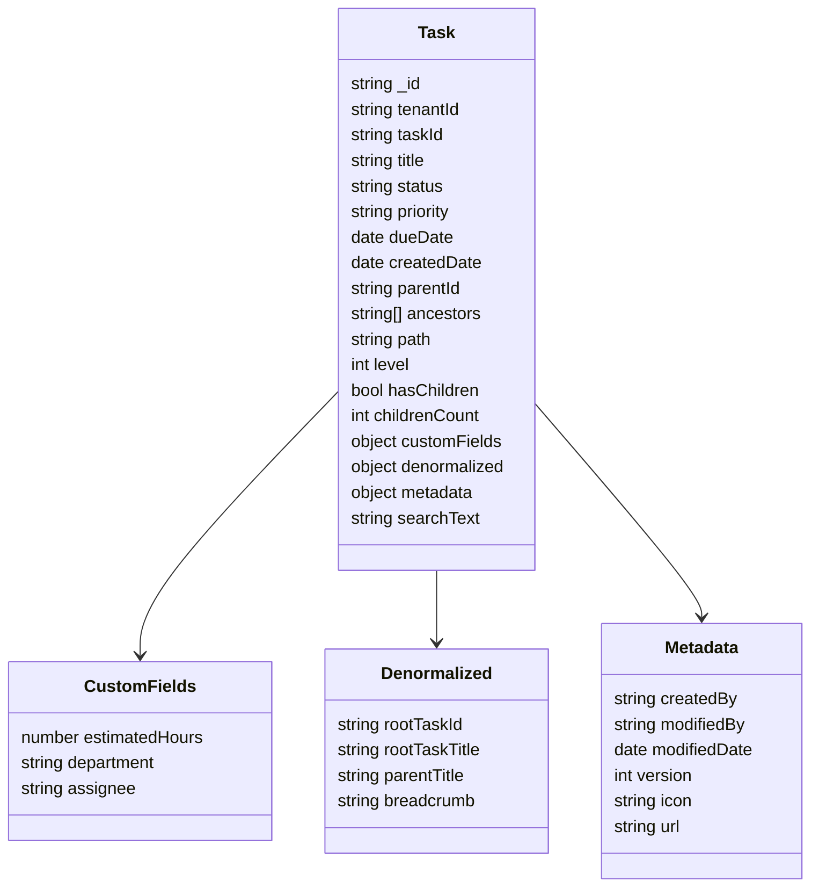

# Multi-Tenenet DB

## :bank: Multi-Tenent + Multi hierachial Schema

### :question:Problem Statement

Recently one of our client, has requested for an application design, which requires customization by the end-user itself. Such as the <mark style="color:$primary;">"end-user</mark>" can create,

1. Project
   1. The project can have multiple fields(static & custom), the custom fields can be defined by the end-user eg. "Estimated Hours", "Assigned By", "Tag", "Last Comments" etc.&#x20;
   2. The end-user can also define types for each custom fields, as "int", "string", "date" etc.
2. Tasks for the Project
   1. Each task also have custom filelds, which is again defined by the end-user similar to "Project".
   2. The task can have sub-tasks, similar to Task, each can have custom fields as well.
   3. The level of sub-task can go upto 50 or 100. our schema defintion should sustain this and should have flexibilty.
3. The system should be
   1. Searchable
   2. Filtering based on custom fields
   3. Sortings and all sort of DB Operations.

***

> :money\_with\_wings: Basically or at a high level we can think of it as a workflow appliation, similar to "Monday", "Asana" or "ClickUp", where we can defined multiple custom fields and custom levels can be achived.&#x20;


<details>

<summary>Example Screnario in Short</summary>

1. Task 1 (may have 5 fixed fields, 15 custom fields and each will have different data types available within C#)
   1. Sub-Task-1 of 'Task-1' (may have 5 fixed fields, 15 custom fields and each will have different data types available within C#)
   2. Sub-Task-2 of 'Sub-Task-1' and goes on up to 50.

</details>


> :money\_mouth: The worst part is that we can anticipate upto 80 million records, and each sub-task may have up to 10 million sub-tasks and it may goes on. With the given problem statement we have defined the schema which suits our workflow, yet to identify the performance but at a initial stage it is coming our very well.

***

### :person\_raising\_hand: Solution

#### Below is the schema structure for the given problem above.&#x20;

<details>

<summary>Collection: project/tasks</summary>

```json
{
  "_id": ObjectId("507f1f77bcf86cd799439011"),
  "tenantId": "tenant_001",
  "taskId": "TASK-2024-001",
  
  // Fixed Fields (5)
  "title": "Implement Authentication Module",
  "status": "in_progress",
  "priority": "high",
  "dueDate": ISODate("2024-12-31T23:59:59Z"),
  "createdDate": ISODate("2024-01-15T10:30:00Z"),
  
  // Hierarchy Information
  "parentId": "TASK-2024-000",  // null for root tasks
  "ancestors": ["TASK-2024-000"], // Array of all ancestor IDs for efficient queries
  "path": "/TASK-2024-000/TASK-2024-001", // Materialized path
  "level": 1, // Depth in hierarchy (0 for root)
  "hasChildren": true,
  "childrenCount": 3,
  
  // Custom Fields (up to 15, tenant-defined)
  "customFields": {
    "assignee": {
      "value": "john.doe@company.com",
      "type": "string",
      "displayName": "Assignee"
    },
    "estimatedHours": {
      "value": 40,
      "type": "number",
      "displayName": "Estimated Hours"
    },
    "department": {
      "value": "Engineering",
      "type": "string",
      "displayName": "Department"
    },
    "budget": {
      "value": 5000.00,
      "type": "decimal",
      "displayName": "Budget"
    },
    "isUrgent": {
      "value": true,
      "type": "boolean",
      "displayName": "Urgent Flag"
    },
    "tags": {
      "value": ["backend", "security", "Q1-2024"],
      "type": "array",
      "displayName": "Tags"
    },
    "attachments": {
      "value": [
        {
          "name": "requirements.pdf",
          "url": "https://storage.example.com/req.pdf",
          "size": 1024000
        }
      ],
      "type": "object_array",
      "displayName": "Attachments"
    },
    "completionDate": {
      "value": ISODate("2024-03-15T00:00:00Z"),
      "type": "date",
      "displayName": "Completion Date"
    }
  },
  
  // Denormalized data for performance
  "denormalized": {
    "rootTaskId": "TASK-2024-000",
    "rootTaskTitle": "Q1 2024 Product Development",
    "parentTitle": "Backend Development",
    "breadcrumb": [
      {"id": "TASK-2024-000", "title": "Q1 2024 Product Development"},
      {"id": "TASK-2024-001", "title": "Implement Authentication Module"}
    ]
  },
  
  // Metadata
  "metadata": {
    "createdBy": "admin@company.com",
    "modifiedBy": "john.doe@company.com",
    "modifiedDate": ISODate("2024-01-20T14:30:00Z"),
    "version": 2,
    "icon": "https://icons.example.com/task.png",
    "url": "https://app.example.com/tasks/TASK-2024-001"
  },
  
  // Search optimization
  "searchText": "implement authentication module backend development q1 2024 product development john.doe engineering"
}
```

</details>

#### <i class="fa-plus">:plus:</i>

<details>

<summary>Collection: task_schema (Per Tenant Configuration)</summary>

```json
{
  "_id": ObjectId("607f1f77bcf86cd799439012"),
  "tenantId": "tenant_001",
  "schemaVersion": "1.0",
  "fixedFields": [
    {"name": "title", "type": "string", "required": true, "searchable": true},
    {"name": "status", "type": "string", "required": true, "searchable": true},
    {"name": "priority", "type": "string", "required": true, "searchable": true},
    {"name": "dueDate", "type": "date", "required": false, "searchable": true},
    {"name": "createdDate", "type": "date", "required": true, "searchable": true}
  ],
  "customFieldDefinitions": [
    {
      "fieldName": "assignee",
      "displayName": "Assignee",
      "dataType": "string",
      "required": false,
      "searchable": true,
      "sortable": true,
      "defaultValue": null,
      "validation": {
        "pattern": "^[a-zA-Z0-9._%+-]+@[a-zA-Z0-9.-]+\\.[a-zA-Z]{2,}$"
      }
    },
    {
      "fieldName": "estimatedHours",
      "displayName": "Estimated Hours",
      "dataType": "number",
      "required": false,
      "searchable": true,
      "sortable": true,
      "defaultValue": 0,
      "validation": {
        "min": 0,
        "max": 999
      }
    },
    {
      "fieldName": "tags",
      "displayName": "Tags",
      "dataType": "array",
      "required": false,
      "searchable": true,
      "sortable": false,
      "defaultValue": [],
      "validation": {
        "maxItems": 10
      }
    }
  ],
  "hierarchyConfig": {
    "maxDepth": 50,
    "maxChildrenPerTask": 1000000
  }
}
```

</details>

### :exclamation: Example JSON Data Structure

#### Root Task Example (Level 0)

```json
{
  "_id": "507f1f77bcf86cd799439011",
  "tenantId": "tenant_001",
  "taskId": "TASK-2024-000",
  "title": "Q1 2024 Product Development",
  "status": "active",
  "priority": "high",
  "dueDate": "2024-03-31T23:59:59Z",
  "createdDate": "2024-01-01T00:00:00Z",
  "parentId": null,
  "ancestors": [],
  "path": "/TASK-2024-000",
  "level": 0,
  "hasChildren": true,
  "childrenCount": 5,
  "customFields": {
    "budget": {
      "value": 500000,
      "type": "decimal",
      "displayName": "Total Budget"
    },
    "projectManager": {
      "value": "sarah.johnson@company.com",
      "type": "string",
      "displayName": "Project Manager"
    }
  }
}
```

#### Child Task Example (Level 1)

```json
{
  "_id": "507f1f77bcf86cd799439012",
  "tenantId": "tenant_001",
  "taskId": "TASK-2024-001",
  "title": "Backend Development",
  "status": "in_progress",
  "priority": "high",
  "dueDate": "2024-02-28T23:59:59Z",
  "createdDate": "2024-01-05T00:00:00Z",
  "parentId": "TASK-2024-000",
  "ancestors": ["TASK-2024-000"],
  "path": "/TASK-2024-000/TASK-2024-001",
  "level": 1,
  "hasChildren": true,
  "childrenCount": 3,
  "customFields": {
    "team": {
      "value": "Backend Team Alpha",
      "type": "string",
      "displayName": "Team"
    },
    "sprint": {
      "value": 3,
      "type": "number",
      "displayName": "Sprint Number"
    }
  }
}
```

#### Sub-Child Task Example (Level 2)

```json
{
  "_id": "507f1f77bcf86cd799439013",
  "tenantId": "tenant_001",
  "taskId": "TASK-2024-002",
  "title": "Implement JWT Authentication",
  "status": "completed",
  "priority": "critical",
  "dueDate": "2024-01-31T23:59:59Z",
  "createdDate": "2024-01-10T00:00:00Z",
  "parentId": "TASK-2024-001",
  "ancestors": ["TASK-2024-000", "TASK-2024-001"],
  "path": "/TASK-2024-000/TASK-2024-001/TASK-2024-002",
  "level": 2,
  "hasChildren": false,
  "childrenCount": 0,
  "customFields": {
    "assignee": {
      "value": "developer1@company.com",
      "type": "string",
      "displayName": "Assignee"
    },
    "storyPoints": {
      "value": 8,
      "type": "number",
      "displayName": "Story Points"
    },
    "completedDate": {
      "value": "2024-01-28T16:30:00Z",
      "type": "date",
      "displayName": "Completed Date"
    }
  }
}
```

### :trident: Mermaid Diagram - Schema Structure



### :expressionless: Relationship Diagram Explanation

#### Parent-Child Relationships

The relationship model uses a **reference-based approach with denormalization** for optimal performance:



#### Relationship Types:

1. **Direct Parent-Child**:
   * Each task has a `parentId` field pointing to its immediate parent
   * Root tasks have `parentId: null`
2. **Ancestor Chain**:
   * `ancestors` array contains all parent IDs up to the root
   * Enables efficient queries for entire branches
3. **Materialized Path**:
   * `path` field stores the complete hierarchical path
   * Format: `/root/parent1/parent2/current`
   * Supports regex queries for subtree operations
4. **Level Tracking**:
   * `level` field indicates depth (0 for root, max 50)
   * Useful for level-specific queries and depth validation

### :heavy\_equals\_sign: Indexing Strategy

```javascript
// Essential Indexes
db.tasks.createIndex({ "tenantId": 1, "taskId": 1 }, { unique: true });
db.tasks.createIndex({ "tenantId": 1, "parentId": 1 });
db.tasks.createIndex({ "tenantId": 1, "ancestors": 1 });
db.tasks.createIndex({ "tenantId": 1, "path": 1 });
db.tasks.createIndex({ "tenantId": 1, "level": 1 });

// Search and Sort Indexes
db.tasks.createIndex({ "tenantId": 1, "status": 1, "priority": 1 });
db.tasks.createIndex({ "tenantId": 1, "dueDate": 1 });
db.tasks.createIndex({ "searchText": "text" });

// Custom Field Indexes (Dynamic)
db.tasks.createIndex({ "tenantId": 1, "customFields.assignee.value": 1 });
db.tasks.createIndex({ "tenantId": 1, "customFields.department.value": 1 });
db.tasks.createIndex({ "tenantId": 1, "customFields.tags.value": 1 });
```

### :thumbsup: Query Examples

#### Get All Children of a Task

```javascript
db.tasks.find({ 
  "tenantId": "tenant_001",
  "parentId": "TASK-2024-001" 
});
```

#### Get All Descendants of a Task

```javascript
db.tasks.find({ 
  "tenantId": "tenant_001",
  "ancestors": "TASK-2024-001" 
});
```

#### Get Tasks at Specific Level

```javascript
db.tasks.find({ 
  "tenantId": "tenant_001",
  "level": 2,
  "status": "in_progress" 
});
```

#### Search with Custom Fields

```javascript
db.tasks.find({ 
  "tenantId": "tenant_001",
  "customFields.department.value": "Engineering",
  "customFields.estimatedHours.value": { $gte: 20 }
}).sort({ "customFields.priority.value": -1 });
```

#### Full-Text Search

```javascript
db.tasks.find({ 
  "tenantId": "tenant_001",
  $text: { $search: "authentication security" }
});
```

***

## &#x20;<i class="fa-code-simple">:code-simple:</i> Comple C# Code&#x20;

<details>

<summary>Complete C# Example For the hierrachial reference</summary>


```csharp
// Entity Model
public class TaskDocument
{
    [BsonId]
    [BsonRepresentation(BsonType.ObjectId)]
    public string Id { get; set; }

    public string tenantId { get; set; }
    public string taskId { get; set; }
    public string title { get; set; }
    public string status { get; set; }
    public string priority { get; set; }
    public DateTime dueDate { get; set; }
    public DateTime createdDate { get; set; }
    public string parentId { get; set; }
    public List<string> ancestors { get; set; }
    public string path { get; set; }
    public int level { get; set; }
    public bool hasChildren { get; set; }
    public int childrenCount { get; set; }
    public Dictionary<string, CustomField> customFields { get; set; }
    public Denormalized denormalized { get; set; }
    public Metadata metadata { get; set; }
    public string searchText { get; set; }
}

public class CustomField
{
    public BsonValue value { get; set; }
    public string type { get; set; }
    public string displayName { get; set; }
}

public class Denormalized
{
    public string rootTaskId { get; set; }
    public string rootTaskTitle { get; set; }
    public string parentTitle { get; set; }
    public List<Breadcrumb> breadcrumb { get; set; }
}

public class Breadcrumb
{
    public string id { get; set; }
    public string title { get; set; }
}

public class Metadata
{
    public string createdBy { get; set; }
    public string modifiedBy { get; set; }
    public DateTime modifiedDate { get; set; }
    public int version { get; set; }
    public string icon { get; set; }
    public string url { get; set; }
}
```


Entity Service


```csharp
// Entity Service

    public class TaskService
    {
        private readonly IMongoCollection<TaskDocument> _tasks;
        private const string TenantId = "tenant_001";

        public TaskService(string connectionString, string databaseName)
        {
            var client = new MongoClient(connectionString);
            var database = client.GetDatabase(databaseName);
            _tasks = database.GetCollection<TaskDocument>("tasksInstance-1");
        }

        // 1. Create/Insert
        public async Task InsertHierarchy(int parents, int children, int levels)
        {
            Console.WriteLine($"\n--- Inserting {parents} parents, {children} children, and {levels} levels. ---\n");

            for (int i = 0; i < parents; i++)
            {
                // Create a parent task (level 0)
                var parentTaskId = $"TASK-{Guid.NewGuid()}";
                var parentTask = CreateTask(parentTaskId, null, new List<string>(), 0, $"Parent Task {i + 1}");
                await _tasks.InsertOneAsync(parentTask);
                Console.WriteLine($"Inserted parent task: {parentTask.title} with ID: {parentTaskId}");

                await InsertChildren(parentTask, children, 1, levels);
            }
            Console.WriteLine("\n--- Insert operation complete. ---\n");
        }

        private async Task InsertChildren(TaskDocument parent, int count, int currentLevel, int maxLevels)
        {
            if (currentLevel > maxLevels)
            {
                return;
            }

            for (int i = 0; i < count; i++)
            {
                var taskId = $"TASK-{Guid.NewGuid()}";
                var ancestors = new List<string>(parent.ancestors) { parent.taskId };
                var childTask = CreateTask(taskId, parent.taskId, ancestors, currentLevel, $"{parent.title}'s Child {i + 1}");

                await _tasks.InsertOneAsync(childTask);
                Console.WriteLine($"  Inserted child task: {childTask.title} with ID: {taskId} at level {currentLevel}");

                // Recursively insert sub-children
                await InsertChildren(childTask, count, currentLevel + 1, maxLevels);
            }
        }

        private TaskDocument CreateTask(string taskId, string parentId, List<string> ancestors, int level, string title)
        {
            var random = new Random();
            var status = random.Next(3) switch
            {
                0 => "in_progress",
                1 => "completed",
                _ => "active"
            };
            var priority = random.Next(3) switch
            {
                0 => "low",
                1 => "medium",
                _ => "high"
            };

            var task = new TaskDocument
            {
                tenantId = TenantId,
                taskId = taskId,
                title = title,
                status = status,
                priority = priority,
                dueDate = DateTime.UtcNow.AddDays(random.Next(30, 90)),
                createdDate = DateTime.UtcNow,
                parentId = parentId,
                ancestors = ancestors,
                path = parentId != null ? $"{string.Join("/", ancestors)}/{taskId}" : $"/{taskId}",
                level = level,
                hasChildren = true, // We'll assume a new task can have children for the sake of the demo
                childrenCount = 0,
                customFields = new Dictionary<string, CustomField>
                {
                    { "estimatedHours", new CustomField { value = new BsonInt32(random.Next(1, 50)), type = "number", displayName = "Estimated Hours" } },
                    { "department", new CustomField { value = new BsonString("Engineering"), type = "string", displayName = "Department" } },
                    { "assignee", new CustomField { value = new BsonString($"developer{random.Next(1, 10)}@company.com"), type = "string", displayName = "Assignee" } }
                },
                denormalized = new Denormalized
                {
                    rootTaskId = ancestors.Count > 0 ? ancestors[0] : taskId,
                    rootTaskTitle = "Project Root",
                    parentTitle = "Parent Title"
                },
                metadata = new Metadata
                {
                    createdBy = "system",
                    modifiedBy = "system",
                    modifiedDate = DateTime.UtcNow,
                    version = 1
                },
                searchText = $"{title} {status} {priority}"
            };
            return task;
        }

        // 2. Single Update
        public async Task UpdateSingleTask(string taskIdToUpdate)
        {
            Console.WriteLine($"\n--- Updating single task with ID: {taskIdToUpdate} ---\n");
            var filter = Builders<TaskDocument>.Filter.Eq(t => t.taskId, taskIdToUpdate);
            var update = Builders<TaskDocument>.Update
                .Set(t => t.status, "completed")
                .Set(t => t.metadata.modifiedDate, DateTime.UtcNow)
                .Set(t => t.customFields["estimatedHours"].value, new BsonInt32(new Random().Next(51, 100)));

            var result = await _tasks.UpdateOneAsync(filter, update);

            Console.WriteLine(result.ModifiedCount > 0 ? "Update successful." : "Update failed. Task not found.");
            Console.WriteLine("\n--- Update operation complete. ---\n");
        }

        // 3. Delete
        public async Task DeleteTask(string taskIdToDelete)
        {
            Console.WriteLine($"\n--- Deleting task with ID: {taskIdToDelete} and its children ---\n");

            // Find all descendants using the ancestors array
            var descendantsFilter = Builders<TaskDocument>.Filter.Eq("ancestors", taskIdToDelete);
            var descendantsToDelete = await _tasks.Find(descendantsFilter).Project(t => t.taskId).ToListAsync();

            if (descendantsToDelete.Count > 0)
            {
                var descendantIdsFilter = Builders<TaskDocument>.Filter.In(t => t.taskId, descendantsToDelete);
                await _tasks.DeleteManyAsync(descendantIdsFilter);
                Console.WriteLine($"Deleted {descendantsToDelete.Count} descendant tasks.");
            }

            // Delete the parent task itself
            var parentFilter = Builders<TaskDocument>.Filter.Eq(t => t.taskId, taskIdToDelete);
            var deleteResult = await _tasks.DeleteOneAsync(parentFilter);

            Console.WriteLine(deleteResult.DeletedCount > 0 ? "Deletion successful." : "Deletion failed. Task not found.");
            Console.WriteLine("\n--- Delete operation complete. ---\n");
        }

        // 4. Read Single
        public async Task ReadSingleTask(string taskIdToRead)
        {
            Console.WriteLine($"\n--- Reading single task with ID: {taskIdToRead} ---\n");
            var filter = Builders<TaskDocument>.Filter.Eq(t => t.taskId, taskIdToRead);
            var task = await _tasks.Find(filter).FirstOrDefaultAsync();

            if (task != null)
            {
                Console.WriteLine($"Found Task: {task.title}");
                Console.WriteLine($"Status: {task.status}, Priority: {task.priority}");
                Console.WriteLine($"Path: {task.path}, Level: {task.level}");
                Console.WriteLine($"Estimated Hours: {task.customFields["estimatedHours"].value}");
            }
            else
            {
                Console.WriteLine("Task not found.");
            }
            Console.WriteLine("\n--- Read single operation complete. ---\n");
        }

        // 5. Read Multiple with Range
        public async Task ReadMultipleTasksByRange()
        {
            Console.WriteLine("\n--- Reading multiple tasks with a due date range ---\n");
            var startDate = DateTime.UtcNow;
            var endDate = DateTime.UtcNow.AddDays(45);

            var filter = Builders<TaskDocument>.Filter.And(
                Builders<TaskDocument>.Filter.Gte(t => t.dueDate, startDate),
                Builders<TaskDocument>.Filter.Lte(t => t.dueDate, endDate)
            );

            var tasks = await _tasks.Find(filter).ToListAsync();

            Console.WriteLine($"Found {tasks.Count} tasks due between {startDate.ToShortDateString()} and {endDate.ToShortDateString()}:");
            foreach (var task in tasks)
            {
                Console.WriteLine($"- {task.title} (ID: {task.taskId}, Due: {task.dueDate.ToShortDateString()})");
            }
            Console.WriteLine("\n--- Read multiple operation complete. ---\n");
        }

        // 6. Complex Filter
        public async Task ComplexFilterQuery()
        {
            Console.WriteLine("\n--- Performing complex filter query on custom fields ---\n");
            var filter = Builders<TaskDocument>.Filter.And(
                Builders<TaskDocument>.Filter.Eq("customFields.department.value", "Engineering"),
                Builders<TaskDocument>.Filter.Gte("customFields.estimatedHours.value", new BsonInt32(20)),
                Builders<TaskDocument>.Filter.Eq("priority", "high")
            );

            var tasks = await _tasks.Find(filter).ToListAsync();

            Console.WriteLine($"Found {tasks.Count} high-priority Engineering tasks with estimated hours >= 20:");
            foreach (var task in tasks)
            {
                Console.WriteLine($"- {task.title} (ID: {task.taskId})");
            }
            Console.WriteLine("\n--- Complex filter operation complete. ---\n");
        }

        // 7. Multiple Update
        public async Task UpdateMultipleTasks()
        {
            Console.WriteLine("\n--- Updating multiple tasks matching a filter ---\n");
            var filter = Builders<TaskDocument>.Filter.Eq(t => t.status, "in_progress");
            var update = Builders<TaskDocument>.Update
                .Set(t => t.status, "on_hold")
                .Set(t => t.metadata.modifiedDate, DateTime.UtcNow);

            var result = await _tasks.UpdateManyAsync(filter, update);

            Console.WriteLine($"Updated {result.ModifiedCount} tasks to 'on_hold'.");
            Console.WriteLine("\n--- Multiple update operation complete. ---\n");
        }

        // 8. Your choice of any - Aggregation Pipeline for a hierarchical report
        public async Task HierarchicalReport()
        {
            Console.WriteLine("\n--- Generating a hierarchical report using an aggregation pipeline ---\n");

            var pipeline = new BsonDocument[]
            {
                // Match all tasks for the tenant
                new BsonDocument("$match", new BsonDocument("tenantId", TenantId)),

                // Use $lookup to find children
                new BsonDocument("$lookup",
                    new BsonDocument
                    {
                        { "from", "tasks" },
                        { "localField", "taskId" },
                        { "foreignField", "parentId" },
                        { "as", "children" }
                    }),
                    
                // Filter to show only root tasks for the report
                new BsonDocument("$match", new BsonDocument("level", 0)),

                // Project the fields for the final report
                new BsonDocument("$project",
                    new BsonDocument
                    {
                        { "_id", 0 },
                        { "taskId", "$taskId" },
                        { "title", "$title" },
                        { "status", "$status" },
                        { "childrenCount", new BsonDocument("$size", "$children") },
                        { "childTitles", new BsonDocument("$map", new BsonDocument
                            {
                                { "input", "$children" },
                                { "as", "child" },
                                { "in", "$$child.title" }
                            })
                        }
                    })
            };

            var reportResults = await _tasks.Aggregate<BsonDocument>(pipeline).ToListAsync();

            Console.WriteLine("Root Tasks and Their Direct Children:");
            foreach (var doc in reportResults)
            {
                Console.WriteLine($"\nRoot Task ID: {doc["taskId"]}");
                Console.WriteLine($"Title: {doc["title"]}");
                Console.WriteLine($"Status: {doc["status"]}");
                Console.WriteLine($"Direct Children Count: {doc["childrenCount"]}");

                var childTitles = doc["childTitles"].AsBsonArray;
                if (childTitles.Count > 0)
                {
                    Console.WriteLine("Children Titles:");
                    foreach (var childTitle in childTitles)
                    {
                        Console.WriteLine($"- {childTitle.AsString}");
                    }
                }
            }
            Console.WriteLine("\n--- Aggregation pipeline operation complete. ---\n");
        }
    }
```


Execution Program


```csharp
// Program.cs

    class Program
    {
        static async Task Main(string[] args)
        {
            // Replace with your actual connection string.
            const string connectionString = "mongodb://localhost:27017";
            const string databaseName = "TaskManagerDB";
            var service = new TaskService(connectionString, databaseName);

            while (true)
            {
                Console.WriteLine("\n---------------------------------------------------");
                Console.WriteLine("Select an operation:");
                Console.WriteLine("1. Insert Hierarchy");
                Console.WriteLine("2. Update Single Task");
                Console.WriteLine("3. Delete Task and its Descendants");
                Console.WriteLine("4. Read Single Task");
                Console.WriteLine("5. Read Multiple Tasks with Date Range");
                Console.WriteLine("6. Complex Filter Query");
                Console.WriteLine("7. Update Multiple Tasks");
                Console.WriteLine("8. Generate Hierarchical Report (Aggregation)");
                Console.WriteLine("9. Exit");
                Console.WriteLine("---------------------------------------------------");
                Console.Write("Enter your choice: ");

                var choice = Console.ReadLine();
                switch (choice)
                {
                    case "1":
                        Console.Write("How many parent records to insert? ");
                        int parents = int.Parse(Console.ReadLine());
                        Console.Write("How many child records per level? ");
                        int children = int.Parse(Console.ReadLine());
                        Console.Write("How many levels deep? ");
                        int levels = int.Parse(Console.ReadLine());
                        await service.InsertHierarchy(parents, children, levels);
                        break;
                    case "2":
                        Console.Write("Enter the taskId to update: ");
                        string updateId = Console.ReadLine();
                        await service.UpdateSingleTask(updateId);
                        break;
                    case "3":
                        Console.Write("Enter the taskId to delete: ");
                        string deleteId = Console.ReadLine();
                        await service.DeleteTask(deleteId);
                        break;
                    case "4":
                        Console.Write("Enter the taskId to read: ");
                        string readId = Console.ReadLine();
                        await service.ReadSingleTask(readId);
                        break;
                    case "5":
                        await service.ReadMultipleTasksByRange();
                        break;
                    case "6":
                        await service.ComplexFilterQuery();
                        break;
                    case "7":
                        await service.UpdateMultipleTasks();
                        break;
                    case "8":
                        await service.HierarchicalReport();
                        break;
                    case "9":
                        return;
                    default:
                        Console.WriteLine("Invalid choice. Please try again.");
                        break;
                }
            }
        }
    }

```



</details>

### <i class="fa-brackets-round">:brackets-round:</i> Extracted JSON

<details>

<summary>JSON Schema </summary>

```json
// JSON Schema

[{
  "_id": {
    "$oid": "68aebb39322f0037583cecf8"
  },
  "tenantId": "tenant_001",
  "taskId": "TASK-63cbeeca-83b6-4842-b419-07a5f5294d65",
  "title": "Parent Task 1",
  "status": "active",
  "priority": "low",
  "dueDate": {
    "$date": "2025-10-04T08:00:57.702Z"
  },
  "createdDate": {
    "$date": "2025-08-27T08:00:57.702Z"
  },
  "parentId": null,
  "ancestors": [],
  "path": "/TASK-63cbeeca-83b6-4842-b419-07a5f5294d65",
  "level": 0,
  "hasChildren": true,
  "childrenCount": 0,
  "customFields": {
    "estimatedHours": {
      "value": 2,
      "type": "number",
      "displayName": "Estimated Hours"
    },
    "department": {
      "value": "Engineering",
      "type": "string",
      "displayName": "Department"
    },
    "assignee": {
      "value": "developer2@company.com",
      "type": "string",
      "displayName": "Assignee"
    }
  },
  "denormalized": {
    "rootTaskId": "TASK-63cbeeca-83b6-4842-b419-07a5f5294d65",
    "rootTaskTitle": "Project Root",
    "parentTitle": "Parent Title",
    "breadcrumb": null
  },
  "metadata": {
    "createdBy": "system",
    "modifiedBy": "system",
    "modifiedDate": {
      "$date": "2025-08-27T08:00:57.702Z"
    },
    "version": 1,
    "icon": null,
    "url": null
  },
  "searchText": "Parent Task 1 active low"
},
{
  "_id": {
    "$oid": "68aebb39322f0037583cecf9"
  },
  "tenantId": "tenant_001",
  "taskId": "TASK-e332772a-d11d-414d-b57f-fbac417fc801",
  "title": "Parent Task 1's Child 1",
  "status": "active",
  "priority": "high",
  "dueDate": {
    "$date": "2025-11-18T08:00:57.710Z"
  },
  "createdDate": {
    "$date": "2025-08-27T08:00:57.710Z"
  },
  "parentId": "TASK-63cbeeca-83b6-4842-b419-07a5f5294d65",
  "ancestors": [
    "TASK-63cbeeca-83b6-4842-b419-07a5f5294d65"
  ],
  "path": "TASK-63cbeeca-83b6-4842-b419-07a5f5294d65/TASK-e332772a-d11d-414d-b57f-fbac417fc801",
  "level": 1,
  "hasChildren": true,
  "childrenCount": 0,
  "customFields": {
    "estimatedHours": {
      "value": 20,
      "type": "number",
      "displayName": "Estimated Hours"
    },
    "department": {
      "value": "Engineering",
      "type": "string",
      "displayName": "Department"
    },
    "assignee": {
      "value": "developer4@company.com",
      "type": "string",
      "displayName": "Assignee"
    }
  },
  "denormalized": {
    "rootTaskId": "TASK-63cbeeca-83b6-4842-b419-07a5f5294d65",
    "rootTaskTitle": "Project Root",
    "parentTitle": "Parent Title",
    "breadcrumb": null
  },
  "metadata": {
    "createdBy": "system",
    "modifiedBy": "system",
    "modifiedDate": {
      "$date": "2025-08-27T08:00:57.710Z"
    },
    "version": 1,
    "icon": null,
    "url": null
  },
  "searchText": "Parent Task 1's Child 1 active high"
},
{
  "_id": {
    "$oid": "68aebb39322f0037583cecfa"
  },
  "tenantId": "tenant_001",
  "taskId": "TASK-2d9f595c-a4a5-4044-9c49-948ce45af616",
  "title": "Parent Task 1's Child 1's Child 1",
  "status": "active",
  "priority": "high",
  "dueDate": {
    "$date": "2025-10-24T08:00:57.711Z"
  },
  "createdDate": {
    "$date": "2025-08-27T08:00:57.711Z"
  },
  "parentId": "TASK-e332772a-d11d-414d-b57f-fbac417fc801",
  "ancestors": [
    "TASK-63cbeeca-83b6-4842-b419-07a5f5294d65",
    "TASK-e332772a-d11d-414d-b57f-fbac417fc801"
  ],
  "path": "TASK-63cbeeca-83b6-4842-b419-07a5f5294d65/TASK-e332772a-d11d-414d-b57f-fbac417fc801/TASK-2d9f595c-a4a5-4044-9c49-948ce45af616",
  "level": 2,
  "hasChildren": true,
  "childrenCount": 0,
  "customFields": {
    "estimatedHours": {
      "value": 21,
      "type": "number",
      "displayName": "Estimated Hours"
    },
    "department": {
      "value": "Engineering",
      "type": "string",
      "displayName": "Department"
    },
    "assignee": {
      "value": "developer2@company.com",
      "type": "string",
      "displayName": "Assignee"
    }
  },
  "denormalized": {
    "rootTaskId": "TASK-63cbeeca-83b6-4842-b419-07a5f5294d65",
    "rootTaskTitle": "Project Root",
    "parentTitle": "Parent Title",
    "breadcrumb": null
  },
  "metadata": {
    "createdBy": "system",
    "modifiedBy": "system",
    "modifiedDate": {
      "$date": "2025-08-27T08:00:57.711Z"
    },
    "version": 1,
    "icon": null,
    "url": null
  },
  "searchText": "Parent Task 1's Child 1's Child 1 active high"
},
{
  "_id": {
    "$oid": "68aebb39322f0037583cecfb"
  },
  "tenantId": "tenant_001",
  "taskId": "TASK-ae83ece1-d0f4-4e21-888a-255c8731d9bd",
  "title": "Parent Task 1's Child 1's Child 2",
  "status": "completed",
  "priority": "high",
  "dueDate": {
    "$date": "2025-11-01T08:00:57.712Z"
  },
  "createdDate": {
    "$date": "2025-08-27T08:00:57.712Z"
  },
  "parentId": "TASK-e332772a-d11d-414d-b57f-fbac417fc801",
  "ancestors": [
    "TASK-63cbeeca-83b6-4842-b419-07a5f5294d65",
    "TASK-e332772a-d11d-414d-b57f-fbac417fc801"
  ],
  "path": "TASK-63cbeeca-83b6-4842-b419-07a5f5294d65/TASK-e332772a-d11d-414d-b57f-fbac417fc801/TASK-ae83ece1-d0f4-4e21-888a-255c8731d9bd",
  "level": 2,
  "hasChildren": true,
  "childrenCount": 0,
  "customFields": {
    "estimatedHours": {
      "value": 26,
      "type": "number",
      "displayName": "Estimated Hours"
    },
    "department": {
      "value": "Engineering",
      "type": "string",
      "displayName": "Department"
    },
    "assignee": {
      "value": "developer5@company.com",
      "type": "string",
      "displayName": "Assignee"
    }
  },
  "denormalized": {
    "rootTaskId": "TASK-63cbeeca-83b6-4842-b419-07a5f5294d65",
    "rootTaskTitle": "Project Root",
    "parentTitle": "Parent Title",
    "breadcrumb": null
  },
  "metadata": {
    "createdBy": "system",
    "modifiedBy": "system",
    "modifiedDate": {
      "$date": "2025-08-27T08:00:57.712Z"
    },
    "version": 1,
    "icon": null,
    "url": null
  },
  "searchText": "Parent Task 1's Child 1's Child 2 completed high"
},
{
  "_id": {
    "$oid": "68aebb39322f0037583cecfc"
  },
  "tenantId": "tenant_001",
  "taskId": "TASK-b9a5df15-3937-4335-a4d7-6371afca3d62",
  "title": "Parent Task 1's Child 2",
  "status": "active",
  "priority": "medium",
  "dueDate": {
    "$date": "2025-10-29T08:00:57.713Z"
  },
  "createdDate": {
    "$date": "2025-08-27T08:00:57.713Z"
  },
  "parentId": "TASK-63cbeeca-83b6-4842-b419-07a5f5294d65",
  "ancestors": [
    "TASK-63cbeeca-83b6-4842-b419-07a5f5294d65"
  ],
  "path": "TASK-63cbeeca-83b6-4842-b419-07a5f5294d65/TASK-b9a5df15-3937-4335-a4d7-6371afca3d62",
  "level": 1,
  "hasChildren": true,
  "childrenCount": 0,
  "customFields": {
    "estimatedHours": {
      "value": 37,
      "type": "number",
      "displayName": "Estimated Hours"
    },
    "department": {
      "value": "Engineering",
      "type": "string",
      "displayName": "Department"
    },
    "assignee": {
      "value": "developer2@company.com",
      "type": "string",
      "displayName": "Assignee"
    }
  },
  "denormalized": {
    "rootTaskId": "TASK-63cbeeca-83b6-4842-b419-07a5f5294d65",
    "rootTaskTitle": "Project Root",
    "parentTitle": "Parent Title",
    "breadcrumb": null
  },
  "metadata": {
    "createdBy": "system",
    "modifiedBy": "system",
    "modifiedDate": {
      "$date": "2025-08-27T08:00:57.713Z"
    },
    "version": 1,
    "icon": null,
    "url": null
  },
  "searchText": "Parent Task 1's Child 2 active medium"
},
{
  "_id": {
    "$oid": "68aebb39322f0037583cecfd"
  },
  "tenantId": "tenant_001",
  "taskId": "TASK-56a96a50-b349-4f8c-a66e-baed161253bc",
  "title": "Parent Task 1's Child 2's Child 1",
  "status": "completed",
  "priority": "low",
  "dueDate": {
    "$date": "2025-10-07T08:00:57.714Z"
  },
  "createdDate": {
    "$date": "2025-08-27T08:00:57.714Z"
  },
  "parentId": "TASK-b9a5df15-3937-4335-a4d7-6371afca3d62",
  "ancestors": [
    "TASK-63cbeeca-83b6-4842-b419-07a5f5294d65",
    "TASK-b9a5df15-3937-4335-a4d7-6371afca3d62"
  ],
  "path": "TASK-63cbeeca-83b6-4842-b419-07a5f5294d65/TASK-b9a5df15-3937-4335-a4d7-6371afca3d62/TASK-56a96a50-b349-4f8c-a66e-baed161253bc",
  "level": 2,
  "hasChildren": true,
  "childrenCount": 0,
  "customFields": {
    "estimatedHours": {
      "value": 32,
      "type": "number",
      "displayName": "Estimated Hours"
    },
    "department": {
      "value": "Engineering",
      "type": "string",
      "displayName": "Department"
    },
    "assignee": {
      "value": "developer4@company.com",
      "type": "string",
      "displayName": "Assignee"
    }
  },
  "denormalized": {
    "rootTaskId": "TASK-63cbeeca-83b6-4842-b419-07a5f5294d65",
    "rootTaskTitle": "Project Root",
    "parentTitle": "Parent Title",
    "breadcrumb": null
  },
  "metadata": {
    "createdBy": "system",
    "modifiedBy": "system",
    "modifiedDate": {
      "$date": "2025-08-27T08:00:57.714Z"
    },
    "version": 1,
    "icon": null,
    "url": null
  },
  "searchText": "Parent Task 1's Child 2's Child 1 completed low"
},
{
  "_id": {
    "$oid": "68aebb39322f0037583cecfe"
  },
  "tenantId": "tenant_001",
  "taskId": "TASK-e1bf29a3-bda8-4470-96b6-5351ebe3d346",
  "title": "Parent Task 1's Child 2's Child 2",
  "status": "completed",
  "priority": "low",
  "dueDate": {
    "$date": "2025-11-14T08:00:57.714Z"
  },
  "createdDate": {
    "$date": "2025-08-27T08:00:57.714Z"
  },
  "parentId": "TASK-b9a5df15-3937-4335-a4d7-6371afca3d62",
  "ancestors": [
    "TASK-63cbeeca-83b6-4842-b419-07a5f5294d65",
    "TASK-b9a5df15-3937-4335-a4d7-6371afca3d62"
  ],
  "path": "TASK-63cbeeca-83b6-4842-b419-07a5f5294d65/TASK-b9a5df15-3937-4335-a4d7-6371afca3d62/TASK-e1bf29a3-bda8-4470-96b6-5351ebe3d346",
  "level": 2,
  "hasChildren": true,
  "childrenCount": 0,
  "customFields": {
    "estimatedHours": {
      "value": 13,
      "type": "number",
      "displayName": "Estimated Hours"
    },
    "department": {
      "value": "Engineering",
      "type": "string",
      "displayName": "Department"
    },
    "assignee": {
      "value": "developer4@company.com",
      "type": "string",
      "displayName": "Assignee"
    }
  },
  "denormalized": {
    "rootTaskId": "TASK-63cbeeca-83b6-4842-b419-07a5f5294d65",
    "rootTaskTitle": "Project Root",
    "parentTitle": "Parent Title",
    "breadcrumb": null
  },
  "metadata": {
    "createdBy": "system",
    "modifiedBy": "system",
    "modifiedDate": {
      "$date": "2025-08-27T08:00:57.714Z"
    },
    "version": 1,
    "icon": null,
    "url": null
  },
  "searchText": "Parent Task 1's Child 2's Child 2 completed low"
}]

```


</details>

### :frame\_photo: ER Diagram



### :frame\_photo: Class Diagram based on Document




### :performing\_arts: Performance Optimization Tips

1. **Denormalization**: Store frequently accessed parent/root information to avoid lookups
2. **Compound Indexes**: Always include `tenantId` as the first field in indexes
3. **Projection**: Only retrieve necessary fields in queries
4. **Aggregation Pipeline**: Use for complex hierarchical reports
5. **Sharding**: Consider sharding by `tenantId` for horizontal scaling
6. **Caching**: Implement application-level caching for frequently accessed hierarchies
7. **Batch Operations**: Use bulk operations for mass updates
8. **Connection Pooling**: Configure appropriate connection pool sizes


### :a: Advantages of This Design

* **Flexible**: Supports dynamic custom fields per tenant
* **Scalable**: Can handle millions of records with proper indexing
* **Performant**: Optimized for both read and write operations
* **Maintainable**: Clear structure with separation of concerns
* **Queryable**: Supports efficient searching and sorting on any field
* **Extensible**: Easy to add new features without schema changes



