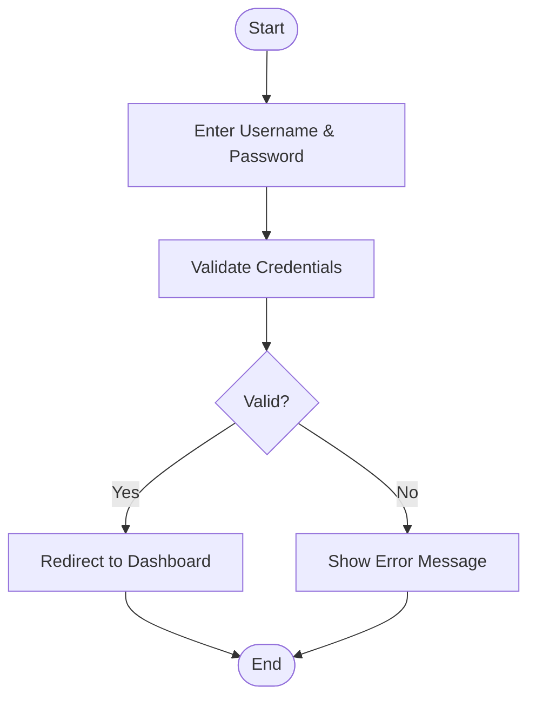
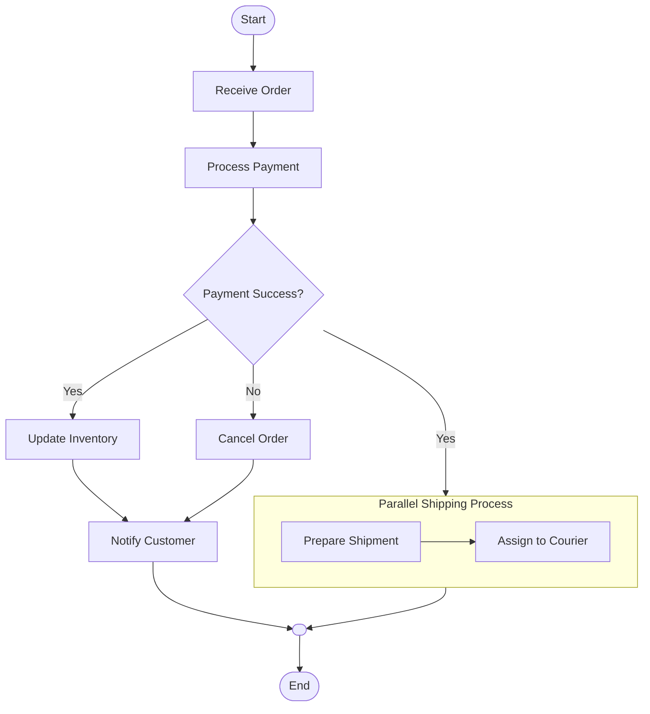
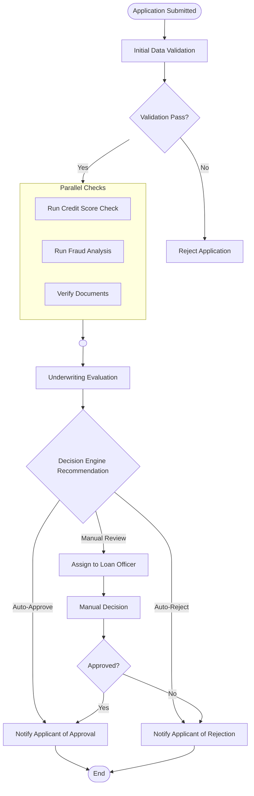
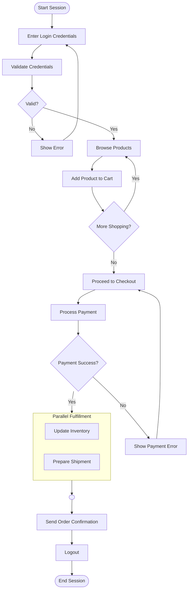

# Activity Diagram

Of course. Here is a detailed explanation of UML Activity Diagrams based on your request.

***

#### What is an Activity Diagram?

An **Activity Diagram** is a behavioral diagram in the Unified Modeling Language (UML) that represents the flow of control and data between activities. It models the dynamic aspects of a system, essentially illustrating the workflow or business process from a start point to a finish point, showing the sequence and conditions of these activities.

Think of it as a sophisticated flowchart. It describes _how_ an activity is performed, the order of actions, the decisions that lead to different paths, and how activities can happen in parallel.

**Key Elements:**

* **Start Node:** A filled-in circle marking the beginning of the workflow.
* **Activity/Action Node:** A rounded rectangle representing a single task or step within the overall activity.
* **Control Flow:** A solid arrow showing the sequence of execution from one action to the next.
* **Decision Node:** A diamond shape that branches the flow based on a condition (guard condition like `[yes]` or `[no]`).
* **Merge Node:** A diamond shape that brings together multiple alternative flows back into a single flow.
* **Fork Node:** A solid horizontal bar that splits a single flow into multiple **concurrent** (parallel) flows.
* **Join Node:** A solid horizontal bar that synchronizes multiple concurrent flows back into a single flow.
* **End Node:** A filled-in circle with a ring around it marking the end of the workflow.

***

#### When to Use Activity Diagrams?

Activity diagrams are versatile and used throughout the software development lifecycle.

1. **Modeling Business Processes:** To visualize the step-by-step workflow of a business use case (e.g., "Process Order," "Onboard Customer").
2. **Describing System Functionality:** To detail the algorithm of a complex operation or the logic of a use case.
3. **Illustrating Parallel and Concurrent Behavior:** When multiple actions can happen simultaneously (e.g., after a fork), which is a key advantage over simple flowcharts.
4. **Documenting Application Logic:** To provide a clear, visual representation of how a specific process works for both technical and non-technical stakeholders.

***

#### Problem Statement: Real-Time Scenario

**Scenario:** A financial technology company, "PayFlow," has a manual and error-prone process for user loan applications. Applications are received via email, a clerk manually checks documents against a checklist, sends approvals to a senior officer via chat, and then emails the result to the user. The process is slow, lacks accountability, and steps are sometimes missed.

**The Problem:** The loan application process is inefficient, non-transparent, and not scalable.

**Solution with Activity Diagrams:** A business analyst uses an **Activity Diagram** to:

* Map out the _as-is_ (current) process to identify bottlenecks and inefficiencies.
* Design a _to-be_ (future) process for a new automated loan application system.
* Clearly define every step, decision point, and parallel activity (e.g., running credit check and fraud analysis at the same time).
* Serve as a requirements document for developers to understand the exact workflow they need to build.

***

#### Use Case Examples with Mermaid Diagrams

**1. Simple: User Login Process**

A linear process with a single decision point. It models the steps a system takes to authenticate a user.

**Use Case:** A user submits login credentials. The system validates them. If correct, the user is directed to the dashboard; if incorrect, an error message is shown.

**Mermaid Syntax:**

**2. Medium: Order Fulfillment Process**

A more complex workflow involving parallel activities and multiple decision points. It shows what happens after a customer places an order.

**Use Case:** After an order is received, payment is processed. If payment fails, the order is cancelled. If successful, inventory is updated _and_ the shipping process is initiated in parallel. Only after both are complete is the customer notified.

**Mermaid Syntax:**

**3. Complex: Loan Application Approval System**

This diagram models the complex, multi-stage workflow from our "PayFlow" problem statement, involving system checks, human-in-the-loop decisions, and parallel processing.

**Mermaid Syntax:**

***

#### Comparison with Other Diagrams

| Diagram Type              | Purpose & Focus                                                                                                                                | Key Differentiator                                                                                           |
| ------------------------- | ---------------------------------------------------------------------------------------------------------------------------------------------- | ------------------------------------------------------------------------------------------------------------ |
| **Activity Diagram**      | Models the **flow of activities/actions** in a process. Focuses on **how** something is done, including sequence, parallelism, and conditions. | **Swimlanes** can assign activities to actors. Excellent for showing **parallel and concurrent flows**.      |
| **Sequence Diagram**      | Models the **interaction between objects** over **time**. Focuses on the **order of messages** exchanged.                                      | Emphasizes **time ordering and object collaboration**, not the detailed logic of each operation.             |
| **State Machine Diagram** | Models the **different states** an object can be in and the **transitions** between those states caused by events.                             | Focuses on the **lifecycle of a single object/entity** (e.g., an Order's state: New, Paid, Shipped, Closed). |
| **Flowchart**             | A general-purpose diagram for **algorithmic logic**.                                                                                           | Less formal than UML. Lacks built-in support for **concurrency/parallelism** or **swimlanes**.               |

**In short:** Use an Activity Diagram for **processes and workflows**, a Sequence Diagram for **object interactions over time**, and a State Diagram for the **lifecycle of a single object**.

***

#### In Summary

* **Purpose:** Activity Diagrams are the premier tool for **modeling business and operational workflows** visually.
* **Key Benefit:** They excel at showing **parallelism and concurrent processes**, which is crucial for modeling efficient systems.
* **When to Use:** Perfect for understanding, designing, and documenting the logic of a use case, a business process, or a complex algorithm.
* **Not For:** They are less suitable for showing interactions between objects or the detailed lifecycle of a single object.

***

#### Sample Diagram for All Use Cases

This integrated diagram shows a user's journey from login to placing an order, which involves processes from all three previous use cases.

