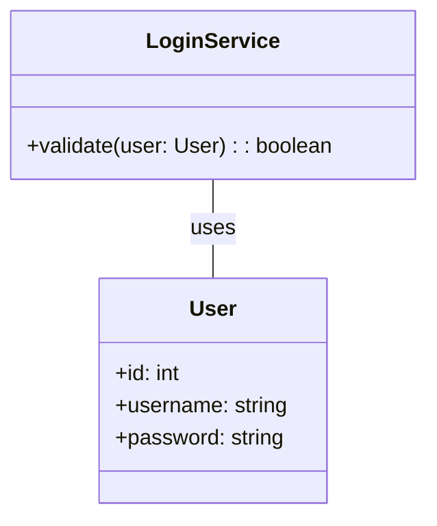
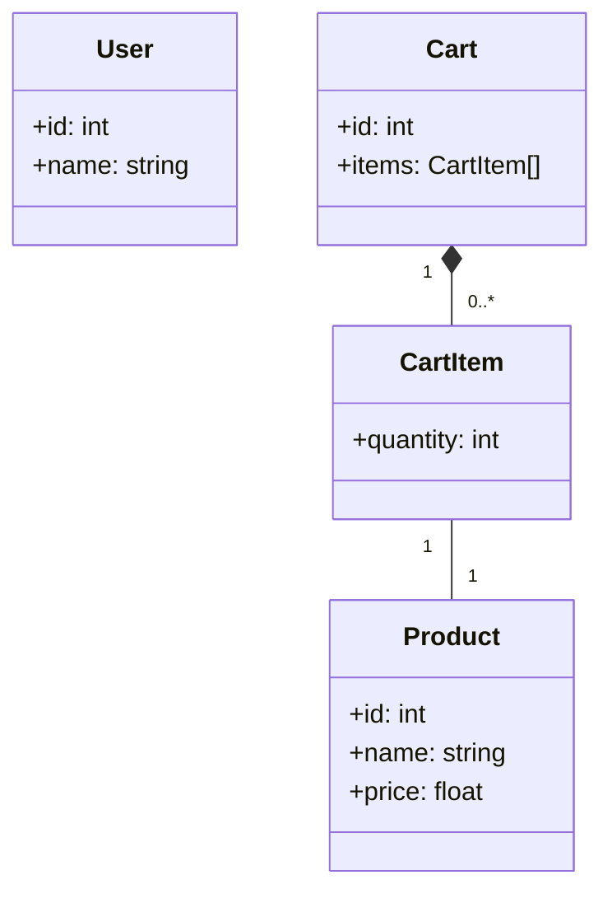
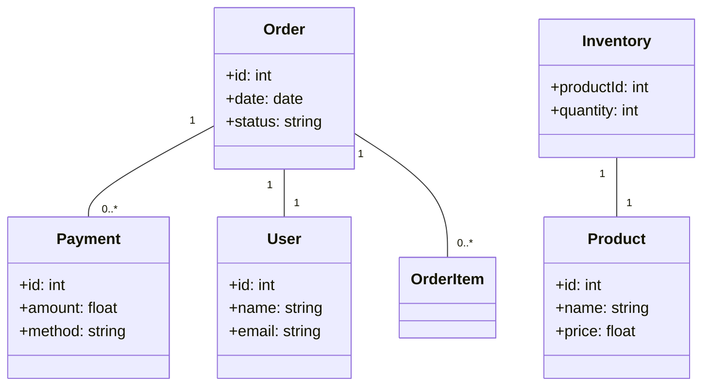

# Class Diagram

## Class Diagram

### What is it?

A **Class Diagram** is a structural UML (Unified Modeling Language) diagram that represents the static structure of a system by showing its classes, attributes, methods, and relationships between classes. It's used in object-oriented design to visualize the system's blueprint before coding.

***

### When to Use?

* During **system design phase** for object-oriented software.
* To model **real-world entities** (e.g., users, products, orders).
* To clarify **relationships** (e.g., inheritance, associations).
* To ensure **consistency** in system architecture.

***

### Real-Time Scenario Problem Statement

**Problem**: An e-commerce platform struggles with disorganized product inventory, inconsistent user data, and order processing errors. The team needs a clear system structure to avoid bugs and streamline development.

**Solution**: A Class Diagram will define core entities (e.g., `User`, `Product`, `Order`) and their relationships to ensure the system is logically structured.

***

### Use Case Examples

#### ✅ **Simple Use Case**: User Login System

**Scenario**: A basic login system with username/password validation.\
**Classes**: `User`, `LoginService`.\
**Relationship**: `LoginService` validates `User` credentials.

***

#### 🟠 **Medium Use Case**: Shopping Cart System

**Scenario**: Users add products to a cart with quantity tracking.\
**Classes**: `User`, `Product`, `Cart`, `CartItem`.\
**Relationships**:

* `Cart` contains `CartItem` (composition).
* `CartItem` links to `Product`.

***

#### 🔴 **Complex Use Case**: Full E-Commerce Platform

**Scenario**: End-to-end system with orders, payments, inventory, and user management.\
**Classes**: `User`, `Product`, `Order`, `Payment`, `Inventory`.\
**Relationships**:

* `Order` has multiple `Payment` entries.
* `Inventory` tracks stock for `Product`.

***

### Comparison with Other Diagrams

| Diagram Type | Purpose                       | Focus                   | Class Diagram Comparison                                           |
| ------------ | ----------------------------- | ----------------------- | ------------------------------------------------------------------ |
| **Use Case** | User interactions with system | Functional requirements | Shows _what_ the system does, not _how_.                           |
| **Sequence** | Object interactions over time | Dynamic behavior        | Class Diagram is **static**; Sequence shows **runtime flow**.      |
| **Activity** | Workflow/process steps        | Business logic          | Activity Diagram = process flow; Class Diagram = system structure. |

***

### In Summary

* **Class Diagram** = Static structure of a system (classes, attributes, relationships).
* **When to use**: Design phase for OOP systems.
* **Key benefit**: Prevents design flaws by clarifying entity relationships.
* **Best for**: Modeling complex systems (e.g., e-commerce, banking).

***

### Key Takeaway

Class Diagrams are the **foundation** of object-oriented design. They transform abstract requirements into a clear, actionable blueprint—ensuring developers build systems that are scalable, maintainable, and error-resistant.
