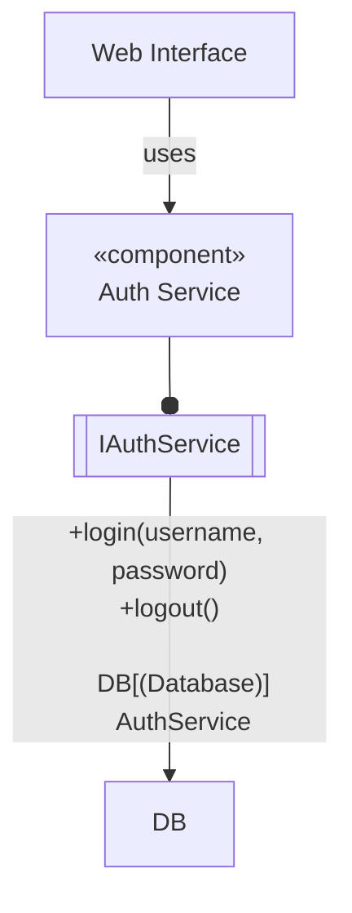
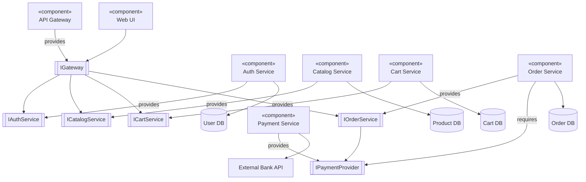
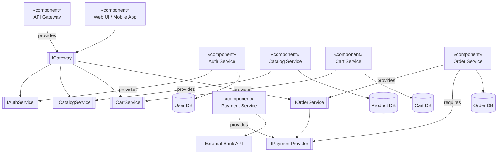

# Component Diagram

## Component Diagram

A **Component Diagram** is a type of structural diagram in the Unified Modeling Language (UML) that depicts the structural relationships between the components of a software system. A "component" is a modular, deployable, and replaceable part of a system that encapsulates its contents and exposes its functionality through a set of well-defined **interfaces**.

### What is a Component Diagram?

Think of it as a high-level blueprint of the software's architecture. It shows how the system is broken down into physical or logical components (like modules, libraries, services) and how they interact with each other through interfaces and dependencies.

**Key Elements:**

* **Component:** A rectangular box with the `«component»` stereotype and/or a component icon (a smaller rectangle with two tabs on the left).
* **Interface:** A circle (aka "lollipop") for a provided interface (what functionality the component offers) and a semi-circle (aka "socket") for a required interface (what functionality it needs from others).
* **Port:** A small square on the component's boundary that defines an explicit interaction point.
* **Dependency Arrow:** A dashed arrow with a line head, showing that one component requires/depends on another.
* **Assembly Connector:** A solid line connecting a "lollipop" to a "socket," showing how components are wired together.

***

#### When to Use Component Diagrams?

Component diagrams are used primarily during the **design and architecture phase** of software development.

1. **Modeling Source Code:** To visualize how your code is organized into modules, namespaces, or libraries and their dependencies (e.g., in Java: JARs, WARs; in .NET: DLLs).
2. **Designing System Architecture:** To plan and document the high-level structure of an application, especially for service-oriented architectures (SOA) or microservices.
3. **Describing Executable Releases:** To show what components and their versions are included in a specific release of an application.
4. **Facilitating Reuse:** By clearly defining interfaces, components become "black boxes," making it easier to replace or reuse them in other systems.

***

#### Problem Statement: Real-Time Scenario

**Scenario:** An e-commerce company, "ShopFast," has a monolithic web application that is becoming difficult to maintain and scale. Every small bug fix requires redeploying the entire application. During peak sales, the entire site becomes slow or crashes because a single feature (like product search) is overloaded.

**The Problem:** The current architecture is a tangled monolith. The team needs to break it down into a more modular, scalable, and resilient system.

**Solution with Component Diagrams:** The architecture team uses **Component Diagrams** to design a new, component-based or microservices-based architecture. The diagram will help them:

* Identify clear, independent functional units (e.g., User Authentication, Product Catalog, Shopping Cart, Payment Processor).
* Define strict interfaces between these components.
* Plan for independent development, testing, and deployment of each component.
* Communicate the new architectural vision to all stakeholders (developers, testers, DevOps, management).

***

#### Use Case Examples with Mermaid Diagrams

**1. Simple: User Login System**

A basic system where a web interface depends on a separate authentication component to verify user credentials.

**Use Case:** A user enters their username and password on a login screen. The `Web Interface` component sends this data to the `Auth Service` component, which checks it against a database and returns a success or failure response.

**Mermaid Syntax:**



**2. Medium: Payment Processing Module**

A more complex interaction involving multiple components with defined required and provided interfaces. The `Order Service` requires payment functionality, which is provided by the `Payment Service`. The `Payment Service` itself requires an external connection to a `Bank API`.

**Use Case:** After checkout, the `Order Service` initiates a payment. It connects to the `Payment Service` via the `IPaymentProvider` interface. The `Payment Service` processes the transaction by communicating with an external bank's API.

**Mermaid Syntax:**


```mermaid
graph LR
    OrderService[«component»\nOrder Service] -- requires --> IPaymentProvider[[IPaymentProvider]]
    IPaymentProvider : +processPayment(amount, details)

    PaymentService[«component»\nPayment Service] -- provides --> IPaymentProvider
    PaymentService -- requires --> IBankAPI[[IBankAPI]]

    BankGateway[Bank API Gateway]
    IBankAPI --o BankGateway
```

**3. Complex: E-Commerce Application Architecture**

This diagram shows a high-level, service-oriented architecture for our "ShopFast" problem statement. Components communicate through well-defined interfaces, allowing them to be developed and scaled independently.

**Mermaid Syntax:**



***

#### Comparison with Other Diagrams

| Diagram Type           | Purpose & Scope                                                                                                                                             | Focus                                                                                      |
| ---------------------- | ----------------------------------------------------------------------------------------------------------------------------------------------------------- | ------------------------------------------------------------------------------------------ |
| **Component Diagram**  | **Static implementation view.** Shows the organization and dependencies between physical software **components** (modules, services, libraries).            | **High-level architecture,** code organization, and dependencies between deployable units. |
| **Class Diagram**      | **Static design view.** Shows the structure of the system in terms of **classes**, attributes, methods, and their relationships (inheritance, association). | **Low-level design,** object-oriented modeling of the code itself, not its deployment.     |
| **Deployment Diagram** | **Static deployment view.** Shows the physical arrangement of **hardware nodes** and how software artifacts (executables, components) are deployed on them. | **Infrastructure,** servers, processors, and where components live physically.             |
| **Sequence Diagram**   | **Dynamic behavior view.** Shows how **objects/components interact** in a time sequence, emphasizing the order of messages passed between them.             | **Runtime behavior** of a specific use case or operation.                                  |

**In short:** A Class Diagram shows _what your code is_, a Component Diagram shows _how your code is packaged_, and a Deployment Diagram shows _where that package runs_.

***

#### In Summary

* **Purpose:** Component Diagrams are the **blueprint of your software's architecture**, focusing on modularity, interfaces, and dependencies.
* **Key Benefit:** They promote a **design-by-contract** approach through interfaces, making systems more maintainable, scalable, and understandable.
* **When to Use:** Ideal for designing and communicating the high-level structure of **component-based, service-oriented, or microservices architectures**.
* **Not For:** They are not meant for describing algorithms, complex business logic, or the finite states of a system (use Activity or State Machine diagrams for that).

***

#### Sample Diagram for All Use Cases

This single, integrated diagram combines the concepts from the simple, medium, and complex examples into a coherent view of an e-commerce system.




