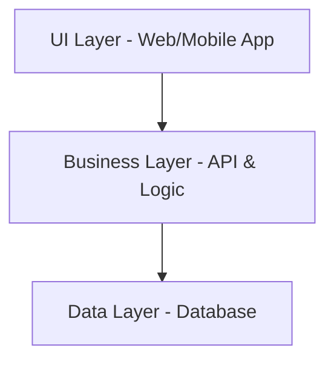
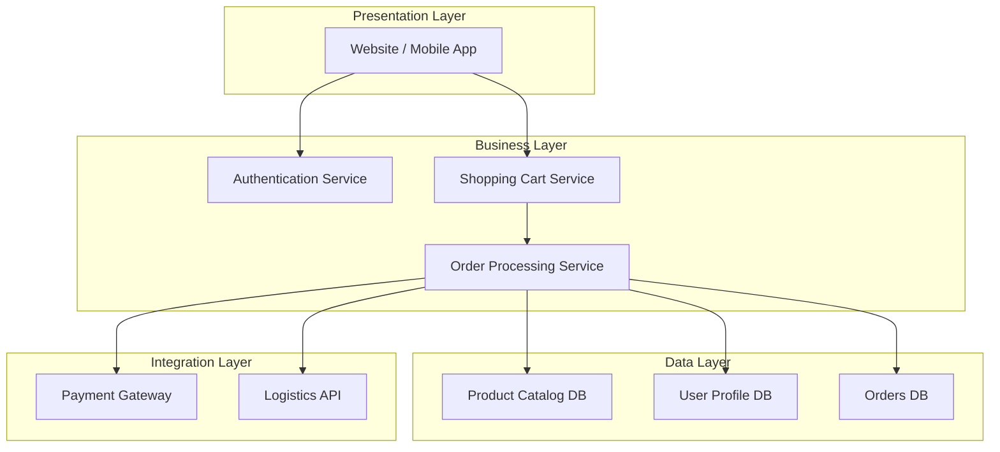
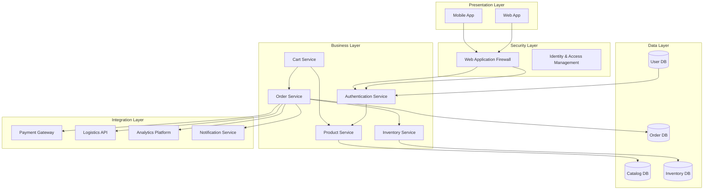
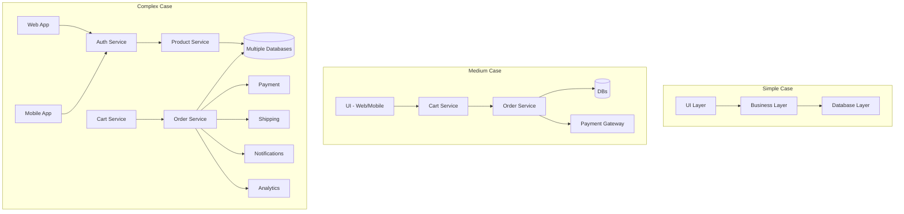

# Layered Diagram

***

### 1. What is it?

A **Layered Diagram** is a visual representation that organizes a system, process, or architecture into **distinct layers**, where each layer represents a level of abstraction, responsibility, or functionality.

* It helps in showing **separation of concerns** (e.g., UI, business logic, data layer).
* Common in **software architecture, cloud design, enterprise workflows, and security models**.

***

### 2. When to use?

Use **Layered Diagrams** when you need to:

* Show **hierarchy of responsibilities** in a system.
* Represent **logical vs physical layers** (UI, services, database).
* Explain **progressive abstraction** from high-level to low-level details.
* Document **enterprise systems**, **network design**, or **multi-tier architectures**.

***

### 3. Problem Statement (Real-time Scenario)

Imagine an **E-commerce Platform**:

* Customers browse products via a website or mobile app.
* Business logic handles pricing, discount, and checkout rules.
* Database stores product catalogs, user profiles, and orders.
* External services like payment gateways, delivery tracking, and analytics are integrated.

The challenge is **to represent the system in a way that different stakeholders (developers, architects, business owners) can understand their area of concern without overwhelming detail.**

A **Layered Diagram** solves this by separating the system into **UI Layer, Business Layer, Data Layer, and Integration Layer**.

***

### 4. Use Case Examples with Mermaid Diagrams

#### 🟢 Simple Case – 3-tier Web App

✅ Shows separation of **frontend, backend, database**.

***

#### 🟡 Medium Case – E-commerce Platform

✅ Shows **multiple services and integrations**.

***

#### 🔴 Complex Case – Enterprise E-commerce with Analytics & Security

✅ Represents **multi-layered enterprise architecture with security & analytics**.

***

### 5. Comparison with Other Diagrams

| Diagram Type           | Purpose                                 | Strengths                             | Weakness vs Layered                                 |
| ---------------------- | --------------------------------------- | ------------------------------------- | --------------------------------------------------- |
| **Layered Diagram**    | Show hierarchy & separation of concerns | Easy abstraction, stakeholder clarity | Limited interaction flow                            |
| **Flowchart**          | Show process sequence                   | Good for workflows                    | Not ideal for abstraction                           |
| **Component Diagram**  | Show system components & relationships  | Good for microservices                | Lacks tiered abstraction                            |
| **Sequence Diagram**   | Show interactions over time             | Best for time-based flows             | Too detailed for high-level                         |
| **Deployment Diagram** | Show physical deployment of services    | Useful for infra view                 | Overlaps with architecture but not logical layering |

***

### 6. In Summary

* **Layered diagrams** are best when you need to **show separation of responsibilities**.
* They **simplify complex systems** by breaking them into logical layers.
* Ideal for **software architecture, enterprise systems, and multi-tier applications**.
* Compared to flowcharts/sequence diagrams, they **focus on hierarchy, not process flow**.

***

### 7. Final Sample Diagram (Combined View of Simple → Medium → Complex)

***

