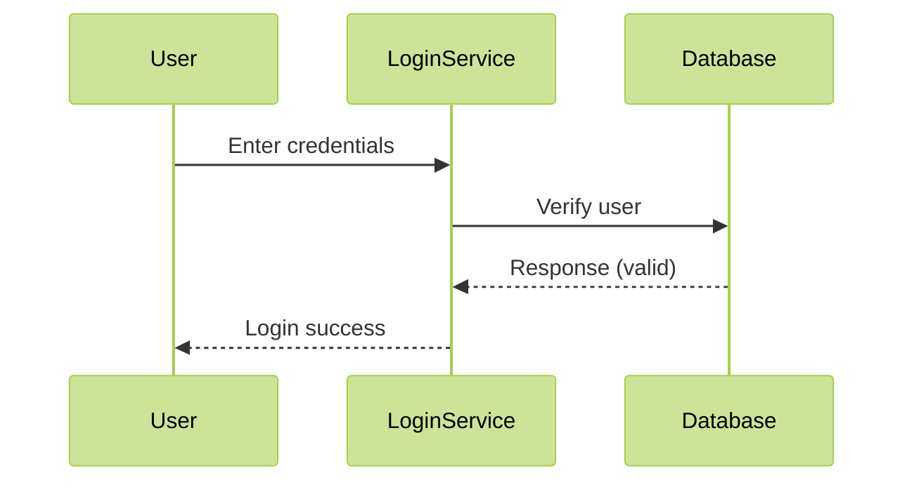
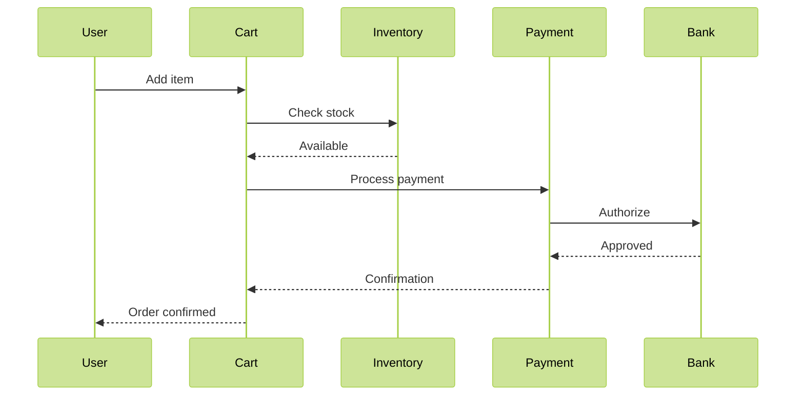
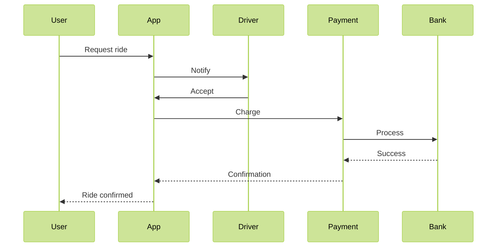

# Sequence Diagram

## Sequence Diagram

### What is it?

A **Sequence Diagram** is a UML (Unified Modeling Language) diagram that illustrates how objects interact in a sequential order to accomplish a specific task. It shows the flow of messages between objects over time, emphasizing the _order_ of interactions rather than just the relationships.

### When to use?

Use Sequence Diagrams when:

* You need to model **dynamic behavior** of a system
* The **sequence of messages** between objects is critical
* You're designing **interaction flows** (e.g., user workflows, API calls)
* You need to visualize **time-sensitive operations** (e.g., timeouts, parallel processes)

***

### Problem Statement (Real-Time Scenario)

**Scenario**: A mobile banking app experiences inconsistent transaction failures during payment processing. Users report "Timeout" errors when attempting to complete payments, but the issue doesn't occur consistently.

**Problem Analysis**: The system waits for a response from the payment gateway, but the timeout occurs at unpredictable intervals. A Sequence Diagram helps identify:

* Where the delay occurs (gateway vs. internal processing)
* Whether the issue is due to message ordering or external dependencies

***

### Use Case Examples

#### 1. Simple Use Case: User Login

**Scenario**: A user logs into a web application.

**Key Insight**: Shows the linear flow of authentication checks.

***

#### 2. Medium Use Case: E-Commerce Checkout

**Scenario**: A user completes a purchase on an online store.

**Key Insight**: Demonstrates parallel checks (inventory) and external system integration (bank).

***

#### 3. Complex Use Case: Ride-Hailing Service

**Scenario**: A user requests a ride via a mobile app.

**Key Insight**: Highlights multi-step coordination across services (driver, payment, bank) with asynchronous responses.

***

### Comparison with Other Diagrams

| Diagram Type              | Focus                           | Best For                                  | Limitation                        |
| ------------------------- | ------------------------------- | ----------------------------------------- | --------------------------------- |
| **Sequence Diagram**      | Message order over time         | Workflow sequencing, time-sensitive flows | Doesn't show object relationships |
| **Activity Diagram**      | Workflow steps & decisions      | Business processes, complex logic paths   | No explicit object interactions   |
| **State Diagram**         | State transitions               | Object lifecycle (e.g., order status)     | No message flow details           |
| **Communication Diagram** | Object relationships (not time) | Object relationships, not sequence        | Harder to track message order     |

***

### In Summary

* **Sequence Diagrams** excel at showing **how objects interact over time**.
* They’re ideal for **debugging workflows**, **designing APIs**, and **documenting user journeys**.
* Unlike Activity Diagrams (which focus on _what_ happens), Sequence Diagrams emphasize _when_ and _in what order_ things happen.
* **Key difference from Communication Diagrams**: Sequence Diagrams show _time progression_; Communication Diagrams show _object relationships_.

***

### Why This Matters

Sequence Diagrams bridge the gap between technical design and business requirements. They help teams:

* Catch **timing issues** (e.g., timeouts)
* **Clarify responsibilities** between services
* **Document interactions** for developers and stakeholders
* **Validate system behavior** before implementation

> 💡 **Pro Tip**: Always start with a simple sequence diagram for core workflows before adding complexity. It’s the most effective way to visualize and communicate system behavior.
