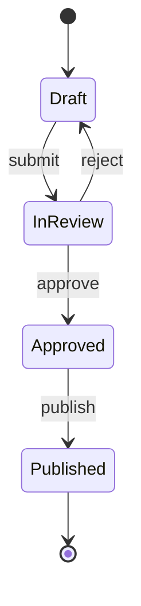
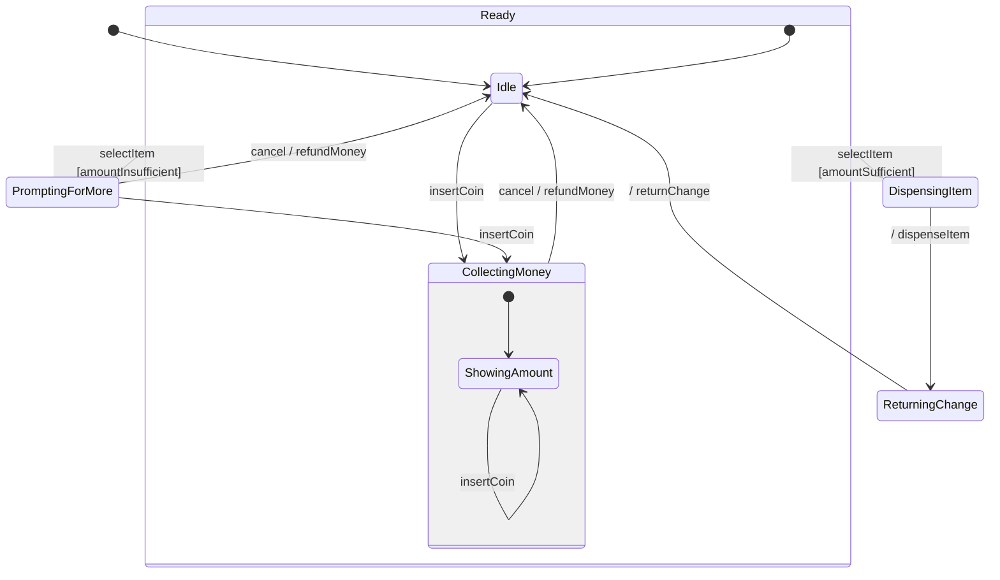
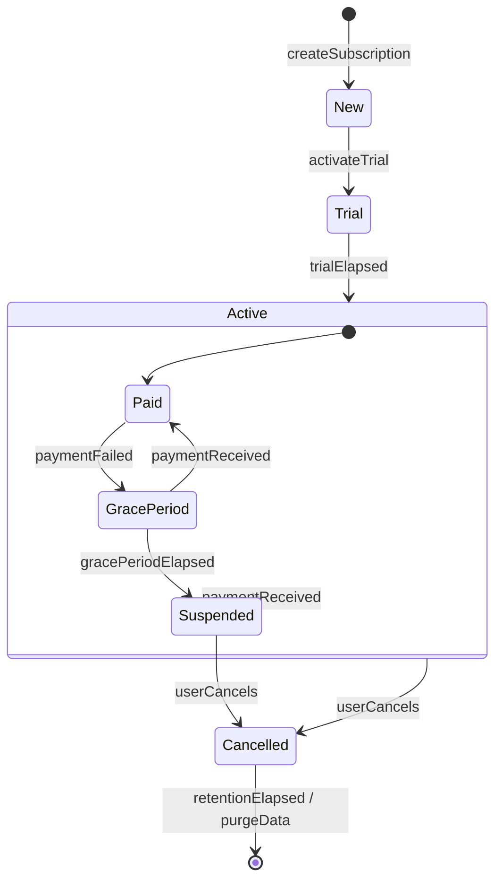

# State Diagram

Of course. Here is a detailed explanation of UML State Machine Diagrams (State Diagrams) based on your request.

***

#### What is a State Diagram?

A **State Diagram** (also known as a **State Machine Diagram** or **Statechart Diagram**) is a behavioral diagram in the Unified Modeling Language (UML) that models the dynamic behavior of a single object in response to a series of events in its lifetime. It describes the sequence of **states** an object goes through, the **transitions** between those states, and the **events** that cause those transitions.

Think of it as a map of all the possible conditions (states) an object can be in and the rules that govern how it moves from one condition to another. The key idea is that an object's behavior is determined by its current state.

**Key Elements:**

* **State:** A rounded rectangle representing a condition or situation during the life of an object during which it satisfies some condition, performs some action, or waits for an event. States can have **entry/**`do`/**exit** actions.
  * `entry/`: Action performed upon entering the state.
  * `do/`: Action performed while inside the state.
  * `exit/`: Action performed upon exiting the state.
* **Initial State:** A filled black circle indicating the starting point of the state machine.
* **Final State:** A circled black circle indicating the end of the object's life or the conclusion of the state machine.
* **Transition:** A solid arrow from one state to another, representing the movement caused by an event.
* **Event:** The trigger that causes a transition (e.g., `buttonPressed`, `paymentReceived`). It is written alongside the transition arrow.
* **Guard Condition:** A boolean expression in square brackets `[condition]` that must be true for the transition to be taken (e.g., `[password correct]`).
* **Action:** An executable, atomic computation that may occur on a transition (e.g., `/ send confirmation email`).

***

#### When to Use State Diagrams?

State diagrams are used to model the reactive behavior of objects that have a clear lifecycle with multiple defined states.

1. **Objects with Complex State-Dependent Behavior:** When an object's response to an event depends not just on the event itself, but on what has happened to the object in the past (i.e., its current state). Examples: Order, User Account, Vending Machine, Network Connection.
2. **Describing Lifecycles:** To define the complete lifecycle of an entity from its creation to termination, including all possible states it can be in.
3. **Clarifying Complex Business Rules:** When business rules involve numerous "if-then" conditions based on an object's status, a state diagram can visualize them more clearly than text.
4. **Designing Event-Driven Systems:** Ideal for systems that respond to internal or external events (e.g., GUIs, embedded systems, control systems).

***

#### Problem Statement: Real-Time Scenario

**Scenario:** A video streaming service, "StreamFlix," has a complex set of business rules governing a user's subscription. Subscriptions can be in trial, active, suspended for non-payment, cancelled, or expired. Support and billing teams often make mistakes when handling user requests because the rules for moving between these statuses are documented in a long, confusing text document.

**The Problem:** The business logic for subscription status is poorly understood, leading to inconsistent application of rules and customer dissatisfaction.

**Solution with State Diagrams:** A system architect creates a **State Diagram** to:

* Serve as a single source of truth for the entire subscription lifecycle.
* Visually clarify all possible states a subscription can be in and the exact events (e.g., `payment failed`, `admin reactivates`) required to move between them.
* Ensure that developers implement the logic correctly and that all teams (billing, support) understand the workflow.

***

#### Use Case Examples with Mermaid Diagrams

**1. Simple: Light Switch**

A basic object with only two possible states. This is the "Hello, World!" of state diagrams.

**Use Case:** A light switch can be either `On` or `Off`. The event `flipSwitch` toggles it from one state to the other.

**Mermaid Syntax:**

```mermaid
stateDiagram-v2
    [*] --> Off
    state Off {
        -- : entry/lightOff()
    }
    Off --> On : flipSwitch
    state On {
        -- : entry/lightOn()
    }
    On --> Off : flipSwitch
    On --> [*]
```

**2. Medium: Document Review Workflow**

An object with multiple states and transitions that depend on guard conditions. This models a common business process.

**Use Case:** A document starts as `Draft`. It can be `Submitted` for review, moving it to the `In Review` state. A reviewer can either `Approve` it (moving it to `Approved`) or `Reject` it (moving it back to `Draft` for edits). From `Approved`, it can be `Published`.

**Mermaid Syntax:**



**3. Complex: Vending Machine**

This diagram models an object with complex behavior, including nested states (e.g., `Idle` within `Ready`), guard conditions, and transitions triggered by internal actions (selecting an item, inserting money).

**Use Case:** A vending machine starts `Idle`. Inserting money makes it `Ready` and shows the amount. The user can then `selectItem`. If the amount is `[sufficient]`, the machine `dispenses` the item and returns any change before going back to `Idle`. If the amount is `[insufficient]`, it prompts for more money. The user can always cancel to get a refund.

**Mermaid Syntax:**



***

#### Comparison with Other Diagrams

| Diagram Type         | Purpose & Focus                                                                                                             | Key Differentiator                                                                                         |
| -------------------- | --------------------------------------------------------------------------------------------------------------------------- | ---------------------------------------------------------------------------------------------------------- |
| **State Diagram**    | Models the **states and transitions of a single object** in response to events. Focuses on the **lifecycle** of one object. | Answers: "What are all the conditions this specific object can be in, and what makes it change condition?" |
| **Activity Diagram** | Models the **flow of activities/actions** in a process. Focuses on the **sequence and parallelism of operations**.          | Answers: "What are the steps to complete this process, and what activities happen in parallel?"            |
| **Sequence Diagram** | Models the **interaction between multiple objects** over **time**. Focuses on the **order of messages**.                    | Answers: "In what order do these objects communicate to get a job done?"                                   |

**In short:** Use a State Diagram for the **lifecycle of one object**, an Activity Diagram for the **steps of a process**, and a Sequence Diagram for the **collaboration between objects over time**.

***

#### In Summary

* **Purpose:** State Diagrams are the premier tool for **modeling the state-dependent behavior of a single object** throughout its life.
* **Key Benefit:** They excel at capturing complex business rules and logic that depend on an object's history or current condition.
* **When to Use:** Essential for designing and understanding objects with clearly defined states (e.g., orders, tickets, user accounts, devices).
* **Not For:** They are not suitable for showing interactions between multiple objects or the overall flow of a business process involving many actors.

***

#### Sample Diagram for All Use Cases

This integrated diagram shows the state lifecycle of a `Subscription` object for our "StreamFlix" scenario, incorporating ideas from the simple and medium examples.





