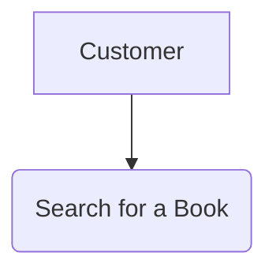
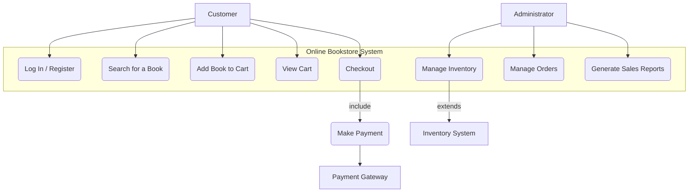

# Use Case Diagram

## Use Case Diagram

A Use Case Diagram is a visual representation of how users interact with a system to achieve a specific goal. It's a high-level view that shows the relationships between actors (the users or external systems) and the use cases (the functions or actions within the system). The main components of a use case diagram are **actors**, **use cases**, and the **relationships** between them.

***

### When to Use

You should use a use case diagram during the **requirements gathering** and **analysis phases** of software development. They are particularly useful for:

* **Communicating with stakeholders:** They provide a simple, non-technical way to show clients, project managers, and other stakeholders what the system will do.
* **Defining system scope:** They help to clearly define the boundaries of the system and what functionality will be included.
* **Identifying and organizing requirements:** They serve as a foundation for more detailed functional requirements.
* **Planning development sprints:** Use cases can be broken down into tasks for development teams.

***

### Problem Statement & Scenario

Imagine a new **online book store** 📚 that needs to be developed. The business wants to allow customers to browse books, add them to a cart, and make a purchase. They also need a way for administrators to manage the inventory and process orders. The problem is to accurately model and visualize these user interactions and system functions to ensure everyone involved has a clear understanding of the system's scope and requirements.

***

### Use Case Examples

**Simple Use Case: Searching for a Book**

* **Actors:** Customer
* **Use Case:** Search for a Book
* **Relationship:** The Customer initiates the "Search for a Book" use case.
* **Mermaid Syntax:**




#### **Medium Use Case: Purchasing a Book**

* **Actors:** Customer, Payment Gateway
* **Use Cases:**
  * Log In/Register
  * Add Book to Cart
  * View Cart
  * Checkout
  * Make Payment
* **Relationships:** The "Checkout" use case **includes** "Make Payment". The "Make Payment" use case extends to an external **Payment Gateway** system.
*   **Mermaid Syntax:**

    ```mermaid
    graph TD
        A[Customer] --> B(Log In / Register)
        A --> C(Add Book to Cart)
        A --> D(View Cart)
        A --> E(Checkout)
        E -- include --> F(Make Payment)
        F -- extends --> G[Payment Gateway]
    ```


#### **Complex Use Case: Administering the Store**

* **Actors:** Administrator, Inventory System
* **Use Cases:**
  * Log In as Administrator
  * Manage Inventory (Add, Update, Delete Books)
  * Manage Orders (View, Process, Cancel)
  * Generate Sales Reports
* **Relationships:** The "Manage Inventory" use case **includes** "Update Book" and interacts with the external **Inventory System**. The "Manage Orders" use case is also initiated by the **Administrator**.
*   **Mermaid Syntax:**

    ```mermaid
    graph TD
        A[Administrator] --> B(Log In as Administrator)
        B --> C(Manage Inventory)
        B --> D(Manage Orders)
        B --> E(Generate Sales Reports)
        C -- include --> C1(Update Book)
        C -- extends --> F[Inventory System]
    ```

***

### Comparison with Other Diagrams

While use case diagrams are excellent for showing the **what** of a system (what it does from a user's perspective), other diagrams are better for showing the **how**.

* **Class Diagram:** This diagram shows the static structure of the system, including **classes**, their attributes, and relationships. It is used to model the internal structure of the software, not the user's interaction.
* **Sequence Diagram:** This diagram shows the interactions between objects in a time-ordered sequence. It is used to model the **dynamic behavior** of a system and the flow of messages between objects.
* **Activity Diagram:** This diagram represents the **flow of control** and the step-by-step workflow of a system. It's great for visualizing business processes and detailed system activities.

In short, a use case diagram provides the **context**, while the others provide the **details** of the system's architecture and behavior.

***

### Summary

A use case diagram is a powerful tool for **visualizing and defining the scope** of a system based on user interactions. It helps bridge the gap between business requirements and technical design by providing a simple, high-level overview. They are most effective during the early stages of a project and complement other, more detailed UML diagrams.

### Sample Diagrams

**Combined Mermaid Diagram for the Online Book Store**


