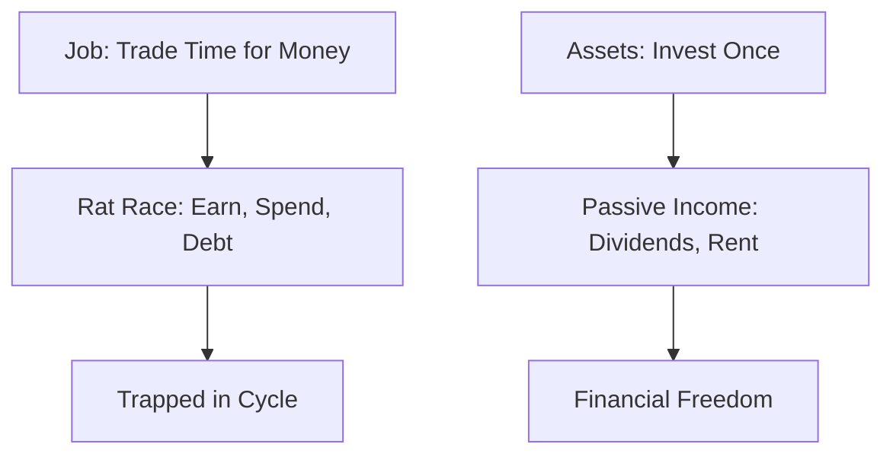
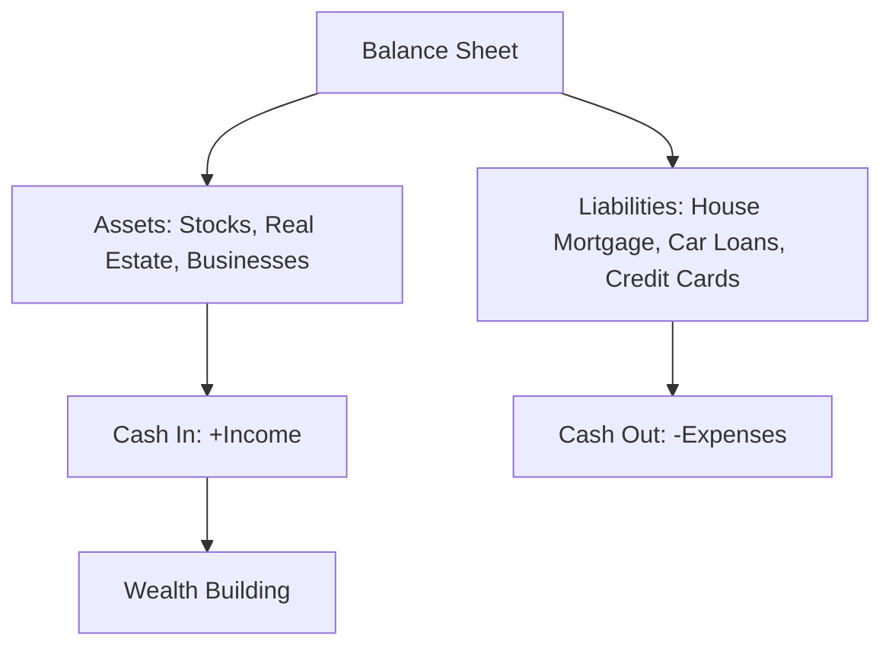
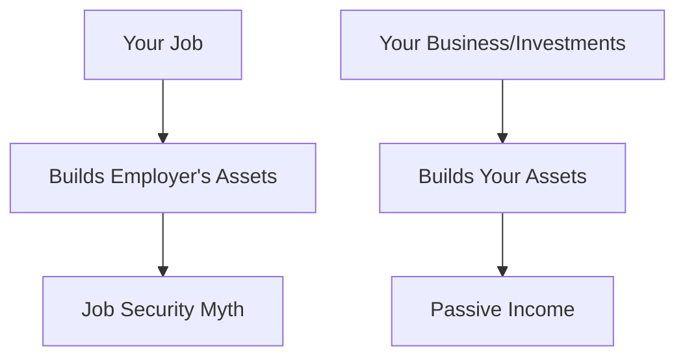
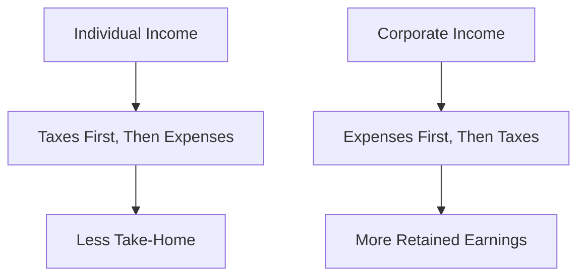
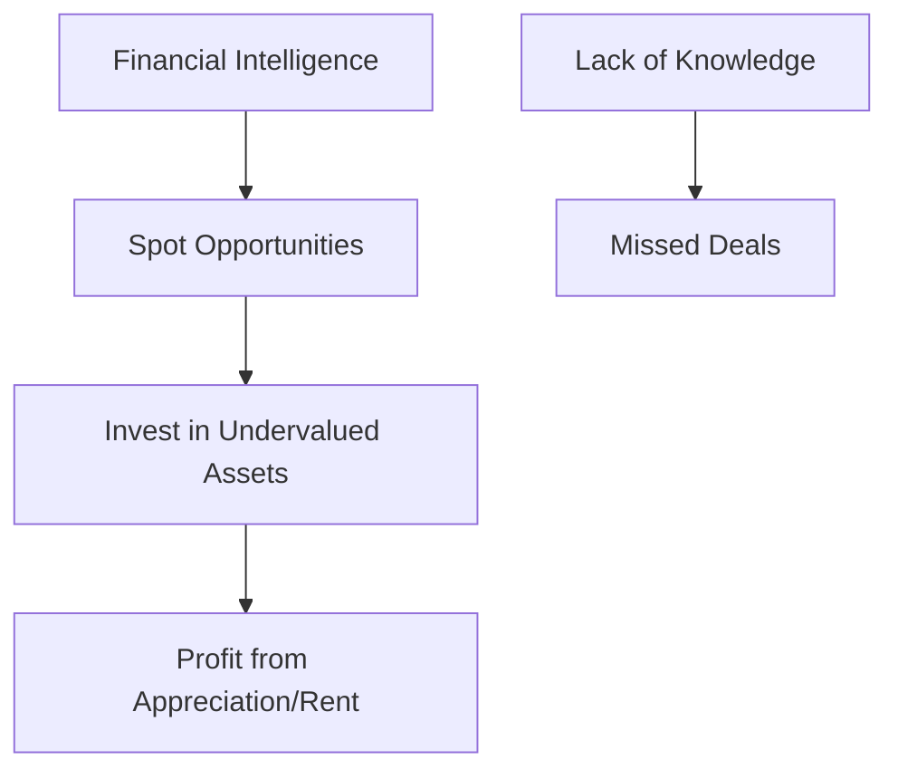
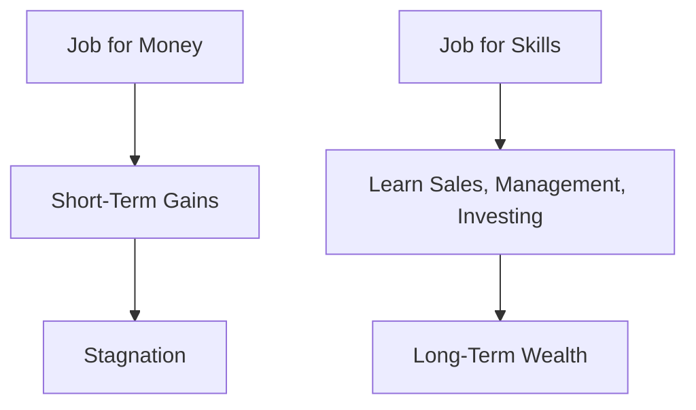
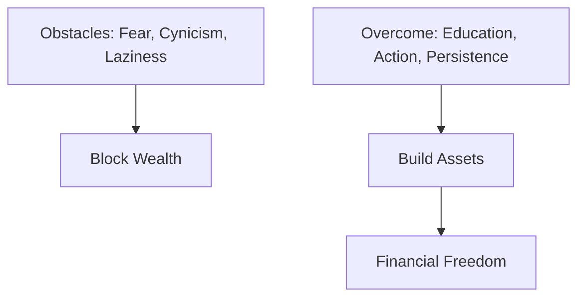

# What the Rich Teach Their Kids

## 🪙 Rich Dad Poor Dad: A Comprehensive Summary

_Rich Dad Poor Dad: What the Rich Teach Their Kids About Money - That the Poor and Middle Class Do Not!_ by Robert T. Kiyosaki is a seminal personal finance book published in 1997. Through autobiographical anecdotes, Kiyosaki contrasts the mindsets and financial advice from his two "dads": his biological father (Poor Dad), a highly educated but financially struggling government employee, and his friend's father (Rich Dad), a successful businessman who builds wealth through smart investments. The book challenges conventional wisdom on money, emphasizing financial literacy, asset building, and entrepreneurial thinking. Below is a detailed summary of its key lessons, with examples and Mermaid diagrams for clarity.

### 🏠 Introduction to the Book

Kiyosaki shares his childhood experiences learning about money from Poor Dad, who believed in job security and education, and Rich Dad, who taught that the rich don't work for money—they make money work for them. The book debunks myths like "your house is an asset" and promotes building passive income streams. It uses simple language and stories to make financial concepts accessible, urging readers to shift from employee mindsets to investor or business owner perspectives.

### 💡 Key Financial Lessons

The book revolves around six main lessons taught by Rich Dad, plus additional insights. Each is explained with concepts, real-life examples from Kiyosaki's experiences, and Mermaid diagrams to illustrate the ideas.

### 🧠 Lesson 1: The Rich Don't Work for Money

**Concept**: Money should work for you through assets that generate income, rather than trading time for money in a job. Poor and middle-class people get trapped in the "rat race" of earning, spending, and debt.

**Example**: As a child, Kiyosaki and his friend Mike work for Rich Dad for pennies, learning that employees work for money while the rich create systems (like businesses) that produce money. Rich Dad pays them little to teach the value of opportunity over wages.

**Application**: Instead of chasing higher salaries, invest in stocks or real estate that pay dividends or rent.

**Diagram**: Job vs Asset

### 📊 Lesson 2: Why Teach Financial Literacy?

**Concept**: Understand the difference between assets (things that put money in your pocket) and liabilities (things that take money out). Build a strong asset column on your balance sheet.

**Example**: Kiyosaki explains that a house is often a liability due to mortgages, taxes, and maintenance, not an asset as Poor Dad believed. Rich Dad's asset column included businesses and investments that generated cash flow.

**Application**: Track your cash flow: Income from job/assets minus expenses/liabilities. Focus on acquiring income-generating assets like rental properties.

**Diagram**: Asset Vs Liabilities

### 🏢 Lesson 3: Mind Your Own Business

**Concept**: Focus on building your own assets rather than working to build someone else's (like your employer's). Own businesses or investments that don't require your daily presence.

**Example**: Rich Dad owned multiple businesses and invested in real estate, while Poor Dad climbed the corporate ladder but owned few assets. Kiyosaki started buying comic book libraries as a kid to create his own "business."

**Application**: Start a side hustle or invest in stocks; don't let your job define your financial future.

**Diagram**:  Job Vs Business/Investments

### 📜 Lesson 4: The History of Taxes and the Power of Corporations

**Concept**: The rich use corporations to minimize taxes legally, as corporations can deduct expenses before taxes. Understand tax laws to your advantage.

**Example**: Rich Dad explained how taxes originated to fund wars and how the wealthy structure income through corporations to pay less. Poor Dad paid high taxes on his salary, while Rich Dad deducted business expenses first.

**Application**: Form an LLC for side businesses to deduct costs like travel or home offices before taxing profits.

**Diagram**: Individual vs Corporate

### 💭Lesson 5: The Rich Invent Money

**Concept**: Opportunities are everywhere; financial intelligence (knowledge + courage) turns them into wealth. Use your brain to find deals others miss.

**Example**: Kiyosaki bought undervalued real estate during a market downturn, flipping it for profit. Rich Dad taught that deals come from education and networks, not luck.

**Application**: Educate yourself on markets; negotiate deals like buying foreclosed properties at a discount.

**Diagram**: Financial knowledge

#### 📚 Lesson 6: Work to Learn—Don't Work for Money

**Concept**: Seek jobs for skills (sales, management, investing) rather than pay. Broad knowledge makes you versatile and wealthy.

**Example**: Kiyosaki worked in sales at Xerox to learn selling, then applied it to his businesses. Rich Dad advised learning multiple skills to manage money effectively.

**Application**: Take a lower-paying job if it teaches valuable skills like marketing, which can lead to higher future earnings.

**Mermaid Diagram**:

### 🧐 Other Key Insights

#### Overcoming Obstacles to Wealth

The book discusses mental barriers like fear, cynicism, laziness, bad habits, and arrogance that prevent wealth-building. Kiyosaki stresses starting small and persisting.

**Example**: Fear of losing money stopped Poor Dad from investing, while Rich Dad viewed failures as lessons.

#### The Importance of Giving

Rich Dad taught that giving (tithing, charity) attracts more wealth, aligning with a abundance mindset.

**Example**: Kiyosaki donates to causes, believing it creates positive financial karma.

#### Action Steps

Kiyosaki ends with 10 steps, like paying yourself first, controlling cash flow, and continuous learning.

**Diagram: F**or Obstacles

### 🔑 Key Points to Remember

* Assets generate income; liabilities consume it.
* Financial education is more important than formal schooling for wealth.
* Think like an investor: Make money work for you.
* Use corporations and tax strategies wisely.
* Learn from failures and keep educating yourself.
* Avoid the rat race by building passive income.

### 📝 Summary and Conclusion

_Rich Dad Poor Dad_ revolutionizes how we view money by contrasting Poor Dad's traditional path of education and job security with Rich Dad's entrepreneurial approach to assets and financial IQ. Through six core lessons, Kiyosaki teaches that wealth comes from mindset shifts, literacy, and action—buying assets, minimizing liabilities, and inventing opportunities.&#x20;

Examples from his life, like early business ventures and real estate deals, illustrate these principles vividly. The book encourages readers to break free from middle-class traps, work to learn skills, and use tools like corporations for advantage. Ultimately, it's a call to financial independence: Educate yourself, take risks, and build a life where money serves you. This timeless guide empowers anyone to rethink money and achieve prosperity, proving that riches start in the mind.

***

