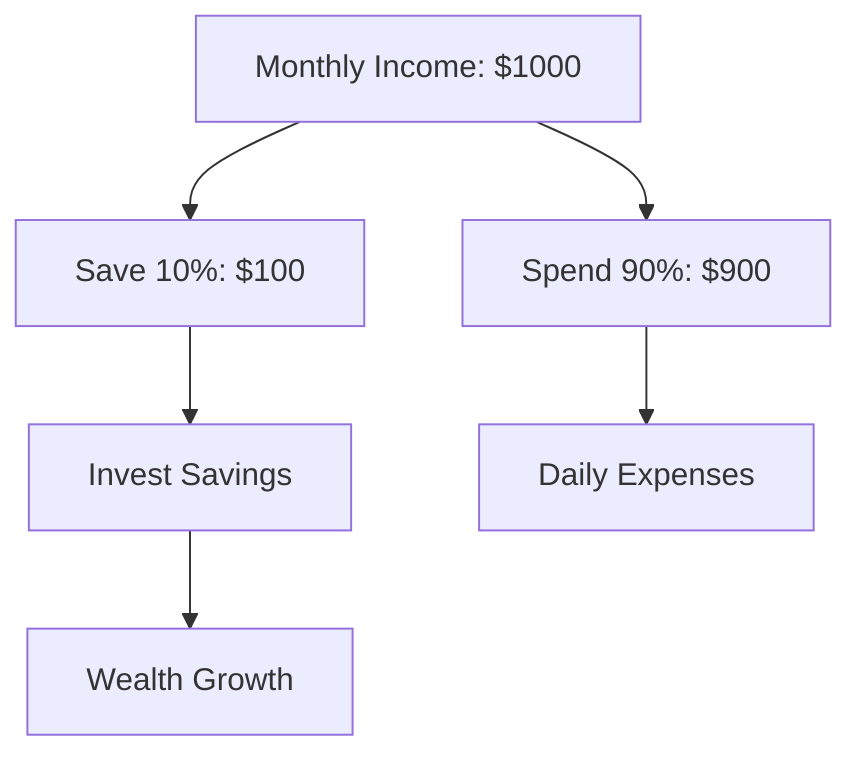
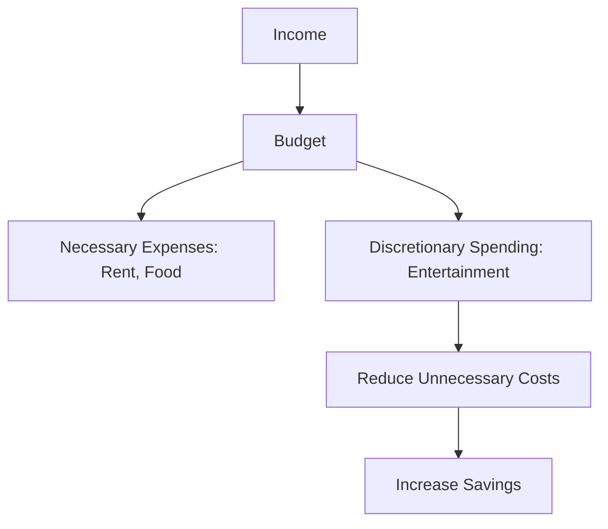
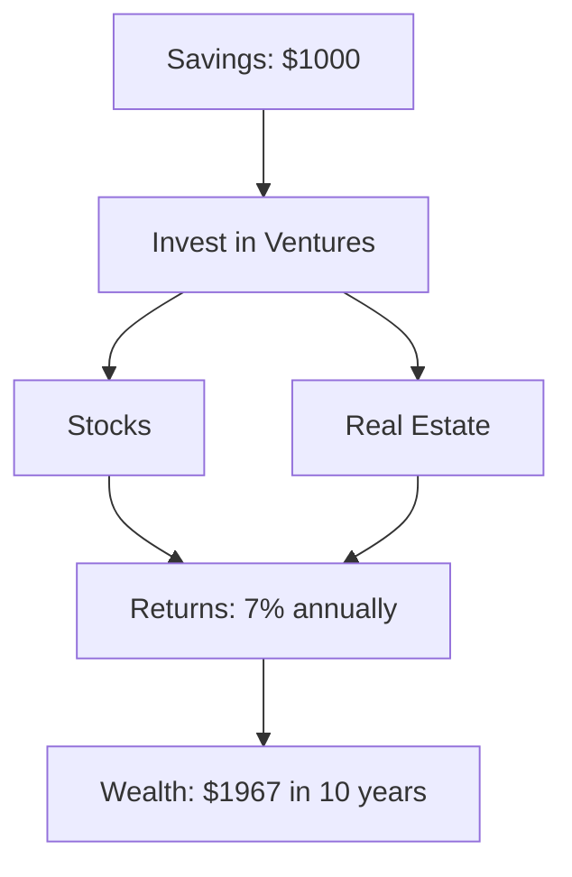
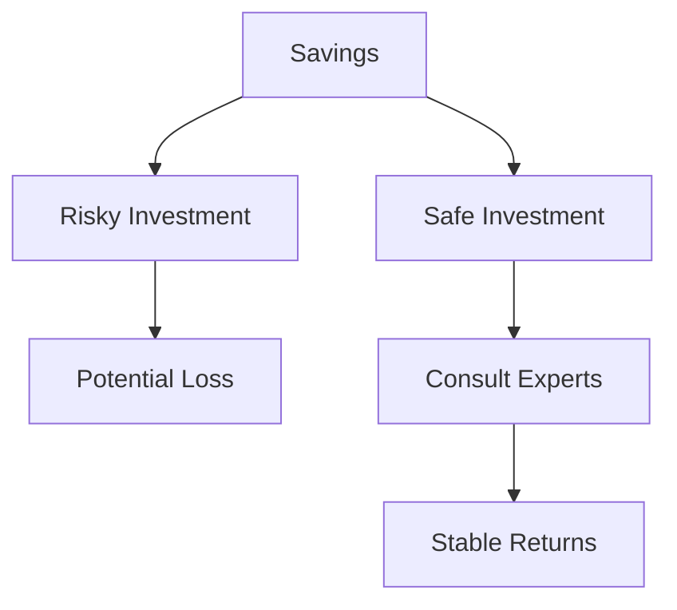
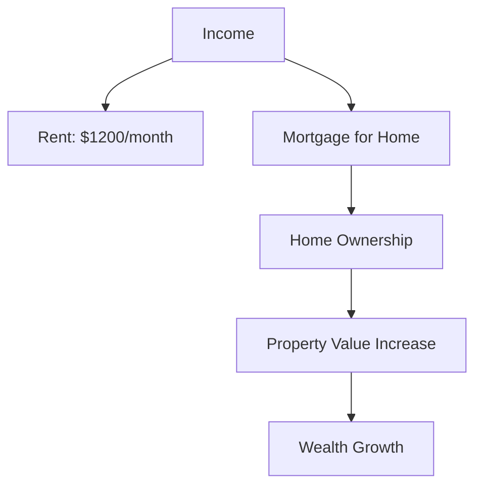
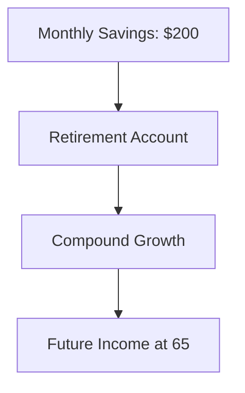
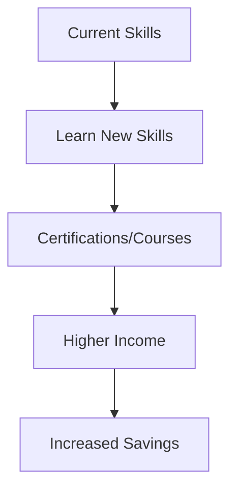
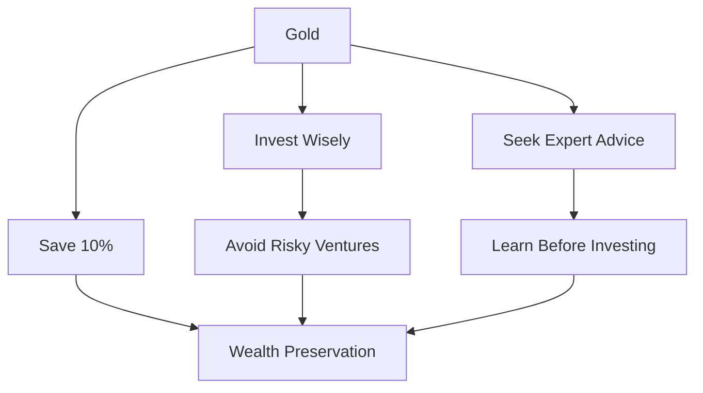
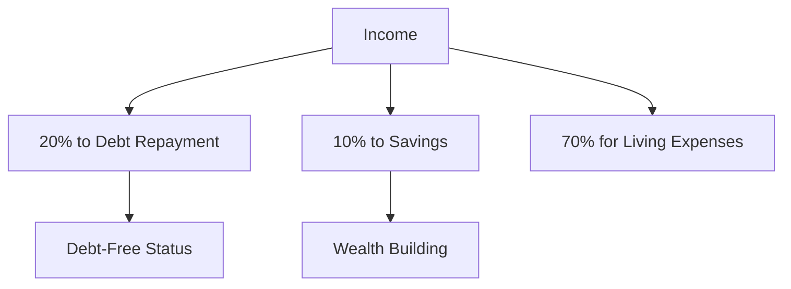

# Richest Man in Babylon

## 👑 The Richest Man in Babylon:&#x20;

## :cowboy: A Comprehensive Summary

### 🏛 Introduction to the Book

_The Richest Man in Babylon_ is a collection of parables that deliver financial wisdom through the experiences of characters in ancient Babylon, a city renowned for its wealth and prosperity. The book’s central figure, Arkad, is the titular "richest man," whose journey from humble beginnings to immense wealth serves as a model for readers. Through stories and dialogues, Clason outlines principles for accumulating wealth, managing money, and achieving financial security. The book’s storytelling approach makes complex financial concepts accessible and engaging.

### 📜 Key Financial Principles

The book is structured around core financial principles, often referred to as the "Seven Cures for a Lean Purse" and the "Five Laws of Gold." These principles are presented through narratives that illustrate their application in everyday life. Below, each principle is explained with examples and supported by Mermaid diagrams to visualize the concepts.

## 💸 1. Pay yourself first using the skills you already have.

> Start Thy Purse to Fattening

**Concept**: Save at least 10% of your income before spending on anything else. This principle emphasizes the importance of paying yourself first to build wealth over time.

**Example**: In the book, Arkad, a poor scribe, learns this lesson from Algamish, a wealthy money lender. Algamish advises Arkad to set aside one-tenth of his earnings and live on the remaining nine-tenths. Arkad follows this advice, saving consistently, which becomes the foundation of his wealth.

**Application**: If you earn $1,000 a month, save $100 before paying bills or expenses. Over time, this savings accumulates and can be invested for growth.

**Diagram**: How to handle monthly income?

### 💰 2. Keep Your Expenses Low&#x20;

> Control Thy Expenditures

**Concept**: Live within your means by budgeting and avoiding unnecessary expenses. This principle stresses the importance of distinguishing between needs and wants.

**Example**: Arkad’s friend Kobbi and Bansir, a chariot builder, lament their lack of wealth despite steady incomes. Arkad explains that they spend all their earnings on luxuries and non-essentials. By tracking expenses and cutting back on frivolous spending, they can redirect money toward savings.

**Application**: Create a budget to track income and expenses. For example, limit dining out to once a week to free up funds for savings or investments.

**Diagram**: Budget your income

### 📈 3. Invest What You Save

> Make Thy Gold Multiply

**Concept**: Invest your savings wisely to generate additional income. This principle highlights the power of compound interest and passive income.

**Example**: Arkad invests his savings in profitable ventures, such as lending to a brick maker who pays back with interest. His money grows through careful investments, unlike his peers who squander their savings.

**Application**: Invest in a diversified portfolio, such as stocks or real estate, to earn returns. For instance, $1,000 invested at a 7% annual return could grow to $1,967 in 10 years with compound interest.

**Diagram**: Multiply your income

### 🛡 4. Protec Your Investments From Loss

> Guard Thy Treasures from Loss

**Concept**: Protect your wealth by avoiding risky or speculative investments. Seek advice from experts and invest in secure opportunities.

**Example**: Arkad learns this lesson the hard way when he entrusts his savings to a brick maker who loses it in a bad deal. He later seeks advice from experienced investors to ensure safer returns.

**Application**: Research investments thoroughly and consult financial advisors. Avoid "get-rich-quick" schemes that promise high returns with little risk.

**Diagram**: Risk vs Safe Investment

### 🔄 5. Own your Home/Profitable Investment

> Make of Thy Dwelling a Profitable Investment

**Concept**: Own your home to reduce expenses and build wealth. Homeownership can be a stable investment compared to renting.

**Example**: The book suggests that owning a home provides security and eliminates rent payments, freeing up income for other investments. Arkad advises his students to prioritize this step once savings are established.

**Application**: Instead of paying $1,200 monthly in rent, consider purchasing a home with a mortgage. Over time, the home’s value may appreciate, contributing to wealth.

**Diagram**: Right investment&#x20;

### 📚 6. Invest for Retirement/Future Income

> Ensure a Future Income

**Concept**: Plan for retirement and future financial needs by saving and investing consistently. This principle emphasizes long-term security.

**Example**: Arkad prepares for his later years by investing in income-generating assets, ensuring he can retire comfortably without relying on others.

**Application**: Contribute to a retirement account, such as a 401(k) or IRA, to secure income in old age. For example, saving $200 monthly from age 30 could grow significantly by age 65.

**Diagram**: Future Income

### 🤝 7. Learn New Skills to Increase Your Income

> Increase Thy Ability to Earn

**Concept**: Continuously improve your skills and knowledge to increase your earning potential. Education and effort lead to higher income.

**Example**: Arkad rises from a scribe to a wealthy merchant by learning about trade and investments. His dedication to self-improvement boosts his income.

**Application**: Take courses or acquire certifications to advance your career. For instance, learning a new skill like coding could lead to a higher-paying job.

**Diagram**: Learn New Skills

### 💸 The Five Laws of Gold

In addition to the Seven Cures, Clason introduces the "Five Laws of Gold" through the story of Nomasir, Arkad’s son, who learns to manage wealth wisely. These laws complement the cures and focus on preserving and growing wealth.

#### ⚖ Law 1: Gold Cometh Gladly

Gold comes to those who save at least one-tenth of their income. This reinforces the first cure, emphasizing consistent saving.

#### 🔒 Law 2: Gold Clingeth to the Cautious

Wealth stays with those who invest it wisely, avoiding reckless ventures.

#### 📈 Law 3: Gold Slippeth Away

Money is lost when entrusted to those without expertise. Seek advice from knowledgeable advisors.

#### 🛠 Law 4: Gold Favors the Knowledgeable

Invest in areas you understand, or learn before investing to avoid losses.

#### 🏃 Law 5: Gold Flees the Impulsive

Avoid schemes promising quick riches, as they often lead to financial ruin.

**Example**: Nomasir loses his gold in a risky venture but later succeeds by following these laws, investing cautiously, and seeking expert advice.

**Diagram**: Wise investor

### 🧠 Other Key Lessons

#### The Importance of Seeking Wisdom

The book emphasizes learning from those who have achieved financial success. Arkad seeks guidance from Algamish, which sets him on the path to wealth.

**Example**: A young man in Babylon consults a successful merchant before starting a business, avoiding common pitfalls.

#### The Power of Persistence

Financial success requires discipline and consistency. Arkad’s steady adherence to saving and investing leads to his prosperity.

**Example**: Despite early setbacks, Arkad persists in saving and learning, eventually becoming the richest man in Babylon.

#### Avoiding Debt

The book warns against borrowing beyond one’s means, as debt can erode wealth. In the story of Dabasir, a camel trader, paying off debts systematically restores his financial freedom.

**Example**: Dabasir allocates 20% of his income to debt repayment, 10% to savings, and lives on the rest, eventually becoming debt-free.

**Diagram**: How to overcome debut?

### 📝 Summary and Conclusion

_The Richest Man in Babylon_ distills timeless financial wisdom into simple, actionable principles. Through the stories of Arkad, Nomasir, and others, Clason teaches readers to save consistently, live within their means, invest wisely, and seek knowledge. The Seven Cures for a Lean Purse and the Five Laws of Gold provide a roadmap for financial success, emphasizing discipline, caution, and long-term planning. By applying these principles—saving 10% of income, budgeting carefully, investing for growth, and avoiding debt—anyone can work toward financial independence.&#x20;

The book’s engaging parables make these lessons memorable, offering a blend of storytelling and practical advice that remains relevant nearly a century after its publication. Whether you’re starting your financial journey or seeking to refine your approach, this book offers enduring guidance for building and preserving wealth.

***

