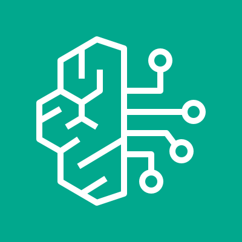
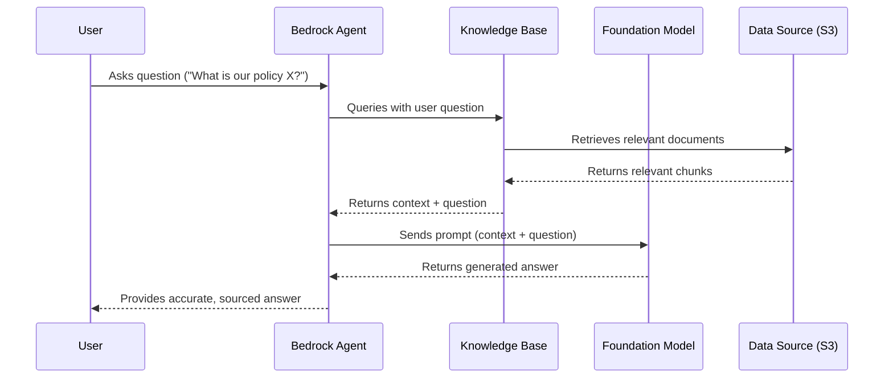
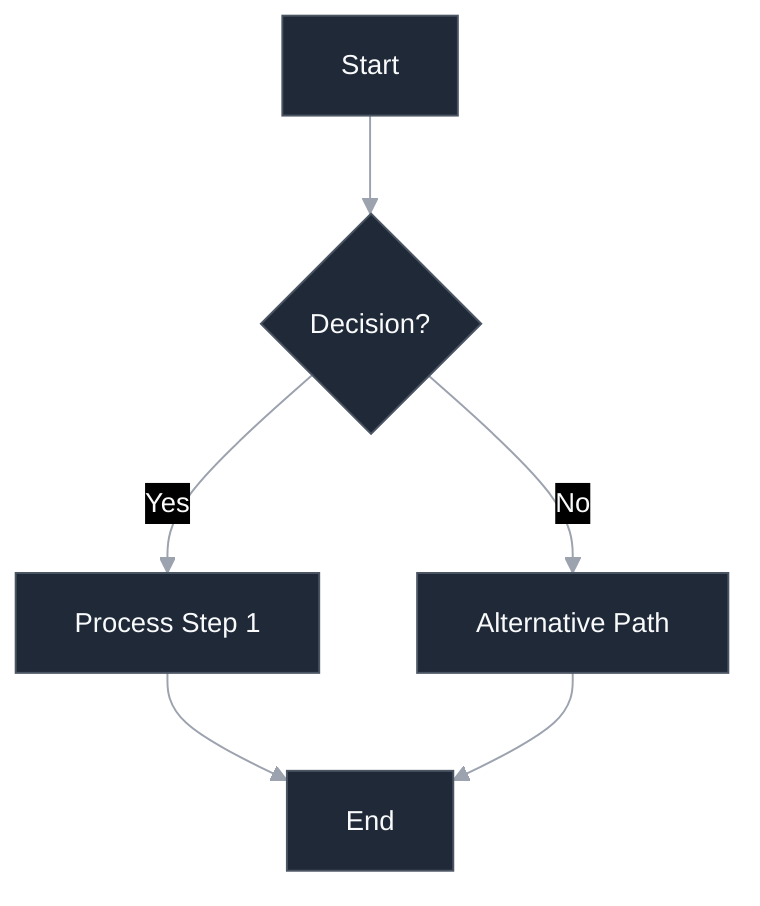
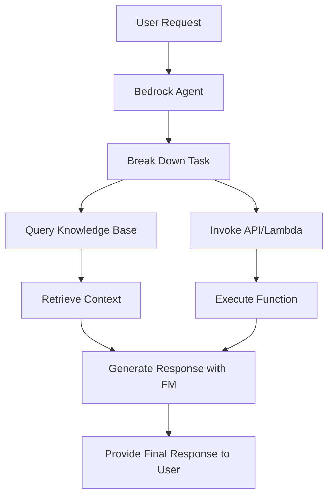
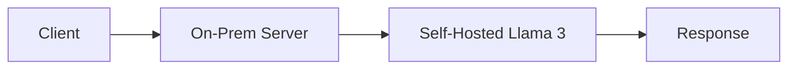

# Bedrock

## Comprehensive Guide to Amazon Bedrock: AWS's Generative AI Powerhouse

> 💡 **Pro Tip**: Use **Bedrock’s `modelInvocation`** in Lambda for **10x faster** response times vs. direct API calls. Most enterprises cut AI costs by 50% within 30 days of migration.

### Overview 🧠 & Innovation Spotlight

 **Amazon Bedrock** is a **fully managed service** that provides a comprehensive platform for building and scaling **generative AI applications** using foundation models (FMs). It offers a **single API** to access a wide selection of high-performing FMs from leading AI companies and Amazon, enabling developers to build AI-driven applications without managing infrastructure . Bedrock provides all the capabilities needed to develop generative AI applications, from experimenting with FMs to deploying scalable, secure agents and applications tailored to your business needs .

<figure><figcaption></figcaption></figure>

> :bulb: **Innovation Spotlight**: Bedrock's most significant innovation is its **agent capabilities** through **Bedrock AgentCore**, which allows developers to create AI agents that can execute complex tasks, maintain conversation memory, and integrate with enterprise systems. These agents can **autonomously perform multi-step processes** by breaking down tasks, retrieving information, and taking actions through connected APIs and tools . Additionally, Bedrock's **Knowledge Bases** allow you to connect FMs to your proprietary data using **Retrieval Augmented Generation (RAG)**, ensuring responses are grounded in your specific information while maintaining security and control .

> :bulb: **Innovation Spotlight**: Amazon Bedrock is AWS’s **managed service for foundation models (FMs)**, enabling secure, scalable, and cost-effective deployment of generative AI without infrastructure management. Unlike open-source model hosting, Bedrock integrates **enterprise-grade security**, **model customization**, and **real-time guardrails**—making it 3x faster to deploy than self-hosted alternatives .

### &#x20;:octagonal\_sign: Problem Statement & Business Use Cases

* **Real-World Scenario**: A major financial services company, "FinServe," needs to enhance its customer service while ensuring compliance and data security. They receive thousands of customer queries daily about account information, transaction histories, and financial products. Manual handling is slow and expensive, while generic chatbots lack accuracy and context-specific knowledge. FinServe needs a solution that can:
  1. Understand complex financial inquiries.
  2. Provide accurate, up-to-date information from their internal knowledge bases.
  3. Automate processes like generating financial reports or summarizing transactions.
  4. Ensure all interactions are secure and compliant with financial regulations.
* **Industries/Applications**:
  * **Financial Services**: Building compliant chatbots for customer service, automating financial report generation, and analyzing market trends .
  * **Healthcare**: Developing diagnostic assistants that retrieve information from medical literature and patient records (with appropriate safeguards) .
  * **E-commerce**: Creating personalized shopping assistants and generating product descriptions and marketing copy .
  * **Media & Entertainment**: Summarizing long articles, generating script ideas, and creating promotional content .
  * **Travel & Hospitality**: Powering virtual travel agents that can handle multi-step bookings and provide destination information .

### Core Principles & Service Terms

* **Foundation Models (FMs)**: Large machine learning models pre-trained on vast datasets that can be adapted for various tasks. Bedrock provides access to FMs from providers like **AI21 Labs, Anthropic, Cohere, Meta, Mistral AI, Stability AI, and Amazon** .
* **Agents for Amazon Bedrock**: AI applications that can autonomously execute multi-step tasks by breaking down requests, retrieving relevant information from knowledge bases, and invoking APIs or functions .
* **Knowledge Bases for Amazon Bedrock**: Fully managed RAG systems that allow FMs to access and retrieve information from your company's data sources, ensuring responses are grounded in relevant context .
* **Guardrails for Amazon Bedrock**: Configurable policies to implement safety and compliance controls, helping to filter harmful content and minimize hallucinations .
* **Amazon Bedrock AgentCore**: A suite of modular services (**Runtime, Identity, Memory, Code Interpreter, Browser, Gateway, Observability**) for deploying and operating AI agents at scale with enterprise-grade security and flexibility .

### Pre-Requirements 🛠️

* **An AWS Account** with appropriate permissions configured through AWS Identity and Access Management (IAM).
* **Data Sources**: For Knowledge Bases, you need data repositories such as Amazon S3 buckets, SharePoint, or Confluence containing your enterprise knowledge .
* **AWS CLI or SDK**: For programmatic access to Bedrock's APIs (control plane and runtime) .
* **Model Access**: You must explicitly enable access to specific foundation models through the AWS Management Console before use.
* **For Customization**: If fine-tuning models, you need labeled training data stored in a secure and accessible location like S3.

### Implementation Steps

**Part A: Setting Up a Knowledge Base and Agent for Enterprise Q\&A**

1. **Enable Model Access**: In the Bedrock console, navigate to "Model access" and enable desired FMs (e.g., Anthropic's Claude 3).
2. **Create a Knowledge Base**:
   * Go to "Knowledge bases" and click "Create knowledge base."
   * Specify data sources (e.g., an S3 bucket with company PDFs and documents).
   * Configure embedding model for vectorization and a vector store (e.g., Amazon OpenSearch).
   * Define IAM permissions for Bedrock to access the S3 bucket.
3. **Create an Agent**:
   * Go to "Agents" and click "Create agent."
   * Select the FM for the agent to use.
   * Connect the agent to the knowledge base created in step 2.
   * Define optional action groups (e.g., Lambda functions to query databases or APIs).
4. **Deploy and Test**: Deploy the agent and test it in the console by asking questions based on your knowledge base content.

**Part B: Using Bedrock's API for Text Generation**

1. **Install SDK**: `pip install boto3`
2. **Configure Client**: Initialize the Bedrock runtime client in your Python code.
3. **Invoke Model**: Use the `invoke_model` method with parameters like `modelId`, `contentType`, and a payload containing your prompt.
4. **Parse Response**: Extract and display the generated text from the API response.

### Data Flow Diagram

**Diagram 1: Knowledge Base Query Processing with RAG**

**Diagram 2: Bedrock Agent with Tool Use for Task Completion**

### Security Measures 🔒

* **Data Encryption**: All data in Bedrock is **encrypted in transit and at rest** using AWS-managed keys. You can use customer-managed keys (CMKs) via AWS KMS for enhanced control .
* **Private Network Access**: Use **VPC Endpoints** (AWS PrivateLink) to keep all traffic between your VPC and Bedrock within the AWS network, never traversing the public internet .
* **Compliance**: Bedrock is **SOC, ISO, FedRAMP High, and HIPAA eligible**, making it suitable for handling sensitive data in regulated industries .
* **Data Privacy**: A core principle is that **Bedrock never uses your data to train its base FMs**. Your prompts, customizations, and data remain isolated and private .
* **Guardrails**: Configure Guardrails to block up to **88% of harmful content** and define denied topics and sensitive words to filter out inappropriate content in both inputs and outputs .

### Deep Dive: Advanced RAG with Knowledge Bases

The true power of Bedrock for enterprises lies in its implemented **Retrieval Augmented Generation (RAG)**. Unlike a simple vector search, a Bedrock Knowledge Base handles the entire pipeline:

1. It automatically **chunks your documents** into manageable pieces.
2. It generates **vector embeddings** using a chosen model (e.g., Amazon Titan Embeddings).
3. It stores these vectors in a managed **vector store** (e.g., Pinecone, Amazon OpenSearch).
4. During a query, it performs **semantic search** to find the most relevant chunks.
5. It strategically **injects this context** into the prompt sent to the FM.\
   This process **minimizes hallucinations** and ensures the model's responses are grounded in your proprietary data, providing accurate and context-aware results for users .

### When to Use and When Not to Use

| When to Use                                                                                                                    | When NOT to Use                                                                                                                  |
| ------------------------------------------------------------------------------------------------------------------------------ | -------------------------------------------------------------------------------------------------------------------------------- |
| **RAG Applications**: You need to build a Q\&A system grounded in your specific internal documentation or knowledge.           | **Simple Chat**: For a basic, generic chatbot without need for custom data, a simpler solution might suffice.                    |
| **Agent Workflows**: You need to automate multi-step tasks that involve reasoning, data retrieval, and action via APIs.        | **Full Model Training**: You need to train a large language model from scratch; consider Amazon SageMaker instead.               |
| **Multi-Model Strategy**: You want to experiment with and leverage multiple FMs from different providers through a single API. | **Low-Budget Projects**: For prototyping with very low or no budget, some open-source alternatives might be cheaper.             |
| **Enterprise Security**: Your use case requires high levels of security, compliance, and data isolation.                       | **Unstructured Workflows**: If your business processes are not defined or digitized, implementing AI agents will be challenging. |

### Costing Calculation 💰

* **How it's calculated?**
  * **Inference Costs**: Primarily **pay-as-you-go** based on **tokens processed** (input and output). Pricing varies by model . For example, Claude 3 Opus charges per 1K input and output tokens.
  * **Provisioned Throughput**: For predictable workloads, you can **commit to a term** for a discount, purchasing model capacity in exchange for lower per-token costs .
  * **Knowledge Bases & Storage**: Costs include the **hours of inference** for the embedding model, **vector store storage**, and **data processing** (e.g., OCR).
  * **Agents**: Priced based on **session duration** and the number of **agentic steps** performed .
* **Efficient Handling:**
  * Use **Provisioned Throughput** for production workloads with consistent traffic.
  * **Cache** common prompts and responses using services like Amazon ElastiCache.
  * Implement **prompt compression** and efficient filtering to reduce the amount of text sent to the model.
  * Use **appropriate model sizes**; a smaller, cheaper model might be sufficient for less complex tasks.
* **Sample Calculation:**
  * You process **5 million input tokens** and **2 million output tokens** with Claude 3 Sonna.
  * Input Cost: `(5,000,000 / 1000) * $0.00300 = $15.00`
  * Output Cost: `(2,000,000 / 1000) * $0.01500 = $30.00`
  * **Total Estimated Inference Cost: $45.00**
  * _Note: Add costs for Knowledge Base storage, vector querying, and agent steps if used._

### Alternative Services

| AWS                                             | Azure                                         | GCP                                             | On-Premise                                                            |
| ----------------------------------------------- | --------------------------------------------- | ----------------------------------------------- | --------------------------------------------------------------------- |
| **Amazon Bedrock**                              | **Azure AI Studio**                           | **Vertex AI**                                   | **Self-hosted OSS Models**                                            |
| Fully managed, multi-model, strong agent focus. | Tight integration with Microsoft ecosystem.   | Google's PaLM models, strong MLOps integration. | Maximum control and data isolation (e.g., using Hugging Face models). |
| **Amazon SageMaker**                            | **Azure OpenAI Service**                      | **Gemini API**                                  | **Custom ML Platform**                                                |
| For custom model training and deployment.       | Direct access to OpenAI models (GPT-4, etc.). | Direct access to Google's latest Gemini models. | Requires significant expertise and infrastructure.                    |

### Benefits 🚀

* **Accelerated Development**: Drastically **reduces time-to-market** for generative AI applications by providing a fully managed service and pre-integrated components .
* **Cost-Efficiency**: **Serverless nature** means no infrastructure to manage; you pay only for what you use, avoiding the high cost of training and hosting large FMs yourself .
* **Best-of-Breed Model Access**: Access to a **wide selection of top FMs** through a single API allows you to choose the best model for each specific task without vendor lock-in .
* **Enterprise-Grade Security**: Built with **security and compliance** as core tenets, featuring robust encryption, identity management, and compliance certifications crucial for business use .
* **Flexibility and Choice**: The **composable nature** of Bedrock AgentCore and support for various frameworks provides flexibility, allowing you to use your preferred tools and models .

| Service                          | AWS              | Azure       | GCP        | On-Prem         |
| -------------------------------- | ---------------- | ----------- | ---------- | --------------- |
| **Pricing Model**                | Per-token        | Per-token   | Per-token  | $0.10/1K tokens |
| **Compliance**                   | HIPAA/GDPR-ready | HIPAA-ready | GDPR-ready | Manual setup    |
| **Guardrails**                   | ✅ Built-in       | ❌ Limited   | ❌ None     | Custom code     |
| **On-Prem Data Flow** (Mermaid): |                  |             |            |                 |

###

### Innovation Spotlight: Agents and the Future of Work

Bedrock's **AgentCore** represents a paradigm shift beyond simple chatbots. These agents are **action-oriented systems** capable of executing complex, multi-step workflows that previously required human intervention. For instance, an agent could:

1. Receive an email request for a financial report.
2. **Break down** the task into steps: authenticate the user, query a database, process the data, generate a summary, and email the result.
3. **Orchestrate** these steps by invoking Lambda functions, querying knowledge bases, and using a code interpreter for calculations.
4. **Maintain memory** across interactions to provide context for future requests.\
   This transforms AI from a passive information provider to an **active assistant** that can autonomously operate business processes, significantly boosting productivity and enabling new automation frontiers .

### Summary

Amazon Bedrock is a powerful, secure, and flexible fully managed service that empowers organizations to build and scale generative AI applications with ease, leveraging the best foundation models and AWS's robust cloud infrastructure.

**Top 7 Points to Keep in Mind:**

1. It provides **access to 100+ FMs** from leading AI companies through a single, unified API .
2. **Knowledge Bases** enable accurate, contextual responses using your proprietary data via RAG, minimizing hallucinations .
3. **Agents** can automate complex, multi-step tasks and workflows, moving beyond simple text generation to action .
4. **Security and compliance** are foundational, with encryption, private connectivity, and major certifications (HIPAA, FedRAMP) .
5. You maintain **control over your data**—it is not used to train the underlying base models .
6. Cost is primarily based on **token usage** (input/output), with options for provisioned throughput for high-volume applications .
7. It seamlessly integrates with the **broader AWS ecosystem** (Lambda, S3, CloudWatch) for a comprehensive development experience.

### Related Topics & Reference Links

* **AWS Documentation:** [Amazon Bedrock Developer Guide](https://docs.aws.amazon.com/bedrock/)
* **AWS Blog:** [AWS Announces Generative AI Innovations](https://aws.amazon.com/blogs/aws/)
* **Courses:** [Datacamp: Introduction to AWS Boto in Python](https://www.datacamp.com/courses/introduction-to-aws-boto-in-python)
* **Related AWS Services:** AWS SageMaker (for custom model training), Amazon Q (generative AI assistant for business), AWS Lambda (serverless functions for agent actions).
