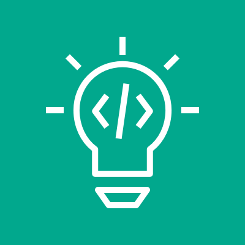
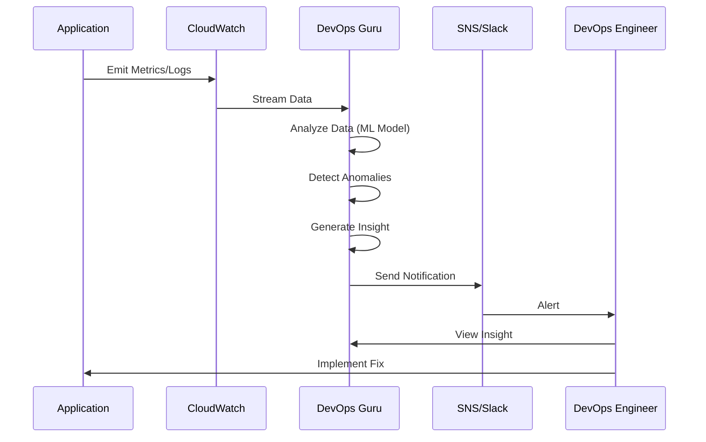
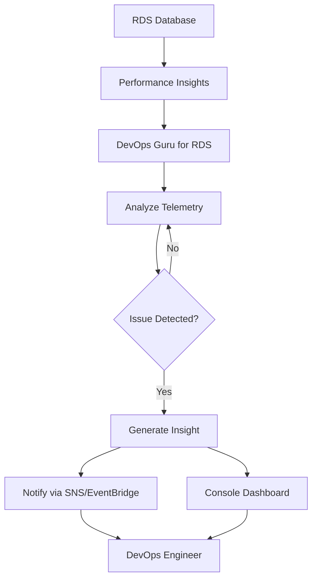

# DevOps Guru



&#x20;`Last Update`



`Aug-26-2025`



### 🧠 Overview & Innovation Spotlight

**Amazon DevOps Guru**  is a **fully managed machine learning-powered service** designed to improve application availability and performance by automatically detecting operational issues and providing actionable recommendations. It leverages ML models trained on Amazon's vast operational data to identify anomalous behavior, reduce noise from alarms, and help teams focus on remediation rather than manual monitoring.

<figure><figcaption></figcaption></figure>

> :bulb: **Innovation Spotlight**: DevOps Guru's key innovation lies in its **proactive and reactive insights** powered by machine learning. Unlike traditional monitoring tools that rely on static thresholds, DevOps Guru continuously learns normal application behavior and detects deviations in real-time. It correlates anomalies across metrics, logs, and events to provide contextual insights, significantly reducing mean time to resolution (MTTR).

### :triangular\_flag\_on\_post: Problem Statement & Business Use Cases

* **Real-World Scenario**: A financial services company, "FinServe," operates a microservices-based application on AWS. They experience intermittent latency spikes and occasional downtime, but their traditional monitoring tools generate hundreds of alarms, making it difficult to pinpoint root causes. The operations team spends hours correlating data from CloudWatch, X-Ray, and CloudTrail, leading to delayed resolutions and customer impact.
* **Industries/Applications**:
  * **E-commerce**: Detect and resolve performance issues during peak shopping seasons to avoid revenue loss.
  * **Healthcare**: Monitor EHR systems for availability and performance, ensuring compliance and patient care.
  * **Gaming**: Identify and remediate latency issues in real-time multiplayer games.
  * **Financial Services**: Ensure high availability of trading platforms and transaction processing systems.

### :hotsprings: Core Principles & Service Terms

* **Reactive Insights**: Detect ongoing operational issues by analyzing deviations from normal behavior. These insights provide detailed context, including impacted resources, related anomalies, and remediation steps.
* **Proactive Insights**: Identify potential future issues before they impact customers. For example, DevOps Guru can predict resource exhaustion (e.g., disk space, CPU) based on trends.
* **Anomaly Detection**: Uses ML models to establish baselines for metrics like latency, error rates, and resource utilization. Deviations from these baselines are flagged as anomalies.
* **Integration with AWS Services**: DevOps Guru consolidates data from CloudWatch, AWS Config, CloudFormation, X-Ray, and Systems Manager to provide a holistic view of application health.

### :interrobang: Pre-Requirements

* **AWS Account**: With appropriate IAM permissions to access DevOps Guru and integrated services.
* **Data Sources**: DevOps Guru requires access to CloudWatch metrics, AWS Config data, CloudTrail logs, and X-Ray traces.
* **AWS Resources**: Applications must be running on supported AWS services (e.g., EC2, Lambda, RDS, ECS).
* **Monitoring Setup**: Ensure CloudWatch Metrics and AWS Config are enabled for the resources you want to monitor.

### :busstop: Implementation Steps

1. **Enable DevOps Guru**:
   * Navigate to the DevOps Guru console in AWS Management Console.
   * Click "Get started" and choose analysis coverage (e.g., entire account, specific CloudFormation stacks, or tagged resources).
2. **Configure Data Sources**:
   * Ensure CloudWatch, AWS Config, and X-Ray are enabled for your resources.
   * Optionally, integrate with Systems Manager OpsCenter for automated ticket creation.
3. **Set Up Notifications**:
   * Configure SNS topics to receive alerts for insights.
   * Integrate with incident management tools like PagerDuty or Atlassian OpsGenie.
4. **Baseline Establishment**:
   * DevOps Guru will take approximately 2 hours to establish a baseline of normal behavior.
5. **Review Insights**:
   * Access the DevOps Guru dashboard to view reactive and proactive insights.
   * Implement recommended remediation steps.

### :pager: Data Flow Diagram

**Diagram 1: DevOps Guru Anomaly Detection and Insight Generation**

**Diagram 2: DevOps Guru for RDS Issue Detection**

### 🔒Security Measures&#x20;

* **Encryption**: All data is encrypted in transit and at rest using AWS Key Management Service (KMS).
* **IAM Policies**: Use least-privilege policies to control access to DevOps Guru and related resources.
* **VPC Endpoints**: Access DevOps Guru via VPC endpoints to keep traffic within the AWS network.
* **Data Isolation**: Your operational data is never used to train AWS's general ML models.

### :fish: Deep Dive: DevOps Guru for RDS

DevOps Guru for RDS extends the core service to specifically monitor relational databases. It analyzes telemetry from Amazon RDS Performance Insights and Enhanced Monitoring to detect database-specific issues like lock contention, connection storms, and SQL regressions.

**Key Features:**

* **Continuous Monitoring**: Analyzes database load, counters, and OS metrics in real-time.
* **Root Cause Analysis**: Provides detailed insights into database performance bottlenecks.
* **Integration with RDS**: Native support for Aurora MySQL, Aurora PostgreSQL, and RDS for PostgreSQL.

### :grey\_question: When to Use and When Not to Use

| When to Use                                                                                | When NOT to Use                                                                              |
| ------------------------------------------------------------------------------------------ | -------------------------------------------------------------------------------------------- |
| **Complex Applications**: Microservices or distributed systems with dynamic workloads .    | **Simple Applications**: Single-tier apps with minimal resource usage.                       |
| **Database Performance Monitoring**: For RDS databases experiencing performance issues .   | **On-Premises Systems**: DevOps Guru is AWS-specific and does not support on-prem resources. |
| **Proactive Monitoring**: When you need predictive insights to prevent future issues .     | **Static Environments**: Applications with consistent, unchanging behavior.                  |
| **Noise Reduction**: When traditional monitoring tools generate too many false positives . | **Limited Budget**: For small projects with minimal operational overhead.                    |

### 💰Costing Calculation&#x20;

* **Pricing Model**: DevOps Guru charges based on the number of resource hours analyzed. The first 72 resource hours per month are free.
* **Cost Calculation**:
  * **Example**: Monitoring 100 resources for 720 hours (30 days) would incur charges for 72,000 resource hours. After the free tier, the cost is $0.003 per resource hour.
  * **Monthly Cost**: (72,000 - 72) \* $0.003 = \~$215.78
* **Cost Optimization**:
  * Use resource tagging to exclude non-critical resources from analysis.
  * Limit analysis to specific CloudFormation stacks or environments (e.g., production only).

### :open\_hands: Alternative Services

| AWS                                             | Azure                                       | GCP                                            | On-Premise                          |
| ----------------------------------------------- | ------------------------------------------- | ---------------------------------------------- | ----------------------------------- |
| **Amazon DevOps Guru**                          | **Azure Monitor**                           | **Google Cloud Operations Suite**              | **Dynatrace**                       |
| ML-powered insights, native AWS integration .   | Rule-based alerts, limited ML capabilities. | Integrated monitoring with Chronicle for logs. | AI-powered root cause analysis.     |
| **AWS Health Dashboard**                        | **Azure Advisor**                           | **GCP Recommender**                            | **Splunk ITSI**                     |
| Service health status, no application insights. | Cost and security recommendations.          | Cost optimization focus.                       | Machine learning for IT operations. |

### 🚀Benefits&#x20;

* **Reduced MTTR**: Automates root cause analysis, reducing resolution time from days to minutes.
* **Proactive Insights**: Identifies potential issues before they impact customers.
* **Cost Savings**: Reduces operational overhead by automating monitoring and analysis.
* **Improved Availability**: Helps maintain high application availability by detecting issues early.
* **Ease of Use**: No ML expertise required; fully managed service.

***

> :flags:&#x20;
>
> **Innovation Spotlight: DevOps Guru for Serverless:**\
> DevOps Guru for Serverless extends capabilities to serverless applications (e.g., Lambda, API Gateway). It detects issues like latency degradation, resource exhaustion, and cold starts. The service provides both reactive and proactive insights tailored to serverless architectures.

***

### :newspaper: Summary

Amazon DevOps Guru is a powerful AI-driven service that enhances operational efficiency by providing ML-powered insights for AWS applications. It reduces manual effort, improves availability, and helps teams focus on innovation rather than firefighting.

**Top 7 Points to Keep in Mind:**

1. DevOps Guru uses ML models trained on Amazon's operational data to detect anomalies.
2. It provides both reactive and proactive insights with actionable recommendations.
3. Native integration with AWS services like CloudWatch, X-Ray, and RDS.
4. Supports multi-account monitoring through AWS Organizations.
5. Pricing is based on resource hours analyzed, with a free tier available.
6. Use DevOps Guru for complex, dynamic workloads rather than simple applications.
7. Implement least-privilege IAM policies to secure access to DevOps Guru.

***

### :link: Related Topics & Reference Links

* **AWS Documentation:** [Amazon DevOps Guru User Guide](https://docs.aws.amazon.com/devops-guru/latest/userguide/welcome.html)
* **AWS Blog:** [Introducing Amazon DevOps Guru](https://aws.amazon.com/blogs/aws/amazon-devops-guru/)
* **Integration Guide:** [Using DevOps Guru with AWS Organizations](https://docs.aws.amazon.com/organizations/latest/userguide/services-that-can-integrate-devops.html)
* **FAQ:** [Amazon DevOps Guru FAQs](https://aws.amazon.com/devops-guru/faqs/)
