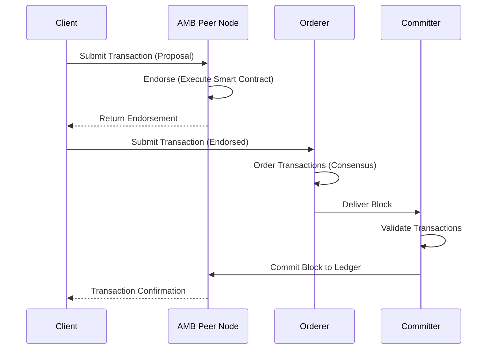
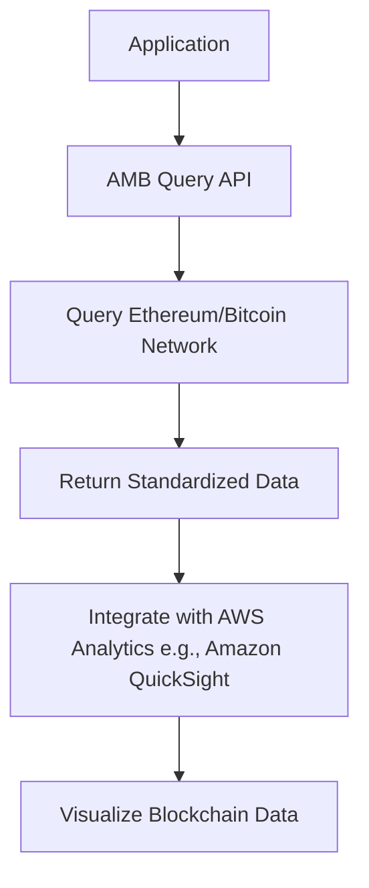

# Blockchain

## Amazon Managed Blockchain (AMB)



`Last Update`



`Aug-27-2025`



### 🧠Overview  & Innovation Spotlight

**Amazon Managed Blockchain (AMB)**  is a **fully managed blockchain-as-a-service (BaaS)** that enables organizations to build, deploy, and manage scalable blockchain networks without the overhead of provisioning hardware, configuring software, or managing infrastructure. AMB supports popular open-source frameworks including **Hyperledger Fabric** and **Ethereum**, allowing developers to create both permissioned (private) and permissionless (public) blockchain networks with just a few clicks.

<figure><figcaption></figcaption></figure>

> 💡 **Innovation Spotlight**: AMB's most significant innovation is its **serverless architecture** through **AMB Access** and **AMB Query**, which provide instant, scalable access to multiple blockchains without managing nodes. AMB Access offers **serverless JSON-RPC endpoints** for Ethereum and Bitcoin, while AMB Query provides **developer-friendly APIs** to access real-time and historical blockchain data without specialized infrastructure or ETL processes. This eliminates the traditional complexities of node management and data synchronization, enabling developers to focus solely on application logic.

### 🚩Problem Statement & Business Use Cases

* **Real-World Scenario**: A global supply chain consortium involving manufacturers, logistics providers, and retailers needs to track goods across international borders. They face challenges with data silos, lack of transparency, and counterfeit products. Traditional centralized systems require trusting a single authority, are prone to data manipulation, and cannot provide a single source of truth across organizational boundaries.
* **Industries/Applications**:
  * **Supply Chain Management**: Track goods from origin to consumer, ensuring authenticity and compliance. Nestlé uses AMB with Hyperledger Fabric to trace coffee beans from farm to cup, providing consumers with transparency about origin and quality .
  * **Financial Services**: Facilitate cross-border payments, trade finance, and securities settlement with reduced intermediaries and enhanced security .
  * **Healthcare**: Securely manage and share patient records across providers while maintaining privacy and audit trails. AMB enables immutable audit logs for data access and modification .
  * **Digital Identity**: Create self-sovereign identity systems where users control their digital identities without relying on central authorities .
  * **Energy Trading**: Enable peer-to-peer energy trading between solar panel owners and consumers, automating settlements via smart contracts .

### ♨️ Core Principles & Service Terms

* **Managed Blockchain Networks**: AMB handles the provisioning, configuration, and scaling of blockchain infrastructure, including nodes, ordering services, and certificate authorities .
* **Consensus Mechanisms**:
  * **Hyperledger Fabric**: Uses Kafka-based ordering service (Starter Edition) or Raft consensus (Standard Edition) for permissioned networks .
  * **Ethereum**: Supports Proof-of-Work (public) or Proof-of-Authority (private) consensus algorithms .
* **Smart Contracts**: Self-executing code deployed on blockchain nodes to automate business logic. Hyperledger Fabric supports chaincode written in Go, Java, or Node.js, while Ethereum uses Solidity .
* **Immutable Ledger**: All transactions are cryptographically linked and tamper-proof, ensuring data integrity and auditability .
* **Membership Management**: Simplified member onboarding and voting APIs for consortium governance, allowing members to propose and vote on new members or network changes .

### ⁉️ Pre-Requirements 🛠️

* **AWS Account**: With appropriate IAM permissions to create and manage AMB resources .
* **Network Configuration**: Decide on blockchain framework (Hyperledger Fabric or Ethereum), network type (public or private), and member nodes .
* **VPC Setup**: Configure Virtual Private Cloud (VPC) endpoints for secure, private connectivity between AMB and other AWS services .
* **Data Sources**: For supply chain or asset tracking use cases, prepare data sources (e.g., IoT sensors, ERP systems) to integrate with AMB .
* **Consortium Agreement**: For private networks, establish governance rules and membership criteria among participants .

### 🚏 Implementation Steps

1. **Choose Framework and Edition**:
   * Select **Hyperledger Fabric** for enterprise permissioned networks or **Ethereum** for public or private smart contract applications .
   * For Hyperledger Fabric, choose between **Starter Edition** (for development/testing) or **Standard Edition** (for production) .
2. **Create Network**:
   * Using AWS Management Console, CLI, or SDK, specify network name, framework, edition, and consensus mechanism .
   * For Hyperledger Fabric, configure ordering service (Kafka or Raft) and certificate authority (Fabric CA integrated with AWS KMS) .
3. **Add Members and Nodes**:
   * Invite members via email; they accept invitations and provision their peer nodes .
   * Each member can deploy peer nodes (e.g., `bc.t3.small` for testing, `bc.m5.large` for production) with attached storage for ledger data .
4. **Deploy Smart Contracts**:
   * For Hyperledger Fabric, package and install chaincode on peer nodes via AMB console .
   * For Ethereum, deploy Solidity smart contracts using tools like Truffle or Remix via AMB endpoints .
5. **Integrate with AWS Services**:
   * Connect AMB to **Amazon QLDB** for immutable audit trails, **Amazon S3** for data storage, or **AWS Lambda** for serverless event processing .
6. **Monitor and Maintain**:
   * Use **Amazon CloudWatch** to track network metrics (e.g., transaction volume, CPU utilization) and set alarms .

### 📟 Data Flow Diagram

**Diagram 1: Hyperledger Fabric Transaction Flow on AMB**

**Diagram 2: AMB Query for Data Retrieval**

### 🔒 Security Measures&#x20;

* **Encryption**: All data encrypted at rest using **AWS KMS** and in transit using TLS 1.2+ .
* **Access Control**: **IAM policies** control access to AMB APIs, while Fabric CA manages member certificates for blockchain-level access .
* **Network Isolation**: **VPC Endpoints** ensure private connectivity between AMB and other AWS resources, preventing exposure to the public internet .
* **Compliance**: AMB complies with **SOC, ISO, FedRAMP**, and **HIPAA** eligibility, making it suitable for regulated industries .
* **Immutable Audit Trail**: Integration with **Amazon QLDB** provides an immutable change log for all network activities, enhancing transparency and compliance .

### :frog: Innovation Spotlight: Serverless Web3 Infrastructure

AMB represents a paradigm shift in blockchain infrastructure through its **serverless components**, which abstract away node management and data synchronization:

* **AMB Access**: Provides instant, scalable JSON-RPC endpoints for Ethereum and Bitcoin without provisioning or managing nodes. This allows developers to interact with public blockchains as easily as calling a web API .
* **AMB Query**: Offers standardized APIs to access real-time and historical data from multiple blockchains (e.g., Ethereum, Bitcoin). This eliminates the need for complex ETL pipelines and allows developers to use familiar SQL-like queries to analyze on-chain data .\
  These innovations enable developers to build **Web3 applications** with the same agility and scalability as traditional web applications, while leveraging the full power of blockchain technology.

### ❔ When to Use and When Not to Use

| When to Use                                                                                                                                  | When NOT to Use                                                                                                 |
| -------------------------------------------------------------------------------------------------------------------------------------------- | --------------------------------------------------------------------------------------------------------------- |
| **Multi-Party Workflows**: Applications requiring trust and transparency across multiple organizations (e.g., supply chain, trade finance) . | **Simple CRUD Apps**: For basic database applications without need for decentralization or consensus.           |
| **Audit and Compliance**: Industries requiring immutable audit trails (e.g., healthcare, financial services) .                               | **High-Frequency Trading**: Where sub-millisecond latency is critical; blockchain consensus introduces latency. |
| **Data Integrity**: Use cases where data tampering is a concern and immutable ledgers provide value .                                        | **Static Workflows**: Processes that rarely change and do not benefit from smart contract automation.           |
| **Tokenization**: Creating digital assets, NFTs, or token-gated experiences .                                                                | **Limited Budget**: Small projects with minimal scale; traditional databases may be more cost-effective.        |

### 💰 Costing Calculation&#x20;

* **Pricing Model**:
  * **Hyperledger Fabric**:
    * **Membership Fee**: Starter Edition: $0.30/hour; Standard Edition: $0.55/hour .
    * **Peer Node Cost**: From $0.034/hour (bc.t3.small) to $1.36/hour (bc.m5.large) .
    * **Storage**: $0.10/GB-month for ledger storage .
    * **Data Written**: $0.10/GB for data written to the ledger .
  * **Ethereum**:
    * **Peer Node Cost**: $0.136/hour for c5.large node .
    * **Storage**: $0.10/GB-month for ledger storage .
    * **Requests**: $3/million API requests .
* **Cost Optimization**:
  * Use **Starter Edition** for development and testing .
  * **Monitor Usage** with CloudWatch to right-size peer nodes and storage .
  * **Archive Data** to S3 or QLDB for long-term retention instead of expanding peer node storage .
* **Sample Calculation (Hyperledger Fabric)**:
  * 3-member consortium with Standard Edition
  * Each member has 1 bc.t3.small node with 30 GB storage
  * Network writes 12 MB/hour
  * **Cost Breakdown**:
    * Membership: 3 × $0.55 = $1.65/hour
    * Nodes: 3 × $0.034 = $0.102/hour
    * Storage: 3 × 30 GB × $0.10/GB-month ÷ 720 hours = $0.0125/hour
    * Data Written: 3 × 12 MB × $0.10/GB ÷ 1000 = $0.0036/hour
    * **Total**: ~~$1.77/hour (~~$1,277/month) .

### 👐 Alternative Services

| AWS                                                    | Azure                                                        | GCP                                                     | On-Premise                                                     |
| ------------------------------------------------------ | ------------------------------------------------------------ | ------------------------------------------------------- | -------------------------------------------------------------- |
| **Amazon Managed Blockchain**                          | **Azure Blockchain Service**                                 | **Google Cloud Blockchain**                             | **Hyperledger Fabric Direct Deployment**                       |
| Fully managed, supports Hyperledger Fabric & Ethereum. | Discontinued in 2021; replaced by Azure Confidential Ledger. | Limited to Ethereum with partner integrations.          | Full control but requires expert knowledge and infrastructure. |
| **Amazon QLDB**                                        | **Azure SQL Database**                                       | **Google Cloud Spanner**                                | **Ethereum Self-Hosted Nodes**                                 |
| Centralized ledger for trusted authority scenarios.    | Traditional relational database without blockchain features. | Globally distributed database without decentralization. | High operational overhead for node maintenance.                |

### 🚀 Benefits&#x20;

* **Reduced Overhead**: Eliminates need to provision hardware, install software, or manage certificates. AMB automates network setup and scaling .
* **Scalability**: Automatically scales to handle thousands of transactions per second (Hyperledger Fabric: 2000+ TPS; Ethereum: \~20 TPS) .
* **Security**: Built-in encryption, IAM integration, and secure key management via AWS KMS .
* **Interoperability**: Seamless integration with AWS services (S3, Lambda, CloudWatch) and support for multiple blockchain frameworks .
* **Cost-Effectiveness**: Pay-as-you-go pricing with no upfront costs; only pay for resources used .

> ### :dart: Success Stories: Real-World Implementations
>
>
>
> * **Nestlé**: Uses AMB with Hyperledger Fabric to trace coffee beans from farm to cup. Consumers can scan QR codes to access information about origin, processing, and sustainability. This enhanced transparency has strengthened brand trust and customer loyalty .
> * **Accenture**: Partnered with a major aerospace/defense company to build a track-and-trace solution for manufacturing supply chains. AMB provided the immutable ledger to ensure part authenticity and provenance, reducing counterfeiting and improving compliance .
> * **TrackX**: Integrated AMB into its Global Asset Management platform to track reusable assets (e.g., beer kegs, chemical containers) across global supply chains. AMB enabled secure, transparent sharing of asset data among stakeholders, reducing loss and improving utilization .

### 📰 Summary

Amazon Managed Blockchain is a powerful, fully managed service that democratizes blockchain technology for enterprises, enabling them to build scalable, secure decentralized applications without the operational overhead of managing infrastructure.

**Top 7 Points to Keep in Mind:**

1. AMB supports **both Hyperledger Fabric and Ethereum**, catering to permissioned enterprise networks and public smart contract platforms .
2. **Serverless options** like AMB Access and AMB Query simplify interaction with blockchains without node management .
3. **Integration with AWS ecosystem** (QLDB, S3, Lambda) enables powerful extensions like immutable audit trails and serverless event processing .
4. **Strong security and compliance** with encryption, IAM, and HIPAA eligibility make it suitable for regulated industries .
5. **Cost transparency** with pay-as-you-go pricing; use Starter Edition for development and Standard Edition for production .
6. **Simplify consortium governance** with built-in voting APIs for member management and network changes .
7. **Leverage real-world implementations** from companies like Nestlé and Accenture for inspiration and best practices .

### 🔗 Related Topics & Reference Links

* **AWS Documentation**: [Amazon Managed Blockchain User Guide](https://docs.aws.amazon.com/managed-blockchain/)
* **Blockchain Fundamentals**: [AWS What is Blockchain?](https://aws.amazon.com/what-is/blockchain/)
* **Web3 on AWS**: [AWS Web3 Portal](https://aws.amazon.com/web3/)
* **Case Studies**: [Nestlé Blockchain Transparency](https://pixelplex.io/blog/overview-of-amazon-managed-blockchain/)
* **Pricing Details**: [AMB Pricing Examples](https://www.seaflux.tech/blogs/aws-managed-blockchain/)
* **Integration Guides**: [Using AMB with AWS Services](https://appinventiv.com/blog/aws-managed-blockchain-implementation/)

