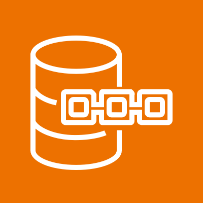
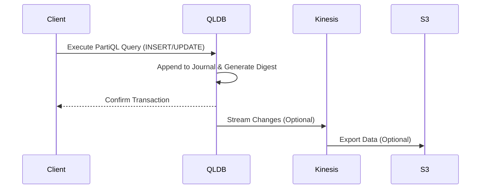

# QLDB

## Amazon QLDB

### 🌟 **Amazon Quantum Ledger Database (QLDB): A Comprehensive Overview**

Amazon Quantum Ledger Database (QLDB)  is a **fully managed ledger database** service that provides a **transparent, immutable, and cryptographically verifiable transaction log**. It is designed for applications that require a **centralized trusted authority** to maintain a complete and tamper-proof history of data changes. Unlike blockchain-based solutions, QLDB does not rely on decentralization or consensus algorithms, making it simpler and more efficient for use cases where trust is placed in a single entity.

<figure><figcaption></figcaption></figure>

***

> ### ⚠️ **Important Note: QLDB Discontinuation**
>
>
>
> AWS has announced that **QLDB will be discontinued**. Key points include:
>
> * **New customers** can no longer sign up for QLDB.
> * All existing databases will be shut down on **July 31, 2025**.
> * Current users are encouraged to migrate to **Amazon Aurora PostgreSQL**.
> * AWS has provided migration guidance using services like **AWS Database Migration Service (DMS)**, **S3**, and **AWS Glue**.

***

### 🔍 **Problem Statement & Business Use Cases**

QLDB addresses the need for **data integrity, transparency, and auditability** in industries where maintaining a tamper-proof record of changes is critical.

**Real-World Scenario**

A financial institution needs to track **credit and debit transactions** with a complete, immutable history to comply with regulatory requirements and prevent fraud. Traditional databases lack built-in immutability, making it difficult to ensure data integrity without complex custom solutions.

**Industries/Applications**

* **Financial Services**: Recording transactions for auditability and compliance.
* **Supply Chain**: Tracking goods from manufacture to sale, ensuring transparency and reducing fraud.
* **Healthcare**: Maintaining patient data history for accuracy and regulatory compliance (e.g., HIPAA).
* **Gaming**: Tracking virtual asset ownership and transactions to prevent fraud.

***

### ⚙️ **Core Principles & Key Features**

QLDB's design revolves around **immutability, cryptographic verification, and ease of use**.

**Key Components**

* **Journal**: An immutable, append-only log that records all data changes.
* **Digest**: A cryptographic hash (SHA-256) generated for each transaction, enabling verification of data integrity.
* **PartiQL Support**: Uses a SQL-like query language for data manipulation and retrieval.
* **Streaming Integration**: Real-time streaming to Amazon Kinesis for event-driven processing.

**Features**

* **Immutability**: Data cannot be modified or deleted once committed.
* **Cryptographic Verification**: Users can verify data integrity using digests.
* **Serverless Architecture**: Automatically scales with pay-per-use pricing.
* **History Tracking**: Query historical changes using the `history` function.

***

### 📋 **Pre-Requirements**

To use QLDB, ensure the following:

* **AWS Account** with appropriate IAM permissions for QLDB actions.
* **Data Model Design**: Plan for immutable data storage and history tracking.
* **Integration Setup**: Configure Kinesis for streaming or S3 for data export if needed.

***

### 🛠️ **Implementation Steps**

1. **Create a Ledger**:
   * Use the AWS Console, CLI, or SDK to create a ledger (e.g., `CREATE LEDGER`).
2. **Define Tables and Indexes**:
   * Use PartiQL to create tables and indexes (e.g., `CREATE TABLE odometer_values`).
3. **Insert and Update Data**:
   * Use PartiQL statements like `INSERT` and `UPDATE` to modify data.
4. **Query History**:
   * Use the `history` function to retrieve historical changes.
5. **Export Data**:
   * Export journal data to S3 for analysis or migration purposes.

***

### 🔄 **Data Flow Diagram**

***

### 🔒 **Security Measures**

* **Encryption**: Data encrypted at rest and in transit using AWS KMS.
* **IAM Policies**: Control access to QLDB actions and resources.
* **Cryptographic Verification**: Ensure data integrity using digests.
* **VPC Endpoints**: Secure access to QLDB within a VPC.

***

### 💡 **Innovation Spotlight**

QLDB's key innovation is its **centralized immutability model**, which provides blockchain-like benefits without the complexity of decentralization. Features like **cryptographic verification** and **seamless AWS integration** (e.g., Kinesis streaming) make it unique for audit-heavy use cases.

***

### ⚖️ **When to Use and When Not to Use**

| **When to Use**                                                                            | **When Not to Use**                                                                |
| ------------------------------------------------------------------------------------------ | ---------------------------------------------------------------------------------- |
| **Audit Trails**: Applications requiring tamper-proof logs (e.g., financial transactions). | **Dynamic Data**: Applications requiring frequent data modifications or deletions. |
| **Regulatory Compliance**: Industries needing verifiable data history (e.g., healthcare).  | **High Write Throughput**: Applications needing extremely high write speeds.       |
| **Supply Chain Tracking**: Tracking goods with immutable records.                          | **Simple CRUD Operations**: Basic applications without audit requirements.         |

***

### 💰 **Costing Calculation**

* **Pricing Model**: Pay-per-use for storage, I/O, and streaming.
* **Example Cost**:
  * Storage: $0.10/GB-month
  * I/O: $0.10/million IOs
  * Streaming: $0.11/GB for Kinesis data delivery
* **Cost Optimization**: Use S3 for long-term storage and archive older data.

***

### 🔁 **Alternative Services**

| **AWS**                                                 | **Azure**                    | **GCP**                     | **On-Premise**                           |
| ------------------------------------------------------- | ---------------------------- | --------------------------- | ---------------------------------------- |
| **Amazon Aurora PostgreSQL** (Recommended replacement)  | **Azure SQL Database**       | **Google Cloud Spanner**    | **ImmuDB** (Open-source ledger database) |
| **Amazon Managed Blockchain** (For decentralized needs) | **Azure Blockchain Service** | **Google Cloud Blockchain** | **Hyperledger Fabric**                   |

***

### ✅ **Benefits**

* **Immutability**: Tamper-proof data history.
* **Ease of Use**: Fully managed with PartiQL support.
* **Integration**: Works with AWS services like Kinesis and S3.
* **Cost-Effective**: No upfront costs; pay-per-use pricing.

***

### 🚨 **Challenges and Limitations**

* **No Backup/Restore**: Does not support point-in-time restores.
* **Limited Query Features**: No sorting (`ORDER BY`) or pagination (`LIMIT`).
* **Discontinuation**: Service will be shut down in 2025.

***

### 📅 **Migration to Aurora PostgreSQL**

AWS recommends migrating to **Aurora PostgreSQL** using:

* **AWS DMS**: For data replication.
* **AWS Glue**: Transform exported QLDB data into CSV format.
* **S3**: Store exported journal data.\
  **Note**: Migration may impact data integrity guarantees during the process.

***

### 📊 **Comparison: QLDB vs. Aurora PostgreSQL**

| **Feature**                    | **QLDB**               | **Aurora PostgreSQL**        |
| ------------------------------ | ---------------------- | ---------------------------- |
| **Immutability**               | Built-in; tamper-proof | Requires custom audit trails |
| **Cryptographic Verification** | Native support         | Requires external tools      |
| **Query Language**             | PartiQL (SQL-like)     | SQL                          |
| **Managed Service**            | Fully managed          | Fully managed                |

***

### 💎 **Summary**

QLDB is a powerful tool for **immutable, verifiable data tracking**, but due to its discontinuation, users should migrate to **Aurora PostgreSQL** for similar functionality. Key takeaways:

1. **Use QLDB** for audit-heavy applications until July 2025.
2. **Plan Migration** to Aurora PostgreSQL using AWS tools.
3. **Leverage QLDB Features** like cryptographic verification and history tracking while available.

***

### 🔗 **Related Topics & References**

* [AWS QLDB Documentation](https://docs.aws.amazon.com/qldb/)
* [Migrating from QLDB to Aurora PostgreSQL](https://aws.amazon.com/blogs/database/migrate-an-amazon-qldb-ledger-to-amazon-aurora-postgresql/)
* [QLDB Use Cases](https://www.ciotechcentral.com/what-are-some-examples-of-successful-use-cases-for-amazon-qldb/)

For further details, refer to the [AWS Discontinuation Announcement](https://www.infoq.com/news/2024/07/aws-kill-qldb/).
