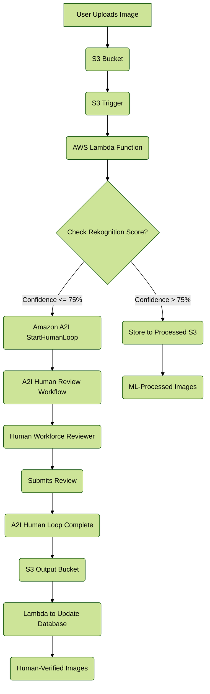
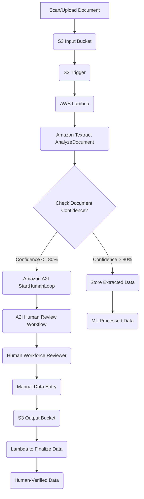
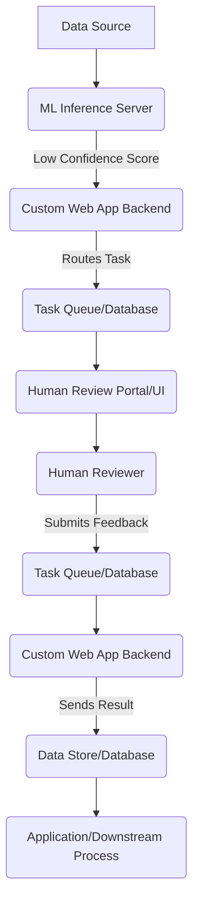

# Augment AI

***

### 🚀**Overview**&#x20;

**Amazon Augmented AI (A2I)**  is a fully managed service that simplifies the process of building human review workflows for your machine learning (ML) predictions. While ML models are incredibly powerful, they aren't perfect. Certain tasks—like moderating nuanced content, processing blurry documents, or handling highly sensitive data—require the subtle, intuitive judgment that only a human can provide. A2I acts as a bridge, making it easy to route low-confidence predictions or random samples to human reviewers for verification, without the heavy lifting of building a custom human-in-the-loop system.

<figure><figcaption></figcaption></figure>

> **Innovation Spotlight:** A2I's innovative approach lies in its ability to democratize the HITL process. Before A2I, a company would have to build a complex, bespoke system from scratch, including a review UI, a task management backend, and an API to handle the data flow. A2I provides these components as a managed service, allowing developers to focus on their core ML models and business logic, rather than on the undifferentiated work of building a human review system.

***

### 🛠️ **Problem Statement & Business Use Cases**&#x20;

**Problem Statement:** A common challenge in deploying ML models to production is maintaining a high level of accuracy and quality control. For many applications, a model's prediction might be below a certain confidence threshold, or the data itself is ambiguous, leading to potential errors. Allowing these low-confidence predictions to proceed without a human check can lead to poor user experience, compliance issues, or incorrect business decisions.

**Business Use Cases:**

* **Financial Services:** A bank uses an ML model to process mortgage application documents. The model can automatically extract key information like names, addresses, and income. However, for applications where the scanned documents are blurry or contain handwritten notes, the model's confidence might drop. A2I can be configured to send these specific cases to a human reviewer to verify the extracted data, ensuring accuracy and compliance.
* **Social Media & Content Moderation:** A large social media platform uses a computer vision model (like Amazon Rekognition) to automatically moderate user-uploaded images for inappropriate content. To avoid false positives and negatives, all images flagged with a confidence score between 50% and 75% are sent to a human moderator for a final decision. This ensures that potentially offensive content is caught, while benign content isn't accidentally removed.
* **Healthcare:** A healthcare provider uses an ML model to extract patient information from medical intake forms. Due to varying form layouts and handwriting, a human review is essential for critical fields like allergies or medication lists. A2I routes these forms to a team of nurses or data entry specialists for manual verification, ensuring patient safety and data integrity.

***

### 🧠 **Core Principles**&#x20;

Amazon A2I is built on a few key concepts that enable the human-in-the-loop workflow:

* **Human Loops:** This is the core workflow that sends a task to a human reviewer. A human loop is created when an ML prediction meets certain criteria, such as a low confidence score.
* **Flow Definitions:** A flow definition is a reusable resource that defines the entire human review workflow. It specifies the work team, the human task UI, and where the input and output data are stored.
* **Worker Task Templates:** This is the user interface (UI) that the human reviewers interact with. It's a simple HTML template that provides instructions, displays the data to be reviewed (e.g., an image or a document), and provides fields for the reviewer to enter their judgment. A2I provides a library of pre-built templates for common tasks.
* **Workforce:** This refers to the group of human reviewers. A2I gives you three options:
  * **Amazon Mechanical Turk (MTurk):** A public, crowdsourced marketplace for reviews. Ideal for non-sensitive data and high-volume, low-complexity tasks.
  * **Vendor Workforce:** A private workforce provided by third-party data labeling vendors through the AWS Marketplace. Useful for specialized tasks that require specific skills or certifications.
  * **Private Workforce:** Your own employees or contractors. This is the best option for sensitive data that must remain within your organization's control.

***

### ✅ **Pre-Requirements**&#x20;

To implement a basic A2I workflow, you will need the following AWS services and tools:

* **Amazon S3 Bucket:** To store input data (e.g., images, documents) and the output results of the human review.
* **IAM Role:** An IAM role with permissions to access S3, invoke A2I, and interact with the other services in your workflow (e.g., Lambda, Rekognition, Textract).
* **A Machine Learning Model/Service:** The ML component of your workflow, such as:
  * **Amazon Rekognition:** For image and video analysis (e.g., moderation, object detection).
  * **Amazon Textract:** For document text and data extraction (e.g., forms, invoices).
  * **Amazon SageMaker:** For custom-trained ML models.
* **AWS Lambda Function (Optional but Recommended):** To programmatically trigger human loops based on business logic (e.g., a confidence threshold).

***

### 👣 **Implementation Steps**&#x20;

Let's walk through a simple content moderation example using Amazon Rekognition and A2I.

1. **Set up an S3 Bucket:** Create an S3 bucket to store the images you want to moderate and the output of the A2I human review.
2. **Create a Workforce:** In the Amazon SageMaker console, navigate to "Augmented AI" and then "Human review workflows." Choose "Workforces" and create a new private, vendor, or Mechanical Turk workforce.
3. **Define a Human Review Workflow:**
   * Go to "Flow definitions" and create a new one.
   * Name the workflow and provide the ARN of the S3 bucket where you want to store the results.
   * Specify the task type. For our example, select "Image Moderation" and choose Amazon Rekognition as the source.
   * Configure the human loop trigger. You can set a condition, like "start a human loop if the confidence score for 'unsafe content' is less than 75%."
   * Select the workforce you created in the previous step.
   * Define the worker task template, providing clear instructions for the reviewers.
4. **Create an IAM Role:** Create an IAM role with policies that grant the necessary permissions for your Lambda function and other services to interact with A2I, S3, and Rekognition.
5. **Implement the Application Logic:**
   * Use an AWS Lambda function that is triggered when an image is uploaded to your S3 bucket.
   * The Lambda function will call the Amazon Rekognition API to analyze the image.
   * The function then checks the confidence score of the prediction. If the score is below the threshold you set in the A2I workflow (e.g., `< 75%`), the Lambda function calls the A2I `StartHumanLoop` API.
   * The `StartHumanLoop` API call passes the image location and other relevant data to the A2I workflow.
6. **Human Review & Output:**
   * The human loop is initiated, and the task is routed to a reviewer in your selected workforce.
   * The reviewer sees the image and your instructions in the Worker Task UI. They then make a decision (e.g., "safe" or "unsafe").
   * Once the reviewer submits their response, A2I saves the result, including the reviewer's judgment, to the designated S3 output path.
   * Another Lambda function or a downstream process can be triggered by the S3 event to pick up the human-reviewed result and update your application's database or trigger an action (e.g., remove the image from the platform).

***

### 📊 **Data Flow Diagram**&#x20;


**Use Case 1: Image Moderation with Amazon Rekognition** This diagram shows a typical workflow for moderating user-uploaded images where low-confidence predictions are sent to human reviewers.



**Use Case 2: Document Processing with Amazon Textract** This diagram illustrates how A2I can be used to augment a document processing workflow, ensuring data extraction from complex or handwritten documents is accurate.


***

### 🔒 **Security Measures**&#x20;

* **Least Privilege IAM Roles:** Ensure the IAM roles for Lambda, A2I, and other services only have the permissions they absolutely need. For instance, the Lambda function should only have `s3:GetObject` on the input bucket and `s3:PutObject` on the output bucket, along with the necessary A2I API calls.
* **Encryption at Rest and in Transit:** Use AWS Key Management Service (KMS) to encrypt the S3 buckets where your sensitive data and review results are stored. A2I automatically uses SSL/TLS for data in transit.
* **VPC Endpoints:** For private workforces and to keep data within your network, configure VPC endpoints for Amazon A2I, SageMaker, S3, and other services. This prevents data from traversing the public internet.
* **Workforce Security:**
  * For sensitive data, use a **private workforce** to maintain a high level of security and control over who can access the data.
  * When using a vendor workforce, carefully vet the vendor and their security practices.

***

### 🤖 **Augmenting LLMs with Human-in-the-Loop** ➡️👨‍💻

A new and innovative application of A2I is in the realm of Large Language Models (LLMs) and generative AI. While LLMs are incredibly versatile, their outputs can sometimes be inaccurate, biased, or simply not aligned with specific business needs. A2I can be used to implement a human feedback loop to fine-tune or validate LLM outputs.

**Use Case:** A legal tech company uses an LLM to automatically summarize legal documents. For critical sections, a human lawyer must review the summary to ensure accuracy and nuance are not lost. A2I can be triggered when the LLM's confidence is below a certain threshold or on a random sample basis to ensure quality. The lawyer's feedback can then be used to continuously fine-tune the model, improving its performance over time.

***

### 🤔 **When to Use and When Not to Use**&#x20;

**When to Use A2I:**

* **When high accuracy is critical:** Industries like finance, healthcare, and legal often have zero-tolerance for errors.
* **When dealing with ambiguous or nuanced data:** Content moderation, handwritten forms, or subjective analysis where a simple ML model might fail.
* **To audit and improve your ML models:** A2I can be used to send a random sample of predictions to humans, and the human feedback can be used to retrain and improve your model.
* **When you need a managed solution:** If you want to avoid the time and cost of building and managing a custom human review system.

**When Not to Use A2I:**

* **For simple, high-confidence tasks:** If your ML model consistently produces predictions with 99%+ confidence and errors are non-critical, A2I might be overkill.
* **For very low-volume or one-off tasks:** If you only need to review a handful of items occasionally, a manual process might be simpler than setting up an A2I workflow.
* **If you have no human workforce:** A2I requires a human workforce, whether it's private, a vendor, or Mechanical Turk.

***

### 💰**Costing Calculation**&#x20;

Amazon A2I pricing is straightforward and pay-as-you-go. It is based on the number of **human-reviewed objects**.

**How it is Calculated:** The primary cost driver is the number of objects reviewed. There are tiered prices, meaning the cost per object decreases as your volume increases.

* **First 50,000 objects per month:** $0.08 per object
* **Next 950,000 objects per month:** $0.04 per object
* **Over 1,000,000 objects per month:** $0.02 per object

**Efficient Way of Handling This Service:**

* **Smart Thresholding:** The most effective way to manage costs is to set intelligent confidence thresholds for your ML models. You only want to send the "hard cases" for human review, not every prediction.
* **Random Sampling:** For quality assurance and model improvement, don't review every prediction. Instead, send a small random sample (e.g., 5%) of high-confidence predictions to a human loop.
* **Automated Workflows:** Use Lambda functions and Step Functions to automate the entire process, ensuring that human loops are only initiated when absolutely necessary, minimizing unnecessary reviews.

**Sample Calculation:** A company needs to review 150,000 images per month for content moderation. They use a private workforce (no additional MTurk/vendor fees).

* Cost for the first 50,000 images: $50,000 \* $0.08 = $4,000
* Cost for the next 100,000 images: $100,000 \* $0.04 = $4,000
* **Total Monthly Cost:** $4,000 + $4,000 = $8,000

_Note: This calculation does not include the cost of the underlying ML service (e.g., Amazon Rekognition) or other services like S3 and Lambda._

***

### 🌍 **Alternative Services**&#x20;

| Service               | AWS                           | Azure                                  | GCP                                 | On-Premise                                         | Key Comparison/Difference                                                                                                                                                     |
| --------------------- | ----------------------------- | -------------------------------------- | ----------------------------------- | -------------------------------------------------- | ----------------------------------------------------------------------------------------------------------------------------------------------------------------------------- |
| **Human-in-the-Loop** | Amazon Augmented AI (A2I)     | Azure Machine Learning + Data Labeling | Vertex AI + Vertex AI Data Labeling | Custom HITL Platform                               | A2I is tightly integrated with AWS services. Azure's solution is part of their ML platform. GCP's is part of Vertex AI. On-premise requires building everything from scratch. |
| **Data Labeling**     | Amazon SageMaker Ground Truth | Azure Machine Learning Data Labeling   | Vertex AI Data Labeling             | Custom Data Labeling Software (e.g., V7, Labelbox) | Ground Truth is more focused on dataset creation for training. The others are broader. On-premise solutions offer full control but high management overhead.                  |

> **On-Premise Data Flow Diagram** A company building a custom human-in-the-loop system on-premise would need to manage all the components themselves.

***

### 🌟 **Benefits**&#x20;

* **Increased Accuracy:** The primary benefit is improved model accuracy by leveraging human judgment for difficult cases.
* **Reduced Operational Overhead:** A2I is a managed service that eliminates the need to build and maintain a complex human review system from scratch.
* **Scalability:** A2I can automatically scale to handle any volume of human review tasks, from a few hundred to millions.
* **Flexibility:** You can use pre-built workflows for popular AWS services or create custom workflows for any ML model.
* **Cost-Effectiveness:** The pay-per-object pricing model ensures you only pay for the reviews you actually perform.

***

### 📡 **Augmenting IoT Data with A2I**&#x20;

Another innovative use case is in the world of IoT. Imagine a fleet of autonomous industrial robots performing visual inspections. A machine learning model on the robot can detect anomalies, but a human needs to verify critical safety issues. A2I can be a part of the data pipeline for such an IoT fleet.

**Use Case:** An oil and gas company uses drones equipped with cameras and ML models to inspect pipelines for leaks or damage. The model can identify potential issues with high confidence, but for low-confidence detections (e.g., a stain that could be a leak or just a shadow), the image is sent to an A2I workflow. A human inspector reviews the image and provides a final verdict, preventing unnecessary dispatches of field teams while ensuring no critical issues are missed.

***

### ✅ **Summary**&#x20;

Amazon A2I provides a streamlined and powerful way to integrate human judgment into your machine learning workflows. By using a managed human-in-the-loop service, you can dramatically increase the accuracy and reliability of your ML applications without the undifferentiated heavy lifting of building a custom solution. This ensures that you can confidently deploy ML models in production, especially in mission-critical applications where errors are costly.

**What to Keep in Mind:**

1. **Start with a Clear Business Problem:** Don't use A2I just because you can. Identify a specific business problem where human judgment is a critical requirement.
2. **Define Your Confidence Thresholds:** The most important part of the setup is defining the criteria for when a human loop is triggered. A well-tuned threshold can save you significant costs.
3. **Choose the Right Workforce:** Evaluate the sensitivity of your data and the complexity of the task to select the best workforce option (private, vendor, or MTurk).
4. **Create Clear Worker Instructions:** The quality of the human review depends on how well you've instructed your reviewers. Use clear, concise, and unambiguous language.
5. **Audit Your Results:** Even with a human-in-the-loop process, it's a good practice to randomly sample and audit the human-reviewed results to ensure quality and consistency.

***

### 📚 **Related Topics**&#x20;

* **Amazon SageMaker:** The broader ML platform where A2I is integrated.
* **Amazon Rekognition:** For computer vision tasks, often used as the ML component.
* **Amazon Textract:** For intelligent document processing, another common use case for A2I.
* **AWS Step Functions:** Can be used to orchestrate more complex workflows involving A2I, Lambda, and other services.
* [AWS Augmented AI Developer Guide](https://docs.aws.amazon.com/sagemaker/latest/dg/a2i.html)

