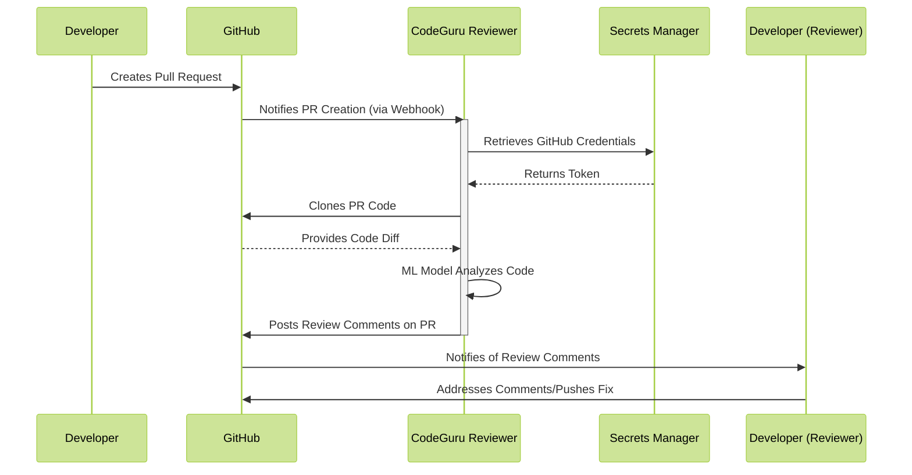
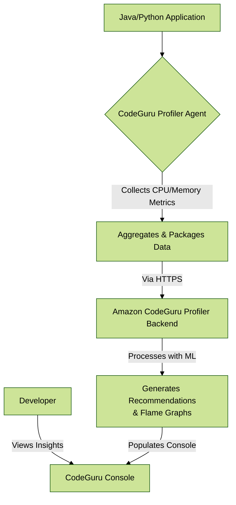
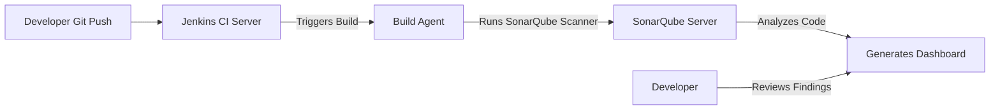

# Code Guru

***

### **🧠 Overview**

**Amazon CodeGuru** is a developer tool powered by machine learning that provides intelligent recommendations for improving code quality and identifying an application’s most expensive lines of code. It consists of two main components:

* **CodeGuru Reviewer:** Automatically scans code (in Java, Python, and JS/TS) in pull requests and identifies hard-to-find bugs, security vulnerabilities, and deviations from AWS best practices.
* **CodeGuru Profiler:** Helps understand the runtime behavior of your application, visualizes its performance characteristics, and recommends ways to reduce CPU utilization and cut compute costs.

> :bulb:**Innovation Spotlight:** CodeGuru's core innovation is its use of **ML models trained on Amazon's and open-source codebases**, comprising billions of lines of code. It doesn't just use static analysis rules; it learns patterns from highly efficient, secure code to identify deviations in _your_ code. It can find complex concurrency issues, resource leaks, and nuanced security flaws that traditional linters often miss.

***

### **Problem Statement & Business Use Cases**

* **Real-World Scenario:** A FinTech company, "FinApp," has a monolithic Java application for processing transactions. They are moving to microservices. During this process, developers are creating new services and modifying old code. They face:
  1. **Pre-Production:** Code reviews are a bottleneck. Senior developers are overwhelmed, and subtle bugs like race conditions or misconfigured AWS credentials slip into production, causing outages.
  2. **Post-Production:** Their production environment runs on EC2 and ECS. CPU utilization is consistently high, leading to high costs, but developers cannot pinpoint the exact cause in the complex codebase.
* **Industries/Applications:**
  * **Financial Services & Healthcare:** To ensure stringent security and compliance requirements are met in code (e.g., preventing log injection of sensitive data).
  * **E-commerce:** To optimize performance of recommendation engines and payment processing services during peak loads (e.g., Black Friday).
  * **SaaS Companies:** To maintain high code quality and operational efficiency across rapidly evolving, multi-service architectures.
  * **Gaming:** To profile game servers and identify performance bottlenecks that degrade player experience.

***

### **Core Principles & Service Terms**

* **CodeGuru Reviewer:**
  * **Pull Request Analysis:** Integrates with GitHub, GitHub Enterprise, Bitbucket, and AWS CodeCommit. It automatically analyzes every new pull request and provides findings directly in the developer's workflow.
  * **Repository Analysis:** Scans an entire repository and provides a full assessment of its code quality.
  * **Recommendations:** Findings are categorized as **Critical, High, Medium, or Low** and include a detailed explanation, the problematic code snippet, and a suggested fix.
* **CodeGuru Profiler:**
  * **Profiling Groups:** A collection of agents that report profiling data from your application instances.
  * **Agent:** A lightweight library (e.g., `codeguru-profiler-java-agent.jar`) that runs alongside your application on EC2, ECS, Lambda, or on-premises servers.
  * **Flame Graphs:** Visualizations that show the execution stack of your application, making it easy to identify the most CPU-intensive methods.
  * **Anomalies:** Automatically detects unusual performance behavior (e.g., a specific method suddenly taking 5x longer) and highlights it.

***

### **Pre-Requirements 🛠️**

* **An AWS Account** with appropriate permissions.
* **Source Code Repository:** Hosted on a supported platform (CodeCommit, GitHub, Bitbucket).
* **Application Runtime (For Profiler):** Java Python applications (JVM-based or Python) running on:
  * Amazon EC2 (Any OS)
  * Amazon ECS
  * AWS Lambda
  * AWS EKS (Kubernetes)
  * On-premises servers
* **IAM Roles/Policies:** Permissions for CodeGuru to access your repositories (via a linked AWS Secrets Manager connection) and for your compute resources to send data to the profiler.

***

### **Implementation Steps**

**Part A: Setting Up CodeGuru Reviewer for a GitHub Repository**

1. **Create a Secrets Manager Secret:** Store your GitHub personal access token in AWS Secrets Manager.
2. **Connect GitHub to CodeGuru:** In the CodeGuru Console, go to Reviewer -> Source repositories -> Associate repository. Choose "GitHub", authenticate, and select your repo.
3. **Configure a Code Review:** For the associated repo, enable pull request analysis. CodeGuru will now automatically scan every new PR.
4. **Review Findings:** Developers will see CodeGuru's recommendations directly in the pull request interface on GitHub.

**Part B: Setting Up CodeGuru Profiler for a Java App on EC2**

1. **Create a Profiling Group:** In the CodeGuru Console, go to Profiler -> Profiling groups -> Create profiling group. Name it (e.g., `finapp-production`).
2. **IAM Role:** Ensure your EC2 instance has an IAM role with a policy that allows `codeguru-profiler:ConfigureAgent` and `codeguru-profiler:PostAgentProfile`.
3. **Download the Agent:** On your EC2 instance, download the Java agent .jar file from the AWS hosted location.
4. **Start the Application with the Agent:** Modify your Java application's start command: `java -javaagent:/path/to/codeguru-profiler-java-agent.jar -jar your_application.jar`
5. **View Profiling Data:** After \~15 minutes, data will appear in the CodeGuru console. Analyze the flame graphs for performance insights.

***

### **Data Flow Diagram**

**Diagram 1: CodeGuru Reviewer Pull Request Analysis**

**Diagram 2: CodeGuru Profiler Runtime Analysis**

***

### **Security Measures 🔒**

* **Least Privilege IAM Roles:** The IAM role for the Profiler agent should only have permissions to submit profiling data, nothing else.
* **Secrets Manager for Tokens:** Securely store and rotate GitHub/Bitbucket access tokens using Secrets Manager. CodeGuru uses these without exposing them.
* **VPC Endpoints (AWS PrivateLink):** Use VPC endpoints (`com.amazonaws.region.codeguru-reviewer`, `com.amazonaws.region.codeguru-profiler`) to keep all traffic between your VPC and CodeGuru within the AWS network.
* **Encryption:** All data (code, profiles) is encrypted at rest and in transit using AWS-managed keys (AWS KMS keys can be used).

***

### **Deep Dive: How the ML Model Works**

The true innovation is in the training data and methodology. The model wasn't just trained on "bad code"; it was trained on **diffs**. It analyzed billions of code commits from Amazon's internal codebases and public open-source repositories to learn what a "fix" looks like for a given problem. When it sees new code, it doesn't just match patterns; it predicts what a secure, efficient version of that code would look like and highlights the difference. This allows it to find novel and complex bugs that are not defined in a static rulebook.

***

### **When to Use and When Not to Use**

| When to Use                                                                                                       | When NOT to Use                                                             |
| ----------------------------------------------------------------------------------------------------------------- | --------------------------------------------------------------------------- |
| **Reviewer:** For Java, Python, JavaScript/TypeScript codebases needing deep security and best practice analysis. | Your codebase is in an unsupported language (e.g., C++, Go, C#).            |
| **Profiler:** For CPU-intensive applications where cost or performance is a concern.                              | Your application's primary bottleneck is I/O (disk or network) and not CPU. |
| **Shift-Left Culture:** You want to automate code reviews and catch bugs before they merge.                       | You have no established CI/CD pipeline or code review process.              |
| **Cost Optimization:** You need actionable data to right-size EC2 instances or optimize Lambda functions.         | Your application is simple, has low traffic, and costs are already minimal. |

***

### :moneybag: **Costing Calculation**

* **How it's calculated?**
  * **Reviewer:** **$0.75 per 100 lines of code** analyzed in a pull request. Repository analysis is **$4.00 per 100,000 lines of code** per month.
  * **Profiler:** **$0.005 per hour** for each instance profiled. The AWS Free Tier includes **180,000 lines of code per month for Reviewer** and **8 hours per month of Profiler** for 12 months.
* **Efficient Handling:**
  * Only run the Profiler agent on environments that matter (e.g., production, staging). Don't run it on development machines.
  * For Reviewer, you can configure it to only scan on specific branches (e.g., `main`, `develop`) to avoid scanning experimental feature branches.
* **Sample Calculation:**
  * Your team creates **50 pull requests per month**, averaging **500 lines of code changed** each.
    * `(50 PRs * 500 LOC) / 100 * $0.75 = $187.50`
  * You profile **5 production EC2 instances** continuously for a month (730 hours).
    * `5 instances * 730 hours * $0.005 = $18.25`
  * **Total Estimated Monthly Cost: \~$205.75**

***

### **Alternative Services**

| AWS                                                 | Azure                                       | GCP                                                                     | On-Premise                                             |
| --------------------------------------------------- | ------------------------------------------- | ----------------------------------------------------------------------- | ------------------------------------------------------ |
| **AWS CodeGuru**                                    | **Azure DevOps + SonarCloud**               | **Cloud Profiler + Secret Manager**                                     | **SonarQube + YourKit Profiler**                       |
| Native AWS integration, ML-powered.                 | SonarCloud provides strong static analysis. | GCP's profiler is excellent, but static analysis is split across tools. | Full control, high upfront cost, requires maintenance. |
| **Amazon Inspector** (for EC2/ECR)                  | **Microsoft Security Code Analysis**        |                                                                         | **Checkmarx, Veracode** (SAST)                         |
| More focused on OS/app-level vulns post-deployment. | A suite of static analysis tools.           |                                                                         | Traditional, powerful SAST tools.                      |

**On-Premise Data Flow (SonarQube + Jenkins):**

***

### **Benefits 🚀**

* **Cost Savings:** Profiler directly identifies performance inefficiencies, leading to lower EC2/Lambda bills. Reviewer prevents costly bugs from reaching production.
* **Improved Code Quality:** Automates and enhances code reviews, enforcing best practices and security standards consistently.
* **Developer Productivity:** Provides actionable feedback directly in the developer's workflow, reducing context-switching and manual debugging time.
* **Performance Optimization:** Offers deep, visual insights into application behavior that are otherwise nearly impossible to obtain.
* **ML-Powered Accuracy:** Reduces false positives compared to traditional static analysis tools, so developers trust the recommendations.

***

### **Integration with CI/CD and "DevSecOps"**

CodeGuru is a cornerstone for a DevSecOps pipeline. It's not a standalone tool. Its true power is realized when its findings are treated as **gates** in the CI/CD process. For example, in AWS CodePipeline, you can add a step after a CodeBuild build that checks if CodeGuru Reviewer found any **CRITICAL** issues. If it did, the pipeline can be configured to fail, preventing vulnerable code from being deployed. This enforces quality and security as a non-negotiable, automated part of the release process.

***

### **Summary**

Amazon CodeGuru leverages machine learning to automate and enhance code reviews and performance profiling, leading to more secure, efficient, and cost-effective applications.

**Top 7 Points to Keep in Mind:**

1. It's **ML-powered**, not just a rules-based linter, making it effective at finding complex issues.
2. **Reviewer supports** Java, Python, and JavaScript/TypeScript. Ensure your language is covered.
3. Integrates **seamlessly with GitHub, Bitbucket, and CodeCommit** for a unified developer experience.
4. The **Profiler agent is lightweight** but should be tested in a staging environment before production.
5. **Costs are based on usage** (lines of code and profiling hours); use the Free Tier for evaluation.
6. Treat its findings as **CI/CD quality gates** to fully embrace a DevSecOps culture.
7. It complements but **does not replace** manual code reviews and other security testing tools.

***

### **Related Topics & Reference Links**

* **AWS DevOps Blog:** [Tag: CodeGuru](https://aws.amazon.com/blogs/devops/tag/amazon-codeguru/)
* **AWS Documentation:** [Amazon CodeGuru Developer Guide](https://docs.aws.amazon.com/codeguru/)
* **AWS Whitepaper:** [AWS Well-Architected Framework](https://aws.amazon.com/architecture/well-architected/) (The Reliability & Performance Efficiency pillars are highly relevant)
* **Related AWS Services:** AWS X-Ray (distributed tracing), AWS Security Hub (aggregates CodeGuru findings), AWS Lambda Power Tuning (works with Profiler for optimization).
