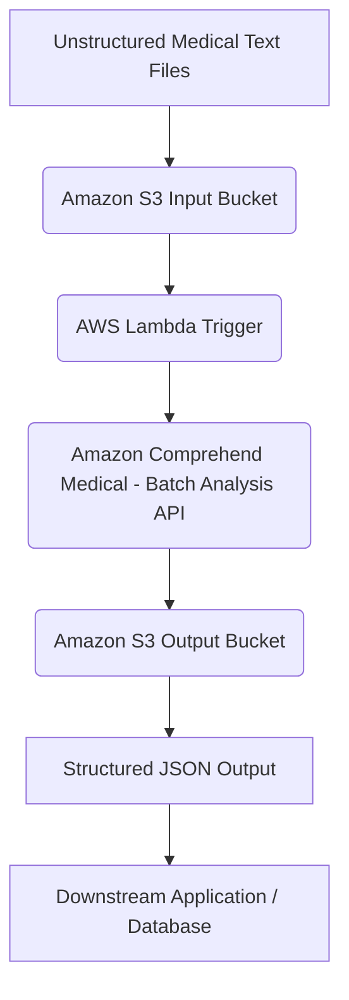
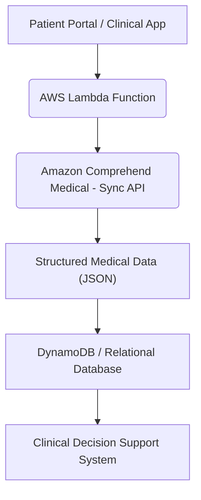
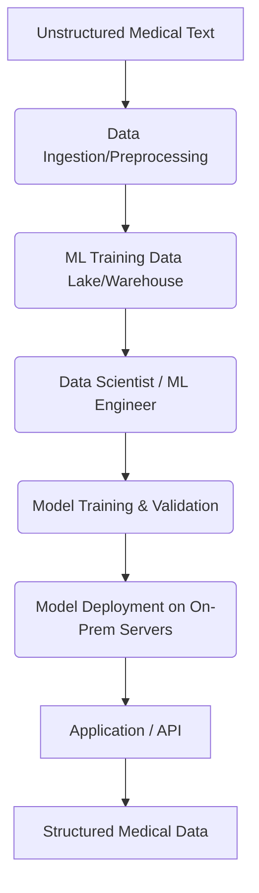

# Comprehend Medical

## 🩺 Comprehend Medical

### ⭐ **Unlocking Insights from Unstructured Clinical Text** 💉

### **🔍 Overview**

Amazon Comprehend Medical is a HIPAA-eligible Natural Language Processing (NLP) service that uses pre-trained machine learning models to extract and structure health data from unstructured medical text. Instead of building and training your own complex NLP models, you can use a simple API call to analyze documents like doctor's notes, clinical trial reports, and patient records. It automatically identifies and categorizes medical information, providing a powerful tool for the healthcare and life sciences industries.

> 🤖 **Innovation Spotlight:** The true innovation of Amazon Comprehend Medical lies in its ability to understand the context and relationships between entities. It doesn't just identify a list of medical terms; it can link a medication to its dosage and frequency, or a medical condition to the patient's anatomy, providing a richer, more meaningful output. This contextual understanding is a significant leap from traditional keyword-based extraction methods.

### **⚡ Problem Statement & Business Use Cases**

**Problem Statement:** In the healthcare industry, a vast amount of critical patient data is stored in free-form, unstructured text format—think of physician notes, discharge summaries, and lab results. Manually sifting through these documents is time-consuming, error-prone, and a major bottleneck for healthcare providers and researchers. Rule-based systems often fail to capture the full context, leading to incomplete or inaccurate data extraction. This slows down processes like medical coding, clinical trial recruitment, and insurance claims processing.

**Business Use Cases:**

* **Clinical Trial Management:** 🧪 **Scenario:** A pharmaceutical company needs to find patients for a new clinical trial. They have thousands of patient records stored as unstructured text. **Application:** By using Amazon Comprehend Medical, they can automatically analyze these records to identify patients who meet specific inclusion criteria, such as a particular medical condition, a certain medication history, or a family history of a disease, significantly accelerating the patient recruitment process.
* **Insurance Claims Processing:** 💼 **Scenario:** A healthcare insurance company receives thousands of claims each day with attached physician notes. **Application:** Amazon Comprehend Medical can automatically extract and validate diagnoses (e.g., linked to ICD-10-CM codes) and procedures from the notes, automating claim capture and validation workflows and speeding up the approval process.
* **Population Health Analytics:** 📈 **Scenario:** A public health organization wants to analyze patient data from multiple hospitals to identify trends in a specific disease outbreak. **Application:** They can use the service to process anonymized patient data in bulk, structuring key information like diagnoses, medications, and demographic data to identify gaps in care and improve health outcomes.

### **🔥 Core Principles**

Amazon Comprehend Medical is a fully managed, serverless service built on a simple pay-as-you-go model. Its core principles are:

* **Pre-trained ML Models:** The service is pre-trained on a vast corpus of medical literature, which means you don't need to provide your own training data. This drastically reduces the time and expertise required to get started.
* **Contextual Understanding:** It goes beyond simple entity detection. It understands the relationships and "traits" of the medical information it finds, such as whether a diagnosis is a symptom or a sign, or if a medication is an existing prescription or a new one.
* **HIPAA Eligibility:** The service is designed with the security and privacy of Protected Health Information (PHI) in mind, making it suitable for use in healthcare applications that handle sensitive data.

**Key Resources & Services:**

* **`DetectEntitiesV2`:** This API identifies a broad range of medical entities in text, including medical conditions, medications, tests, treatments, procedures, and anatomy. It also identifies relationships between these entities.
* **`DetectPHI`:** This API specifically identifies and extracts Protected Health Information (PHI) like patient names, addresses, and medical record numbers, which is crucial for de-identification and data privacy.
* **`InferICD10CM`:** This API detects medical conditions and links them to standard ICD-10-CM codes, which is essential for medical billing and coding.
* **`InferRxNorm`:** This API detects medications and links them to standard RxNorm codes, used for drug-related data processing.
* **`InferSNOMEDCT`:** This API detects medical concepts and links them to codes from the SNOMED CT ontology, providing a comprehensive vocabulary for clinical terms.
* **Asynchronous Batch Analysis:** For processing large volumes of documents, Amazon Comprehend Medical offers batch APIs that work asynchronously, reading input from and writing output to Amazon S3 buckets.

### **📋 Pre-Requirements**

* **AWS Account:** An active AWS account is required to access the services.
* **Amazon S3:** An S3 bucket is needed to store input and output files for batch processing jobs.
* **AWS Identity and Access Management (IAM):** An IAM role with appropriate permissions is necessary for the service to read from S3 and write back to S3. This is a critical security step.
* **AWS SDK/CLI:** To programmatically interact with Amazon Comprehend Medical, you will need to use the AWS Command Line Interface (CLI) or an AWS SDK (e.g., Boto3 for Python).

### **👣 Implementation Steps**

Here's a high-level guide for a common batch processing use case:

1. **Prepare Your Data:** Gather your unstructured clinical text documents (e.g., `.txt` files) and upload them to an Amazon S3 bucket. Create a folder for input and another for output.
2. **Create an IAM Role:** In the IAM console, create a new role for Amazon Comprehend Medical. The role should have a trust relationship with `comprehendmedical.amazonaws.com` and have a policy that grants it `s3:GetObject` and `s3:PutObject` permissions for your specific S3 bucket.
3.  **Start the Analysis Job:** Use the AWS CLI or SDK to initiate a batch analysis job. For example, to detect medical entities:

    ```sh
    aws comprehendmedical start-entities-detection-v2-job \
    --input-data-config "S3Uri=s3://your-input-bucket/input-folder/" \
    --output-data-config "S3Uri=s3://your-output-bucket/output-folder/" \
    --data-access-role-arn "arn:aws:iam::123456789012:role/your-comprehend-medical-role" \
    --language-code "en" \
    --job-name "medical-entity-detection-job"
    ```
4. **Monitor the Job:** You can monitor the status of the job using the `describe-entities-detection-v2-job` command.
5. **Retrieve Results:** Once the job status is `COMPLETED`, the output will be a `.tar.gz` archive in your specified S3 output folder. Download and decompress the file to get the JSON-formatted results.
6. **Process the Output:** Parse the JSON output to extract the structured medical information and integrate it into your downstream applications, databases, or analytics dashboards.

### **🗺️ Data Flow Diagram**

**Diagram 1: Asynchronous Batch Processing**



**Diagram 2: Real-time API Integration (e.g., for a Clinical App)**



### **👮 Security Measures**

* **IAM Roles with Least Privilege:** 🔐 Grant Amazon Comprehend Medical only the specific S3 permissions it needs (e.g., `s3:GetObject` and `s3:PutObject`) for the designated buckets. Avoid using overly permissive roles.
* **Data Encryption:** 🔒 Ensure that your data is encrypted both at rest in Amazon S3 (using S3-managed keys or KMS) and in transit to and from Amazon Comprehend Medical using SSL/TLS.
* **VPC Endpoints (AWS PrivateLink):** For enhanced security, you can use a VPC endpoint to keep traffic between your VPC and Amazon Comprehend Medical within the AWS network, without traversing the public internet.
* **PHI Redaction:** 🛡️ Use the `DetectPHI` API to automatically identify and, if needed, redact or de-identify sensitive PHI before any further processing or analysis, ensuring compliance with HIPAA Safe Harbor guidelines.

### **🎍 Advanced Topic: Combining Comprehend Medical with Generative AI**

A powerful and innovative use case is combining Amazon Comprehend Medical with Large Language Models (LLMs) like Amazon Bedrock. You can use Comprehend Medical to precisely extract structured clinical facts from a note and then feed these facts into a large language model to generate a structured summary, a patient-friendly explanation, or even an automated SOAP (Subjective, Objective, Assessment, Plan) note. This ensures the LLM's output is grounded in accurate, verified clinical information, preventing hallucinations and enhancing reliability.

### **⚖️ When to Use and When Not to Use**

**When to Use:**

* You need to process a large volume of unstructured clinical documents.
* You require a pre-trained, managed service that is HIPAA-eligible.
* You want to extract structured medical entities and their relationships without building your own ML models.
* The text is in English (US-EN).

**When Not to Use:**

* Your data is highly specialized and requires a custom model trained on proprietary data (consider Amazon Comprehend Custom).
* Your documents are in a language other than English.
* You need to process structured data (e.g., a CSV file) that doesn't require NLP.
* You need to transcribe audio or video (use Amazon Transcribe first).

### **💰 Costing Calculation**

Amazon Comprehend Medical pricing is based on a per-character model, measured in units of 100 characters. There are tiered prices, meaning the cost per unit decreases as your usage increases.

* **How it's Calculated:** The cost is calculated based on the total number of characters processed by a specific API. Each API (`DetectEntitiesV2`, `InferICD10CM`, `DetectPHI`, etc.) has its own pricing per unit.
* **Efficient Way of Handling:**
  * **Batch Processing:** For large, non-real-time workloads, use batch processing to leverage volume discounts.
  * **Filter Data:** Only process the text that is relevant. If a document has a lot of boilerplate or non-medical text, pre-process it to reduce the character count.
  * **Optimize API Calls:** For example, if you only need PHI detection, use `DetectPHI` instead of the more comprehensive `DetectEntitiesV2`.
  * **Leverage the Free Tier:** Use the generous free tier for initial testing and proof-of-concept projects.
* **Sample Calculation:**
  * **Scenario:** An insurance company processes 50,000 clinical notes in a month for medical coding. Each note is an average of 1700 characters. They use the `InferICD10CM` API.
  * **Calculation:**
    * Total Characters: 50,000 notes \* 1700 chars/note = 85,000,000 characters
    * Total Units (100-char unit): 85,000,000 / 100 = 850,000 units
    * **Cost (Example Tiered Pricing - refer to official docs for current rates):**
      * Up to 1M units: $0.0005 per unit
      * Total Cost: 850,000 units \* $0.0005/unit = **$425**

### **⛕ Alternative Services**

| Service Provider    | Service Name                                                       | Key Comparison/Difference                                                                                                                                                                                                                             |
| ------------------- | ------------------------------------------------------------------ | ----------------------------------------------------------------------------------------------------------------------------------------------------------------------------------------------------------------------------------------------------- |
| **AWS**             | **Amazon Comprehend Medical**                                      | HIPAA-eligible, pre-trained, and fully managed. Focuses exclusively on clinical text. No custom model training needed for core functions.                                                                                                             |
| **Google Cloud**    | **Cloud Healthcare Natural Language API**                          | Part of the Google Cloud Healthcare API suite. It offers similar functionalities with pre-trained models for medical entity extraction, de-identification, and relationship extraction. It is also HIPAA-compliant.                                   |
| **Microsoft Azure** | **Text Analytics for health**                                      | A feature of Azure Cognitive Services. It offers similar entity and relation extraction for health-related text. It is built for a broader range of text, but the health-specific features are robust.                                                |
| **On-Premise**      | **Custom NLP Models (e.g., spaCy, NLTK, or dedicated frameworks)** | Requires significant expertise in data science, ML engineering, and NLP. You are responsible for data annotation, model training, and deployment on your own servers. Offers complete control and customization but has high overhead and complexity. |

🗄️**On-Premise Data Flow Diagram:**



### **✅ Benefits**

* **Cost Savings:** 💰 Automates manual, time-intensive processes, reducing labor costs associated with data extraction and medical coding.
* **Scalability:** 🚀 A serverless solution that automatically scales to handle any volume of documents, from a single file to millions.
* **Accuracy & Quality:** 🎯 Pre-trained on a massive amount of clinical data, it delivers high accuracy in entity and relationship extraction, reducing errors and improving data quality.
* **Automation:** 🤖 Enables automation of complex workflows like clinical trial screening and claims processing, freeing up healthcare professionals to focus on patient care.
* **Time to Market:** ⏱️ As a managed service, it allows organizations to quickly build and deploy applications without the need to hire a large team of ML experts or spend months on model development.

> **💊 Innovative Use Case: Drug Safety & Pharmacovigilance**

> Pharmaceutical companies can use Amazon Comprehend Medical to monitor and analyze vast amounts of text from clinical trial reports, medical journals, and social media for adverse drug events (ADEs). The service can automatically identify mentions of specific medications, conditions, and symptoms, and link them together to flag potential side effects. This can accelerate pharmacovigilance efforts, ensuring patient safety and helping to meet regulatory reporting requirements faster.

***

### **📝 Summary**

Amazon Comprehend Medical is a powerful, HIPAA-eligible NLP service that transforms unstructured clinical text into actionable, structured data. It automates complex data extraction workflows, enabling organizations to accelerate processes like clinical trial recruitment, insurance claims processing, and medical coding. By providing pre-trained models, it significantly reduces the time, cost, and expertise required to gain valuable insights from medical documents.

<details>

<summary>💭 <strong>What you need to keep in mind</strong></summary>

***

* [x] **HIPAA Eligibility is Key:** It's built for sensitive data, but you must still ensure your entire architecture is HIPAA-compliant.
* [x] **English Only:** The service currently only supports US English (US-EN).
* [x] **Pay-per-use Model:** Be mindful of character count and API choice to manage costs effectively.
* [x] **Relationships are Crucial:** Don't just look at the entities; the relationships between them provide the most valuable context.
* [x] **Not for Custom Training:** If you have highly specialized, unique entities to extract, consider the standard Amazon Comprehend service for custom model training.
* [x] **Batch vs. Sync:** Use asynchronous batch processing for large, non-time-sensitive workloads and the synchronous API for real-time interactive applications.

</details>


### **🔗 Related Topics/Reference Guidelines**

* **AWS Official Documentation:** [https://docs.aws.amazon.com/comprehend-medical/latest/dev/comprehendmedical-gettingstarted.html](https://docs.aws.amazon.com/comprehend-medical/latest/dev/comprehendmedical-gettingstarted.html)
* **AWS Blogs on Comprehend Medical:** [https://aws.amazon.com/blogs/machine-learning/category/healthcare-and-life-sciences/](https://www.google.com/search?q=https://aws.amazon.com/blogs/machine-learning/category/healthcare-and-life-sciences/)
* **HIPAA Compliance on AWS:** [https://aws.amazon.com/compliance/hipaa-compliance/](https://aws.amazon.com/compliance/hipaa-compliance/)
