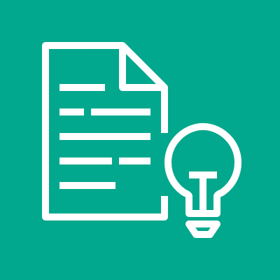
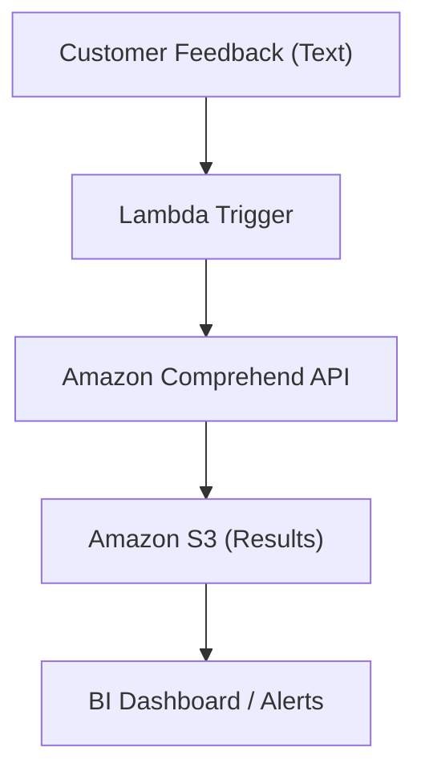
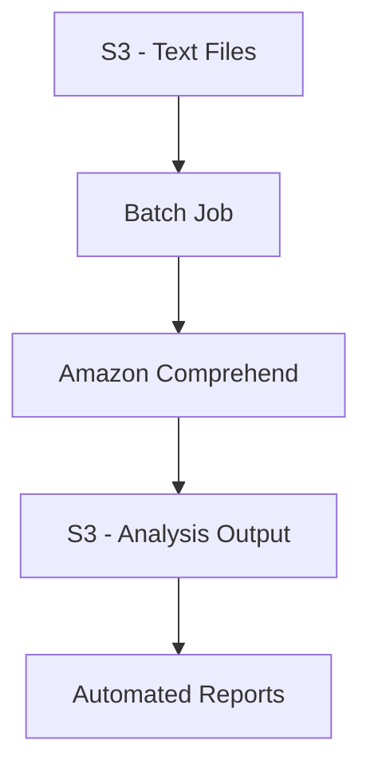
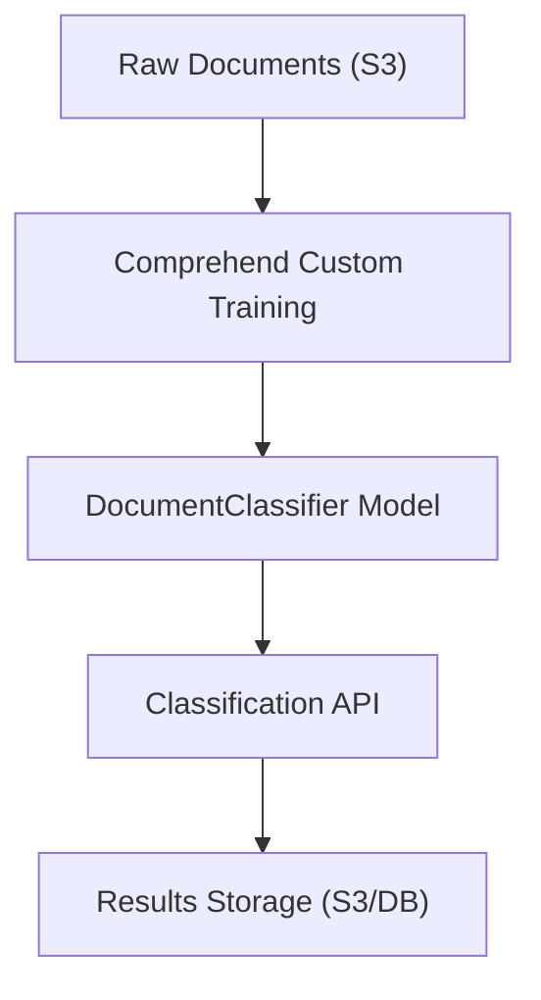
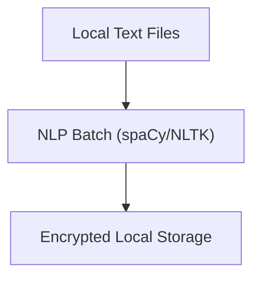

# Comprehend

## Amazon Comprehend (AWS NLP Service) 🚀

### **Overview**&#x20;

  Amazon Comprehend is an advanced natural language processing (NLP) service powered by machine learning on AWS. It seamlessly uncovers valuable information from unstructured text, including sentiment, entities, key phrases, topics, syntax, and personally identifiable information (PII)—with no ML experience required. Its innovation spotlight is real-time NLP with high accuracy and flexibility for custom models, making it a critical tool for AI-driven solutions like customer experience mining, compliance, and knowledge management.

<figure><figcaption></figcaption></figure>

> 🔍 **Two-Step PII Detection and Redaction for Large-Scale Compliance**\
> Amazon Comprehend offers a sophisticated two-step process for detecting and redacting Personally Identifiable Information (PII) in massive datasets, which is critical for industries like legal, healthcare, and finance. The first step uses the `ContainsPiiEntities` API to quickly scan millions of documents and flag those likely containing PII (e.g., names, bank account numbers) based on a confidence threshold (e.g., >0.75). This narrows down the dataset for deeper analysis. The second step employs the `DetectPiiEntities` API to identify exact PII locations within flagged documents, enabling precise redaction. This approach efficiently balances speed and accuracy, allowing organizations like Reveal's Logikcull to process over 20 million documents weekly while ensuring compliance with regulations like GDPR or HIPAA . This innovation reduces costs and operational complexity while safeguarding sensitive data.

***

> 🏥 **Medical Ontology Linking for Healthcare Data Extraction**\
> Beyond general NLP tasks, Amazon Comprehend Medical extends its capabilities to healthcare by extracting structured medical information from unstructured text (e.g., clinical notes, trial reports) and linking it to standardized medical ontologies. For instance, it maps medical conditions to ICD-10-CM codes and medications to RxNorm codes, enabling seamless integration with electronic health record (EHR) systems. This allows healthcare providers to rapidly identify patient cohorts for clinical trials, automate medical coding, and improve data accuracy without manual intervention. The service is HIPAA-eligible, ensuring compliance while handling complex medical jargon . This innovation accelerates medical research and operational efficiency in healthcare, showcasing how NLP can tackle domain-specific challenges.

### **Problem Statement & Business Use Cases**

**Scenario:**\
A global retailer receives thousands of customer feedback messages daily. They want to identify negative feedback in any language, extract specific product mentions, and perform compliance redaction of PII—all in real-time.

**Industries & Applications:**

* **Retail**: Customer sentiment analysis, complaint routing
* **Healthcare**: Extract symptoms from doctor notes, detect PII
* **Legal & Finance**: Document classification, entity redaction
* **Media/News**: Content topic discovery, multilingual classification
* **Support Centers**: Automated ticket routing, trend analysis.

### **Core Principles**

Amazon Comprehend works on foundational NLP & ML concepts:

* **Entity Recognition**: Find names, dates, organizations, products
* **Sentiment Analysis**: Classify as positive, negative, neutral, mixed
* **Keyphrase Extraction**: Highlight significant terms for summaries
* **Language Detection**: Identify text language automatically
* **Topic Modeling**: Discover dominant themes in corpora
* **Document Classification**: Categorize into predefined labels
* **PII Detection & Redaction**: Identify/remove sensitive data
* **Custom Model Training**: Tailor to domain-specific needs

**Resources/Terms:**

* **Comprehend API**: Main interface for tasks
* **EntityRecognizer**: Used for custom entity models
* **DocumentClassifier**: Used for custom document labeling
* **Comprehend Medical**: Specialized for healthcare.

### **Pre-Requirements**

* **AWS Account**: Access to Comprehend service
* **Amazon S3**: Storage for text inputs/outputs
* **IAM Roles**: Permissions for least privilege access
* **(Optional) Lambda/Step Functions**: For automation triggers
* **(Optional) Comprehend Custom Models**: For domain-specific tasks

### **Implementation Steps**

1. **Enable Comprehend in AWS console**
2. **Upload Data to S3 bucket** (feedback, documents, etc.)
3. **Configure IAM roles** for secure access
4. **Invoke Comprehend API** (using SDKs/console) for required tasks:
   * Detect entities/sentiment/PII
   * Extract keyphrases
   * Topic modeling
   * (Optional) Start custom model training
5. **Save results** (entities, sentiment) back to S3 or database
6. **(Optional) Automate flow with Lambda/Step Functions**
7. **Monitor and optimize throughput/cost**

### **Data Flow Diagrams (Mermaid)**

**A. Real-Time Feedback Analysis**

**B. Batch Entity & Sentiment Extraction**

**C. Custom Document Classification**

### **Security Measures**

* **Enable Encryption** (S3, Comprehend endpoints)
* **Use Least Privilege IAM roles**
* **Data Masking & PII Redaction**
* **VPC Endpoints for Comprehend**
* **Audit Logging (CloudTrail)**
* **Secure API access (IAM, KMS)**

### **Innovative Use Case: Automated Compliance Monitoring**

Automatically scan and redact sensitive legal or financial information across millions of documents, meeting GDPR and other regulatory standards—while providing an auditable trail for reviewers.

### **When to Use & When Not to Use**

**Use When:**

* You require NLP but lack ML expertise
* Need scalable, real-time/batch text analysis
* Multilingual, domain-specific document handling
* Integrated AWS data workflows

**Not Ideal When:**

* On-prem documentation mandates (compliance)
* Highly specialized NLP not aligned with pre-trained/comprehend custom models
* Extreme cost constraints with massive data (consider custom open-source solutions for lower volumes).

### **Costing Calculation**

**How is it calculated?**

* **Per-text analysis**: Charged per unit (e.g., 1,000 characters for entity/sentiment extraction)
* **Custom model training/deployment**
* **Batch processing jobs**
* **Storage (S3), Lambda triggers, API calls**

**Efficient Handling:**

* Optimize input sizes, batch requests
* Archive processed data
* Use auto-scaling & budget alerts

**Sample Calculation (Typical)**

* Analyzing 1,000,000 customer reviews (avg 200 chars each) = 200,000,000 chars
* If $0.0001 per 1,000 chars = $20
* Custom model: Additional training/inference charges.

### **Alternative Services (Comparison Table)**

| Service              | AWS Comprehend  | Azure Text Analytics | GCP Natural Language | On-Premise NLP (spaCy/NLTK) |
| -------------------- | --------------- | -------------------- | -------------------- | --------------------------- |
| Sentiment            | ✔️ Yes          | ✔️ Yes               | ✔️ Yes               | ✔️ Yes                      |
| Entity Recognition   | ✔️ Yes          | ✔️ Yes               | ✔️ Yes               | ✔️ Yes                      |
| Custom Models        | ✔️ Yes          | ✔️ Limited           | ✔️ Yes               | ✔️ Full Control             |
| Multilingual Support | ✔️ Yes          | ✔️ Yes               | ✔️ Yes               | ✔️ Yes (Manual)             |
| PII Detection        | ✔️ Yes          | ✔️ Yes               | ❌ No                 | ❌ Manual                    |
| Real-time API        | ✔️ Yes          | ✔️ Yes               | ✔️ Yes               | ❌ Often batch only          |
| Pricing Flexibility  | Metered         | Metered              | Metered              | Hardware/Setup costs        |
| PCI/GDPR Ready       | ✔️ Configurable | ✔️                   | ✔️                   | Manual Configuration        |

**On-Prem Data Flow (Mermaid Example):**

### **Benefits**

* **Cost-effective** (scale as needed, pay-as-you-go)
* **Automated NLP** (no ML training required)
* **Scalable** (process millions of docs nightly)
* **Multilingual Support**
* **Domain Customization**
* **Integrated PII/Compliance workflows**
* **Fast integration to other AWS services**

### **Innovative Use Case: Sentiment-powered Search Filters**

Enable advanced e-commerce or content platforms to filter/search by topics and sentiment extracted from user reviews/comments—providing smarter user experiences.

### **Summary**

Amazon Comprehend delivers scalable, accurate NLP on AWS—uncovering trends, entities, and compliance risks in real-time or batch, with minimal infrastructure overhead or ML expertise needed. It powers actionable business intelligence for text-rich organizations, while remaining secure and cost-effective—transforming raw data into decisions.

**Top Points to Keep In Mind**

* Focus on input data quality for best results
* Always secure text and output (encryption, IAM)
* Use batch processing for cost efficiency
* Fine-tune custom models for niche applications
* Leverage integrated services (Lambda, Step Functions, S3)
* Monitor and alert for volume/cost spikes
* Use domain-specific models when accuracy matters
* Regularly audit access and workflows for compliance
* Archive for analytics, compliance, troubleshooting
* Explore feature updates—service improves regularly.

### **Related Topics**

* NLP in AWS (Amazon Transcribe, Translate, Lex)
* Custom AI/ML on AWS SageMaker
* Cloud compliance and security guidelines
* Open-source NLP: spaCy, NLTK, Transformers

***

