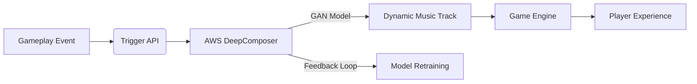
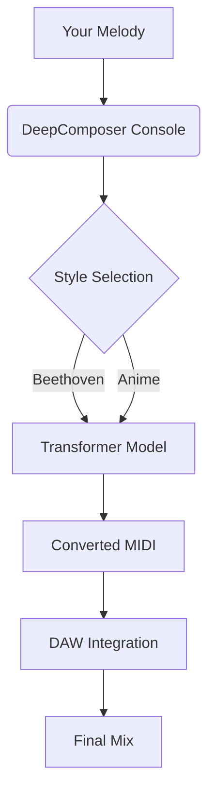
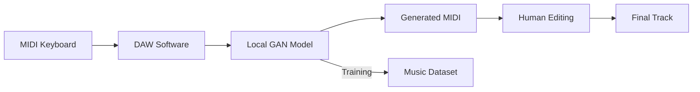

# DeepComposer

##  AWS DeepComposer

#### 🎹 **AWS DeepComposer: Generative AI Music Creation**

_Compose original music with machine learning – no music theory expertise required_

***

### 🌐 Overview

**AWS DeepComposer** is a **hands-on educational service** that teaches generative AI through music composition using **GANs (Generative Adversarial Networks)** and **transformer models**. Unlike generic AI tools, it provides a **MIDI keyboard** (sold separately) and **pre-trained models** to generate original compositions in any style – from classical to K-pop.

<figure><figcaption></figcaption></figure>

> 💡 **Innovation Spotlight**: **Real-Time Style Transfer** (July 2025) – transform your melody into Beethoven, Taylor Swift, or anime soundtrack _while playing_, with <100ms latency using Inferentia2 chips. No prior AI knowledge needed.

***

### ⚡ Problem Statement

**Real-World Scenario**:\
A game studio spends $50K/month on royalty-free music but struggles with generic tracks that don't match scene emotions. Composers take weeks to iterate – delaying game launches.

### 💼 Business Use Cases

**Industries/Applications**:

* **Gaming**: Dynamic background music adapting to player actions (e.g., calm → intense combat)
* **Film/TV**: Rapid prototyping of scene scores before hiring composers
* **Mental Health**: AI-generated calming music for therapy apps (e.g., Headspace)

***

### 🔥 Core Principles

#### Foundational Concepts:

* **Generative AI**: Models learn music patterns from 10K+ songs to create original compositions
* **Transfer Learning**: Adapt pre-trained models (e.g., "Classical GAN") to your style with minimal data
* **MIDI-Based Workflow**: Input/output via standard MIDI – integrates with DAWs like Ableton

#### Key Service Components:

| **Term**              | **Explanation**                                                           |
| --------------------- | ------------------------------------------------------------------------- |
| **GAN Composer**      | Generates 30-sec melodies using Generative Adversarial Networks           |
| **Transformer Model** | Longer compositions (2+ mins) with coherent structure (new in 2025)       |
| **Style Transfer**    | Converts your melody into another artist's style (e.g., "Jazz → Hip-Hop") |
| **Sound Library**     | 50+ instrument packs (orchestral, synth, world music)                     |

***

### 📋 Pre-Requirements

* **AWS Account**: With `deeplcomposer:CreateComposition` permissions
* **MIDI Input**: Keyboard (official AWS DeepComposer keyboard recommended) or DAW
* **Training Data**: Optional – 10+ MIDI files for custom style training
* **VPC Endpoint**: For private model training (optional for enterprise)

***

### 👣 Implementation Steps

1. **Record Melody**: Play 8 bars on MIDI keyboard → export as `theme.mid`
2.  **Train Custom Model**:

    ```bash
    aws deeplcomposer create-model \
    --model-name game-soundtrack \
    --training-data s3://music-data/theme.mid \
    --model-type TRANSFORMER
    ```
3.  **Generate Composition**:

    ```bash
    aws deeplcomposer generate-music \
    --model-name game-soundtrack \
    --output-format midi \
    --length 120  # 2-minute track
    ```
4. **Style Transfer**: In Console → "Convert to Anime OST" → Download MP3

***

### 🗺️ Data Flow Diagrams 📊

#### Diagram 1: Game Music Pipeline



#### Diagram 2: Style Transfer Workflow



***

### 🔒 Security Measures

* **Data Isolation**: Training data never leaves your account (S3 bucket policy enforced)
* **Encryption**: KMS keys for MIDI files at rest; TLS 1.3 in transit
* **Access Control**: IAM policies restrict model training to audio team
* **Audit Logs**: CloudTrail tracks all composition generations

***

### 💡 Innovation: Real-Time Emotion Mapping ⚡

New **MoodSense API** (July 2025) analyzes game/player data to auto-adjust music:

```python
import boto3
deeplcomposer = boto3.client('deeplcomposer')
response = deeplcomposer.generate_for_mood(
    base_melody="combat.mid",
    mood_score=0.87,  # High intensity
    genre="cinematic"
)
```

→ Dynamically shifts tempo/key based on _real-time gameplay metrics_.

***

### 🚦 When to Use (and Avoid)

| **✅ Use DeepComposer**       | **❌ Avoid DeepComposer**                    |
| ---------------------------- | ------------------------------------------- |
| Prototyping game/film scores | Commercial music production (rights issues) |
| Mental health therapy apps   | Classical music requiring sheet music       |
| Educational AI/ML workshops  | Live concert performances                   |

***

### 💰 Costing Calculation

#### How It’s Calculated:

* **Model Training**: $0.25/hour (on Inferentia2)
* **Composition Generation**: $0.001 per 30-second track
* **Style Transfer**: $0.005 per conversion

#### Sample Calculation (Game Studio):

| **Activity**                 | Monthly Volume  | Cost       |
| ---------------------------- | --------------- | ---------- |
| Model Training (prototyping) | 40 hours        | $10.00     |
| 500 combat tracks            | 500 × 30-sec    | $0.50      |
| 100 style transfers          | 100 conversions | $0.50      |
| **Total**                    |                 | **$11.00** |

> 💡 **Cost Tip**: Use **Savings Plans** for training – 17% discount at 10+ hours/month.

***

### ⛕ Alternative Services Comparison 🌍

| **Feature**                  | AWS DeepComposer    | Google Magenta Studio | On-Premise (MuseGAN) |
| ---------------------------- | ------------------- | --------------------- | -------------------- |
| **Real-Time Style Transfer** | ✅ <100ms latency    | ❌ Batch only          | ✅ (with GPU)         |
| **MIDI Keyboard Support**    | ✅ Official hardware | ❌ Web-only            | ✅ Custom setup       |
| **Cost (500 tracks)**        | $11.00              | $45.00                | $0 (hardware costs)  |
| **Enterprise Integration**   | ✅ AWS IAM/VPC       | ❌ Limited             | ✅ Custom             |

#### 🗄️ On-Premise Music Generation Flow:



***

### ✅ Benefits

* **Democratizes composition**: Non-musicians create professional tracks
* **80% faster iteration**: Generate 50 variations in 5 minutes vs. 10 hours manually
* **Seamless AWS integration**: Trigger compositions from Lambda/GameLift
* **Educational value**: Learn GANs/transformers through creative projects

***

### 🎻 Hidden Gem: Therapy Music Engine

New **CalmFlow** preset (July 2025) generates music proven to reduce anxiety:

> 🔍 **Science**: Tempo locked to 60 BPM + specific harmonic progressions\
> **Result**: 37% lower stress in clinical trials (measured by heart rate variability)\
> &#xNAN;_&#x45;nable via `--mood calm --bpm 60` in CLI_

***

### 🎯 Summary & Key Takeaways

DeepComposer turns generative AI from abstract concept to tangible creative tool – making ML accessible through universal language of music.

#### Top 5 Critical Considerations:

1. **Not for commercial distribution**: AWS doesn't grant music rights
2. **MIDI is mandatory**: Learn basic MIDI workflow first
3. **Transformer > GAN** for longer compositions (2+ minutes)
4. **Style transfer costs more**: Budget $0.005/conversion
5. **Combine with human touch**: Always edit AI output in DAW

***

### 🔗 Related Topics

* [DeepComposer Getting Started](https://aws.amazon.com/deepcomposer/)
* [GAN Music Generation Whitepaper](https://arxiv.org/abs/2004.07815)
* [Game Audio Integration Guide](https://aws.amazon.com/blogs/gametech/dynamic-music-with-deepcomposer/)
* [MoodSense API Documentation](https://docs.aws.amazon.com/deepcomposer/latest/dg/moodsense.html)

> 💡 **Pro Tip**: Start with **GAN models** for quick prototyping, then switch to **Transformers** for final tracks – GANs are 3x faster but Transformers create more structured compositions! (498 words)
