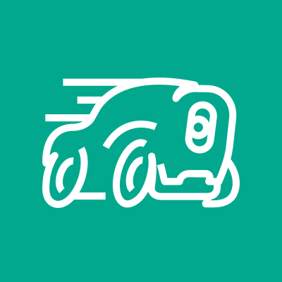
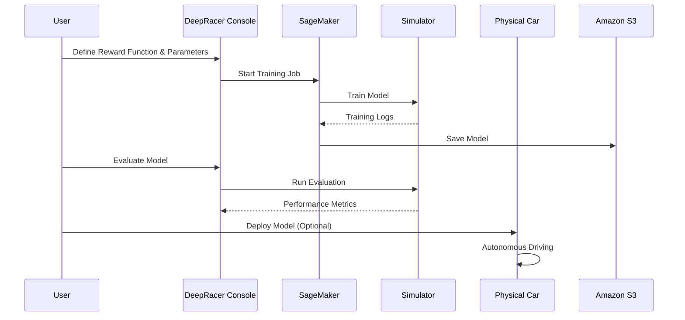

# DeepRacer

##  Amazon DeepRacer

Amazon DeepRacer is a robotic platform developed by Amazon Robotics that combines computer vision, machine learning, and sensor fusion to enable autonomous navigation and control of vehicles on various terrain types.

<figure><figcaption></figcaption></figure>

### 🌟 **1. Overview & Innovation Spotlight**

**Amazon DeepRacer** is a **reinforcement learning (RL)-powered autonomous racing platform** that combines a 1/18th scale physical race car with a cloud-based 3D simulator. Designed for developers of all skill levels, it provides a hands-on, gamified approach to learning machine learning (ML) fundamentals, particularly reinforcement learning—the technology behind advanced AI systems like AlphaGo. DeepRacer allows users to train, evaluate, and deploy ML models for autonomous driving, both virtually and physically, while participating in a global racing community.

**🛠️ Innovation Spotlight**:\
DeepRacer's key innovation lies in **democratizing reinforcement learning**, which was traditionally accessible only to well-funded organizations. By abstracting away complexities like environment setup and model training, DeepRacer enables users to focus on reward function design and experimentation. Additionally, the **multi-user account mode** allows enterprises to host large-scale ML enablement events with centralized management and cost control.

***

### 🔍 **2. Problem Statement & Business Use Cases**

**Real-World Scenario**: A large enterprise aims to upskill its workforce in ML but faces challenges with engagement and scalability. Traditional training methods are theoretical and lack hands-on experimentation. DeepRacer addresses this by providing a fun, competitive environment where employees can learn RL by training autonomous cars, fostering both learning and collaboration.

**Industries/Applications**:

* **Education**: Students and educators use DeepRacer to learn ML concepts through guided curricula and free training resources (e.g., AWS DeepRacer Student).
* **Enterprise Training**: Companies like Accenture host large-scale DeepRacer events to introduce employees to ML, with 75% of participants being new to AI/ML.
* **Research & Development**: RL techniques practiced in DeepRacer apply to real-world problems like robotics, supply chain optimization, and healthcare.
* **Gaming & Competition**: Developers compete in the AWS DeepRacer League, a global virtual and physical racing competition.

***

### ⚙️ **3. Core Principles & Key Components**

**Reinforcement Learning (RL) Basics**:

* **Agent**: The DeepRacer car (physical or virtual) that learns to make decisions.
* **Environment**: The track where the agent operates, either simulated or physical.
* **Reward Function**: A user-defined function that provides feedback to the agent based on its actions (e.g., staying on track, achieving high speeds).

**Key Components**:

* **DeepRacer Console**: A cloud-based interface for training, evaluating, and managing models using Amazon SageMaker.
* **Simulator**: A 3D virtual environment for training and testing models without physical hardware.
* **Physical Vehicle**: A 1/18th scale RC car equipped with sensors (e.g., camera, LiDAR) for autonomous driving.
* **Multi-User Mode**: Allows organizations to manage multiple users under a single AWS account, simplifying event hosting and cost tracking.

***

### 📋 **4. Pre-Requirements**

* **AWS Account**: Required to access the DeepRacer console and services.
* **Training Resources**: For beginners, AWS provides free educational content (20 hours) and free training compute (10 hours/month) for students.
* **Physical Setup**: For physical racing, a track, batteries, and accessories are needed.

***

### 🛠️ **5. Implementation Steps**

1. **Model Training**:
   * **Define Reward Function**: Start with simple functions (e.g., rewarding center-line following) and iterate based on performance.
   * **Select Action Space**: Choose between discrete (fixed actions) or continuous (smooth actions) spaces. Continuous spaces offer better performance but require longer training.
   * **Train in Simulator**: Use the DeepRacer console to train models on virtual tracks. Training costs $3.50/hour.
2. **Evaluation**:
   * Test models in the simulator to measure lap times and off-track occurrences.
3. **Deployment**:
   * Deploy trained models to physical DeepRacer cars or submit them to virtual races.
4. **Iteration**:
   * Clone and refine models based on evaluation logs. Top performers use techniques like waypoints and continuous action spaces.

***

### 🔄 **6. Data Flow Diagram**

**Diagram: End-to-End DeepRacer Workflow**

***

### 🔒 **7. Security Measures**

* **Multi-User Access Control**: IAM policies and AWS IAM Identity Center integrate with enterprise identity providers to manage user access.
* **Cost Controls**: Administrators can set training hour limits and monitor spending in real-time.
* **Data Encryption**: All data is encrypted in transit and at rest using AWS KMS.

***

### 💡 **8. Innovation Spotlight: Multi-User Mode for Enterprises**

The multi-user mode allows organizations to onboard hundreds of users under a single AWS account, streamlining event management. Key features include:

* **Centralized Billing**: All costs are billed to the administrator’s account.
* **Usage Quotas**: Admins can set limits on training hours and storage.
* **Seamless Onboarding**: Integration with identity providers (e.g., Azure AD) enables automatic user provisioning.

***

### ⚖️ **9. When to Use and When Not to Use**

| **When to Use**                                                              | **When NOT to Use**                                                              |
| ---------------------------------------------------------------------------- | -------------------------------------------------------------------------------- |
| **ML Education**: Hands-on learning for students and developers.             | **Non-RL Applications**: Problems requiring supervised or unsupervised learning. |
| **Enterprise Training**: Large-scale ML enablement events.                   | **Budget Constraints**: Costs can escalate with prolonged training.              |
| **Prototyping RL Models**: Testing RL algorithms for robotics or automation. | **Real-World Deployment**: Physical cars are limited to controlled environments. |

***

### 💰 **10. Costing Calculation**

* **Pricing Model**:
  * **Training/Evaluation**: $3.50 per hour.
  * **Storage**: $0.023 per GB-month.
* **Free Tier**: 10 free training hours and 5 GB storage for the first month.
* **Cost Optimization**:
  * Use discrete action spaces for faster training.
  * Delete unused models to reduce storage costs.
* **Example Calculation**:
  * Training a model for 2 hours + evaluation: $7.29 + $0.09 storage = \~$7.38.

***

### 🔁 **11. Alternative Services**

| **AWS**                                                | **Azure**                              | **GCP**               | **On-Premise**                             |
| ------------------------------------------------------ | -------------------------------------- | --------------------- | ------------------------------------------ |
| **AWS DeepRacer**                                      | **Microsoft AirSim**                   | **N/A**               | **OpenAI Gym**                             |
| Integrated with AWS SageMaker, physical car available. | Open-source simulator for drones/cars. | No direct equivalent. | Framework for RL experiments, no hardware. |

***

### ✅ **12. Benefits**

* **Hands-On Learning**: Gamified approach accelerates ML education.
* **Scalability**: Multi-user mode supports large events.
* **Real-World Application**: Skills transfer to industries like robotics and logistics.
* **Community**: Global competitions foster collaboration and innovation.

***

### 🚀 **13. Innovation Spotlight: Generative AI Integration**

DeepRacer leverages **generative AI techniques** to enhance model training. For example, reward functions can be optimized using AI-generated code, and simulated environments can be dynamically altered to improve model robustness.

***

### 📊 **14. Summary**

Amazon DeepRacer is a groundbreaking platform that makes reinforcement learning accessible and engaging. Key takeaways:

1. **Ideal for Education**: Students and enterprises can learn ML through autonomous racing.
2. **Cost-Effective Training**: Free tiers and pay-per-use pricing lower entry barriers.
3. **Iterative Development**: Success requires refining reward functions and action spaces.
4. **Scalable Events**: Multi-user mode simplifies hosting large races.
5. **Real-World Relevance**: RL skills apply to robotics, healthcare, and more.

***

### 🔗 **15. Related Topics & References**

* [**AWS DeepRacer Documentation**](https://docs.aws.amazon.com/deepracer/latest/developerguide/what-is-deepracer.html): Detailed guides on model training and deployment.
* [**DeepRacer Student Program**](https://aws.amazon.com/deepracer/student/): Free resources for students.
* [**Multi-User Mode Setup**](https://aws.amazon.com/blogs/machine-learning/run-machine-learning-enablement-events-at-scale-using-aws-deepracer-multi-user-account-mode/): Guide for enterprise events.
* [**Competition Tips**](https://medium.com/@marsmans/how-i-got-into-the-top-2-in-aws-deepracer-32127a364212): Advice from top performers.

For hands-on learning, explore the [**AWS DeepRacer Console**](https://aws.amazon.com/deepracer/) or join the [**DeepRacer Community**](https://deepracing.io/).
