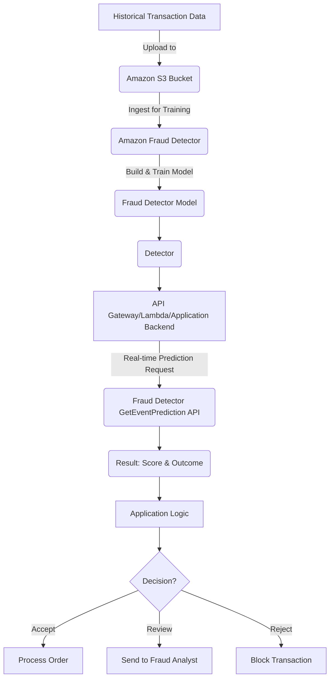
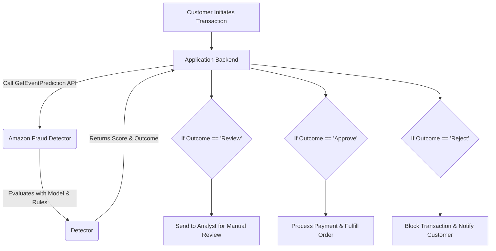
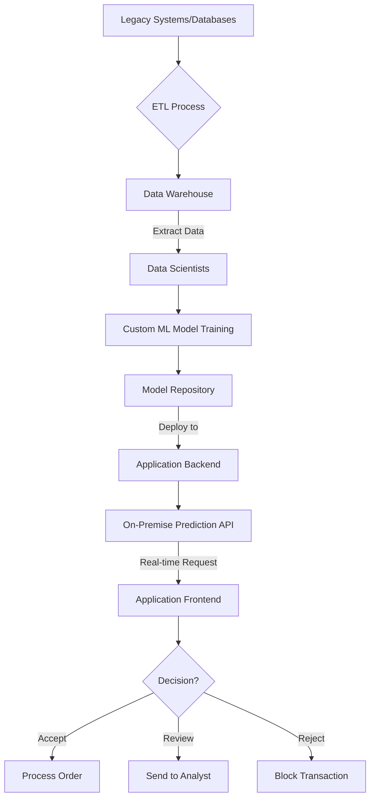

# Fraud Detector

## Amazon Fraud Detector

### 🔍 **Overview**

Amazon Fraud Detector is a machine learning-based service that allows you to identify potentially fraudulent online activities, such as online payment fraud and fake account creation, in near real-time. It leverages over 20 years of fraud detection expertise from Amazon and AWS to automatically build, train, and deploy custom fraud detection models. The service requires no prior machine learning experience.

<figure><figcaption></figcaption></figure>

> **✨Innovation Spotlight:** The key innovation of Amazon Fraud Detector lies in its ability to abstract away the complexity of building and deploying a machine learning model for fraud detection. It uses a combination of Amazon's own fraud knowledge base and your historical data to create a custom model that is highly effective and tailored to your specific business needs. This reduces the time and expertise required to implement a robust fraud prevention system.

***

### **⚡ Problem Statement & Business Use Cases**

**Problem Statement:** Online businesses, especially in e-commerce, banking, and gaming, face a constant threat from fraudulent activities. These can range from fraudulent payments, account takeovers, and fake account creations to promotional abuse. Manually identifying and responding to these threats is slow, error-prone, and can result in significant financial losses and customer trust erosion. Traditional rule-based systems are often rigid and struggle to adapt to new and evolving fraud patterns.

> **🌐Real-world Scenario:** An e-commerce company is experiencing a surge in fraudulent credit card transactions. Fraudsters are using stolen credit card information to make purchases and quickly resell the goods. The company's basic fraud detection rules are failing to keep up, leading to chargebacks, lost inventory, and increased operational costs. They need a dynamic and intelligent solution that can detect these new patterns and flag high-risk transactions instantly.

**Industries & Applications:**

* **E-commerce:** Identifying fraudulent purchases, chargeback prevention, and detecting promotional abuse.
* **Financial Services:** Flagging suspicious login attempts, detecting credit card fraud, and preventing money laundering.
* **Gaming:** Stopping fraudulent account creations (e.g., to exploit free trial periods), preventing in-game currency fraud, and detecting account sharing.
* **Travel & Hospitality:** Identifying fraudulent bookings or reservations made with stolen payment information.

***

### **🔥 Core Principles & Services**

Amazon Fraud Detector works by ingesting your historical event data, training a model, and then using that model in a "Detector" with custom rules to generate real-time fraud predictions.

**Core Principles:**

* **Machine Learning at its Core:** The service uses pre-built ML model types optimized for specific fraud scenarios, which are trained on your data and Amazon's extensive fraud expertise. This makes the models highly accurate and adaptive.
* **Rules-based Augmentation:** You can augment the ML model's output with your own business rules. For example, if a transaction is from a country with a high fraud rate and has a medium fraud risk score from the ML model, you can create a rule to automatically send it for manual review.
* **Event-Driven Architecture:** The service is designed to be triggered by events (e.g., a new user registration, a payment transaction). This allows for real-time fraud evaluation.

**Key Resources & Services Terms:**

* **Event Type:** Defines the structure of the business activity you want to evaluate for fraud (e.g., `online_payment`, `new_account_registration`). It consists of a set of variables, labels, and an entity.
* **Variables:** The data points that describe an event (e.g., `email_address`, `ip_address`, `transaction_amount`).
* **Labels:** Categorical values that indicate whether a past event was fraudulent or legitimate (`fraud`, `legit`). This is the key data required to train the model.
* **Entity Type:** The object performing the event, such as a user, customer, or account.
* **Models:** The machine learning models trained on your data. Amazon Fraud Detector offers different model types:
  * **Online Fraud Insights (OFI):** A general-purpose model for various online fraud types.
  * **Transaction Fraud Insights (TFI):** Specifically tuned for real-time payment fraud.
  * **Account Takeover Insights (ATI):** Designed for fraud related to account login and account creation.
* **Detector:** A container that holds one or more models and a set of rules. This is the central logic hub for your fraud detection.
* **Rules:** Business logic that determines an outcome based on the fraud prediction score from the model and other variables. A rule consists of an expression and an outcome.
* **Outcomes:** The final result of a fraud evaluation (e.g., `approve`, `review`, `reject`).

***

### **📋 Pre-Requirements**

* **AWS Account:** You need an active AWS account.
* **Amazon S3:** A bucket to store your historical training data (a CSV file) before you upload it to Fraud Detector.
* **IAM Roles:** An IAM role with permissions for Amazon Fraud Detector to read from your S3 bucket and to call other AWS services (e.g., Lambda, SNS) for downstream processing.
* **Historical Data:** A dataset of past events with corresponding labels (e.g., `fraud` or `legit`) to train the model. The more data, the better the model's accuracy.

***

### **👣 Implementation Steps**

Here's a simplified guide for a payment fraud use case:

1. **Prepare your Dataset:**
   * Gather historical payment transactions.
   * Create a CSV file with columns for `event_id`, `event_timestamp`, `ip_address`, `email_address`, `amount`, and a `label` column (with values like `fraud` and `legit`).
   * Upload this CSV file to an Amazon S3 bucket.
2. **Define an Event Type in Amazon Fraud Detector:**
   * In the AWS Management Console, navigate to Amazon Fraud Detector.
   * Create a new `Event type`.
   * Define the variables that match the columns in your CSV (e.g., `ip_address`, `email_address`, `amount`).
   * Define the labels (`fraud`, `legit`).
3. **Build and Train a Model:**
   * Create a new `Model`.
   * Select the `Transaction Fraud Insights (TFI)` model type.
   * Point to your S3 bucket and the CSV file.
   * The service will automatically train the model. This can take some time depending on the data size.
   * Once training is complete, review the model performance metrics (e.g., AUC score).
4. **Create a Detector and Rules:**
   * Create a new `Detector`.
   * Add the model you just trained to the detector.
   * Define `Outcomes` (e.g., `approve`, `review`, `reject`).
   * Create `Rules` that use the model's fraud prediction score.
     * **Example Rule 1:** `if $model_score > 900 then review`
     * **Example Rule 2:** `if $model_score > 990 then reject`
     * **Example Rule 3:** `if $model_score <= 900 then approve`
   * You can also combine model scores with business variables: `if $model_score > 800 and $transaction_amount > 500 then review`
5. **Deploy the Detector:**
   * Deploy the detector to a live version.
   * This makes it available for real-time predictions via the Fraud Detector API.
6. **Integrate with Your Application:**
   * Modify your application code to call the `GetEventPrediction` API operation in Amazon Fraud Detector.
   * Pass the event variables (e.g., `ip_address`, `email_address`, `amount`) with the API call.
   * The API returns an outcome (`approve`, `review`, or `reject`) and a fraud score.
   * Based on the outcome, your application can then proceed with the transaction, send it for a manual review, or block it.

***

### **🗺️ Data Flow Diagram**

**Diagram 1: Model Training and Deployment Workflow**

_Description: This diagram illustrates the end-to-end workflow, from ingesting historical data for model training to the real-time prediction request and decision flow within an application._

**Diagram 2: Real-time Transaction Flow**

_Description: This diagram focuses on the real-time interaction between a customer transaction, the application backend, and the Fraud Detector service for instant decision-making._

***

### **🔒 Security Measures**

* **IAM Least Privilege:** Create a dedicated IAM role for Amazon Fraud Detector with the minimum necessary permissions to access your S3 buckets (e.g., `s3:GetObject`).
* **Data Encryption:** Ensure that your historical data in Amazon S3 is encrypted at rest using either AWS KMS or S3-managed keys. Data in transit is automatically encrypted with TLS.
* **VPC Endpoints:** Use VPC endpoints (AWS PrivateLink) to allow your application to securely access Amazon Fraud Detector from within your VPC, without traversing the public internet.
* **CloudTrail Logging:** Enable AWS CloudTrail to log all API calls to Amazon Fraud Detector. This provides an audit trail for all activities, helping you monitor for unauthorized access or changes.
* **Monitoring & Alerts:** Use Amazon CloudWatch to monitor the performance and usage of your fraud detectors and set up alarms for unusual activity.

***

### **☣️ Dynamic Risk-Based Authentication**

A powerful use case for Amazon Fraud Detector is implementing dynamic risk-based authentication. Instead of using a fixed multi-factor authentication (MFA) policy for every login, you can use Fraud Detector to evaluate the risk of a login attempt in real-time.

**Scenario:** A user logs in. The system sends variables like `ip_address`, `device_id`, and `login_history` to Fraud Detector.

* **Low-Risk Outcome:** The login is from a known device and location. The Fraud Detector returns a low score. The system allows login without MFA.
* **Medium-Risk Outcome:** The login is from a new device, but the location is familiar. The Fraud Detector returns a medium score. The system prompts the user for MFA.
* **High-Risk Outcome:** The login is from an entirely new device and a suspicious IP address (e.g., from a known proxy service). The Fraud Detector returns a high score. The system blocks the login attempt and sends an alert to the security team.

This approach significantly improves the user experience while strengthening security.

***

### **⚖️ When to Use and When Not to Use**

**When to Use:**

* You have a significant volume of online transactions or activities (e.g., registrations, logins) that need to be evaluated for fraud in real-time.
* You have historical data on both fraudulent and legitimate events. This is a must-have for the service to train an effective model.
* Your current fraud detection methods (e.g., simple rules) are no longer effective against evolving fraud patterns.
* You want a managed service that requires minimal machine learning expertise and maintenance.

**When Not to Use:**

* You lack a sufficient historical dataset of fraud and legitimate events. Without this data, the ML model cannot be trained effectively.
* Your fraud detection problem is highly specific and requires a custom-built, fine-tuned model that might be better suited for a dedicated ML platform like Amazon SageMaker.
* You are dealing with fraud in offline or non-digital business processes.

***

### **💰 Costing Calculation**

Amazon Fraud Detector pricing is based on a few components, and it's a pay-as-you-go model with no upfront fees.

* **Fraud Predictions:** You are charged per prediction request. The cost varies based on the prediction volume and the type of model used (e.g., Online Fraud Insights, Transaction Fraud Insights). The price per prediction decreases as your usage increases.
* **Model Training & Hosting:** You are charged for the compute hours used to train your models and to host them for real-time predictions. The hosting charge is a per-hour rate for each hosted model.
* **Data Processing & Storage:** You are charged for the amount of data you store in Amazon Fraud Detector.

**Sample Calculation:** Let's assume a company processes 1,000,000 online payment predictions in a month. They also train two models (10 hours each) and host one model for the entire month.

* **Prediction Costs:**
  * First 100,000 predictions: $100,000 \* $0.03 = $3,000
  * Remaining 900,000 predictions: $900,000 \* $0.0075 = $6,750
  * **Total Prediction Cost:** $9,750
* **Training Costs:**
  * 2 models \* 10 hours/model \* $0.39/hour = $7.80
* **Hosting Costs:**
  * 1 model \* 24 hours/day \* 30 days \* $0.06/hour = $43.20
* **Total Estimated Monthly Cost:** $9,750 + $7.80 + $43.20 = **$9,801**

**Efficient Cost Handling:**

* **Utilize Rules-Only Predictions:** For lower-risk transactions, you can use a rules-only detector (without a model) to save on ML-based prediction costs.
* **Batch Predictions:** Use batch predictions for large, offline datasets instead of real-time predictions to potentially leverage different pricing tiers.
* **Monitor and Fine-tune:** Continuously monitor your model performance. If a model's performance degrades, retrain it with more recent data to improve accuracy and avoid unnecessary costs from false positives/negatives.

***

### **⛕ Alternative Services**

| Service                                           | Vendor     | Key Comparison/Difference                                                                                                                                                                         |
| ------------------------------------------------- | ---------- | ------------------------------------------------------------------------------------------------------------------------------------------------------------------------------------------------- |
| **Google Cloud's Anti-Money Laundering (AML) AI** | GCP        | Focuses on financial crime, particularly AML. Less of a general-purpose fraud detection service compared to Amazon Fraud Detector.                                                                |
| **Azure's Anomaly Detector**                      | Azure      | A general-purpose AI service for detecting anomalies in time-series data. It is not specifically built for fraud detection and lacks the pre-trained models and a direct fraud knowledge base.    |
| **Amazon SageMaker**                              | AWS        | A full-featured machine learning platform. You have to build, train, and deploy your own custom model from scratch. More flexible but requires significant ML expertise and operational overhead. |
| **On-Premise (Custom Solutions)**                 | On-Premise | Requires building a data science team, managing hardware/software, and building custom ML pipelines. Offers complete control but is highly complex, costly, and time-consuming.                   |

**On-Premise Fraud Detection Data Flow Diagram:**

_Description: This diagram highlights the manual and resource-intensive process of an on-premise solution, from data extraction to model deployment and API integration._

***

### **✅ Benefits**

* **Speed & Automation:** Provides real-time fraud predictions, allowing for instant decisions and automated responses.
* **Accuracy:** Leverages machine learning models trained on your data and Amazon's vast fraud detection expertise, leading to highly accurate predictions.
* **Ease of Use:** A fully managed service that simplifies the ML process. You don't need to be an ML expert to build and deploy a model.
* **Scalability:** Scales automatically to handle fluctuating event volumes without manual intervention.
* **Cost-Effective:** A pay-as-you-go model eliminates the need for expensive hardware and large teams.
* **Adaptability:** The models can be retrained with new data to continuously adapt to new fraud patterns.

***

### **🥷 Fraud Detection for Generative AI Applications**

As Generative AI becomes more prevalent, a new type of fraud is emerging: **Generative AI Abuse**. This involves using Large Language Models (LLMs) to automate fraudulent activities like:

* Creating sophisticated phishing emails at scale.
* Generating fake customer reviews to manipulate product ratings.
* Writing malicious code or scripts for cyberattacks.
* Creating fake profiles and content for social media manipulation.

Amazon Fraud Detector can be used to combat this. The core idea is to treat the output of an LLM as a new type of event.

**Implementation:** You can create an event type called `LLM_output`. Variables could include `prompt_content`, `generated_text`, `request_ip`, `user_id`. You would then train a Fraud Detector model on examples of benign and fraudulent LLM outputs.

* **Example Rule:** `if $model_score > 950 and $prompt_content contains "phishing" then reject_generation_and_alert`

This innovative approach allows businesses to proactively identify and mitigate the risks posed by malicious actors using AI, protecting their platforms and customers.

***

### **📝 Summary**

Amazon Fraud Detector 🛡️ is a powerful, low-code solution for building and deploying highly accurate, real-time fraud detection models. By leveraging machine learning and Amazon's expertise, it enables businesses to protect themselves from various fraudulent activities without requiring significant ML expertise.

**Top Things to Keep in Mind:**

1. **Data is King:** The accuracy of your model is directly proportional to the quality and quantity of your labeled historical data.
2. **Start with a Single Use Case:** Don't try to solve all your fraud problems at once. Start with a clear, well-defined problem (e.g., payment fraud) and build from there.
3. **Monitor Performance:** Regularly review the model's performance metrics and retrain it with new data to stay ahead of evolving fraud patterns.
4. **Combine ML and Rules:** Don't rely solely on the ML model's score. Use business rules to fine-tune outcomes and incorporate your specific knowledge of your business.
5. **Audit & Iterate:** Use AWS CloudTrail and Amazon CloudWatch to monitor your detector's usage and continuously refine your rules and model.
6. **Cost Awareness:** Understand the pricing model and optimize by using rules-only detectors where appropriate and utilizing batch predictions for non-real-time needs.

***

### **🔗 Related Topics & References**

* **AWS Official Documentation:** [https://aws.amazon.com/fraud-detector/](https://aws.amazon.com/fraud-detector/)
* **Amazon Fraud Detector User Guide:** [https://docs.aws.amazon.com/frauddetector/latest/ug/what-is-frauddetector.html](https://docs.aws.amazon.com/frauddetector/latest/ug/what-is-frauddetector.html)
* **AWS Security Blog:** [https://aws.amazon.com/blogs/security/](https://aws.amazon.com/blogs/security/) (search for fraud detection articles)
* **Getting Started with Amazon Fraud Detector Tutorial:** [https://aws.amazon.com/getting-started/hands-on/](https://aws.amazon.com/getting-started/hands-on/) (search for Fraud Detector)
