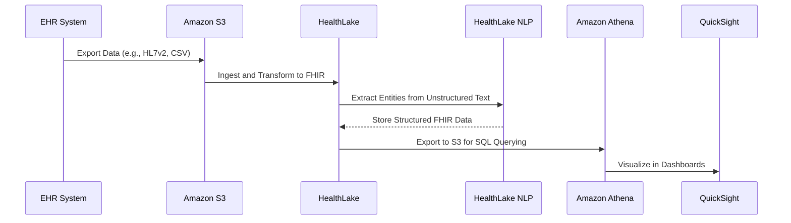

# HealthLake

##  Amazon HealthLake

Amazon HealthLake is a cloud-based health data management system developed by Amazon Web Services (AWS) that enables healthcare organizations to securely store, manage, and analyze large amounts of electronic health records (EHRs), medical imaging, and other types of health data.

<figure><figcaption></figcaption></figure>

### 🌟 **1. Overview & Innovation Spotlight**

**Amazon HealthLake** is a **HIPAA-eligible, fully managed service** designed for healthcare and life sciences organizations to securely store, transform, query, and analyze health data at scale. It uses the **Fast Healthcare Interoperability Resources (FHIR) R4 standard** to unify disparate health data sources (e.g., electronic health records, medical imaging, claims data) into a structured, queryable format. By leveraging machine learning (ML) and natural language processing (NLP), HealthLake extracts meaningful insights from unstructured clinical text, enabling a comprehensive view of patient and population health.

**🛠️ Innovation Spotlight**:

* **Integrated Medical NLP**: Automatically extracts medical entities (e.g., medications, procedures, diagnoses) and their relationships from unstructured text (e.g., clinical notes, lab reports) and maps them to standardized terminologies like ICD-10.
* **Multi-Modal Data Analysis**: Combines clinical, imaging, and genomic data for precision medicine applications, improving predictive accuracy by up to 34% compared to single-domain data.
* **SMART on FHIR Support**: Enables secure, standards-based interoperability with EHR systems and third-party applications for seamless data exchange.

***

### 🔍 **2. Problem Statement & Business Use Cases**

**Real-World Scenario**: A large hospital network struggles with siloed data across multiple EHR systems, legacy formats, and unstructured clinical notes. This delays patient care, hampers population health management, and complicates compliance with regulations like the 21st Century Cures Act. HealthLake solves this by ingesting and standardizing data into FHIR, enabling real-time querying, analytics, and ML-driven insights.

**Industries/Applications**:

* **Hospitals & Health Systems**: Create a unified patient 360 view for care coordination and reduce operational costs.
* **Research Institutions**: Accelerate clinical research by aggregating and analyzing multimodal data (e.g., genomic, clinical, imaging).
* **Payers & Insurers**: Detect fraud, manage risk, and streamline claims processing using normalized data.
* **HealthTech Startups**: Build AI-powered applications (e.g., telemedicine, personalized treatment plans) on a scalable, compliant data foundation.

***

### ⚙️ **3. Core Principles & Key Components**

* **FHIR-Based Data Model**: Supports HL7 FHIR R4 for interoperability, including US Core and CARIN BB profiles for regulatory compliance.
* **Data Ingestion**: Imports data from Amazon S3 or via synchronous APIs, supporting formats like JSON, CSV, and HL7v2 (requires conversion to FHIR).
* **Data Storage**: Indexed, encrypted storage with a chronological timeline of each patient’s medical history.
* **Analytics Integration**: Exports data to Amazon S3 for analysis with Athena (SQL queries), QuickSight (dashboards), or SageMaker (ML models).
* **Security & Compliance**: HIPAA eligibility, GDPR compliance, encryption via AWS KMS, and audit trails using AWS CloudTrail.

***

### 📋 **4. Pre-Requirements**

* **AWS Account** with IAM permissions for HealthLake and related services (e.g., S3, CloudTrail).
* **Data in FHIR R4 Format**: If data is in non-FHIR formats (e.g., HL7v2, CCD), use AWS partners for conversion.
* **Business Associate Addendum (BAA)**: Required for processing protected health information (PHI).

***

### 🛠️ **5. Implementation Steps**

1. **Create a Data Store**:
   * Configure a HealthLake data store in the AWS Console, selecting the FHIR R4 format and region.
2. **Ingest Data**:
   * Bulk import FHIR data from S3 or use CRUD APIs for real-time updates.
3. **Enable NLP Processing**:
   * Use integrated NLP to extract entities from unstructured text (e.g., clinical notes).
4. **Query and Analyze**:
   * Run FHIR-based queries or export to S3 for analysis with Athena/QuickSight.
5. **Monitor and Secure**:
   * Set up CloudWatch alerts and CloudTrail logs for auditing.

***

### 🔄 **6. Data Flow Diagram**

**Diagram : End-to-End HealthLake Workflow**

***

### 🔒 **7. Security Measures**

* **Encryption**: Data encrypted at rest (AWS KMS) and in transit (TLS 1.2+).
* **Access Control**: IAM policies and VPC endpoints for network isolation.
* **Compliance**: HIPAA eligibility, GDPR readiness, and BAA support.
* **Data Governance**: Lake Formation integration for centralized data sharing and governance.

***

### 💡 **8. Innovation Spotlight: HealthLake Imaging & Analytics**

* **HealthLake Imaging (Preview)**: Stores medical images (e.g., DICOM) with sub-second retrieval, reducing storage costs by 40% and enabling AI-based analysis.
* **HealthLake Analytics**: Automatically normalizes multi-modal data (e.g., clinical, genomic) for analysis without complex ETL pipelines.

***

### ⚖️ **9. When to Use and When Not to Use**

| **When to Use**                                                                  | **When NOT to Use**                                                                    |
| -------------------------------------------------------------------------------- | -------------------------------------------------------------------------------------- |
| **Unifying Siloed Health Data**: Integrating EHRs, claims, and imaging data.     | **Non-Healthcare Data**: Generic data analytics (use Amazon Redshift instead).         |
| **Regulatory Compliance**: Meeting 21st Century Cures Act or HIPAA requirements. | **Real-Time Streaming**: For IoT sensor data (use AWS IoT Analytics).                  |
| **AI/ML-Driven Insights**: Building predictive models for population health.     | **Simple Storage**: Basic file storage without FHIR or analytics needs (use S3 alone). |

***

### 💰 **10. Costing Calculation**

* **Pricing Model**:
  * **Data Store**: $0.27/hour (includes 10 GB storage and 3,500 queries/hour).
  * **Additional Storage**: $0.25–$0.37/GB/month (based on tier).
  * **NLP Processing**: $0.0010 per 100 characters of text.
* **Cost Optimization**:
  * Use bulk imports and queries within free limits to minimize costs.
  * Archive historical data to S3 Glacier for long-term storage.
* **Example Calculation**:
  * 1 TB storage + 10M NLP characters + 10,000 extra queries/hour ≈ $654/month.

***

### 🔁 **11. Alternative Services**

| **AWS**                                               | **Azure**                                  | **GCP**                             | **On-Premise**                         |
| ----------------------------------------------------- | ------------------------------------------ | ----------------------------------- | -------------------------------------- |
| **Amazon HealthLake**                                 | **Azure Healthcare APIs**                  | **Google Cloud Healthcare API**     | **FHIR Servers (e.g., HAPI FHIR)**     |
| Deep FHIR integration, NLP, and multi-modal analysis. | Azure ecosystem integration, FHIR support. | Google AI capabilities, FHIR-based. | Open-source, requires self-management. |

***

### ✅ **12. Benefits**

* **Interoperability**: FHIR standard ensures seamless data exchange across systems.
* **Scalability**: Handles petabyte-scale data with automated indexing.
* **AI/ML Readiness**: Pre-built NLP and integration with SageMaker accelerate insights.
* **Cost Savings**: Reduces data engineering effort and infrastructure costs.

***

### 🚀 **13. Innovation Spotlight: Generative AI Integration**

* **HealthScribe**: Generates clinical notes from patient-clinician conversations using speech recognition and generative AI.
* **Cognitive Search**: Tags and indexes clinical evidence for evidence-based medicine using Amazon Kendra.

***

### 📊 **14. Summary**

Amazon HealthLake transforms healthcare data management by providing a secure, scalable, and FHIR-native platform for unlocking insights from disparate health data sources. Key takeaways:

1. **FHIR-Centric**: Standardizes data for interoperability and regulatory compliance.
2. **AI-Powered**: NLP and ML extract insights from unstructured text.
3. **Multi-Modal**: Combines clinical, imaging, and genomic data for precision medicine.
4. **Cost-Effective**: Pay-as-you-go pricing with no upfront costs.
5. **Secure**: HIPAA eligibility and end-to-end encryption.

***

### 🔗 **15. Related Topics & References**

* [**HealthLake Documentation**](https://docs.aws.amazon.com/healthlake/latest/devguide/what-is.html): Detailed guides on FHIR APIs and NLP.
* [**HealthLake Pricing**](https://aws.amazon.com/healthlake/pricing/): Cost models and examples.
* [**HealthLake Imaging**](https://aws.amazon.com/blogs/machine-learning/new-amazon-healthlake-capabilities-enable-next-generation-imaging-solutions-and-precision-health-analytics/): Preview of medical imaging storage.
* [**AWS HealthScribe**](https://aws.amazon.com/health/solutions/health-data-portfolio/): Clinical note generation with generative AI.

For hands-on learning, explore the [**AWS HealthLake Console**](https://console.aws.amazon.com/healthlake/) or review customer case studies from [**CHOP**](https://aws.amazon.com/healthlake/customers/) and [**Cortica**](https://www.peerbits.com/blog/aws-healthlake-explained-use-cases.html).

