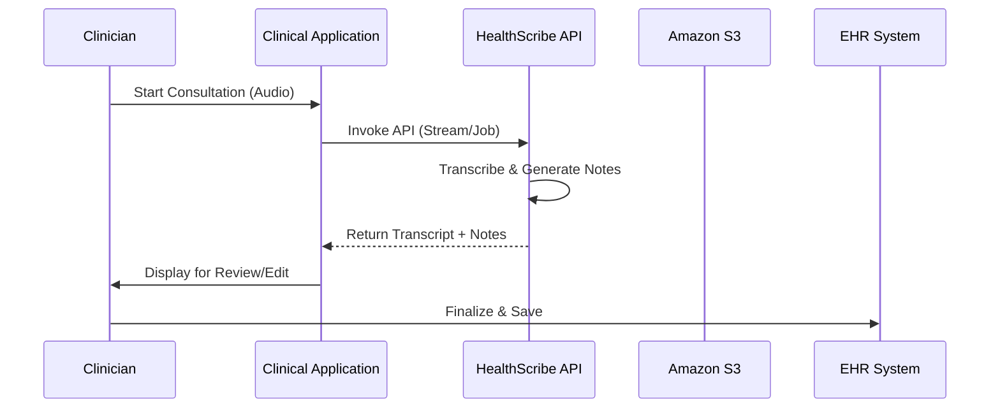

# HealthScribe

##  Amazon HealthScribe

Amazon HealthScribe is a cloud-based EHR (Electronic Health Record) system that enables healthcare providers to manage patient data in a secure and efficient manner.

<figure><figcaption></figcaption></figure>

### 🌟 **1. Overview & Innovation Spotlight**

**Amazon HealthScribe** is a **HIPAA-eligible, generative AI-powered service** designed to transform healthcare documentation by automatically generating preliminary clinical notes from patient-clinician conversations. It combines **speech recognition** and **generative AI** (powered by Amazon Bedrock) to transcribe dialogues, identify speaker roles, extract medical terms, and create structured summaries—all through a single API. This eliminates the need for healthcare software vendors to integrate and manage multiple AI services, accelerating development while ensuring compliance and security.

**🛠️ Innovation Spotlight**:

* **Evidence Mapping**: Every sentence in AI-generated notes includes references to the original transcript, enabling clinicians to verify accuracy swiftly and fostering trust in AI-assisted documentation.
* **Specialized Templates**: Supports **GIRPP (Goal, Intervention, Response, Progress, Plan)** for behavioral health, streamlining documentation for mental health consultations.
* **Real-Time & Batch Processing**: Offers both streaming (real-time) and asynchronous (batch) processing, catering to diverse clinical workflows.

***

### 🔍 **2. Problem Statement & Business Use Cases**

**Real-World Scenario**: Clinicians spend significant time on administrative tasks—up to **50% of their workday**—documenting patient encounters. Manual note-taking is prone to errors, reduces patient interaction time, and contributes to burnout. HealthScribe automates this process, generating accurate drafts in seconds, which clinicians can review and finalize, reclaiming hours for patient care.

**Industries/Applications**:

* **Hospitals & Clinics**: Reduce documentation burden for physicians across **22+ specialties**, including cardiology, orthopedics, and psychiatry.
* **Telehealth Platforms**: Enhance virtual consultations with real-time transcription and note generation.
* **Behavioral Health**: Automate GIRPP-based documentation for therapy sessions, improving efficiency in mental health care.
* **Medical Scribe Services**: Boost scribe productivity by providing AI-generated drafts for refinement.

***

### ⚙️ **3. Core Principles & Key Components**

* **Speech Recognition**: Converts audio into text with high accuracy, even handling medical terminology and multi-speaker dialogues.
* **Generative AI Summarization**: Creates structured clinical notes for sections like:
  * **Chief Complaint**
  * **History of Present Illness (HPI)**
  * **Assessment & Plan**
  * **Treatment Plan**.
* **Speaker Diarization**: Identifies roles (clinician vs. patient) and segments dialogue into categories (e.g., subjective, objective, small talk).
* **Medical Entity Extraction**: Detects medications, conditions, and treatments, enabling auto-suggestions in clinical applications.

***

### 📋 **4. Pre-Requirements**

* **AWS Account**: With IAM permissions for HealthScribe and related services (e.g., S3 for storage).
* **Audio Specifications**:
  * **Format**: Lossless (e.g., WAV, FLAC)
  * **Encoding**: PCM 16-bit
  * **Sample Rate**: ≥16 kHz.
* **Business Associate Agreement (BAA)**: Required for HIPAA compliance.

***

### 🛠️ **5. Implementation Steps**

1. **Upload Audio**: Store consultation recordings in an S3 bucket (for batch processing) or stream directly via API.
2. **API Call**: Invoke `StartMedicalScribeJob` (async) or `StartMedicalScribeStream` (real-time) with parameters like specialty (e.g., `Orthopedics`) and note template (e.g., `GIRPP`).
3. **Process Output**: Retrieve:
   * **Transcript File**: Turn-by-turn dialogue with timestamps and speaker labels.
   * **Clinical Documentation**: Summarized notes with evidence links.
4. **Integrate into Workflow**: Embed outputs into EHR systems or clinical applications for review and finalization.

***

### 🔄 **6. Data Flow Diagram**

**Diagram : End-to-End HealthScribe Workflow**

***

### 🔒 **7. Security Measures**

* **HIPAA Compliance**: Fully eligible with BAA support; data encrypted in transit (TLS) and at rest (AWS KMS).
* **Data Privacy**: No audio or output text retained by AWS; customers control storage location.
* **Access Control**: IAM policies restrict API access, and customer-managed keys add encryption layers.

***

### 💡 **8. Innovation Spotlight: Evidence Mapping & GIRPP Templates**

* **Evidence Mapping**: Links each AI-generated sentence to its source in the transcript, allowing clinicians to quickly validate accuracy—a critical feature for responsible AI adoption in healthcare.
* **Behavioral Health Support**: The GIRPP template automates goal-oriented documentation for mental health, reducing manual effort by hours per day.

***

### ⚖️ **9. When to Use and When Not to Use**

| **When to Use**                                                                   | **When NOT to Use**                                                             |
| --------------------------------------------------------------------------------- | ------------------------------------------------------------------------------- |
| **Clinical Documentation**: Automating note-drafting for 22+ medical specialties. | **Non-English Conversations**: Currently supports only US English.              |
| **Real-Time Telehealth**: Streaming audio for live transcription and summaries.   | **Non-Verbal Observations**: Cannot capture visual cues (e.g., physical exams). |
| **Behavioral Health**: GIRPP-based notes for therapy sessions.                    | **High-Noise Environments**: Poor audio quality reduces accuracy.               |

***

### 💰 **10. Costing Calculation**

* **Pricing Model**: **Pay-per-use** with no upfront costs. Costs apply per minute of processed audio.
* **Cost Optimization**:
  * Use batch processing for pre-recorded consultations.
  * Ensure high-quality audio to minimize re-processing needs.
* **Example Calculation**:
  * Processing **100 hours/month** of audio at an estimated rate of **$0.10/minute** would cost \~$600/month.

***

### 🔁 **11. Alternative Services**

| **AWS**                                                  | **Azure**                                                      | **GCP**                                                | **On-Premise**                                   |
| -------------------------------------------------------- | -------------------------------------------------------------- | ------------------------------------------------------ | ------------------------------------------------ |
| **Amazon HealthScribe**                                  | **Azure Cognitive Services Speech**                            | **Google Cloud Healthcare API**                        | **Nuance Dragon Ambient EX**                     |
| Integrated generative AI, evidence mapping, HIPAA-ready. | Speech-to-text but lacks specialized clinical note generation. | FHIR-based data handling but no dedicated scribe tool. | Popular ambient AI but vendor-locked and costly. |

***

### ✅ **12. Benefits**

* **Time Savings**: Reduces documentation time by **50–70%**, allowing clinicians to focus on patients.
* **Accuracy**: Citations for every generated sentence enable quick validation.
* **Scalability**: Processes thousands of consultations daily without infrastructure management.
* **Compliance**: HIPAA eligibility and robust encryption meet healthcare security standards.

***

### 🚨 **13. Limitations & Considerations**

* **Audio Quality Dependent**: Background noise or unclear speech can reduce accuracy.
* **Human Review Essential**: AI-generated notes are preliminary and must be reviewed by clinicians.
* **Regional Availability**: Currently only available in **US East (N. Virginia)**.

***

### 📊 **14. Summary**

Amazon HealthScribe revolutionizes clinical documentation by leveraging generative AI to turn conversations into structured notes. Key takeaways:

1. **Single API Solution**: Combines transcription, summarization, and medical term extraction.
2. **Evidence-Based Design**: Traceable references build trust and ensure accuracy.
3. **Specialized Templates**: GIRPP support for behavioral health enhances versatility.
4. **HIPAA-Compliant**: Secure and eligible for protected health data.
5. **Real-World Impact**: Saves hours daily for clinicians, reducing burnout.

***

### 🔗 **15. Related Topics & References**

* [**HealthScribe Developer Guide**](https://docs.aws.amazon.com/transcribe/latest/dg/health-scribe.html): API details and code examples.
* [**GIRPP Template Announcement**](https://aws.amazon.com/es/about-aws/whats-new/2025/02/aws-healthscribe-girpp-note-template-behavioral-health/): Behavioral health documentation.
* [**HIPAA Compliance**](https://www.paubox.com/blog/is-aws-healthscribe-hipaa-compliant-2025-update): BAA and security details.

For hands-on learning, access HealthScribe via the [**AWS Console**](https://console.aws.amazon.com/transcribe/) or explore the [**demo**](https://aws.amazon.com/healthscribe/).
