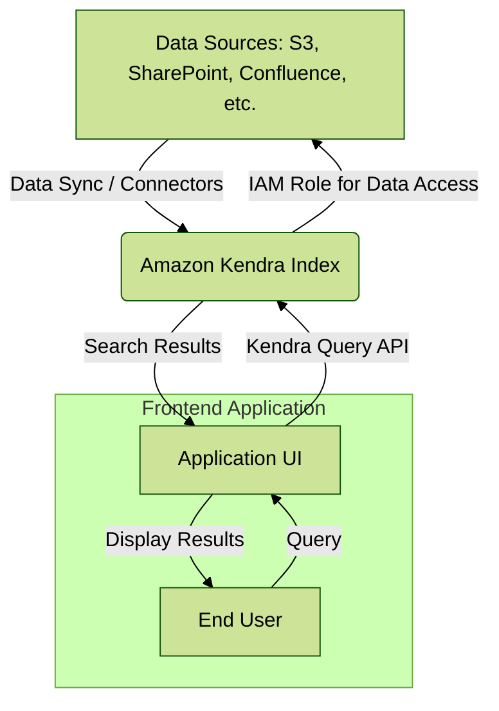
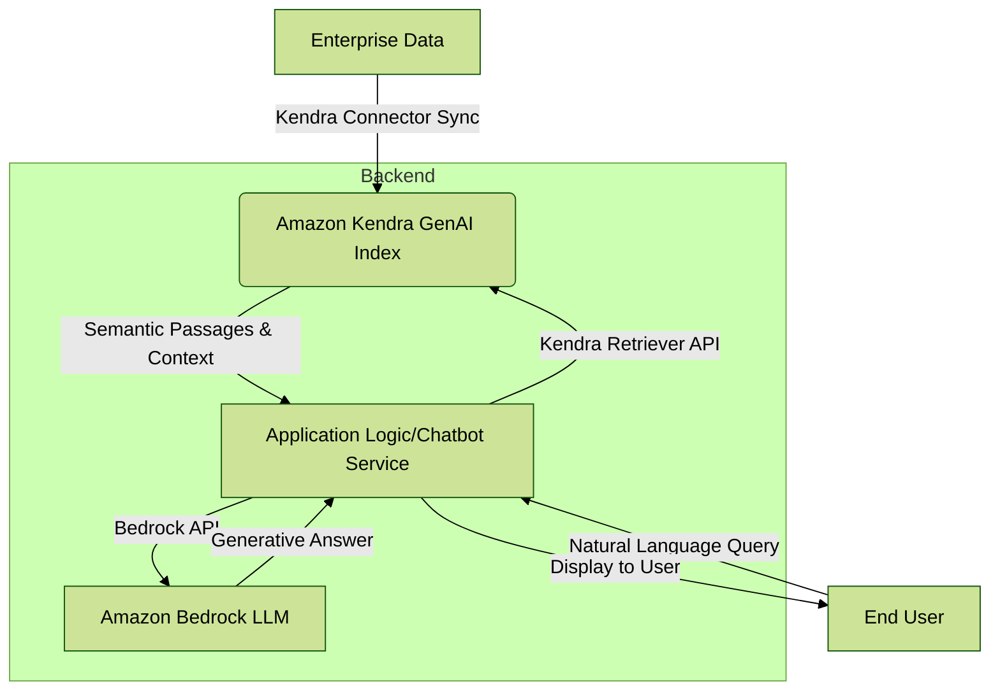
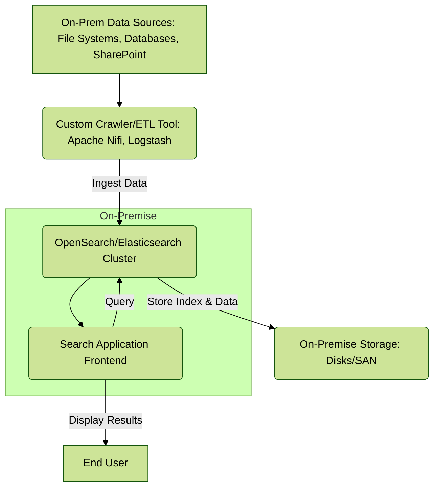

# Kendra

## Overview

<table data-header-hidden><thead><tr><th width="237.199951171875"></th><th></th></tr></thead><tbody><tr><td>
<figure><figcaption></figcaption></figure>
</td><td>Amazon Kendra 🛠️ is a highly accurate and easy-to-use enterprise search service powered by machine learning. It's designed to help organizations of all sizes find information scattered across a variety of disparate data sources within their company. Unlike traditional keyword-based search, Kendra uses natural language processing (NLP) to understand the meaning and context of user queries, providing precise answers and relevant documents. This significantly improves employee and customer productivity by reducing the time spent searching for information.</td></tr></tbody></table>


Innovation Spotlight: A key innovation of Amazon Kendra is its Intelligent Ranking and Generative AI Index. This allows Kendra to not only find relevant documents but also to provide specific, extracted answers and passages from those documents. Furthermore, the Generative AI Index is specifically optimized for Retrieval Augmented Generation (RAG) workflows, enabling developers to build sophisticated generative AI applications, such as chatbots and Q\&A assistants, on top of their enterprise data. It intelligently chunks documents and retrieves the most semantically relevant passages, which are then passed to a Large Language Model (LLM) like those in Amazon Bedrock, to generate accurate and contextual responses.


## Problem Statement & Business Use Cases

In many organizations, critical information is siloed across multiple systems: documents in SharePoint, knowledge base articles in Confluence, sales data in Salesforce, and technical specifications in S3. This leads to a common problem: employees and customers waste significant time searching for information, leading to decreased productivity, poor customer experience, and increased operational costs.

### Real-world Scenario:

An IT support team at a large multinational corporation receives thousands of requests daily. A common request is "How do I reset my MFA token?" The answer could be buried in a confluence page, an internal knowledge base, or a PDF document in an S3 bucket. A traditional search might return a list of links, but Amazon Kendra can directly provide the step-by-step instructions from the relevant document, saving the support agent valuable time.

### Industries/Applications:

* Customer Service: Integrating Kendra into a customer support portal or chatbot to enable self-service, reducing the volume of support tickets.
* Human Resources: Building an intelligent search for employees to find answers to common questions about benefits, policies, and payroll information.
* Legal & Compliance: Allowing legal teams to quickly search and retrieve relevant clauses from contracts, legal documents, and regulatory filings to ensure compliance.
* Research & Development: Helping scientists and engineers access technical papers, previous project documents, and research data to accelerate innovation.
* Healthcare: Enabling medical staff to quickly search patient records and medical knowledge bases for critical information.

### Core Principles

* Intelligent Search: Uses deep learning to understand natural language queries, enabling users to ask questions like "What is the deadline for filing my health savings account form?" instead of just searching for "HSA form".
* Relevance Tuning: Allows administrators to boost the relevance of certain documents or data sources based on business importance, such as prioritizing the latest version of a company policy.
* Document and Field Boosting: You can manually or programmatically adjust the relevance of documents and even specific fields within documents to influence search results.
* Connectors: Kendra comes with a wide range of built-in data source connectors to seamlessly ingest content from popular repositories like Amazon S3, SharePoint, Salesforce, Confluence, and many more. It also supports a custom data source connector for integrating with any other data source.
* Security & Access Control: Kendra respects existing document-level security. When a user queries, it only returns results for which that user has permission to view, integrating with IAM, Active Directory, and other identity providers.

#### Core Services & Terms:

* Index: The central component of Amazon Kendra. It's a repository that holds all the documents and their metadata after they have been processed and ingested.
* Data Source: The location of your documents (e.g., S3 bucket, SharePoint site). You configure a connector to a data source to automatically sync content with your index.
* Connectors: Managed components that connect to various document repositories (e.g., S3 Connector, SharePoint Connector, Salesforce Connector). They handle the crawling and ingestion of data into the Kendra index.
* Queries: The requests from users. These can be natural language questions or keywords.
* FAQs (Frequently Asked Questions): A specialized feature that allows you to provide a list of curated questions and answers, which Kendra can match and return as a precise response.
* Semantic Search: An advanced search technique that understands the meaning behind the query, not just the keywords.
* Generative AI Index: A newer, specialized index type within Kendra optimized for building RAG applications. It automatically creates optimized document chunks and handles the semantic retrieval for an LLM.

#### Pre-Requirements

* An active AWS Account.
* AWS Identity and Access Management (IAM) roles with appropriate permissions to create and manage Amazon Kendra indexes, and to access the data sources (e.g., an IAM role for the Kendra connector to read from an S3 bucket or connect to SharePoint).
* Data Sources: Your enterprise data, structured or unstructured, must be available in a supported repository.
* IAM Identity Center (optional but recommended): For integrating with user identity and access control for document-level security.

### Implementation Steps

1. Create an Amazon Kendra Index:
   * Navigate to the Amazon Kendra console.
   * Choose "Create an Index" and provide a name and description.
   * Select the edition (Developer or Enterprise) based on your needs. For RAG and production workloads, Enterprise Edition is recommended. The Generative AI Edition is the latest for RAG workloads.
   * Define an IAM role for Kendra to manage the service.
2. Configure Data Sources:
   * Once the index is created, go to the "Data sources" tab.
   * Choose "Add data source" and select the connector for your repository (e.g., "Amazon S3").
   * Provide the required connection details (e.g., S3 bucket name) and the IAM role that grants Kendra read access to the data.
   * Schedule a sync frequency (e.g., daily, hourly) to keep your index up-to-date with new or modified documents.
3. Ingest Content:
   * After configuring the data source, manually trigger a "Sync now" to perform the initial ingestion of your documents into the index. Kendra will automatically crawl and index the content.
4. Create a Search Application (Optional but recommended):
   * You can use the Kendra console's built-in search experience to test queries.
   * For a production application, use the Kendra API or SDKs to build a custom search interface.
   * Integrate with an existing application or a new front-end (e.g., a React or Vue application) to allow users to query the index.
5. Refine and Optimize:
   * Monitor search queries and user feedback.
   * Use the Kendra console to configure synonyms and relevance boosting rules to improve search results.

### Data Flow Diagram

Diagram 1: Standard Amazon Kendra Data Flow

Code snippet

Diagram 2: Amazon Kendra with a Generative AI RAG Workflow

Code snippet

7\. Security Measures

* Principle of Least Privilege: Grant Kendra and its associated IAM roles only the minimum required permissions to access the data sources.
* Encryption: Kendra encrypts your data at rest by default using AWS KMS.43 Ensure that your data sources (e.g., S3 buckets) are also encrypted.44 Data in transit is secured with TLS.
* VPC Isolation: Use VPC endpoints to create a private connection between your VPC and Kendra, ensuring that data does not traverse the public internet.45
* Access Control: Configure user access filtering at the document level.46 Kendra can integrate with your existing identity provider (IAM Identity Center, Active Directory, etc.) to ensure that users only see results for documents they are authorized to view.47
* Monitoring and Logging: Use AWS CloudTrail to log API calls to Amazon Kendra for auditing purposes, and Amazon CloudWatch to monitor index health and performance.48

#### Advanced Feature: Kendra Intelligent Ranking

Amazon Kendra's Intelligent Ranking feature is a sophisticated machine learning model that automatically re-ranks search results based on the semantic similarity to the user's query and other signals.49 It's a key differentiator from traditional keyword search. This model is continuously improved based on user feedback and interactions, making the search results more accurate over time without any manual intervention or model training from your end.50

#### When to use and when not to use

When to use Amazon Kendra:

* When you need to provide a natural language search experience over a wide range of disparate, unstructured and semi-structured enterprise data.51
* When you want to build a self-service portal, internal knowledge base, or a customer support bot.
* When you need to reduce the time employees or customers spend searching for information.52
* When you have data across multiple silos and want to create a unified search experience.53

When not to use Amazon Kendra:

* For simple keyword-based search on a single, well-structured data source (e.g., a relational database) where a traditional search engine would suffice.
* When your data volume is very small and a simpler solution (like a basic search API on a single S3 bucket) is sufficient.
* For applications requiring a high degree of custom indexing or advanced analytics on the search data, where a more customizable solution like OpenSearch might be a better fit.

### Costing Calculation

Amazon Kendra pricing is based on a few key factors:

* Index Edition: Different hourly rates for Developer, Enterprise, and Generative AI editions.
* Query Units (QUs): Price per hour for query capacity. A single query unit typically supports a certain number of queries per second (QPS).
* Storage Units (SUs): Price per hour for document storage capacity in your index.
* Connector Syncing: Cost per hour for running data source syncs and a price per million documents scanned.

Sample Calculation (Approximate, based on Enterprise Edition):

* Base Cost (Enterprise Edition): `$$1.40/hour` for 100,000 documents (30GB extracted text) and 0.1 QPS.55
* Monthly Base Cost: `$$1.40 * 24 hours * 30 days = $$1,008`
* Additional Storage: If you need to store more, you add a Storage Unit. For example, a single SU for Enterprise Edition costs `$$0.70/hour`, providing an additional 100,000 documents of capacity.56
* Additional Queries: If you need more query capacity, you add a Query Unit. For example, a single QU for Enterprise Edition costs `$$0.70/hour`, adding 0.1 QPS.
* Connector Cost: `$$0.35/hour` while syncing. Let's say a sync job runs for 5 hours per day. `$$0.35 * 5 hours * 30 days = $$52.50`. Plus a cost per scanned document.

Efficient Cost Management:

* Use the right edition: Start with the Developer Edition for proofs-of-concept.58 Upgrade to Enterprise when you have a production-ready application.
* Optimize Syncing: Schedule data source syncs during off-peak hours and only as frequently as needed to manage connector costs.
* Monitor Usage: Use Amazon CloudWatch to monitor your query and storage usage to right-size your Kendra capacity and avoid over-provisioning.
* Review your data sources: Ensure you're only indexing what is necessary and relevant to the search application.

### Alternative Services

| Feature         | AWS                                                                          | Azure                                                                        | GCP                                                            | On-Premise                                                                                 |
| --------------- | ---------------------------------------------------------------------------- | ---------------------------------------------------------------------------- | -------------------------------------------------------------- | ------------------------------------------------------------------------------------------ |
| Service Name    | Amazon Kendra                                                                | Azure AI Search (formerly Cognitive Search)                                  | Google Cloud Search                                            | OpenSearch (or Elasticsearch) with custom setup                                            |
| Core Function   | Intelligent search with NLP & Generative AI RAG support. Managed connectors. | Enterprise search as a service with AI capabilities.                         | Enterprise search for Google Workspace and third-party data.   | Open-source, highly customizable search and analytics engine.                              |
| Ease of Use     | Very high. Fully managed, minimal ML expertise required.                     | High. Managed service with built-in AI.                                      | High. Deeply integrated with Google ecosystem.                 | Low to Medium. Requires significant setup, maintenance, and expertise.                     |
| NLP & AI        | Deep learning for semantic search, intelligent ranking, Q\&A extraction.     | AI-powered features for text analytics, image analysis, and semantic search. | Natural language understanding and AI-driven relevance.        | Requires custom implementation with ML libraries and models.                               |
| Data Connectors | Extensive built-in connectors (S3, SharePoint, Salesforce, etc.).            | Connectors for Azure services, SharePoint, Blob Storage.                     | Connectors for Google Workspace, SharePoint, and a custom API. | Requires building and managing custom crawlers or ETL pipelines.                           |
| Cost Model      | Hourly rate for index, query, storage capacity, and connector usage.         | Based on tiered pricing for capacity (queries/operations) and storage.       | Per-user licensing or API-based pricing.                       | Upfront hardware/software costs, plus ongoing maintenance and management.                  |
| Best For        | Enterprise-wide intelligent search for diverse data silos. RAG applications. | Integrating AI search into existing applications and data on Azure.          | Organizations heavily invested in Google Workspace.            | Highly custom search solutions, large data analytics, or specific on-premise requirements. |

#### On-Premise Data Flow Diagram (OpenSearch/Elasticsearch):

Code snippet

### Benefits

* Increased Productivity: Employees find information faster, reducing the time spent searching and allowing them to focus on more strategic tasks.
* Improved Customer Experience: Customers can get quick, accurate answers from self-service portals, improving satisfaction and reducing the load on support teams.59
* Cost Savings: Reduces the need for manual support and information retrieval, and is a fully managed service, eliminating the need for infrastructure management.60
* Enhanced Accuracy: Natural language processing and machine learning deliver more relevant and precise results than traditional search methods.61
* Scalability: A fully managed service that automatically scales to handle increasing data volumes and query loads without manual intervention.62

### Innovative Application: Customer Service Generative AI Assistant

An innovative use of Amazon Kendra is to combine it with a generative AI service like Amazon Bedrock to create a dynamic, conversational customer service assistant.63 The assistant first receives a user's query.64 It then uses Kendra's Generative AI Index to perform a RAG search across the company's knowledge base. Kendra retrieves the most relevant passages and context, which are then passed to a foundation model in Bedrock.65 The LLM then synthesizes this information to create a human-like, accurate, and concise answer for the customer. This approach ensures the AI assistant provides factually grounded responses, a key challenge with many LLM applications, by leveraging the company's verified and up-to-date internal documents.

### Summary

Amazon Kendra is a powerful, fully managed intelligent search service that transforms how organizations find and retrieve information from disparate data sources.66 By leveraging machine learning and natural language processing, it provides a superior search experience that goes beyond simple keyword matching, delivering precise answers and relevant document passages.67 This makes it an ideal solution for improving employee and customer productivity and building sophisticated generative AI applications.

#### Top 10 things to keep in mind about Amazon Kendra:

1. It's more than a search engine: Kendra is an "intelligent search" service that understands context and meaning.
2. Fully Managed Service: You don't need to manage any servers or machine learning models.
3. Data Source Connectors are key: Use the built-in connectors to easily ingest data from various repositories.
4. Generative AI Index for RAG: Use this specific index type for building factually grounded AI assistants.
5. Cost can scale: Be mindful of the hourly costs for index capacity (storage and queries) and connector usage.
6. Security is paramount: Utilize document-level access control to ensure users only see what they are permitted to.
7. Performance Tuning is simple: Use relevance tuning and synonyms to quickly improve search results.
8. Natural Language is its strength: Encourage users to ask full questions, not just keywords.
9. Monitor with CloudWatch: Keep an eye on your usage and index health to optimize costs and performance.
10. Start small, scale big: Begin with the Developer Edition for testing, and transition to Enterprise for production-level workloads.

#### Related Topics & Resources

* AWS Documentation for Amazon Kendra: [https://aws.amazon.com/kendra/documentation/](https://www.google.com/search?q=https://aws.amazon.com/kendra/documentation/)
* AWS Blogs on Amazon Kendra and Generative AI: [https://aws.amazon.com/blogs/aws/](https://aws.amazon.com/blogs/aws/) (Search for "Kendra")
* AWS re:Invent Sessions on Intelligent Search: Explore past re:Invent talks on YouTube for deep dives and new features.
* AWS Well-Architected Framework - AI/ML Lens: Provides guidance on building secure, reliable, and cost-effective ML workloads.
