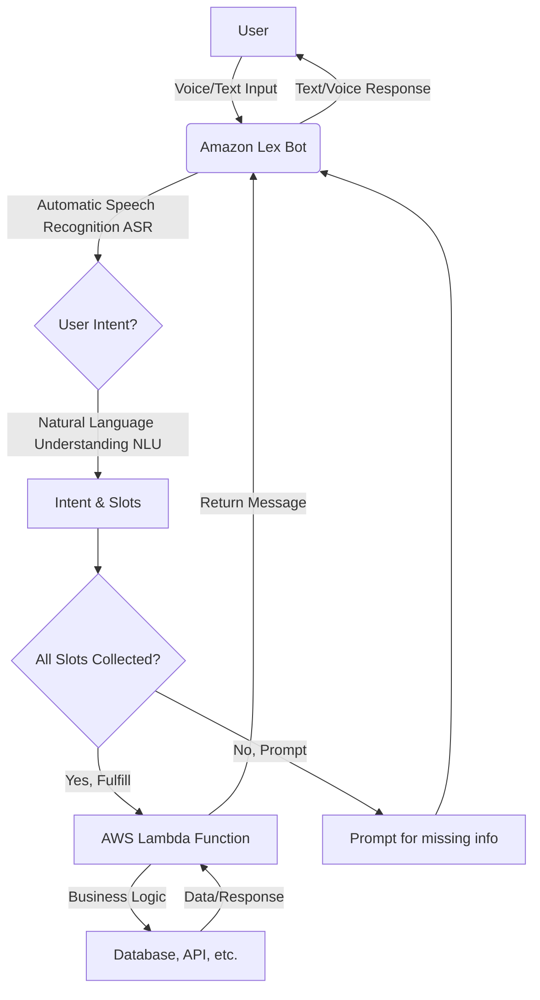
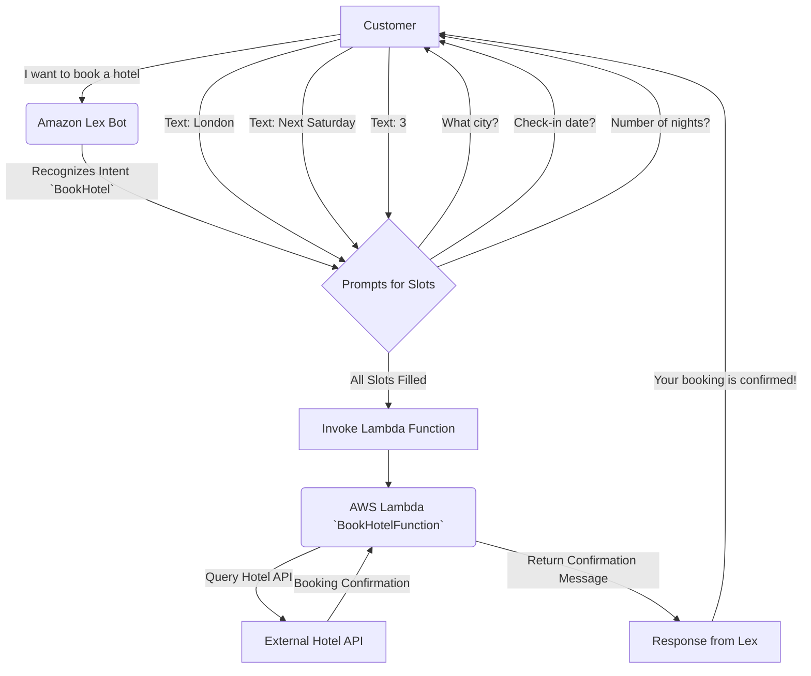
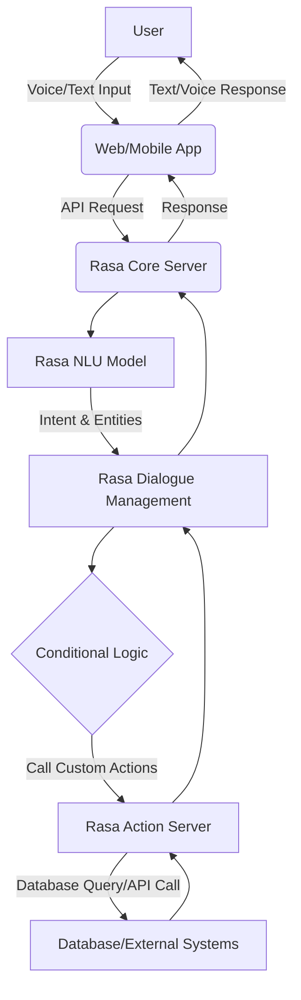

# Lex

## 🤖 AWS - Amazon Lex

***

### 🔍 Overview

Amazon Lex is a fully managed service for building conversational interfaces for any application using voice and text. It provides the advanced deep learning functionalities of automatic speech recognition (ASR) to convert speech to text and natural language understanding (NLU) to recognize the intent of the text, enabling you to build applications with highly engaging, lifelike conversational interactions. The same technology that powers Amazon Alexa is available to any developer, democratizing deep learning technologies.

<figure><figcaption></figcaption></figure>

> #### 🤖 Innovation Spotlight: Generative AI-powered Conversational Design

> A recent innovation in Amazon Lex is the integration of generative AI to simplify and accelerate bot design. The **Automated Chatbot Designer** can analyze existing conversation transcripts (e.g., from a contact center) and automatically propose an initial bot design, complete with intents and slot types. This feature dramatically reduces the time and effort required to build a sophisticated chatbot from scratch. For example, a company can upload a year's worth of customer service chat logs. The Automated Chatbot Designer will analyze the transcripts and automatically identify common user requests (e.g., "track my order," "change my address") and the necessary information to fulfill them (e.g., order ID, new street address). This allows for a fast and data-driven approach to creating a bot that addresses real customer needs.

***

### ⚡ Problem Statement&#x20;

Many businesses face a significant challenge in providing scalable and efficient customer support. Call centers are often overwhelmed with a high volume of repetitive queries, leading to long wait times and increased operational costs. Similarly, websites and mobile apps may lack intuitive ways for users to get quick answers or complete simple tasks, resulting in poor user experience and higher abandonment rates.

### 🤝Business Use Cases

**Example Scenario: A Retail E-commerce Company** An online retailer wants to improve its customer service and reduce the load on its human agents. They receive a large number of calls and chats about order status, returns, and product information. A solution is needed to automate these common interactions, allowing human agents to focus on more complex issues.

**Industries/Applications:**

* 📞 **Contact Centers:** Automating tasks like checking order status, appointment scheduling, and password resets. Amazon Lex can be integrated with Amazon Connect to create an intelligent interactive voice response (IVR) system.
* 🛍️ **E-commerce:** Building chatbots to assist with product discovery, order tracking, and returns.
* 🏥 **Healthcare:** Creating virtual assistants for scheduling appointments, providing lab results, or answering frequently asked questions about a clinic.
* 🏦 **Financial Services:** Developing conversational bots for checking account balances, transferring funds, and providing basic financial advice.
* ⚙️ **Enterprise Productivity:** Building internal bots for IT help desks, HR support, or managing employee requests.

***

### 🔥 Core Principles

Amazon Lex operates on a few key principles and components:

* **Automatic Speech Recognition (ASR):** Converts spoken language into text. This is what allows the bot to understand voice commands.
* **Natural Language Understanding (NLU):** The core of the service. It interprets the text to determine the user's _intent_ and extract relevant _slot_ data.
* **Intent:** Represents an action that the user wants to perform, such as "OrderFlowers" or "BookHotel." You define the purpose of the user's request.
* **Utterances:** Sample phrases that a user might say to trigger a specific intent. For the "OrderFlowers" intent, sample utterances might be "I want to order flowers" or "Can I get some flowers delivered?"
* **Slot:** A piece of data that the bot needs to fulfill an intent. For the "BookHotel" intent, slots might include `Location`, `CheckInDate`, and `NumberOfNights`. Lex will automatically prompt the user to provide this information if it's missing.
* **Prompts:** The messages or questions the bot uses to gather information from the user (e.g., "What city do you want to book a hotel in?").
* **Fulfillment:** The business logic that executes the action after all required slots are gathered. This is typically handled by an AWS Lambda function.

***

### 📋 Pre-Requirements

To implement a solution with Amazon Lex, you will need:

* **AWS Account:** A valid AWS account with administrative access or an IAM user with the necessary permissions.
* **IAM Role:** An IAM role for Amazon Lex with permissions to access other services like AWS Lambda, Amazon CloudWatch, and Amazon S3.
* **AWS Lambda Function:** A Lambda function is essential to perform the backend business logic (e.g., calling an external API, querying a database) after Lex collects all the user's information.
* **Amazon S3 Bucket:** For storing conversation logs, and in some cases, for providing transcripts for the Automated Chatbot Designer.
* **Amazon CloudWatch:** For monitoring bot performance and logging conversations.

***

### 👣 Implementation Steps

Here is a step-by-step guide to building a simple hotel booking bot:

1. **Set up the Lambda Function:**
   * Navigate to the AWS Lambda console.
   * Create a new function (e.g., `BookHotelFunction`).
   * Select a runtime (Python is a common choice).
   * Write the code for the hotel booking logic. This code will receive the slot values (`location`, `checkInDate`, `numberOfNights`) from Lex and process the booking.
   * Configure the function to have an IAM role that allows it to log to CloudWatch.
2. **Create the Amazon Lex Bot:**
   * Go to the Amazon Lex console and choose "Create bot."
   * Select a language and give your bot a name (e.g., `HotelBookingBot`).
   * Choose the permissions: You can let Lex create a basic IAM role for you.
   * Add a new **Intent** (e.g., `BookHotel`).
   * Define a few **Sample Utterances** for this intent, such as:
     * "I want to book a hotel"
     * "Book a hotel for me"
     * "Find me a hotel room"
   * Add **Slots** for the required information:
     * `Location` (use `AMAZON.City` built-in slot type)
     * `CheckInDate` (use `AMAZON.Date`)
     * `NumberOfNights` (use `AMAZON.Number`)
   * For each slot, define a **Prompt** (e.g., "What city do you want to book in?").
   * In the **Fulfillment** section, select "Use a Lambda function" and choose the `BookHotelFunction` you created earlier.
3. **Build and Test the Bot:**
   * After configuring the intent, click "Build" to train the bot's language model.
   * Use the built-in test panel on the right side of the console to simulate a conversation and see how the bot interacts.
   * For example, type "I need to book a hotel." The bot should respond with "What city do you want to book in?".
4. **Publish and Deploy:**
   * Once you are satisfied with the bot's performance, create a version and an alias (e.g., `PROD`).
   * Use the SDKs or integrations to deploy your bot on a platform like a website, mobile app, Facebook Messenger, or Slack.

***

### 🗺️ Data Flow Diagram

**Diagram 1: Simple Bot Interaction Flow**

**Diagram 2: Hotel Booking Use Case**

***

### 🔒 Security Measures

* **Encryption at Rest and in Transit:** Amazon Lex automatically encrypts data at rest using AWS KMS. All communication is secured via TLS.
* **Least Privilege IAM Roles:** The IAM role for Amazon Lex and the Lambda function should only have the minimum required permissions. For example, the Lambda function should only be able to access the specific database or API it needs.
* **VPC Endpoints (AWS PrivateLink):** If your Lambda function needs to access a private resource within a VPC, use VPC endpoints to keep the traffic within the AWS network, improving security.
* **Conversation Logs:** When enabling conversation logs, be mindful of sensitive information. Lex allows you to obscure or redact certain slot values (like credit card numbers or Social Security numbers) from the logs stored in S3.
* **Integration with AWS KMS:** For sensitive data, use AWS KMS to manage encryption keys and ensure that only authorized services and users can decrypt the data.

***

### ⚖️ When to use and when not to use

**✅ When to Use:**

* **Automated Customer Support:** When you have a high volume of repetitive customer inquiries that can be handled by a bot.
* **Task Automation:** For tasks that require collecting specific information from the user to complete an action, like booking, ordering, or scheduling.
* **Voice-enabled Applications:** When you want to add voice interaction to a mobile app, website, or IoT device.
* **High Scalability Needs:** For applications that need to handle a large number of concurrent users without managing the underlying infrastructure.

**❌ When Not to Use:**

* **Complex, Unstructured Conversations:** For open-ended, human-like conversations that require deep, creative reasoning and do not have a defined set of intents. For these use cases, a Generative AI service like Amazon Bedrock might be more suitable.
* **Simple FAQ Bots:** For basic question-and-answer bots that don't need to perform actions or collect multiple pieces of information. A simpler solution like a static website or a basic Q\&A service might be more cost-effective.
* **Low-Volume/Infrequent Use:** For applications with very few users, the effort of setting up and maintaining a Lex bot might not be worth the investment compared to a simple, manual process.

***

### 💰 Costing Calculation

Amazon Lex has a pay-as-you-go pricing model with no upfront fees or minimum commitments.

* **How it is Calculated:**
  * **API Requests:** You are charged per API request. There are different rates for voice and text requests.
  * **Voice Requests:** Billed per 15-second speech interval.
  * **Text Requests:** Billed per request.
  * **Automated Chatbot Designer:** Billed per minute of training time.
* **Efficient way of handling this service:**
  * **Optimize Intents and Slots:** A well-designed bot will require fewer conversational turns and prompts, reducing the number of API calls per conversation.
  * **Use the Right Request Type:** For simple, one-off interactions, use request-response API calls. For multi-turn, interactive conversations, streaming can be more cost-efficient.
  * **Utilize the Free Tier:** The free tier offers a generous allowance (10,000 text requests and 5,000 speech requests per month for the first year), which is great for development and testing.
* **Sample Calculations (based on typical rates):**
  * **Scenario:** A bot handles 50,000 text requests and 10,000 voice requests in a month.
  * **Text Cost:** $0.00075 per text request.
    * 50,000 requests \* $0.00075 = **$37.50**
  * **Voice Cost (Request/Response):** $0.004 per speech request.
    * 10,000 requests \* $0.004 = **$40.00**
  * **Total Monthly Cost:** **$77.50**

***

### ⛕ Alternative services in AWS/Azure/GCP/On-Premise

| Service                                               | Vendor       | Key Comparison/Difference                                                                                                                                                                                  |
| ----------------------------------------------------- | ------------ | ---------------------------------------------------------------------------------------------------------------------------------------------------------------------------------------------------------- |
| **Amazon Lex**                                        | AWS          | Deep integration with the AWS ecosystem (Lambda, S3, Connect). The same tech as Amazon Alexa. Strong ASR and NLU capabilities.                                                                             |
| **Dialogflow**                                        | GCP          | Broad language support and pre-built agents for common use cases. Simpler to get started for many developers. Excellent integration with Google services.                                                  |
| **Azure Bot Service & Language Understanding (LUIS)** | Azure        | Seamless integration with Azure services like Azure Functions and Cognitive Services. Strong enterprise-level security features and compliance.                                                            |
| **On-Premise (e.g., Rasa, IBM Watson Assistant)**     | Self-Managed | Offers full control over the data and models. Can be more cost-effective at very high scale if you have the expertise. Requires significant management overhead for infrastructure, scaling, and security. |

🗄️ **On-Premise Data Flow Diagram (Rasa Example)**

***

### ✅ Benefits

* **Cost-Effective:** Pay-as-you-go pricing model with no upfront costs.
* **Scalability:** As a managed service, it automatically scales to handle any volume of requests.
* **Simplicity:** No need for deep learning expertise; you can build a sophisticated bot using the console or API.
* **Deep AWS Integration:** Seamlessly integrates with other AWS services like Lambda, S3, and Amazon Connect for powerful, end-to-end solutions.
* **Enhanced User Experience:** Provides natural, conversational interactions that improve customer satisfaction and efficiency.
* **Improved Productivity:** Automates repetitive tasks, freeing up human resources for more complex work.

✨ **Amazon Lex: The AI Chatbot Democratizer**

***

### 📝 Summary

Amazon Lex is a powerful, fully managed AWS service that enables developers to build intelligent, conversational interfaces using the same deep learning technology as Amazon Alexa. It simplifies the creation of chatbots and voice assistants by abstracting the complexities of ASR and NLU. By defining intents, utterances, and slots, and integrating with AWS Lambda for fulfillment, you can create scalable, efficient solutions for customer service, task automation, and beyond.

<strong>💭 What to Keep in Mind</strong>

* [x] **Start with a Clear Use Case:** Don't try to build a bot that does everything. Focus on a specific task with a defined conversation flow.
* [x] **Test with a Diverse Audience:** Your sample utterances should be varied to ensure the bot can handle different ways users might phrase the same request.
* [x] **Refine with Analytics:** Use Lex analytics and CloudWatch logs to identify where users are dropping off or getting confused, and continuously improve your bot.
* [x] **Leverage Lambda:** The power of your Lex bot comes from the backend logic in your Lambda function. This is where you connect to your business systems and databases.
* [x] **Don't Forget the Fallback:** Configure a fallback intent to gracefully handle user inputs that the bot doesn't understand.

***

### 🔗 Related Topics

* [Amazon Lex V2 Developer Guide](https://docs.aws.amazon.com/lexv2/latest/dg/what-is.html)
* [Amazon Connect (Cloud Contact Center)](https://aws.amazon.com/connect/)
* [AWS Lambda Documentation](https://www.google.com/search?q=https://aws.amazon.com/lambda/documentation/)
* [Building a Chatbot with Amazon Lex and AWS Lambda](https://www.google.com/search?q=https://aws.amazon.com/blogs/aws/building-a-bot-with-amazon-lex-and-aws-lambda/)
