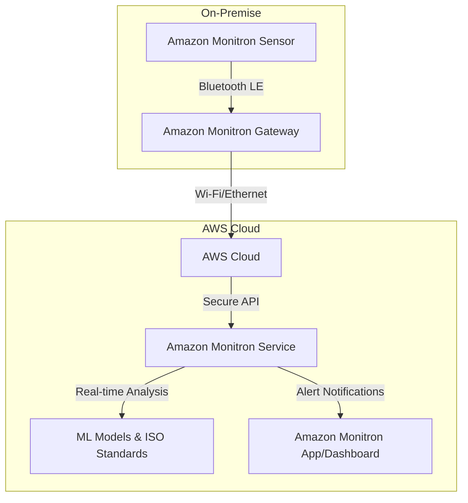
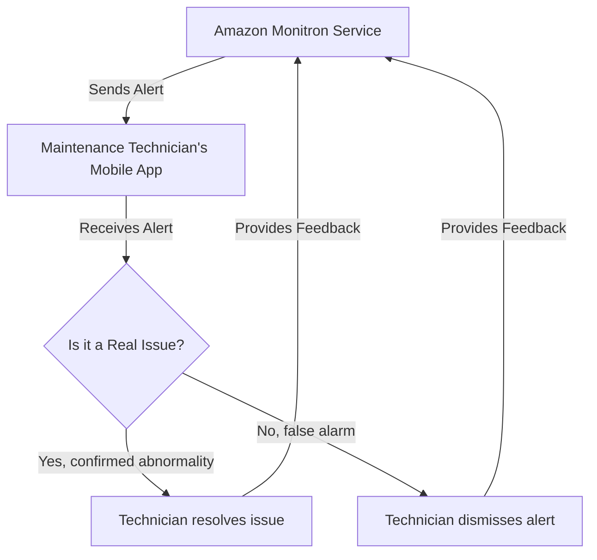
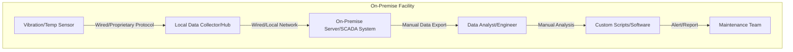

# Monitron

## Amazon Monitron

### 🔍 Overview

**Amazon Monitron** is an end-to-end, machine learning-based condition monitoring solution designed to detect potential failures in industrial equipment. It's a fully managed service that helps you move from a reactive or preventive maintenance model to a more efficient and cost-effective predictive maintenance program. The system includes purpose-built hardware (sensors and gateways) and a software service that automatically analyzes vibration and temperature data to identify abnormal machine behavior and alert maintenance teams.

> **🤖 Innovation Spotlight: The "Plug-and-Play" ML-Powered Solution** The true innovation of Amazon Monitron lies in its simplicity and accessibility. Traditional predictive maintenance solutions often require specialized data scientists, complex sensor installations, and significant upfront development work. Amazon Monitron democratizes this process. The sensors and gateways are pre-configured to work out of the box, and the service's machine learning models are pre-trained on a vast dataset of industrial equipment. This means you don't need any prior ML expertise to get started. The service automatically builds a baseline for normal operation and then uses that to detect anomalies. The real-time feedback loop in the mobile app allows technicians to confirm or dismiss alerts, which continuously improves the accuracy of the ML model over time, making it smarter with every use.

### ⚡ Problem Statement

**Problem Statement:** Unplanned equipment downtime in manufacturing, logistics, and other industrial settings is a significant and costly problem. It leads to production delays, lost revenue, high repair costs, and potential safety risks. Traditional maintenance methods (reactive and preventive) are often inefficient. Reactive maintenance means waiting for equipment to fail, leading to catastrophic breakdowns. Preventive maintenance involves scheduled repairs, which can be costly and unnecessary if a component isn't actually close to failure.

### 🤝**Business Use Cases**

* **Manufacturing:** A car manufacturer can use Amazon Monitron to monitor the health of critical equipment like motors, gearboxes, and pumps on the assembly line. By detecting early signs of a bearing failure on a robot arm, the maintenance team can schedule a repair during a planned shutdown, avoiding an unplanned line stoppage that could cost thousands per minute.
* **Logistics & Fulfillment:** Amazon's own fulfillment centers use Monitron to monitor the thousands of pieces of rotating equipment, from conveyor belt motors to sorter gearboxes. This has led to a significant reduction in unplanned downtime, saving millions of dollars by ensuring on-time customer deliveries.
* **Energy & Utilities:** A power plant can monitor the vibration and temperature of turbines and cooling pumps. An early alert from Monitron can indicate a developing fault, allowing technicians to intervene before a major component failure, which could lead to power outages.
* **Agriculture:** Farmers can use Monitron on heavy machinery like tractors and irrigation pumps to monitor for potential issues, ensuring the equipment is operational during critical planting and harvesting seasons.

### 🔥 Core Principles

Amazon Monitron operates on a simple, event-driven, and scalable architecture. Its core principles are:

* **Predictive Maintenance:** Moving from fixing things after they break (reactive) or on a fixed schedule (preventive) to predicting when they might fail and taking action beforehand.
* **Serverless and Managed:** The backend infrastructure is fully managed by AWS, meaning you don't have to provision servers, databases, or manage complex ML models. You focus on your equipment, not the underlying cloud infrastructure.
* **Machine Learning at the Edge and in the Cloud:** Data is collected at the edge by the sensors and gateways. The bulk of the analysis is done in the AWS Cloud using sophisticated ML models that are continuously improved with feedback.
* **Simple End-to-End Solution:** It’s a complete system from hardware to software, designed for easy deployment by plant maintenance personnel, not IT or ML experts.

**Core Services & Components:**

* **Amazon Monitron Sensors:** Small, wireless, battery-powered devices that are attached directly to industrial equipment. They continuously measure **three-directional vibration** and **temperature**. They are designed to be rugged and have a battery life of up to five years.
* **Amazon Monitron Gateway:** A device that collects data from multiple sensors via Bluetooth Low Energy (BLE). It aggregates the data and securely sends it to the Amazon Monitron service in the AWS Cloud over Wi-Fi or Ethernet.
* **Amazon Monitron Service:** The heart of the system in the AWS Cloud. It ingests data from the gateways and uses a combination of pre-trained machine learning models and ISO vibration standards to analyze the data for abnormalities. It establishes a baseline of "normal" behavior for each piece of equipment.
* **Amazon Monitron Mobile and Web Apps:** The user interface for the entire system. Technicians and managers use the mobile app for device setup, viewing real-time equipment status, and receiving alerts. The web app provides a dashboard for a broader overview and management.

### 📋 Pre-Requirements

1. **AWS Account:** An active AWS account is required to create an Amazon Monitron project.
2. **Amazon Monitron Hardware:** You must purchase Amazon Monitron Sensors and Gateways. A "Starter Kit" is available which includes a few sensors and a gateway to get you started.
3. **Mobile Device:** A smartphone or tablet with the Amazon Monitron app installed (available on iOS and Android) is needed for the initial setup and commissioning of devices.
4. **Network Connectivity:** The gateways require an internet connection, either via Wi-Fi or an Ethernet cable, to send data to the AWS Cloud.

### 👣 Implementation Steps

1. **Purchase Hardware:** Buy the Amazon Monitron Starter Kit or individual sensors and gateways from Amazon Business or a certified distributor.
2. **Set Up AWS Project:** Log in to your AWS account and navigate to the Amazon Monitron console. Create a new "Project" for your site. This project will be the container for all your assets, sensors, and gateways.
3. **Install Mobile App:** Download the Amazon Monitron app on your mobile device.
4. **Commission Gateway:** Using the mobile app, scan the QR code on the gateway to pair it. Connect the gateway to your network (Wi-Fi or Ethernet). The gateway will automatically connect to your AWS project.
5. **Mount Sensors:** Physically attach the sensors to the rotating equipment you want to monitor using the provided adhesive or epoxy.
6. **Pair Sensors to Assets:** In the mobile app, create a digital representation of your equipment (an "asset"). Then, pair the physical sensor with the digital asset by scanning the sensor's QR code.
7. **Start Monitoring:** Once paired, the sensors will automatically begin collecting vibration and temperature data and sending it to the cloud via the gateway. The Amazon Monitron service will start learning the "normal" operational state of your equipment.
8. **Receive Alerts & Take Action:** After the learning phase, if the service detects an abnormal pattern (e.g., increased vibration), it will send a real-time push notification to the mobile app. A technician can then inspect the equipment and take a one-time measurement, providing feedback that improves the ML model's accuracy.

### 🗺️ Data Flow Diagram

**Diagram 1: Data Flow from Sensor to Cloud**

**Diagram 2: User Interaction and Feedback Loop**

### 🔒 Security Measures

* **End-to-End Encryption:** All data is encrypted at rest and in transit. The communication between sensors, gateways, and the AWS Cloud is secured to protect sensitive operational data.
* **Least Privilege IAM Roles:** You should use AWS Identity and Access Management (IAM) to create specific roles with the minimum necessary permissions for users and applications. For Amazon Monitron, a service-linked role is automatically created, but for human users, you should use IAM Identity Center to manage access to the Monitron console and project.
* **Secure Device Management:** The sensors and gateways are pre-configured to a specific AWS account, preventing them from being used on an unauthorized account. Firmware updates are managed securely and automatically over-the-air.
* **VPC Isolation (for advanced users):** While the service itself is fully managed, if you are integrating Monitron data with other AWS services, you can leverage VPC endpoints to ensure that all data stays within your private network and never traverses the public internet.

### ⚖️ When to use and when not to use

| When to Use Amazon Monitron                                                                                                                                 | When Not to Use Amazon Monitron                                                                                                                                                                                                                                     |
| ----------------------------------------------------------------------------------------------------------------------------------------------------------- | ------------------------------------------------------------------------------------------------------------------------------------------------------------------------------------------------------------------------------------------------------------------- |
| **You need a simple, fast-to-deploy solution.** It's ideal for companies that lack in-house ML expertise or a large IT team.                                | **You need a highly customized solution.** If you have specific, unique sensor data types (e.g., chemical composition, gas levels) or require proprietary ML models, you might prefer a more flexible platform like AWS IoT Core with Amazon Lookout for Equipment. |
| **You want to monitor common industrial equipment** like motors, pumps, fans, compressors, and gearboxes. Monitron is purpose-built for these applications. | **You need to monitor a large variety of assets with many different failure modes** beyond what vibration and temperature can detect.                                                                                                                               |
| **You have limited capital for a large-scale predictive maintenance program.** The pay-as-you-go model and low upfront hardware cost make it accessible.    | **Your use case requires on-premise, real-time analysis without any cloud connectivity.** Monitron is a cloud-native solution and requires a connection to the AWS Cloud for analysis.                                                                              |
| **You want to increase the efficiency of your maintenance teams** by moving from manual, periodic checks to a data-driven, alert-based system.              | **You already have a mature and effective predictive maintenance program** with a dedicated team and established processes.                                                                                                                                         |

### 💰 Costing Calculation

Amazon Monitron's pricing model is straightforward with two main components:

1. **One-time device purchase cost:** This is the upfront cost for the physical sensors and gateways.
2. **Pay-as-you-go service fee:** This is a recurring monthly fee per commissioned sensor.

**How it is calculated:**

* **Device Cost:** The cost of the sensors and gateways, purchased from Amazon.com or Amazon Business. A starter kit with 5 sensors and 1 gateway is a popular starting point.
* **Service Fee:** The monthly service fee is charged for each sensor that has been "commissioned" or actively paired to an asset. It's a simple, per-sensor per-month charge.

**Efficient way of handling this service:**

* **Start Small with a Starter Kit:** Use a starter kit to run a proof-of-concept on your most critical or problematic equipment. This allows you to validate the solution's value before a large-scale deployment.
* **Prioritize Assets:** Don't monitor every piece of equipment at once. Start with the "low-hanging fruit"—the assets that are most critical to production and have a history of frequent, costly breakdowns.
* **Leverage AWS Cost Explorer:** Monitron automatically generates cost allocation tags for projects and sites. You can activate these tags in AWS Cost Explorer to track and analyze your spending, making it easy to report on the ROI of your Monitron program.

**Sample Calculation (Example based on US East (N. Virginia) pricing):**

* **Scenario:** A factory wants to monitor 10 critical pieces of equipment. They purchase a starter kit and an additional 5-pack of sensors.
* **Hardware Cost (Year 1):**
  * 1 x Monitron Starter Kit (5 Sensors, 1 Gateway) ≈ $715
  * 1 x Monitron Sensor 5-pack (5 Sensors) ≈ $575
  * **Total Hardware Cost: $1,290**
* **Service Fee (Year 1):**
  * 10 sensors in use
  * Monthly service fee per sensor ≈ $4.17
  * Annual service fee per sensor = $4.17/month \* 12 months = $50.04
  * Total annual service fee = $50.04 \* 10 sensors = $500.40
* **Total Cost for Year 1:** $1,290 (Hardware) + $500.40 (Service) = **$1,790.40**
* **Subsequent Years (Year 2 onwards):**
  * Hardware cost is a one-time purchase.
  * Total annual service fee remains **$500.40** (assuming the same number of sensors).

### ⛕ Alternative services in AWS/Azure/GCP/On-Premise

| Service                                           | Platform   | Key Comparison/Difference                                                                                                                                                                                                                        |
| ------------------------------------------------- | ---------- | ------------------------------------------------------------------------------------------------------------------------------------------------------------------------------------------------------------------------------------------------ |
| **Amazon Monitron**                               | AWS        | **End-to-End:** Complete hardware and software solution. **Simplicity:** No ML expertise required. Pre-trained models.                                                                                                                           |
| **Amazon Lookout for Equipment**                  | AWS        | **Flexible:** A highly customizable ML service. You bring your own sensors and data. Requires ML and data science expertise to build and train models.                                                                                           |
| **Azure IoT Central + Azure Machine Learning**    | Azure      | **Platform:** Provides a managed IoT application platform with templates. **Custom ML:** You can ingest data into Azure ML to build your own predictive models. More complex setup than Monitron.                                                |
| **Google Cloud IoT Core (Retired) + Vertex AI**   | GCP        | **Platform:** A comprehensive IoT platform. **Custom ML:** Similar to Azure, you would use a service like Vertex AI to build and train custom models for predictive maintenance. Requires significant data engineering and ML effort.            |
| **Traditional On-Premise Predictive Maintenance** | On-Premise | **Legacy:** Requires purchasing proprietary hardware, servers, and software. **Complexity:** High upfront cost, requires in-house expertise for installation, data analysis, and maintenance. **Scalability:** Difficult and expensive to scale. |

**On-Premise Alternative Data Flow Diagram:**

### ✅ Benefits

* **Cost Savings:** Reduces unplanned downtime and expensive emergency repairs by enabling proactive maintenance.
* **Scalability:** Easily scales from a few pieces of equipment to thousands across multiple sites without adding complexity.
* **Simplicity and Speed:** A "plug-and-play" solution that requires no development work or ML expertise. You can start monitoring in minutes.
* **Improved Efficiency:** Optimizes maintenance schedules and workforce by providing actionable insights, eliminating unnecessary inspections.
* **Continuous Improvement:** The ML models get more accurate over time as technicians provide feedback, creating a self-improving system.

> ✨ **Monitron's ability to democratize predictive maintenance with an accessible, end-to-end solution is a game-changer for the industrial sector.**

### 📝 Summary

Amazon Monitron is a powerful, yet simple, end-to-end service for predictive maintenance. By combining purpose-built hardware with a managed, machine learning-powered service, it provides an accessible path for businesses of any size to monitor the health of their industrial equipment and avoid costly unplanned downtime. This solution ensures real-time processing with minimal infrastructure overhead and no ML expertise required.

<strong>Top 5 things to keep in mind about Amazon Monitron:</strong>

* [ ] **It’s a complete solution:** You're buying the hardware and a managed service; it's not a DIY project.

- [ ] **No ML expertise needed:** The service's pre-trained models and ISO standards handle the complex analysis for you.
- [ ] **Focus on critical assets:** To maximize ROI, start by deploying sensors on your most vital and failure-prone equipment.
- [ ] **Feedback is key:** The system learns from your technicians' feedback. Encourage them to use the app to confirm or dismiss alerts to improve accuracy.
- [ ] **Cost is a combination of hardware and subscription:** Remember to factor in both the one-time purchase of sensors/gateways and the ongoing monthly service fee per sensor.

***

### 🔗 Related Topics

* **AWS IoT Core:** For building custom IoT solutions from scratch.
* **Amazon Lookout for Equipment:** For building predictive maintenance models on your own sensor data.
* **AWS IoT Greengrass:** For running local compute, messaging, data caching, sync, and ML inference at the edge.
* **AWS IoT SiteWise:** For collecting, organizing, and analyzing industrial equipment data at scale.

