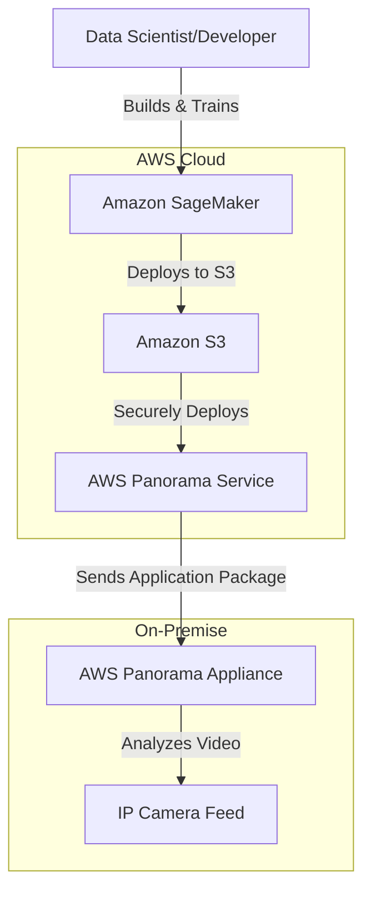
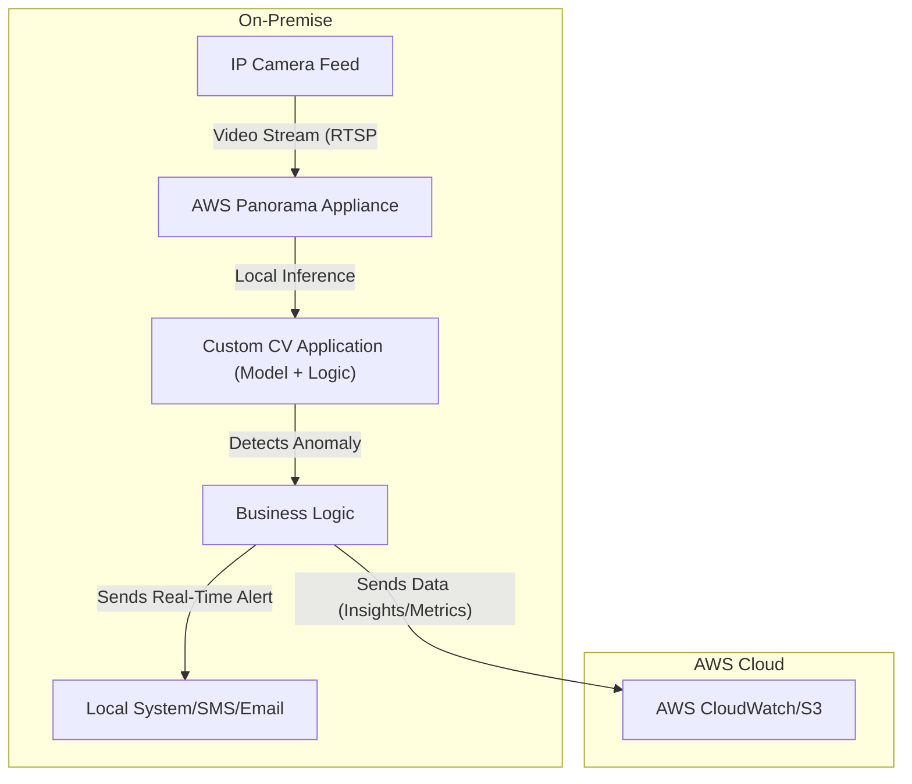

# Panoram

## Amazon Panorama

### 🔍 Overview

**Amazon Panorama** is a machine learning (ML) service and device that brings computer vision (CV) to your existing on-premises cameras. It's an edge computing solution designed for industrial environments where real-time analysis, low latency, and data privacy are critical. Instead of streaming video to the cloud for processing, the Panorama device analyzes the video feed locally, allowing for near-instant insights and actions.

<figure><figcaption></figcaption></figure>

> **🤖 Innovation Spotlight: Bridging the Gap Between Cloud ML and On-Premises Real-Time Applications** The key innovation of Amazon Panorama is its seamless integration of a physical edge device with a fully managed cloud service. Historically, deploying computer vision models on-premises was a complex and fragmented process, requiring a deep understanding of hardware, software, and ML model optimization. Panorama solves this by providing a purpose-built appliance (or compatible third-party devices) that is tightly integrated with the AWS ecosystem. The service handles the heavy lifting of model deployment, application lifecycle management, and device monitoring from the cloud, all while the inference work is performed at the edge. This enables businesses to leverage powerful cloud-based ML services like Amazon SageMaker to train models and then deploy them to thousands of cameras in the field with a few clicks, making computer vision at the edge accessible and scalable.

### ⚡ Problem Statement

**Problem Statement:** Many industrial and commercial environments, such as manufacturing plants, warehouses, and construction sites, have thousands of cameras collecting video data. However, analyzing this data in real-time for actionable insights is a significant challenge. Sending all video streams to the cloud for analysis is often impractical due to bandwidth constraints, high data transfer costs, and the need for immediate, low-latency responses for applications like quality control or safety monitoring. Additionally, for sensitive use cases, regulations or corporate policies may require that video data remains on-premises.

### 🤝 Business Use Cases:

* **Manufacturing Quality Control:** A factory uses Panorama to monitor a conveyor belt. The system can instantly identify defective parts on the assembly line, trigger an alert, and even remove the part from the line in real-time, all without a constant internet connection.
* **Industrial Safety:** In a construction yard, Panorama can monitor workers to ensure they are wearing proper personal protective equipment (PPE) like hard hats and safety vests. The system can detect when a worker enters a hazardous zone and send an immediate alert to a site manager.
* **Retail Analytics:** A retail chain can use Panorama to analyze customer foot traffic, track queue lengths at checkout, and optimize store layouts to improve the customer experience and increase sales. The data is processed locally, protecting customer privacy by only sending anonymized insights to the cloud.
* **Logistics & Supply Chain:** In a warehouse, Panorama can track the movement of goods, read barcodes, and monitor forklift traffic to prevent collisions and ensure efficient operations.

### 🔥 Core Principles

* **Edge-Based Processing:** The core tenet of Panorama is performing computer vision inference locally on the device, near the data source. This minimizes latency and reduces reliance on a constant high-bandwidth internet connection.
* **Cloud-Managed Deployment:** The AWS Cloud acts as the central control plane. You build and manage your computer vision applications, including models and business logic, in the cloud and then securely deploy them to one or many Panorama devices.
* **Managed Hardware & Software:** The solution is an appliance with a powerful GPU (like the NVIDIA Jetson AGX Xavier) and pre-configured software, simplifying the hardware and OS management for customers.
* **Application-centric:** You package your custom computer vision solution as a "Panorama Application," a self-contained unit that includes the ML model, business logic, and camera stream configuration.

**Core Services & Components:**

* **AWS Panorama Appliance:** The physical hardware device that connects to your on-premises IP cameras. It is a ruggedized, compute-optimized edge device capable of running multiple ML models on multiple video streams in parallel.
* **AWS Panorama Service (in the Cloud):** A managed service in the AWS console that you use to register, monitor, and deploy applications to your Panorama devices.
* **AWS Panorama Application SDK:** A software development kit that allows developers to build and package their computer vision applications as a set of code and models.
* **AWS Services Integration:** Panorama integrates with other AWS services like **Amazon SageMaker** for model training and optimization, **Amazon S3** for storing application assets, and **Amazon CloudWatch** for logging and monitoring device health.

### 📋 Pre-Requirements

1. **AWS Account:** An active AWS account is necessary.
2. **AWS Panorama Appliance:** You need to purchase an AWS Panorama Appliance or a compatible device from a partner like Lenovo.
3. **On-premises Cameras:** Existing IP cameras that support the Real-Time Streaming Protocol (RTSP).
4. **Network Connectivity:** The Panorama device requires network access to both the local camera network and the internet to communicate with the AWS Cloud for deployment and monitoring.
5. **Developer Experience:** While the service simplifies deployment, building a custom computer vision application and model requires expertise in ML development, particularly with frameworks like TensorFlow, PyTorch, or MXNet.

### 👣 Implementation Steps

1. **Purchase and Prepare Hardware:** Buy the AWS Panorama Appliance. Unbox it and connect it to your local network and power source.
2. **Register the Device:** Using the AWS Panorama console, register the device by following the on-screen instructions, which typically involves scanning a QR code to link it to your AWS account.
3. **Develop a Computer Vision Application:**
   * **Train an ML Model:** Use a service like Amazon SageMaker to train your computer vision model (e.g., an object detection model for PPE).
   * **Optimize the Model:** Use SageMaker Neo to compile and optimize the model for the Panorama device's hardware.
   * **Write Business Logic:** Write the application code (e.g., in Python) that receives the video stream, performs inference using the model, and takes action (e.g., sends a message to an SNS topic).
   * **Create a Manifest:** Define the application's structure using a manifest file, which links the code, model, and camera streams.
4. **Deploy the Application:**
   * Upload your application assets (code, model) to an Amazon S3 bucket.
   * In the AWS Panorama console, create a new application and specify the S3 location of your assets.
   * Select the registered Panorama device and deploy the application. The service will securely download the application to the device.
5. **Monitor and Manage:** Use the AWS Panorama console and Amazon CloudWatch to monitor the health of your device, view logs, and track application performance.

### 🗺️ Data Flow Diagram

**Diagram 1: Model Development and Deployment**

**Diagram 2: On-Premise Real-Time Inference and Action**

### 🔒 Security Measures

* **Secure by Design:** The Panorama appliance uses a hardened operating system and a secure boot process to prevent unauthorized software from running on the device.
* **Data Protection:** Since video processing happens locally, sensitive video data never has to leave your premises, addressing data privacy concerns. Only non-personally identifiable metadata (e.g., event logs, bounding box coordinates) is sent to the cloud.
* **Identity and Access Management (IAM):** All communication between the Panorama device and the AWS Cloud is authenticated and encrypted using secure certificates. You use IAM policies to control which users and services can access and manage your Panorama devices and applications.
* **VPC Endpoints:** For enhanced security, you can use Amazon VPC endpoints to ensure that the Panorama device's communication with the AWS service endpoints (like S3 and CloudWatch) occurs within your private network, without traversing the public internet.

### ⚖️ When to use and when not to use

| When to Use Amazon Panorama                                                                                                                                                    | When Not to Use Amazon Panorama                                                                                                                                                                              |
| ------------------------------------------------------------------------------------------------------------------------------------------------------------------------------ | ------------------------------------------------------------------------------------------------------------------------------------------------------------------------------------------------------------ |
| **You need real-time, low-latency computer vision.** Applications like quality control or safety monitoring that require an immediate response are ideal.                      | **For simple, cloud-based image analysis.** If you don't have existing cameras or a need for on-premises processing, a service like **Amazon Rekognition** or **Amazon Lookout for Vision** is a better fit. |
| **Data privacy and residency are a concern.** When you cannot or do not want to send raw video data to the cloud, Panorama keeps the video on-premises.                        | **You lack ML expertise.** While Panorama simplifies deployment, building a custom computer vision model from scratch still requires a data scientist or ML engineer.                                        |
| **You have limited or unreliable internet connectivity.** The local processing capability ensures your application continues to function even during network outages.          | **For general-purpose edge computing.** If your application is not computer vision-focused, a more general-purpose edge solution like **AWS IoT Greengrass** might be more appropriate.                      |
| **You need a scalable solution for many sites.** The central, cloud-based management simplifies deploying and updating applications across thousands of devices and locations. | **When an out-of-the-box solution is needed.** If you can use a pre-trained model or a SaaS service without custom development, there are simpler alternatives.                                              |

### 💰 Costing Calculation

Amazon Panorama's pricing has two main components:

1. **One-time hardware cost:** The upfront cost of the AWS Panorama Appliance or a compatible third-party device. The AWS Appliance is priced around $4,000, while a Lenovo ThinkEdge SE70 is a lower-cost option.
2. **Recurring usage fees:**
   * **Device usage fee:** A monthly fee per active camera stream processed by the device.
   * **Cloud storage fee:** A small fee for storing application assets (models, code) in the AWS Cloud.
   * **Other AWS service charges:** Costs for services like Amazon S3, CloudWatch, and Amazon SageMaker for model training and deployment.

**Efficient way of handling this service:**

* **Start with a single use case:** Begin with one high-value application (e.g., quality control on a single line) to prove the ROI before scaling.
* **Optimize your ML models:** Use services like SageMaker Neo to compile models to be as small and efficient as possible. This reduces cloud storage costs and improves performance on the edge device.
* **Use the right device:** Choose between the AWS Panorama Appliance and a compatible partner device based on your specific performance, budget, and ruggedization needs.

**Sample Calculation:**

* **Scenario:** A company wants to monitor 5 camera feeds on a production line for quality control using an AWS Panorama Appliance for 3 years.
* **Hardware Cost:** $4,000 (one-time purchase for the appliance)
* **Device Usage:**
  * $8.33 per month per active camera stream (example pricing)
  * Total monthly usage cost = $8.33/stream \* 5 streams = $41.65
  * Total 3-year usage cost = $41.65/month \* 36 months = $1,499.40
* **Cloud Storage:** Let's assume the application assets are 200MB.
  * $0.10 per GB per month (example pricing)
  * Monthly storage cost = (0.2 GB) \* ($0.10/GB) = $0.02
  * Total 3-year storage cost = $0.02/month \* 36 months = $0.72
* **Total 3-Year Cost (approx):** $4,000 + $1,499.40 + $0.72 = **$5,500.12**

### ⛕ Alternative services in AWS/Azure/GCP/On-Premise

| Service                                        | Platform   | Key Comparison/Difference                                                                                                                                                                                  |
| ---------------------------------------------- | ---------- | ---------------------------------------------------------------------------------------------------------------------------------------------------------------------------------------------------------- |
| **AWS Panorama**                               | AWS        | **End-to-End Edge CV:** Managed hardware and cloud service for on-premises computer vision. Seamless cloud-to-edge deployment.                                                                             |
| **AWS IoT Greengrass**                         | AWS        | **General Purpose Edge:** More flexible platform for running local compute, ML inference, and messaging. Requires you to bring your own hardware and manage more components.                               |
| **Azure Stack Edge + Azure Custom Vision**     | Azure      | **Managed Hybrid Cloud:** Combines a physical device with a managed cloud service. Requires more manual setup and integration compared to the tight coupling of Panorama.                                  |
| **Google Edge TPU + Vertex AI**                | GCP        | **Hardware-centric:** Focuses on the Edge TPU hardware for high-performance ML inference at the edge. Requires significant development and integration work to build a complete end-to-end solution.       |
| **On-Premise CCTV with DVR/NVR + Custom Code** | On-Premise | **DIY/Legacy:** Requires setting up physical servers, installing ML frameworks, writing custom code for video ingestion and inference, and building your own management systems. High complexity and cost. |

### ✅ Benefits

* **Low Latency:** Real-time analysis enables immediate action, which is critical for industrial automation and safety.
* **Data Privacy:** Keeps sensitive video data on-premises, addressing privacy concerns and regulatory requirements.
* **Scalability:** Centrally manage thousands of devices and applications from the cloud, enabling a scalable computer vision strategy.
* **Offline Functionality:** Continues to operate and perform analysis even with limited or no internet connectivity.
* **Reduced Costs:** Minimizes bandwidth and data transfer costs by processing video locally.

### 📝 **Summary**&#x20;

Amazon Panorama is an advanced and integrated solution that brings the power of computer vision to the industrial edge. It combines a purpose-built appliance with a managed cloud service to simplify the deployment and management of real-time CV applications on-premises. The solution is ideal for use cases that demand low latency, data privacy, and scalability across multiple locations, such as quality control, safety monitoring, and retail analytics.

<strong>Top 5 things to keep in mind about Amazon Panorama:</strong>

* [ ] **It's a Hybrid Solution:** It combines a physical on-premises device with a managed cloud service.
* [ ] **Focus on the "Edge":** The primary benefit is performing compute-intensive CV tasks locally to reduce latency and data transfer.
* [ ] **Requires ML Expertise:** While deployment is simplified, you still need to train your own custom computer vision models.
* [ ] **Data Stays Local:** Raw video streams do not need to be sent to the cloud, a major advantage for security and privacy.
* [ ] **Cost is a combination:** Factor in the one-time hardware cost and the recurring usage fee per camera stream.

