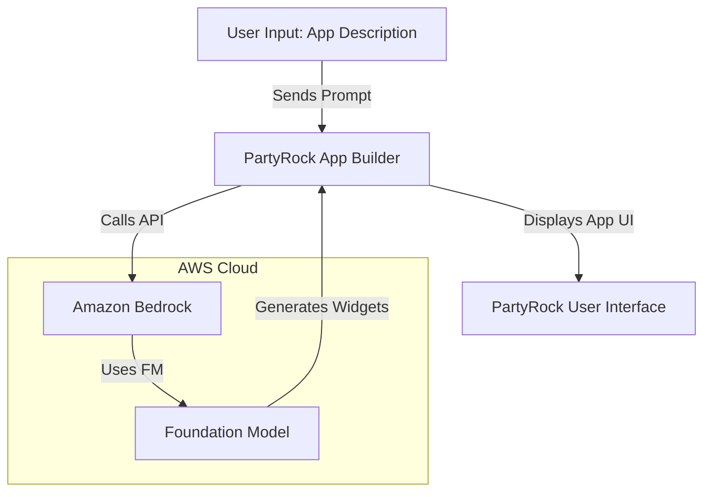
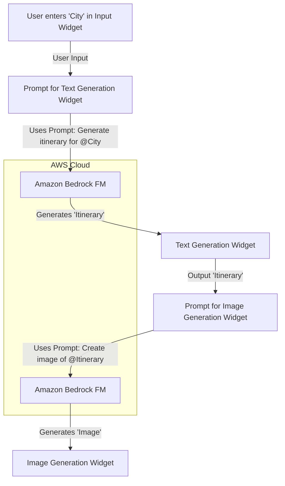

# PartyRock

## Amazon PartyRock

### 🔍 Overview

**Amazon PartyRock** is a fun and interactive, no-code generative AI application-building playground. Powered by **Amazon Bedrock**, it allows anyone—regardless of their technical background or coding experience—to experiment with foundational models (FMs) and build simple, AI-powered apps. The platform's mission is to democratize generative AI, making it accessible for people to learn about prompt engineering, prototype ideas, and share their creations with others.

> 🤖 Innovation Spotlight: Learning by Doing with Generative AI\*\* PartyRock’s key innovation is its hands-on, playful approach to a complex technology. Instead of requiring users to understand API calls, infrastructure, or data pipelines, it presents generative AI concepts through a visual, widget-based interface. Users learn about prompt engineering, model parameters (like Temperature and Top P), and prompt chaining by simply dragging, dropping, and configuring widgets. This "learning by doing" model makes the abstract concepts of generative AI tangible and fun. The ability to instantly "remix" and customize existing apps shared by the community further accelerates learning and fosters a culture of collaborative experimentation.

### ⚡ Problem Statement

**Problem Statement:** The barrier to entry for building with generative AI is often high. It requires knowledge of large language models (LLMs), prompt engineering best practices, and the underlying cloud infrastructure to deploy and manage these applications. This complexity prevents students, hobbyists, small business owners, and non-technical professionals from exploring the potential of this technology.

### 🤝 Business Use Cases

* **Education & Training:** A high school teacher could use PartyRock to create a trivia game app to make learning about history or science more interactive. A corporate trainer could build a simple app that generates summaries of long technical documents, helping employees quickly get up to speed.
* **Small Business & Entrepreneurship:** A coffee shop owner could create an app that generates unique coffee-of-the-day descriptions for their social media. A consultant could build a mini-app that helps them draft client pitch emails in a specific tone. These small, custom tools can significantly boost productivity.
* **Marketing & Content Creation:** A content creator can build an app to generate blog post titles, social media captions, or even script outlines for videos based on a single topic input. A marketing team can use it to quickly generate multiple ad copies for A/B testing.
* **Personal Productivity:** An individual can create an app to plan a trip, generate meal ideas based on available ingredients, or get creative inspiration for writing or art projects.

### 🔥 Core Principles

PartyRock operates on the principle of a low-friction, high-fun user experience.

* **No-Code Development:** Build applications by simply describing them and then arranging and configuring pre-built "widgets" without writing any code.
* **Powered by Amazon Bedrock:** Under the hood, PartyRock uses Amazon Bedrock, the fully managed service that provides access to FMs from leading AI companies (e.g., Anthropic, Cohere, AI21 Labs, Stability AI). This means you get to experiment with cutting-edge models without managing the complex infrastructure.
* **Modular "Widget" Architecture:** Applications are composed of modular building blocks called widgets. Each widget has a specific function, such as taking user input, generating text, or creating an image.
* **Prompt Chaining:** A powerful concept where the output of one widget can be used as the input for another. This allows for the creation of more complex, multi-step applications.
* **Discover, Remix, and Share:** The platform encourages a community-driven approach. You can explore a vast catalog of public apps, "remix" them to customize for your needs, and share your own creations with a unique URL.

**Core Services & Components:**

* **PartyRock App Builder:** The main canvas where you build your application. You can start with a prompt (e.g., "Build an app that tells me a superhero name for my pet") or an empty canvas.
* **Widgets:** The fundamental building blocks. Key widget types include:
  * **User Input Widget:** Collects text from the user.
  * **Text Generation Widget:** Generates text based on a prompt and model parameters.
  * **Chatbox Widget:** Creates an interactive, turn-by-turn chat interface.
  * **Image Generation Widget:** Creates images from a text prompt.
  * **Document Widget:** Upload and analyze text from a document.
  * **Static Text Widget:** For adding titles, instructions, or other non-generative text.
* **Foundation Models (FMs):** The large language and image models from Amazon Bedrock that power the generative AI widgets. PartyRock gives you the ability to select from a variety of models (e.g., Anthropic Claude, Stability AI Stable Diffusion) and experiment with their different outputs.
* **PartyRock "Backstage":** A personal dashboard to manage your apps and track your usage of "PartyRock credits."

### 📋 Pre-Requirements

1. **Web Browser:** Access PartyRock through a web browser (e.g., Chrome, Firefox, Safari).
2. **Account:** While you don't need an AWS account, you'll need a social login (Amazon.com, Google, or Apple) to save your work and create new apps.
3. **No coding skills are required.** Just a willingness to experiment and be creative.

### 👣 Implementation Steps

1. **Go to the PartyRock website:** Navigate to `https://partyrock.aws/`.
2. **Sign in:** Use your Amazon, Google, or Apple ID to sign in.
3. **Start a new app:** Click "Build your own app."
4. **Prompt the App Builder:** Type a simple description of the app you want to create (e.g., "An app that generates a travel itinerary for a family vacation to a city of my choice"). The App Builder will automatically generate a draft of your app with several widgets.
5. **Customize with Widgets:**
   * Drag and drop new widgets from the sidebar (e.g., an "Image Generation" widget to create a picture of a travel destination).
   * Click on a widget to edit its settings, such as the prompt, the foundation model it uses, or advanced parameters like "Temperature" to control creativity.
6. **Chain Widgets:** Use the `@` symbol in a widget's prompt to reference another widget's output. For example, in your "Image Generation" widget, you could use `@City` to dynamically generate an image based on the city entered by the user in the input widget.
7. **Test and Refine:** Interact with your app to see the output. Make changes to the prompts or settings to improve the results.
8. **Share your app:** When you're happy, click "Share" to generate a public link that you can send to friends or colleagues, or create a "snapshot" of the output to share.

### 🗺️ Data Flow Diagram

**Diagram 1: Creating a PartyRock App**

**Diagram 2: Runtime Data Flow with Prompt Chaining**

### 🔒 Security Measures

* **Data Isolation:** PartyRock is designed as a playground. The apps and data you create are specific to your session and account. They are not designed for confidential, sensitive, or production-grade business data.
* **No PII (Personally Identifiable Information):** As per the terms of service, PartyRock is not meant for handling confidential business data or PII. Users are advised against using it for such purposes.
* **Content Moderation:** The underlying Amazon Bedrock service includes safety filters and moderation to prevent the generation of harmful or inappropriate content.
* **Simple Authentication:** PartyRock uses standard social logins, which simplifies the process and avoids the need for complex IAM configurations. Access to your apps is managed through this login.

### ⚖️ When to use and when not to use

| When to Use Amazon PartyRock                                                                                                                                                    | When Not to Use Amazon PartyRock                                                                                                                                                                                                                             |
| ------------------------------------------------------------------------------------------------------------------------------------------------------------------------------- | ------------------------------------------------------------------------------------------------------------------------------------------------------------------------------------------------------------------------------------------------------------ |
| **You want to learn about generative AI.** It's the perfect environment for beginners to understand core concepts like prompt engineering and model parameters.                 | **For production-grade applications.** PartyRock is for experimentation and prototyping. For a business-critical application that needs scalability, security, and integration with other systems, use **Amazon Bedrock** directly.                          |
| **You need to rapidly prototype an idea.** Quickly build and test a concept for an AI-powered app to see if it's feasible before investing in a full-scale development project. | **For building apps with highly sensitive or confidential data.** The platform is not designed to handle private business data or PII. Use **Amazon Q Apps** for secure, internal generative AI applications.                                                |
| **For personal or small-scale productivity tools.** Create a simple app for a specific, repetitive task like content generation or data summarization.                          | **When you need to build a complex, multi-modal application.** While PartyRock supports text and image, it doesn't offer the full range of customization and services available in the broader AWS ecosystem (e.g., databases, API gateways, custom models). |
| **For educational purposes or hackathons.** It's a great tool for a group of people to collaborate, build, and share creative applications quickly.                             | **When you require full programmatic control.** Developers who need to write code, integrate with specific APIs, or build custom logic should work directly with the AWS SDKs and Amazon Bedrock.                                                            |

### 💰 Costing Calculation

Amazon PartyRock is currently a free-to-use playground.

* **Credit System:** PartyRock uses a credit system. Every user is granted a recurring daily amount of free credits. This is not a currency but a measure of usage for the foundational models.
* **Credit Calculation:** Credits are consumed based on the amount of input text (tokens), output text (tokens), and generated images.
* **No Credit Card Required:** You do not need to provide any credit card information to use PartyRock.
* **Cost-Efficient Way:** The best way to be cost-efficient with PartyRock is simply to use it for its intended purpose: as a playground for learning and experimentation. The free daily credits are generous enough for this use case. For anything beyond that, the platform itself will guide you toward production-grade services like Amazon Bedrock.

### ⛕ Alternative services in AWS/Azure/GCP/On-Premise

| Service                           | Platform         | Key Comparison/Difference                                                                                                                                                                                                         |
| --------------------------------- | ---------------- | --------------------------------------------------------------------------------------------------------------------------------------------------------------------------------------------------------------------------------- |
| **Amazon PartyRock**              | AWS              | **No-Code Playground:** Designed for learning and prototyping. Free and doesn't require an AWS account. Built on Bedrock.                                                                                                         |
| **Amazon Bedrock**                | AWS              | **Managed Service:** The underlying platform for building and scaling generative AI applications. Requires an AWS account, billing, and technical expertise. Provides full control over models and infrastructure.                |
| **Amazon Q Apps**                 | AWS              | **Internal No-Code Apps:** For business use cases. Lets employees build internal, secure generative AI apps connected to company data. Requires an Amazon Q Business subscription.                                                |
| **Microsoft AI Builder**          | Azure            | **No-Code AI:** Part of the Power Platform. Allows users to add AI capabilities (text generation, forms processing) to business applications (Power Apps, Power Automate) but is more business-focused than a general playground. |
| **Google AI Studio**              | GCP              | **Web-based Playground:** A similar no-code environment for experimenting with Google's Gemini family of models. It's a direct competitor in the "playground" space but is focused on Google's own FMs.                           |
| **Local LLMs (On-Premise/Local)** | On-Premise/Local | **Full Control:** Requires significant hardware investment, technical expertise, and time to set up and manage. Offers maximum data privacy but is complex and not scalable without major effort.                                 |

### ✅ Benefits

* **Democratization of AI:** Makes generative AI accessible to everyone, not just developers and data scientists.
* **Accelerated Learning:** Provides a safe, hands-on environment to quickly learn about generative AI concepts.
* **Rapid Prototyping:** Drastically reduces the time and effort required to test new AI-powered ideas.
* **Community and Collaboration:** The ability to share and remix apps fosters a vibrant community of builders.
* **No Cost, No Risk:** The free, credit-based model eliminates financial barriers to entry, encouraging broad experimentation.

### 📝 Summary

Amazon PartyRock is a brilliant, user-friendly gateway to the world of generative AI. It turns complex technology into a fun, no-code playground, allowing individuals to quickly build, share, and remix creative applications. It's the perfect starting point for anyone who wants to learn about prompt engineering and the power of foundational models, serving as a stepping stone to more advanced services like Amazon Bedrock for production use cases.

**Top 5 things to keep in mind about Amazon PartyRock:**

1. **It's for Learning and Fun:** PartyRock is not for production or business-critical applications.
2. **No Code, No AWS Account:** The barrier to entry is virtually zero, making it highly accessible.
3. **The power is in the "Widgets" and "Chaining":** Understand how to combine and reference widgets to create more sophisticated apps.
4. **Explore and Remix:** The "Discover" page is your best friend for inspiration and a starting point for your own apps.
5. **Watch Your Credits:** While free, there is a daily usage limit. Use it wisely for your most interesting experiments.

### 🔗 Related Topics

* **Amazon Bedrock:** The underlying service that powers PartyRock and is used for building production-grade generative AI applications.
* **Amazon Q:** A generative AI-powered assistant for businesses, offering secure and private access to company data.
* **Prompt Engineering:** The art and science of communicating effectively with large language models to get desired outputs.
* **Foundation Models (FMs):** The massive, pre-trained models that form the core of modern generative AI applications.
