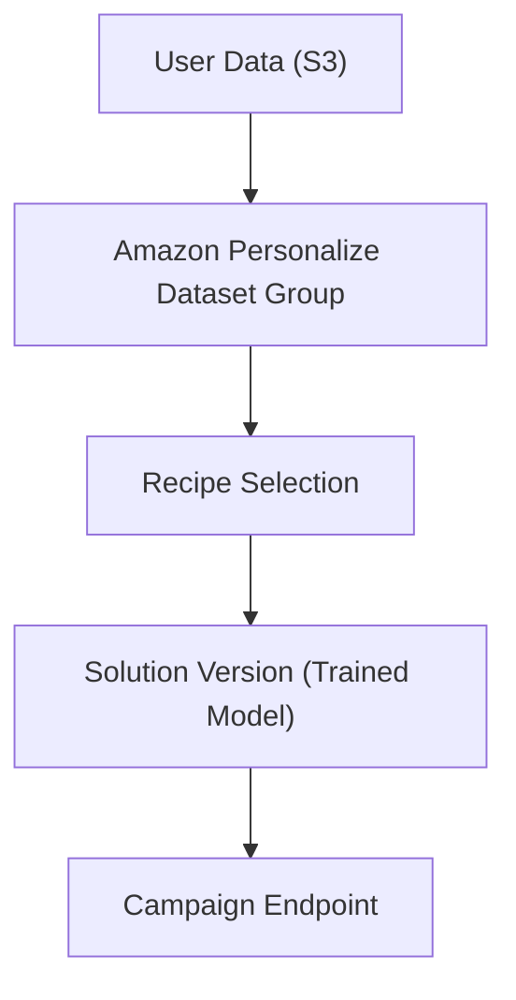
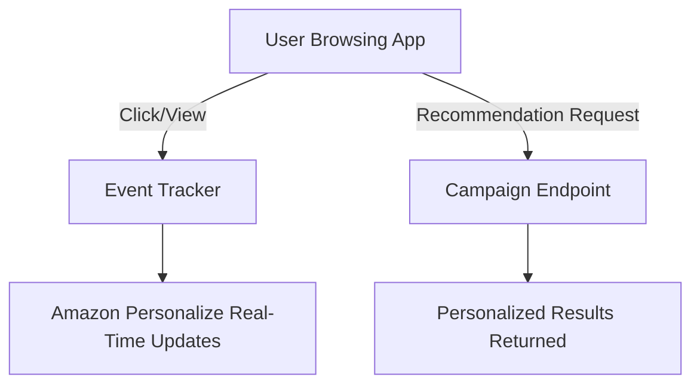
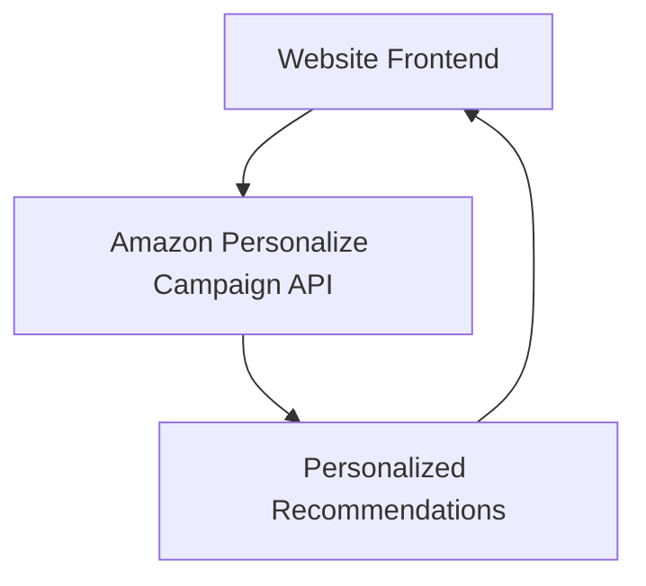
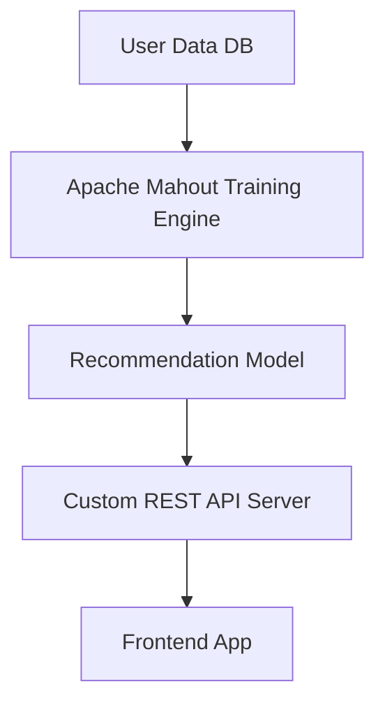

# Personalize

## 🤖 Amazon Personalize – AI-Powered Recommendations

***

### 🔍 **Overview**

Amazon Personalize is a **fully managed machine learning service** that enables developers to build personalized product recommendations, search results, and targeted marketing campaigns **without requiring ML expertise**.

It’s the same tech that powers **Amazon.com’s recommendation engine**, but made available to all industries.

<figure><figcaption></figcaption></figure>

#### 🤖 **Innovation Spotlight**

* Personalize uses **deep learning models (sequence-to-sequence & contextual embeddings)** to capture **real-time user interactions** (like clicks, purchases, views).
* Unlike traditional recommendation systems (collaborative filtering/matrix factorization), Personalize **adapts instantly** as new data flows in.
* Example: If a user watches a sports documentary today, Personalize can shift tomorrow’s recommendations away from dramas to sports-related content.

***

### ⚡ **Problem Statement & Business Use Cases**

**Scenario:** An **e-commerce platform** wants to increase sales by providing **real-time, tailored product recommendations** for each user.

**Industries & Applications:**

* 🛒 **Retail/eCommerce** → product suggestions (“customers who bought this also bought...”).
* 🎬 **Media & Entertainment** → personalized movie/music playlists.
* 💳 **Financial Services** → recommending credit cards or investment products.
* 🏥 **Healthcare** → suggesting personalized wellness programs.
* 🎮 **Gaming** → recommending in-game items based on player behavior.

***

### 🔥 **Core Principles**

Foundational concepts behind Amazon Personalize:

* **Datasets**: Three dataset types:
  * **Users dataset** – user profiles.
  * **Items dataset** – product/item metadata.
  * **Interactions dataset** – user actions (clicks, purchases, ratings).
* **Recipes (ML Models)**: Prebuilt ML algorithms for different goals:
  * **User-Personalization** → personalized ranking.
  * **HRNN (Hierarchical Recurrent Neural Network)** → sequential recommendations.
  * **Popularity-Count** → trending items.
  * **Similar-Items** → "More like this."
* **Campaigns**: Deployed recommendation APIs for real-time serving.
* **Real-Time Personalization**: Updates recommendations instantly as new data flows in.
* **Event Tracker**: Enables tracking **real-time user behavior** via SDKs.

***

### 📋 **Pre-Requirements**

* **Amazon S3** → store raw datasets (users, items, interactions).
* **Amazon Personalize** → core service for dataset import, model training, campaigns.
* **AWS Identity & Access Management (IAM)** → secure role-based access.
* **Amazon CloudWatch** → monitor metrics/logs.
* **SDKs/Apps** → to send events and consume recommendation APIs.

***

### 👣 **Implementation Steps**

1. **Prepare Data**
   * Upload `users.csv`, `items.csv`, `interactions.csv` to **Amazon S3**.
2. **Create Dataset Group**
   * In Personalize, create a dataset group (container for data and models).
3. **Import Dataset**
   * Define schema → import datasets from S3.
4. **Select Recipe (ML Algorithm)**
   * Choose "User-Personalization" or "HRNN".
5. **Train Solution Version**
   * Train a model → generates a solution version.
6. **Deploy Campaign**
   * Launch campaign endpoint (REST API).
7. **Integrate with Application**
   * Use SDKs (Java, Python, JS) to fetch recommendations in real-time.
8. **Enable Real-Time Personalization**
   * Set up **event tracker** → stream clicks, views, purchases.

***

### 🗺️ **Data Flow Diagram**

#### **1. Data Ingestion & Model Training**

#### **2. Real-Time Recommendation API**

#### **3. Integration with E-commerce Website**

***

### 🔒 **Security Measures**

* Use **IAM least privilege policies** for Personalize access.
* Encrypt datasets at rest with **S3 KMS encryption**.
* Encrypt in-transit using **HTTPS/TLS**.
* Limit **event tracker API keys** to specific applications.
* Use **VPC endpoints** for S3 & Personalize for private connectivity.

***

### ☣️ **When to Use & When Not to Use**

✅ **Use when**:

* You want **real-time, adaptive recommendations**.
* You lack ML expertise but need enterprise-grade personalization.
* Your dataset has **enough historical + ongoing events**.

❌ **Don’t use when**:

* You only need **static “top seller” lists** (CloudWatch metrics or Athena is cheaper).
* You have **very small datasets** (<1000 interactions → not enough for ML).
* You require **highly customized ML architectures** (then SageMaker is better).

***

### 💰 **Costing Calculation**

* **Data Ingestion** → $0.05 per 1k records.
* **Training Solutions** → Charged per hour of training (\~$0.40 per training hour).
* **Campaigns (inference)** → $0.20 per 1k recommendation requests.
* **Event Tracker** → $0.05 per 1k events.

**Sample Calculation:**

* 1M interaction records = $50
* Training model (10 hrs) = $4
* 1M monthly recommendation API calls = $200
* 5M events logged = $250 👉 **Total ≈ $504 / month**

**Optimization Tips:**

* Use **batch recommendations** for email campaigns instead of real-time → cheaper.
* Retrain models only when needed (weekly/monthly).

***

### ⛕ **Alternative Services**

| Cloud/On-Prem  | Alternative Service                     | Key Difference                                           |
| -------------- | --------------------------------------- | -------------------------------------------------------- |
| **AWS**        | SageMaker Custom Recommender            | Full ML control, more flexible but complex               |
| **Azure**      | Azure Personalizer                      | Similar personalization but reinforcement-learning based |
| **GCP**        | Recommendations AI                      | Google’s retail/media recommendation engine              |
| **On-Premise** | Apache Mahout / TensorFlow Recommenders | Requires heavy ML expertise, infra setup                 |

#### On-Premise Flow (Apache Mahout Example)

***

### ✅ **Benefits**

* ⚡ **Real-Time Personalization** (adaptive, instant recommendations).
* 📉 **Lower time-to-market** (no ML expertise required).
* 🛠️ **Managed service** (no infra/ML ops overhead).
* 🎯 **Business impact** → boosts conversion rates & customer engagement.
* 💰 **Cost-efficient** vs building in-house ML pipelines.

***

### 📝 **Summary**

Amazon Personalize brings **Amazon.com-grade personalization** to any business, helping deliver real-time, adaptive recommendations without ML expertise. It accelerates innovation, improves customer engagement, and drives measurable ROI.

#### Top 7 Things to Keep in Mind 🧠

1. Minimum dataset size (\~1000 interactions) needed for meaningful results.
2. Always combine **interactions + item metadata** for richer personalization.
3. Retrain models periodically (weekly/monthly).
4. Use **event trackers** for adaptive real-time personalization.
5. Batch recommendations are cheaper than real-time for email campaigns.
6. Control costs by monitoring **API request volume**.
7. Secure with **IAM + encryption + VPC endpoints**.

***

### 🔗 **Related Topics**

* [Amazon Personalize Documentation](https://docs.aws.amazon.com/personalize/)
* [Personalize Recipes Guide](https://docs.aws.amazon.com/personalize/latest/dg/working-with-predefined-recipes.html)
* [Event Tracker API](https://docs.aws.amazon.com/personalize/latest/dg/recording-events.html)
* [Cost Estimator](https://aws.amazon.com/personalize/pricing/)
