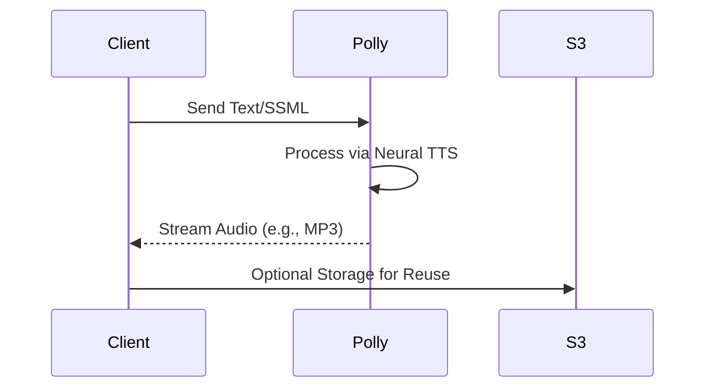
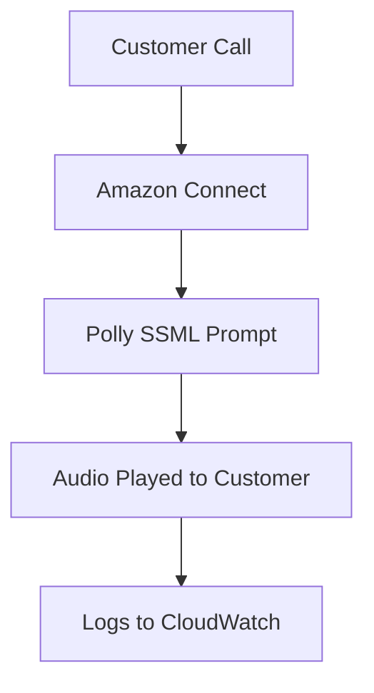

# Polly

## Amazon Polly

### 🌟 **1. Overview & Innovation Spotlight**

**Amazon Polly** is a **fully managed text-to-speech (TTS) service** that uses advanced deep learning technologies to convert text into lifelike speech. It supports **100+ voices across 40+ languages**, enabling developers to build voice-enabled applications that enhance user engagement, accessibility, and multilingual support . Polly offers **neural TTS voices** for higher naturalness and clarity, along with standard voices for cost-effective solutions .

<figure><figcaption></figcaption></figure>

**🛠️ Innovation Spotlight**:

* **Generative AI Integration**: Polly leverages billion-parameter transformer models to produce emotionally expressive, colloquial speech, mimicking human intonation and rhythm .
* **Real-Time Streaming**: Directly streams audio to applications, reducing latency for interactive use cases like voice assistants and live notifications .
* **SSML Customization**: Uses **Speech Synthesis Markup Language (SSML)** to fine-tune pronunciation, emphasis, and pauses, allowing dynamic adjustments for context-specific speech .

***

### 🔍 **2. Problem Statement & Business Use Cases**

**Real-World Scenario**: A global e-learning platform (e.g., Duolingo) needs to provide natural-sounding audio for language lessons in multiple dialects. Manually recording audio is time-consuming and costly, while generic TTS tools lack linguistic nuance and emotional depth. Polly automates this with lifelike voices, ensuring consistency and scalability .

**Industries/Applications**:

* **E-Learning**: Generate audio for courses, podcasts, and language apps .
* **Customer Service**: Power IVR systems and voice bots for contact centers (e.g., Amazon Connect) .
* **Media & Entertainment**: Create voiceovers for videos, games, and animations .
* **Accessibility**: Convert text to speech for visually impaired users .
* **IoT**: Enable voice interactions in smart devices .

***

### ⚙️ **3. Core Principles & Key Components**

* **Voices and Languages**:
  * **Neural Voices**: High-quality, natural-sounding output (e.g., "Joanna" for English) .
  * **Standard Voices**: Cost-effective for basic applications .
  * **Multilingual Support**: Handles homographs (e.g., "live" vs. "live") and language-specific rules .
* **Speech Synthesis Markup Language (SSML)**:
  * Controls prosody (pitch, rate), pauses, and emotional tone (e.g., `<emphasis>` tag) .
* **Audio Formats**:
  * Outputs MP3, OGG, and PCM formats at sample rates of 8 kHz, 16 kHz, or 22.05 kHz .

***

### 📋 **4. Pre-Requirements**

* **AWS Account**: With IAM permissions to access Polly APIs .
* **Integration Tools**: AWS CLI, SDKs (e.g., Python Boto3), or REST APIs .
* **Text Data**: Plain text or SSML-formatted input for synthesis .

***

### 🛠️ **5. Implementation Steps**

1. **Enable Polly in AWS Console**: Navigate to Polly service and activate API access .
2. **Choose Voice and Language**: Select from available voices (e.g., `Joanna` for US English) .
3. **Input Text/SSML**:
   * Use plain text for basic synthesis.
   * Use SSML for advanced control (e.g., `<prosody rate="slow">`).
4. **Synthesize Speech**:
   *   Via CLI:

       ````bash
       aws polly synthesize-speech --output-format mp3 --voice-id Joanna --text "Hello world" output.mp3
       ``` .  
       ````
   * Via SDK: Invoke `SynthesizeSpeech` API.
5. **Distribute Audio**: Stream directly to apps or store in S3 for replay .

***

### 🔄 **6. Data Flow Diagram**

**Diagram 1: Real-Time Speech Synthesis**



**Diagram 2: IVR Integration with Amazon Connect**



***

### 🔒 **7. Security Measures**

* **Encryption**: Data encrypted in transit (TLS) and at rest (AWS KMS) .
* **Data Privacy**: Text inputs are disassociated from users and stored encrypted for ≤6 months .
* **Compliance**: HIPAA eligibility for healthcare applications .

***

### 💡 **8. Innovation Spotlight: Emotional Speech & Custom Lexicons**

* **Emotional Tones**: Generate speech with excitement, sadness, or urgency using SSML tags .
* **Custom Lexicons**: Modify pronunciation of specialized terms (e.g., "AWS" as "A-W-S") via lexical rules .
* **Generative Voices**: Premium voices for brand-specific vocal identities .

***

### ⚖️ **9. When to Use and When Not to Use**

| **When to Use**                                                                            | **When NOT to Use**                                                                      |
| ------------------------------------------------------------------------------------------ | ---------------------------------------------------------------------------------------- |
| **Multilingual Applications**: Global apps needing natural voices in dozens of languages . | **Offline Scenarios**: Polly requires internet access; offline TTS tools may be better . |
| **Real-Time Streaming**: Low-latency audio for interactive systems .                       | **High-Volume Batch Processing**: Cost may escalate beyond free tier limits .            |
| **Dynamic Content**: Frequently changing text (e.g., news feeds) .                         | **Simple Static Content**: Pre-recorded audio may be cheaper for fixed content.          |

***

### 💰 **10. Costing Calculation**

* **Pricing Model**:
  * **Free Tier**: 5 million characters/month for first 12 months .
  * **Standard Voices**: $0.000004 per character (\~$0.004/minute) .
  * **Neural/Generative Voices**: Higher cost (e.g., $0.000016/character) .
* **Cost Optimization**:
  * Cache frequently used audio in S3 to avoid re-synthesis .
  * Use standard voices for non-critical tasks.
* **Example Calculation**:
  * 10 million characters/month with neural voices:\
    `(10M - 5M free) * $0.000016 = $80/month`.

***

### 🔁 **11. Alternative Services**

| **AWS**                              | **Azure**                           | **GCP**                               | **On-Premise**                |
| ------------------------------------ | ----------------------------------- | ------------------------------------- | ----------------------------- |
| **Amazon Polly**                     | **Azure Cognitive Services Speech** | **Google Cloud Text-to-Speech**       | **eSpeak**                    |
| Native AWS integration, 100+ voices. | Microsoft ecosystem integration.    | Google AI voices, WaveNet technology. | Open-source, limited quality. |

***

### ✅ **12. Benefits**

* **Naturalness**: Neural voices mimic human-like intonation and emotion .
* **Scalability**: Handles millions of characters without infrastructure management .
* **Cost-Effective**: Pay-per-use pricing with generous free tier .
* **Global Reach**: Supports 40+ languages and diverse accents .

***

### 🚀 **13. Innovation Spotlight: Alexa Integration & Brand Voices**

* **Alexa Integration**: Polly technology powers Alexa’s TTS, though Alexa voices are exclusive .
* **Brand Voices**: Create custom vocal identities for unique brand experiences .
* **Real-Time Adjustments**: Modify speech attributes mid-stream using SSML .

***

### 📊 **14. Summary**

Amazon Polly transforms text-to-speech with AI-driven naturalness, multilingual support, and seamless AWS integration. Key takeaways:

1. **Use Neural Voices** for high-quality audio in customer-facing applications .
2. **Leverage SSML** for dynamic control over speech output .
3. **Monitor Costs** with free tier and caching strategies .
4. **Ensure Compliance** with encryption and HIPAA for sensitive data .
5. **Explore Alternatives** like ElevenLabs or Murf for niche needs .

***

### 🔗 **15. Related Topics & References**

* [**Polly Documentation**](https://docs.aws.amazon.com/polly/): Official guides for SSML and API use .
* [**AWS Free Tier**](https://aws.amazon.com/free/): Details on Polly’s free usage limits .
* [**SSML Guide**](https://www.w3.org/TR/speech-synthesis11/): W3C standards for markup syntax .
* [**Duolingo Case Study**](https://aws.amazon.com/solutions/case-studies/duolingo-polly/): Real-world implementation .

For hands-on learning, try the [**DataCamp Tutorial**](https://www.datacamp.com/tutorial/amazon-polly) or experiment with voices in the [**AWS Console**](https://console.aws.amazon.com/polly/) .
