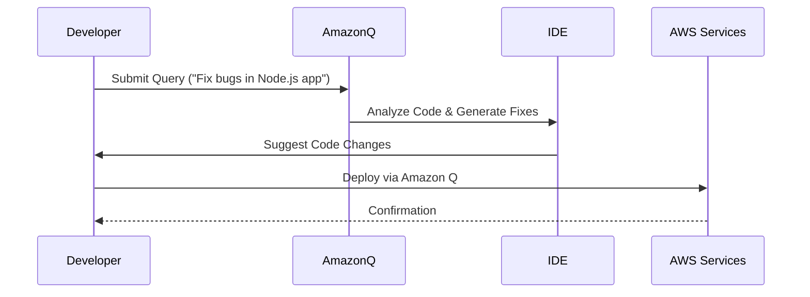
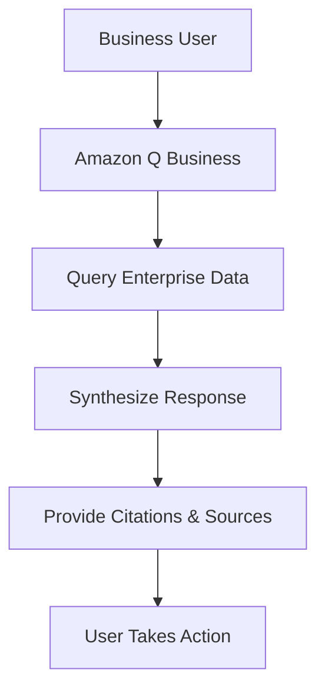

# Q

## Amazon Q

### 🌟 **1. Overview & Innovation Spotlight**

**Amazon Q** is a **generative AI-powered assistant** designed to accelerate software development and enhance business decision-making by leveraging companies' internal data. It offers specialized capabilities for developers, business analysts, and other professionals, enabling them to automate tasks, generate insights, and streamline workflows securely. Built on **Amazon Bedrock**, it utilizes multiple foundation models (FMs) to provide context-aware responses and actions tailored to organizational needs .

<figure><figcaption></figcaption></figure>

**🛠️ Innovation Spotlight**:

* **Agentic Capabilities**: Amazon Q can autonomously perform multi-step tasks, such as code generation, testing, and deployment, reducing manual effort by up to 80% .
* **Generative BI Integration**: In Amazon QuickSight, it allows business analysts to create dashboards and visualizations using natural language, accelerating data-driven decision-making .
* **Customizable Plugins**: Supports over 40 prebuilt connectors for enterprise systems (e.g., Salesforce, Slack) and allows custom plugins for unique workflows .

***

### 🔍 **2. Problem Statement & Business Use Cases**

**Real-World Scenario**: A financial institution struggles with slow software development cycles and inefficient data retrieval processes. Developers spend only 30% of their time coding, while business analysts waste hours searching for insights across disparate systems. Amazon Q addresses this by automating coding tasks and providing instant access to enterprise data .

**Industries/Applications**:

* **Software Development**: Accelerates coding, testing, and debugging for developers .
* **Business Intelligence**: Helps analysts generate reports and dashboards in QuickSight .
* **Supply Chain Management**: Provides operational insights in AWS Supply Chain .
* **Customer Service**: Enhances Amazon Connect with real-time AI-driven responses .
* **Healthcare**: Securely processes patient data for compliance and analytics .

***

### ⚙️ **3. Core Principles & Key Components**

* **Multi-Model Architecture**: Leverages Amazon Bedrock to route tasks to the most suitable FM (e.g., Titan, GPT) for accuracy .
* **Enterprise Integration**: Connects to 50+ business tools (e.g., S3, SharePoint) for seamless data access .
* **Natural Language Processing**: Understands contextual queries and maintains conversation memory .
* **Security & Privacy**: Enforces IAM roles and encryption, ensuring data isolation and compliance .

***

### 📋 **4. Pre-Requirements**

* **AWS Account**: With IAM permissions for Amazon Q and integrated services .
* **Data Sources**: Configure S3 buckets, databases, or SaaS applications for data retrieval .
* **Subscription Plan**: Choose between Amazon Q Business Lite/Pro or Developer Pro based on needs .

***

### 🛠️ **5. Implementation Steps**

1. **Enable Amazon Q**: In AWS Console, subscribe to Amazon Q Business or Developer .
2. **Connect Data Sources**: Use prebuilt connectors to link enterprise systems (e.g., Salesforce, S3) .
3. **Configure Access Controls**: Set IAM policies to restrict data access based on user roles .
4. **Customize Workflows**: Use plugins or APIs for task automation (e.g., code generation, report creation) .
5. **Monitor Usage**: Track metrics via CloudWatch and refine prompts for better accuracy .

***

### 🔄 **6. Data Flow Diagram**

**Diagram 1: Amazon Q Developer Workflow**

**Diagram 2: Amazon Q Business Data Retrieval**

***

### 🔒 **7. Security Measures**

* **Data Encryption**: All data encrypted in transit (TLS) and at rest (KMS) .
* **Access Control**: IAM policies ensure users only access authorized data .
* **Compliance**: HIPAA eligible and supports FedRAMP for regulated industries .
* **Private Connectivity**: AWS PrivateLink allows secure VPC access .

***

### 💡 **8. Innovation Spotlight: Agentic RAG & Custom Apps**

* **Agentic RAG**: Enhances retrieval-augmented generation with multi-step reasoning for accurate responses .
* **Amazon Q Apps**: Lets users build AI apps without code by describing requirements in natural language .
* **Browser Extensions**: Integrates with Chrome/Firefox to summarize web pages or files during chats .

***

### ⚖️ **9. When to Use and When Not to Use**

| **When to Use**                                                                      | **When NOT to Use**                                                                     |
| ------------------------------------------------------------------------------------ | --------------------------------------------------------------------------------------- |
| **Complex Codebases**: Onboarding new developers or maintaining legacy systems .     | **Simple Queries**: Basic questions already covered by existing tools or documentation. |
| **Enterprise Data Silos**: Needing unified insights across CRM, ERP, and databases . | **Highly Specialized Domains**: Niche areas requiring domain experts rather than AI.    |
| **Automated Workflows**: Repetitive tasks like code reviews or report generation .   | **Offline Environments**: No internet access for real-time AI processing.               |

***

### 💰 **10. Costing Calculation**

* **Pricing Models**:
  * **Amazon Q Business**: Lite ($0) and Pro (custom pricing) tiers .
  * **Amazon Q Developer**: Pro tier at $20/month per user .
* **Cost Optimization**:
  * Use Lite tiers for basic queries and upgrade to Pro for advanced features .
  * Cache frequent responses to reduce API calls .
* **Example Calculation**:
  * 50 Developer Pro users + Business Pro tier = \~$1,000/month + custom enterprise pricing .

***

### 🔁 **11. Alternative Services**

| **AWS**                                     | **Azure**                        | **GCP**                         | **On-Premise**                         |
| ------------------------------------------- | -------------------------------- | ------------------------------- | -------------------------------------- |
| **Amazon Q**                                | **Azure OpenAI**                 | **Google Duet AI**              | **OpenSource LLMs**                    |
| Native AWS integration, enterprise-focused. | Microsoft ecosystem integration. | Google Workspace compatibility. | Requires self-hosting and maintenance. |

***

### ✅ **12. Benefits**

* **Productivity Boost**: Developers report 50% code acceptance rates and faster task completion .
* **Data-Driven Decisions**: Business users access insights without technical expertise .
* **Security**: Built-in compliance and data isolation meet enterprise standards .
* **Scalability**: Handles millions of queries with pay-per-use pricing .

***

### 🚀 **13. Innovation Spotlight: IDE Integration & CLI Tools**

* **IDE Plugins**: Supports VS Code, JetBrains, and even Neovim for real-time code suggestions .
* **AWS Console-to-Code**: Generates infrastructure code from console actions .
* **CLI Automation**: Provides shell commands for AWS services via natural language .

***

### 📊 **14. Summary**

Amazon Q transforms enterprises by automating development and business tasks with generative AI. Key takeaways:

1. **Use for Automation**: Ideal for code generation, data queries, and workflow orchestration .
2. **Leverage Integrations**: Connect to 50+ tools for seamless data access .
3. **Ensure Security**: Implement IAM policies and encryption for compliance .
4. **Choose Right Tier**: Start with Lite tiers and scale to Pro for advanced needs .
5. **Explore Innovations**: Utilize agentic RAG and custom apps for unique use cases .

***

### 🔗 **15. Related Topics & References**

* [**Amazon Q Documentation**](https://docs.aws.amazon.com/amazonq/latest/qbusiness-ug/what-is-amazonq.html): Detailed guides for developers and business users .
* [**AWS Free Courses**](https://aws.amazon.com/training/ai-ready/): "AI Ready" initiative for Amazon Q training .
* [**Case Studies**](https://aws.amazon.com/q/): BT Group and National Australia Bank success stories .
* [**GitHub Plugin**](https://github.com/awslabs/amazonq.nvim): Neovim integration for Amazon Q Developer .

For hands-on learning, explore the [**Amazon Q Workshop**](https://aws.amazon.com/getting-started/hands-on/build-generative-ai-apps-with-amazon-bedrock/) or start a free trial via [**AWS Console**](https://console.aws.amazon.com/q/).
