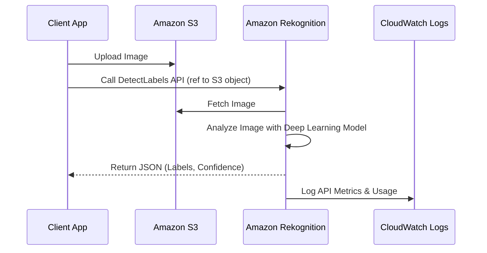
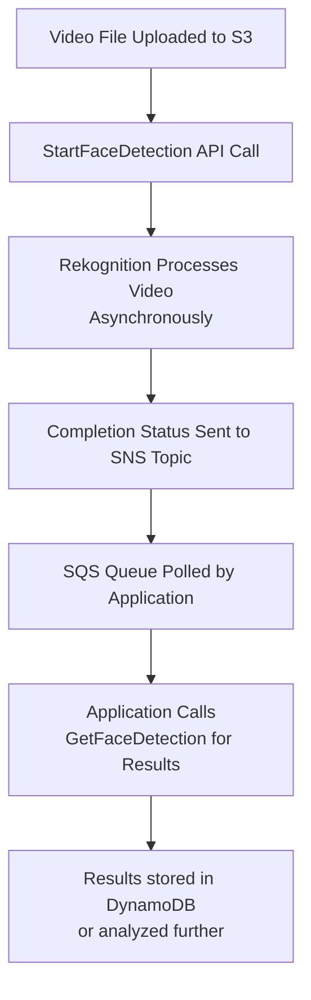

# Rekognition

## Amazon Rekognition

### 🧠 Overview

**Amazon Rekognition** is a **fully managed, deep learning-powered service** for analyzing images and videos at scale. It allows developers to add sophisticated computer vision capabilities to applications without needing machine learning expertise. Rekognition can identify objects, people, text, scenes, and activities, and detect inappropriate content, all from a simple API call.

<figure><figcaption></figcaption></figure>

### :innocent: Innovation Spotlight

> **🛠️ Innovation Spotlight:** Rekognition's core innovation lies in its use of **large-scale, self-supervised learning** models trained on billions of images. This allows it to perform highly accurate facial analysis and comparison, even with non-ideal lighting or angles. A key recent innovation is its **User Verification** feature, which uses "liveness detection" to prevent spoofing with photos or masks—a critical capability for secure authentication workflows.

***

### ⚡ Problem Statement

* **Real-World Scenario:** A major social media platform, "PhotoShare," needs to automatically moderate millions of user-uploaded images daily to prevent the sharing of inappropriate, harmful, or copyrighted content. Manual review is impossible at this scale. Furthermore, users want to automatically tag friends in photos and search their photo libraries for specific objects (e.g., "my dog at the beach").

### 🤝 Business Use Cases

* **Industries/Applications:**
  * **Media & Entertainment:** Automate content moderation, add metadata tags for searchability, and create highlight reels by detecting key events in videos.
  * **Retail & E-commerce:** Enable visual search (e.g., "find products similar to this image"), detect logos of partner brands in social media posts, and manage digital asset libraries.
  * **Security & Identity:** Implement facial recognition for physical access control, user verification for mobile apps, and public safety applications (e.g., finding lost children in crowds—with appropriate ethical and legal safeguards).
  * **Healthcare (Non-Diagnostic):** Analyze medical imagery for non-diagnostic purposes, such as categorizing X-rays or CT scans by body part or detecting the presence of medical equipment.

***

### 🔥 Core Principles

* **Facial Analysis:** Detects faces within an image and provides attributes like **gender expression**, **age range**, **emotions** (e.g., happy, sad), **face pose**, and the presence of accessories (eyeglasses, sunglasses) or facial hair.
* **Facial Comparison:** Calculates a similarity score between faces found in two different images. This is the core of identity verification.
* **Face Search:** You create a server-side "**collection**" of face vectors. Rekognition can then search this collection for faces that match a face detected in a new image.
* **Celebrity Recognition:** Identifies tens of thousands of globally recognized celebrities in images and videos.
* **Pathing:** For videos, it can track the path a person or object takes through the frames.
* **Content Moderation:** Detects explicit and suggestive adult content, and violent content, making it suitable for keeping user-generated content safe.
* **Text Detection (OCR):** Extracts text and numbers from images (e.g., from street signs, license plates, or product labels).
* **Label Detection:** Identifies objects (e.g., car, dog, furniture), scenes (e.g., beach, night), activities (e.g., playing soccer), and concepts.

***

### 📋 Pre-Requirements

* **An AWS Account** with appropriate IAM permissions to call the Rekognition API.
* **Source Data:** Images or videos stored in **Amazon S3** (or provided as bytes in an API call for images).
* **Processing Destination:** For asynchronous video analysis, an **Amazon SNS topic** and optionally an **SQS queue** to receive processing completion status.
* **For Face Search:** A provisioned **Rekognition Collection**.

***

### 👣 Implementation Steps

**Part A: Analyzing an Image for Objects and Scenes**

1. **Upload Image:** Place your image (e.g., `beach.jpg`) in an S3 bucket.
2.  **Call API:** Use the AWS CLI, SDK, or console to call `detect_labels`.

    ```bash
    aws rekognition detect-labels \
        --image '{"S3Object":{"Bucket":"your-bucket-name","Name":"beach.jpg"}}' \
        --max-labels 10
    ```
3. **Parse Response:** Review the JSON response containing detected labels and confidence scores.

**Part B: Setting Up Video Analysis for Content Moderation**

1. **Create SNS Topic:** Create a topic to receive a notification when video analysis is complete.
2. **Grant Permissions:** Allow Rekognition to publish to your SNS topic.
3. **Start Video Analysis:** Call `start-content-moderation`, providing the S3 video location and the SNS topic ARN.
4. **Process Results:** When you receive the SNS notification, call `get-content-moderation` to retrieve the detailed results.

***

### 🗺️ Data Flow Diagram

**Diagram 1: Real-Time Image Analysis**



**Diagram 2: Asynchronous Video Analysis Pipeline**



***

### 🔒 Security Measures

* **Data Encryption:** All data is **encrypted in transit** (TLS) and **at rest** in S3 (SSE-S3 or SSE-KMS). Rekognition itself also encrypts data at rest.
* **IAM Least Privilege:** Use fine-grained IAM policies to grant only the necessary API actions (e.g., `rekognition:CompareFaces`) on specific S3 buckets.
* **No Data Retention:** By default, Rekognition **does not store** the images or videos you analyze. It only persists the metadata you explicitly ask it to (e.g., faces in a collection).
* **VPC Endpoints (AWS PrivateLink):** Use a VPC endpoint (`com.amazonaws.region.rekognition`) to keep all traffic between your VPC and Rekognition within the AWS network, never traversing the public internet.

***

### ✔️ Deep Dive: Liveness Detection for User Verification

This is a critical anti-spoofing innovation. Instead of just comparing two static images, Rekognition can verify that a real person is present during the verification process.

1. The application requests a **live video session** of the user.
2. Rekognition provides a set of prompts (e.g., "turn your head," "blink").
3. It analyzes the short video stream to confirm the 3D depth and non-static nature of the face, defeating attempts to use a printed photo, digital screen, or mask.
4. Only after confirming liveness does it perform the facial comparison. This combines **presentation attack detection** with identity verification in a single API call.

***

### ⚖️ When to use and when not to use

| ✅ When to Use                                                                                 | ❌ When NOT to Use                                                                                                                                                  |
| --------------------------------------------------------------------------------------------- | ------------------------------------------------------------------------------------------------------------------------------------------------------------------ |
| **Content Moderation:** Automating the review of user-generated content.                      | **Real-Time Video Streams:** For live video analysis, use **Amazon Rekognition Video Streams** instead of the standard async API.                                  |
| **Identity Verification:** Secure user onboarding and authentication with liveness detection. | **Fine-Grained Custom Models:** If you need to identify specific machine parts or unique animal breeds, use **Rekognition Custom Labels** to train your own model. |
| **Metadata Generation:** Automatically tagging large libraries of images and videos.          | **Diagnostic Medicine:** It is not FDA-approved for making diagnostic decisions.                                                                                   |
| **Public Safety:** Finding missing persons (with strict governance policies).                 | **Simple OCR:** For scanning documents, **Amazon Textract** is a more specialized and accurate service.                                                            |

***

### 💰 Costing Calculation

* **How it's calculated?**
  * **Images:** Priced per image analyzed. Different operations have different costs (e.g., `DetectLabels` is cheaper than `CompareFaces`).
  * **Video:** Priced per minute of video analyzed. There is a one-minute minimum per video.
  * **Face Metadata Storage:** Storing faces in a **collection** costs per month per 1,000 faces.
* **Efficient Handling:**
  * For video, batch process videos together to minimize the per-video minute minimum charge.
  * Use **content moderation** early in user upload workflows to avoid processing unwanted content further.
  * Cache results if you expect to analyze the same image multiple times.
* **Sample Calculation:**
  * Analyze 100,000 user profile pictures with `DetectLabels`: `100,000 * $0.0010 = $100`
  * Analyze 100 hours of uploaded video for moderation: `(100 hrs * 60 mins) * $0.10 = $600`
  * **Total Estimated Monthly Cost: $700** (plus any face collection storage costs)

***

### ⛕ Alternative Services

| AWS                                                              | Azure                                        | GCP                                           | On-Premise / Open Source                                                              |
| ---------------------------------------------------------------- | -------------------------------------------- | --------------------------------------------- | ------------------------------------------------------------------------------------- |
| **Amazon Rekognition**                                           | **Azure Computer Vision** & **Face API**     | **Google Cloud Vision API** & **Video AI**    | **OpenCV with DNN modules**                                                           |
| Tight AWS integration, strong face features, liveness detection. | Strong integration with Microsoft ecosystem. | Google's deep learning expertise, strong OCR. | Full control, no cost per call, requires significant ML expertise and infrastructure. |

***

### ✅ Benefits

* **High Accuracy:** Leverages Amazon's deep learning expertise and massive training datasets.
* **Scalability:** Instantly analyzes from one to millions of images without managing infrastructure.
* **Cost-Effective:** Pay-per-use pricing; no upfront costs or commitments.
* **Ease of Use:** Simple API calls abstract away the immense complexity of deep learning models.
* **Security & Privacy:** Built with enterprise-grade security and a commitment to responsible AI.

***

### 💡 Innovation Spotlight: Custom Labels

Rekognition Custom Labels allows you to **train a custom image classification model** using only your own labeled images. This is revolutionary because:

* **No ML Expertise Required:** You just upload images (e.g., 30 images of "defective parts" and 30 of "good parts") and Rekognition handles the training.
* **High Accuracy with Small Datasets:** It uses **transfer learning**, starting with its pre-trained model, so it can achieve high accuracy with far fewer images than training from scratch.
* **Specific Use Cases:** Perfect for manufacturing quality control, identifying specific product types, or classifying unique categories not covered by generic labels.

***

### 📝 Summary

Amazon Rekognition democratizes advanced computer vision, allowing any developer to build powerful image and video analysis applications that were previously only available to tech giants.

**Top 7 Points to Keep in Mind:**

1. It is a **deep learning-based API service** for images and videos, not a rules-based filter.
2. **Data is not stored** by default; it is ephemerally processed for your request.
3. **Pricing is based on usage** (images processed, video minutes analyzed).
4. For secure authentication, always use the **User Verification** API with liveness detection to prevent spoofing.
5. Use **Custom Labels** to solve unique image classification problems specific to your business.
6. For video, remember it's **asynchronous**; you must use SNS/SQS to get results.
7. Implement **strong IAM policies** and consider **VPC Endpoints** for security and compliance.

***

### 🔗 Related Topics & Reference Links

* **AWS Documentation:** [Amazon Rekognition Developer Guide](https://docs.aws.amazon.com/rekognition/latest/dg/what-is.html)
* **Responsible AI:** [AWS Responsible AI Policy](https://aws.amazon.com/machine-learning/responsible-ai/)
* **Blog:** [Introducing Liveness Detection for Amazon Rekognition](https://aws.amazon.com/blogs/machine-learning/introducing-liveness-detection-for-amazon-rekognition/)
* **Workshop:** [Building a Serverless Image Analysis Pipeline](https://aws.amazon.com/getting-started/hands-on/analyze-images-with-amazon-rekognition/)
* **Related AWS Services:** Amazon Textract (for documents), Amazon SageMaker (for building custom ML models), AWS Lambda (for serverless processing).
