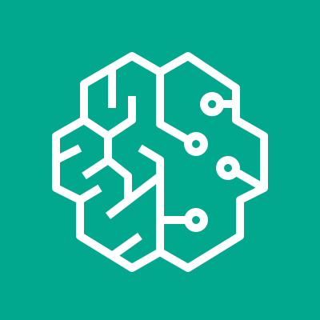
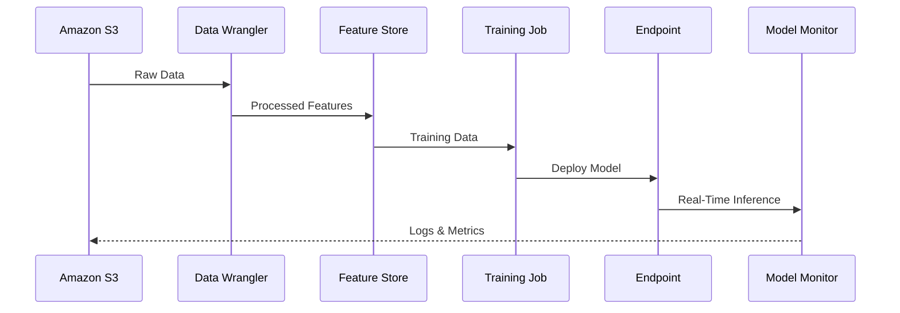
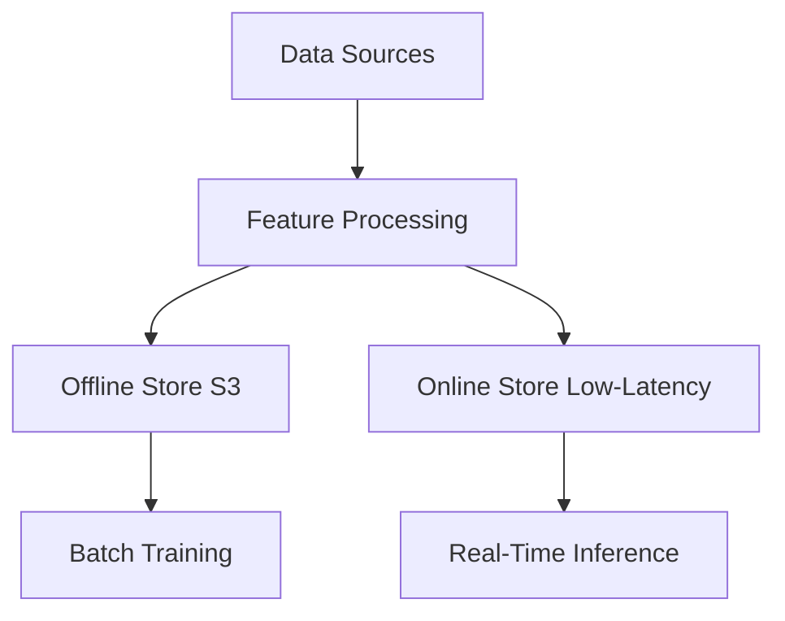

# SageMaker AI

##  Amazon SageMaker AI

### 🌟 Overview

**Amazon SageMaker AI** (formerly Amazon SageMaker) is a **fully managed, end-to-end machine learning (ML) service** that enables developers and data scientists to build, train, deploy, and monitor ML models at scale. It integrates a wide range of tools and capabilities specifically built for ML, simplifying the entire workflow from data preparation to model deployment. SageMaker AI is part of the next-generation **Amazon SageMaker platform**, which unifies data, analytics, and AI services under a single umbrella.

<figure><figcaption></figcaption></figure>

### Innovation Spotlight

**🛠️ Innovation Spotlight**:

* **Unified Studio (Preview)**: A single development environment for accessing AWS analytics and AI/ML services (e.g., Amazon EMR, AWS Glue, Athena, Redshift, and Bedrock).
* **Generative AI Integration**: Leverages **Amazon Q Developer** for natural language assistance in code generation, SQL query creation, and data exploration.
* **SageMaker HyperPod**: Provides a persistent ML environment on elastic clusters for training large-scale models like LLMs and diffusion models.

***

### ⚡ Problem Statement

**Real-World Scenario**: A healthcare organization needs to develop a predictive model for patient readmission risk. The process involves data preprocessing, feature engineering, model training, and deployment. Manual orchestration of these steps is time-consuming and error-prone. SageMaker AI automates this workflow, ensuring scalability, compliance, and real-time insights.

### 🤝 Business Use Cases

**Industries/Applications**:

* **Healthcare**: Predictive analytics for patient outcomes and medical image analysis.
* **Finance**: Fraud detection, risk assessment, and algorithmic trading.
* **Retail**: Demand forecasting, personalized recommendations, and inventory management.
* **Manufacturing**: Predictive maintenance and quality control using IoT data.

***

### ⚙️ Core Principles & Key Components

SageMaker AI encompasses a broad set of features, organized into the following categories :

* **Data Preparation**:
  * **SageMaker Data Wrangler**: Import, analyze, and feature engineer data with minimal code.
  * **Feature Store**: Centralized repository for ML features, with **online store** (low-latency real-time inference) and **offline store** (historical data for training and batch inference).
* **Model Development**:
  * **SageMaker Autopilot**: Automatically builds classification and regression models for users unfamiliar with ML.
  * **SageMaker Experiments**: Tracks and manages ML experiments for reproducibility.
* **Training & Optimization**:
  * **SageMaker Training Compiler**: Accelerates deep learning model training on GPU instances.
  * **SageMaker HyperPod**: Supports large-scale distributed training for LLMs.
* **Deployment & Monitoring**:
  * **Real-Time Endpoints**: Low-latency inference with auto-scaling.
  * **SageMaker Model Monitor**: Detects data drift and deviations in model performance.
* **Generative AI & Collaboration**:
  * **Amazon Bedrock IDE**: Develop generative AI applications.
  * **Shared Spaces**: Collaborative environments for teams to share resources and code.

***

### 📋 Pre-Requirements

* **AWS Account**: With IAM roles granting permissions to SageMaker AI and related services (e.g., `AmazonSageMakerFullAccess`).
* **Data Sources**: Data stored in Amazon S3, Redshift, or other supported repositories.
* **Network Configuration**: VPC, subnets, and security groups for network isolation if needed.

***

### 👣 Implementation Steps

1. **Data Preparation**:
   * Use **SageMaker Data Wrangler** to clean and transform data.
   * Create a **Feature Group** in Feature Store for engineered features.
2. **Model Training**:
   * Utilize **SageMaker Autopilot** for automated model building or **SageMaker Training** for custom training jobs.
3. **Model Deployment**:
   * Deploy models to **real-time endpoints** or **serverless endpoints** for inference.
4. **Monitoring & Governance**:
   * Enable **SageMaker Model Monitor** to track production model performance.
   * Use **SageMaker Model Registry** for version control and approval workflows.

***

### 🔄 Data Flow Diagram

**Diagram 1: End-to-End ML Workflow**

**Diagram 2: Feature Store Architecture**

***

### 🔒 Security Measures

* **Encryption**: Data encrypted at rest (AWS KMS) and in transit (TLS).
* **IAM & VPC**: Least-privilege access policies and network isolation via VPC.
* **Compliance**: HIPAA eligibility and SOC certifications for regulated industries.

***

### 💡 Innovation Spotlight: Next-Gen SageMaker

The next-generation SageMaker platform unifies data, analytics, and AI with :

* **SageMaker Lakehouse**: Integrates data from Amazon S3 data lakes, Redshift data warehouses, and third-party sources.
* **SageMaker Catalog**: Built on Amazon DataZone, providing unified data and AI governance.
* **Unified Studio**: A single IDE for analytics and AI development, leveraging services like EMR, Glue, and Athena.

***

### ⚖️ When to Use and When Not to Use

| **✅ When to Use**                                                         | **❌When NOT to Use**                                                    |
| ------------------------------------------------------------------------- | ----------------------------------------------------------------------- |
| **End-to-End ML Workflows**: From data prep to deployment.                | **Simple Analytics**: Basic SQL queries (use Athena or Redshift alone). |
| **Large-Scale Training**: Distributed training for LLMs.                  | **Real-Time Streaming**: Use Kinesis or Managed Streaming for Kafka.    |
| **Generative AI Development**: Building applications with Amazon Bedrock. | **Static Workflows**: Infrequent tasks with minimal complexity.         |

***

### 💰 Costing Calculation

* **Pricing Models**:
  * **Training**: Based on instance hours (e.g., `ml.p3.2xlarge` at $3.06/hour).
  * **Inference**: Real-time endpoints charge for instance hours; serverless endpoints per GB-second and request.
  * **Feature Store**: Online store ($0.21/hour per GB); offline store ($0.10/GB-month).
* **Cost Optimization**:
  * Use **serverless endpoints** for sporadic traffic.
  * **Archive data** to S3 Glacier for long-term storage.

***

### 🔁 Alternative Services

| **AWS**                                 | **Azure**                    | **GCP**                            | **On-Premise**                         |
| --------------------------------------- | ---------------------------- | ---------------------------------- | -------------------------------------- |
| **SageMaker AI**                        | **Azure Machine Learning**   | **Google Vertex AI**               | **Kubeflow**                           |
| Integrated AWS services, end-to-end ML. | Azure ecosystem integration. | Google AI stack, Vertex Pipelines. | Open-source, requires self-management. |

***

### ✅ Benefits

* **End-to-End Integration**: Simplifies ML workflows with managed services.
* **Scalability**: Handles large-scale training and deployment effortlessly.
* **Cost-Efficiency**: Pay-per-use pricing with no upfront costs.
* **Security & Compliance**: Enterprise-grade encryption and governance.

***

### 🚀 Innovation Spotlight: SageMaker HyperPod & Training Plans

* **HyperPod Recipes**: Execute recipes for end-to-end training workflows based on NVIDIA NeMo.
* **Training Plans**: Reserve GPU capacity for large-scale training with predictable pricing.

***

### 📊 Summary

Amazon SageMaker AI provides a comprehensive, managed platform for building, training, and deploying ML models at scale. Key takeaways:

1. **Unified Platform**: Integrates data, analytics, and AI under SageMaker.
2. **Automation**: Tools like Autopilot and Data Wrangler reduce manual effort.
3. **Scalability**: HyperPod and training plans support large-scale LLM training.
4. **Security**: IAM, encryption, and compliance meet enterprise standards.
5. **Cost Optimization**: Use serverless options and archival strategies to manage costs.

***

### 🔗 Related Topics & References

* [**SageMaker AI Documentation**](https://docs.aws.amazon.com/sagemaker/latest/dg/whatis.html): Detailed guides on features and APIs.
* [**SageMaker Unified Studio**](https://docs.aws.amazon.com/sagemaker/latest/dg/studio.html): Preview of the unified IDE.
* [**Feature Store Examples**](https://docs.aws.amazon.com/sagemaker/latest/dg/feature-store-feature-processor-examples.html): Code samples for feature engineering.
* [**Training Plans**](https://docs.aws.amazon.com/sagemaker/latest/dg/training-plan-creation.html): Guide to reserving compute capacity.

For hands-on learning, explore the [**SageMaker Workshop**](https://aws.amazon.com/getting-started/hands-on/build-machine-learning-model-sagemaker/) or start with [**SageMaker Studio**](https://docs.aws.amazon.com/sagemaker/latest/dg/studio.html).
