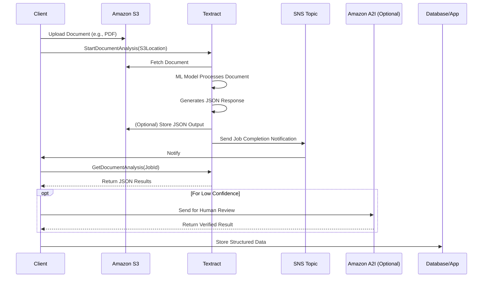
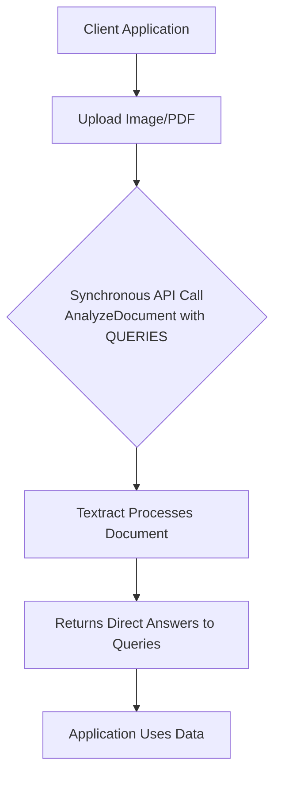

# Textract

##  Amazon Textract

### 🌟 **1. Overview & Innovation Spotlight**

**Amazon Textract** is a **fully managed machine learning (ML) service** that goes beyond simple Optical Character Recognition (OCR) to automatically extract text, handwriting, layout elements, and structured data from scanned documents. It intelligently identifies and understands the context of information within documents, such as forms, tables, and key-value pairs, transforming unstructured document data into a structured, usable format without manual effort.

<figure><figcaption></figcaption></figure>

> **🤖 Innovation Spotlight:** Textract's most significant innovation is its use of **deep learning models** to understand the contextual relationships between pieces of information in a document. Unlike traditional OCR which merely recognizes characters, Textract can comprehend that "First Name:" (the key) is associated with "John" (the value), and that data in a specific table cell belongs to a certain row and column header. A key recent advancement is the **Layout feature**, which automatically identifies and sequences textual elements (e.g., paragraphs, titles, headers, footers) according to human reading patterns, significantly enhancing efficiency for generative AI document processing tasks.

***

### ⚡ Problem Statement

* **Real-World Scenario:** A global financial institution processes thousands of mortgage applications daily. Each application packet contains hundreds of pages of diverse documents—tax forms (W-2s), pay stubs, bank statements, and identity documents. Manually extracting data from these documents is incredibly slow, error-prone, and expensive, leading to customer onboarding delays of days or weeks. Amazon Textract automates this extraction with high accuracy, reducing processing time to minutes and freeing human agents for higher-value tasks.

### 🤝 Business Use Cases

* **Industries/Applications:**
  * **Financial Services:** Automate loan processing (Analyze Lending API), extract data from invoices, and process insurance claims.
  * **Healthcare:** Digitize patient intake forms, lab reports, and insurance claims (HIPAA-eligible) while redacting Protected Health Information (PHI) for compliance.
  * **Public Sector:** Process tax forms, applications for benefits, and other government documents.
  * **Legal & HR:** Analyze contracts to extract critical clauses, dates, and parties involved, and parse resumes to populate applicant tracking systems.
  * **Supply Chain & Procurement:** Automate data extraction from purchase orders and invoices to streamline accounts payable and inventory management.

***

### 🔥 Core Principles & Service Terms

* **Text Detection:** The foundational OCR capability that extracts printed and handwritten text from any document, returning each word and line with its spatial geometry.
* **Layout Analysis:** A powerful feature that identifies and groups text into logical, semantic elements like **titles** (`LAYOUT_TITLE`), **paragraphs** (`LAYOUT_TEXT`), **headers**, **footers**, **page numbers**, and **lists**, presenting them in the correct human reading order.
* **Form Extraction (Key-Value Pair Detection):** Identifies form fields (keys) and their associated values (e.g., "Date of Birth:" -> "01/01/1980"), preserving their relationship without needing manual rules.
* **Table Extraction:** Detects and extracts tabular data while maintaining the structural relationship between cells, rows, and columns, allowing for easy migration into databases.
* **Queries:** Allows you to ask natural language questions of a document (e.g., "What is the invoice number?") and receive precise answers, eliminating the need to parse the entire document structure.
* **Specialized Document Analysis:**
  * **Analyze ID:** Optimized for identity documents like passports and driver's licenses to extract explicit fields (e.g., expiry date) and implicit information (e.g., name, address).
  * **Analyze Expense:** Tailored for invoices and receipts to extract vendor name, line items, totals, and payment terms, even from varied layouts.
  * **Analyze Lending:** A pre-configured API for mortgage processing that automatically classifies document types within a loan package and extracts relevant data.

***

### 📋 Pre-Requirements

* **An AWS Account** with appropriate IAM permissions to access Textract and related services like S3.
* **Data Source:** Documents (PDF, PNG, JPEG, TIFF) stored in an **Amazon S3 bucket** for asynchronous processing or provided as byte arrays for synchronous API calls.
* **For Custom Queries:** A set of sample documents (as few as 10) to train a custom adapter for improved accuracy on specific document types.
* **For Human Review:** An Amazon Augmented AI (A2I) workflow configuration to route low-confidence predictions for manual verification.

***

### 👣 Implementation Steps

**Part A: Batch Processing a Multi-Page Document from S3**

1. **Upload Document:** Place your document (e.g., `loan-application.pdf`) in an S3 bucket.
2. **Start Document Analysis:** Call the `StartDocumentAnalysis` API (asynchronous) specifying the S3 location and the features you need (e.g., `TABLES`, `FORMS`).
3. **Handle Response:** The API returns a Job ID. Textract processes the document asynchronously.
4. **Get Results:** Poll using `GetDocumentAnalysis` with the Job ID or configure an SNS topic to receive a notification upon completion.
5. **Parse JSON Response:** The response contains a detailed JSON structure with all detected `Blocks` (Pages, Lines, Key-Value pairs, Tables, etc.), their geometry, and confidence scores.

**Part B: Using Natural Language Queries**

1.  **Call `AnalyzeDocument` with Queries:** Use the synchronous `AnalyzeDocument` API, providing the document and a list of natural language queries.

    ```bash
    aws textract analyze-document \
        --document '{"S3Object":{"Bucket":"your-bucket","Name":"invoice.png"}}' \
        --feature-types '["QUERIES"]' \
        --queries-config '{"Queries":[{"Text":"What is the invoice number?"},{"Text":"What is the total amount due?"}]}'
    ```
2. **Extract Answers:** The response will contain direct answers to your queries from the document.

***

### 🔄 Data Flow Diagram

**Diagram 1: Asynchronous Document Processing Pipeline**



**Diagram 2: Real-Time Query Processing**



***

### 🔒 Security Measures

* **Encryption:** All data is **encrypted in transit** using TLS and **at rest** using AWS Key Management Service (KMS) or S3 server-side encryption (SSE-S3).
* **HIPAA Compliance:** Textract is HIPAA-eligible, making it suitable for processing healthcare documents containing PHI.
* **Data Privacy & Isolation:** Your document data is not used to train Textract's underlying ML models. It is processed in an isolated and secure environment.
* **PII Redaction:** Can automatically detect and redact Personally Identifiable Information (PII) like names, addresses, and passport numbers.
* **VPC Endpoints (AWS PrivateLink):** Allows you to create a private connection between your VPC and Textract without going over the public internet.

***

### 💡 Deep Dive: Layout Analysis for Generative AI

The **Layout feature** is a game-changer for preparing documents for Large Language Models (LLMs). LLMs are highly sensitive to the order and structure of input text.

* **The Problem:** Traditional OCR often returns text in a "raster-scan" order (top-to-bottom, left-to-right), which destroys the logical reading order in multi-column documents, making the output confusing for LLMs.
* **The Solution:** Textract's Layout intelligently identifies elements like paragraphs, titles, and lists, and sequences them correctly. This **"linearized" text** dramatically improves the performance of LLM-based tasks like:
  * **Retrieval Augmented Generation (RAG):** Provides better context for more accurate Q\&A.
  * **Summarization:** Creates more coherent and contextually accurate summaries.
  * **Entity Recognition:** Improves accuracy for extracting names, dates, and other entities. Studies have shown that using Layout-aware text with Anthropic's Claude model on Amazon Bedrock led to significant improvements in ROUGE scores for abstractive tasks and ANLS scores for extractive tasks compared to raster-scan text.

***

### ⚖️ When to Use and When Not to Use

| ✅ When to Use                                                                                                                                                 | ❌ When NOT to Use                                                                                                                                                         |
| ------------------------------------------------------------------------------------------------------------------------------------------------------------- | ------------------------------------------------------------------------------------------------------------------------------------------------------------------------- |
| **Structured Document Processing:** Extracting data from forms, tables, invoices, and IDs with high accuracy.                                                 | **Simple Text Extraction:** If you only need to extract plain text from a well-formatted document without needing structured data, simpler/cheaper OCR tools may suffice. |
| **High-Volume, Variable Layouts:** Processing thousands of documents where each may have a slightly different layout (e.g., invoices from different vendors). | **On-Premises Processing:** Strict requirements where data cannot leave your on-premises data center. Textract is a cloud-only service.                                   |
| **Generative AI Preprocessing:** Preparing documents for RAG pipelines where correct reading order is critical for LLM performance.                           | **Custom Field Extraction without Queries:** Extracting very unique, non-standard fields from a document without using the Queries feature may require post-processing.   |
| **Compliance-Sensitive Workloads:** Processing healthcare or financial documents requiring HIPAA compliance and audit trails.                                 | **Real-Time, Low-Latency Stream Processing:** For analyzing video text frames in real-time, other services like Amazon Rekognition Video might be more appropriate.       |

***

### 💰 Costing Calculation

* **How it's calculated?**
  * **Pricing is per page** processed (a page is considered a single image or a PDF page).
  * Cost varies based on the API used:
    * **DetectDocumentText (OCR-only):** Lower cost per page.
    * **AnalyzeDocument (Forms & Tables):** Higher cost per page.
    * **AnalyzeExpense / AnalyzeID / AnalyzeLending:** Specific pricing for these specialized operations.
  * **No minimum fees or upfront commitments;** you pay only for what you use.
* **Efficient Handling:**
  * Use the **right API for the job.** Don't use `AnalyzeDocument` if you only need raw text.
  * For multi-page documents, use **asynchronous** operations to avoid timeouts and handle larger files.
  * **Cache results** if you need to analyze the same document multiple times.
  * Use **confidence scores** to only send low-confidence extractions for human review via A2I, optimizing cost.
* **Sample Calculation:**
  * Process **10,000 invoice pages** per month using `AnalyzeExpense`.
  * Assume a blended rate of **$0.015 per page** (for illustration; check latest pricing).
  * **Monthly Cost: 10,000 \* $0.015 = $150.**

***

### ⛕ Alternative Services

| AWS                                                                           | Azure                                                                | GCP                                                           | On-Premise / Open Source                                                                                |
| ----------------------------------------------------------------------------- | -------------------------------------------------------------------- | ------------------------------------------------------------- | ------------------------------------------------------------------------------------------------------- |
| **Amazon Textract**                                                           | **Azure Form Recognizer**                                            | **Google Document AI**                                        | **Tesseract OCR**                                                                                       |
| Deep AWS ecosystem integration, strongest on layout and queries for LLM prep. | Tight integration with Microsoft Power Platform and Azure ecosystem. | Strong integration with Google's AI and data analytics suite. | Free and open-source. Requires significant manual effort for structuring data, tuning, and maintenance. |

***

### ✅ Benefits

* **Beyond OCR:** Understands context and relationships in data, providing structured output instead of just text.
* **High Accuracy:** Leverages continuously improving AWS ML models to achieve high accuracy even on handwritten text and complex layouts.
* **Scalability:** Automatically scales to process millions of pages without managing any infrastructure.
* **Cost Reduction:** Drastically reduces manual data entry costs and errors, accelerating business processes.
* **Ease of Use:** No ML expertise required. Get started with simple API calls and pre-trained models.

***

### 🚀 Innovation Spotlight: Custom Queries

The **Custom Queries** feature allows you to tailor Textract's powerful query engine to your specific document types. By providing as few as **ten sample documents** and annotating the answers to your custom questions, you can train an "adapter" that significantly improves extraction accuracy for your unique use case. This bridges the gap between the powerful generic model and the need for precision on domain-specific documents without the need for full model training.

***

### 📊 Summary

Amazon Textract democratizes advanced document understanding by providing a powerful, accurate, and fully managed service that transforms unstructured documents into structured, actionable data.

**Top 7 Points to Keep in Mind:**

1. It is a **context-aware ML service**, not a simple OCR tool. It understands relationships between data points.
2. The **Layout feature** is crucial for preparing documents for Generative AI and RAG applications, as it provides text in the correct reading order.
3. Use **Natural Language Queries** to extract specific pieces of information without parsing the entire document structure.
4. It is **HIPAA-eligible** and built with enterprise-grade security, making it suitable for sensitive workloads.
5. For unique requirements, use **Custom Queries** to adapt the model to your documents with minimal labeled data.
6. **Integrates seamlessly** with other AWS services like Lambda, Step Functions, and A2I to build complete, automated document processing pipelines.
7. **Pricing is based on pages processed,** so choose the correct API (e.g., `AnalyzeExpense` for invoices) to optimize costs.

***

### 🔗 Related Topics & Reference Links

* **AWS Documentation:** [Amazon Textract Developer Guide](https://docs.aws.amazon.com/textract/latest/dg/what-is.html)
* **Blog:** [How Layout improves Generative AI tasks](https://aws.amazon.com/blogs/machine-learning/amazon-textracts-new-layout-feature-introduces-efficiencies-in-general-purpose-and-generative-ai-document-processing-tasks/)
* **Workshop:** [Building a Document Processing Pipeline](https://aws.amazon.com/getting-started/hands-on/analyze-documents-with-amazon-textract/)
* **FAQ:** [Amazon Textract Pricing](https://aws.amazon.com/textract/pricing/)
* **Related AWS Services:** Amazon Augmented AI (A2I) for human review, Amazon Comprehend for NLP on extracted text, AWS Step Functions for workflow orchestration.
