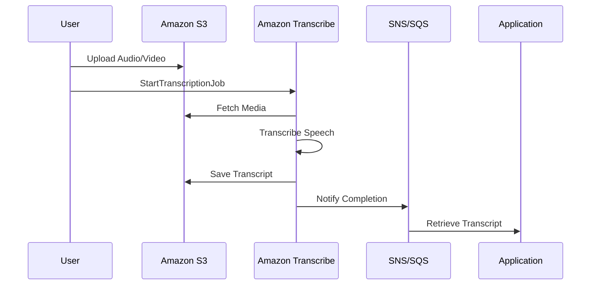
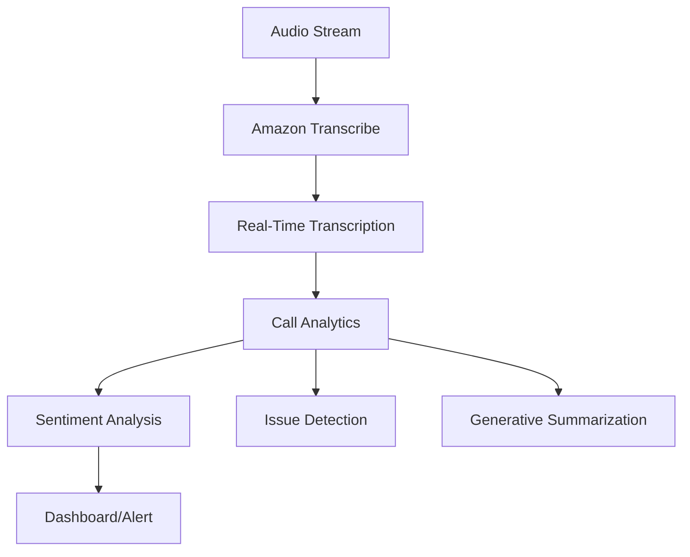

# Transcribe

##  Amazon Transcribe

### 🌟 Overview

**Amazon Transcribe** is a **fully managed automatic speech recognition (ASR) service** that uses advanced machine learning to convert speech to text accurately. It supports **real-time (streaming) and batch processing** for audio/video files, making it versatile for various applications like call analytics, subtitling, and clinical documentation. Powered by a **multi-billion parameter speech foundation model**, it continuously improves to handle diverse accents, noisy environments, and domain-specific jargon.

<figure><figcaption></figcaption></figure>

### 🤖 Innovation Spotlight

* **Generative AI Integration**: Transcribe Call Analytics uses generative AI to automatically summarize calls, extract insights (e.g., sentiment, issues), and boost contact center productivity.
* **Real-Time Toxicity Detection**: Identifies and flags toxic content in audio for gaming, social media, and other platforms to foster safer environments.
* **Automatic Language Identification**: Detects spoken languages in audio without manual input, supporting monolingual and multilingual content.

***

### ⚡ Problem Statement

**Real-World Scenario**: A healthcare provider struggles to manually transcribe patient-clinician conversations for electronic health records (EHR), leading to delays and errors. Amazon Transcribe Medical automates this, ensuring HIPAA-compliant, accurate documentation while saving time.

### 🤝 Business Use Cases

**Industries/Applications**:

* **Call Centers**: Analyze customer calls for sentiment, compliance, and agent performance using Transcribe Call Analytics.
* **Media & Entertainment**: Generate subtitles for videos and meetings to enhance accessibility.
* **Healthcare**: Transcribe medical conversations efficiently with Transcribe Medical (HIPAA-eligible).
* **IoT & Social Media**: Detect toxic audio content in real-time for safer user interactions.

***

### 🔥 Core Principles & Key Components

* **Automatic Speech Recognition (ASR)**: Converts speech to text using deep learning models trained on vast audio datasets.
* **Speaker Diarization**: Identifies and labels multiple speakers in conversations.
* **Customization**:
  * **Custom Vocabulary**: Improves accuracy for domain-specific terms (e.g., medical jargon).
  * **Custom Language Models (CLM)**: Train models on specific text data for specialized use cases.
* **Privacy & Security**:
  * **PII Redaction**: Automatically masks sensitive data (e.g., names, credit card numbers).
  * **Encryption**: Data encrypted in transit (TLS) and at rest (AWS KMS).

***

### 📋 Pre-Requirements

* **AWS Account**: With IAM permissions for Transcribe and related services.
* **Data Storage**: Audio/video files stored in **Amazon S3** for processing.
* **Network Configuration**: For real-time streaming, ensure secure connections (TLS).

***

### 👣 Implementation Steps

1. **Store Media in S3**: Upload audio/video files to an S3 bucket.
2. **Run Baseline Transcription**: Use `StartTranscriptionJob` API for initial output.
3. **Enhance Accuracy**:
   * **Custom Vocabulary**: Add domain-specific terms via console or API.
   * **Vocabulary Filter**: Remove unwanted words (e.g., filler words).
4. **Enable Advanced Features**:
   * **Speaker Partitioning**: Identify speakers with `diarization`.
   * **PII Redaction**: Mask sensitive data.
5. **Real-Time Processing**: Use `StartStreamTranscription` for live audio streams.
6. **Review & Refine**: Iterate with customizations for optimal accuracy.

***

### 🔄 Data Flow Diagram

**Diagram 1: Batch Transcription Process**

**Diagram 2: Real-Time Call Analytics**

***

### 🔒 Security Measures

* **Encryption**: Data encrypted using AWS KMS and TLS.
* **HIPAA Compliance**: Transcribe Medical is HIPAA-eligible for healthcare data.
* **Access Control**: IAM policies restrict access to transcription jobs and S3 buckets.
* **Data Privacy**: Input audio is not stored or shared between customers.

***

### 💡 Innovation Spotlight: Generative Call Summarization

* **Automated Insights**: Transcribe Call Analytics uses generative AI to create post-call summaries, capturing key issues, outcomes, and action items.
* **Real-Time Analytics**: During calls, it detects sentiment, interruptions, and talk speed to guide agent behavior.
* **Custom Categories**: Build rules to classify calls (e.g., "upsell" or "complaint") for compliance monitoring.

***

### ⚖️ When to Use and When Not to Use

| **✅ When to Use**                                                         | **❌ When NOT to Use**                                                                   |
| ------------------------------------------------------------------------- | --------------------------------------------------------------------------------------- |
| **Call Centers**: Real-time agent assist and post-call analytics.         | **Simple Recordings**: Basic transcription without need for customization or analytics. |
| **Content Moderation**: Detecting toxic audio in social media/gaming.     | **Non-Speech Audio**: Music or synthetic speech recognition (unsupported).              |
| **Medical Documentation**: Transcribe Medical for clinical conversations. | **Low-Budget Projects**: Free tier (60 mins/month) may suffice for small needs.         |

***

### 💰 Costing Calculation

* **Pricing Model**:
  * **Batch Transcription**: $0.024/minute for standard audio.
  * **Real-Time Streaming**: $0.036/minute.
  * **Add-Ons**: PII redaction, custom language models, and toxicity detection incur additional costs.
* **Cost Optimization**:
  * Use **batch processing** for non-urgent audio to save costs.
  * Leverage **free tier** (60 minutes/month for first 12 months).
* **Example Calculation**:
  * 100 hours of batch transcription + PII redaction:\
    `(100 * 60 minutes * $0.024) + (100 * 60 * $0.012) = $144 + $72 = $216/month`.

***

### 🔁 Alternative Services

| **AWS**                                         | **Azure**                        | **GCP**                                         | **On-Premise**                      |
| ----------------------------------------------- | -------------------------------- | ----------------------------------------------- | ----------------------------------- |
| **Amazon Transcribe**                           | **Azure Speech to Text**         | **Google Speech-to-Text**                       | **Mozilla DeepSpeech**              |
| Native AWS integration, generative AI features. | Microsoft ecosystem integration. | Google AI capabilities, multi-language support. | Open-source, requires self-hosting. |

***

### ✅ Benefits

* **High Accuracy**: Adapts to accents, noise, and domain-specific terms.
* **Scalability**: Processes thousands of hours of audio seamlessly.
* **Accessibility**: Generates subtitles for videos and meeting notes.
* **Security**: HIPAA eligibility and encryption for sensitive data.

***

### 🚀Innovation Spotlight: Custom Language Models

* **Domain Adaptation**: Train custom models on specific text data (e.g., legal or medical corpora) to improve accuracy for specialized vocabulary.
* **Iterative Improvement**: Continuously refine models with new data to reduce word error rate (WER).

***

### 📊 Summary

Amazon Transcribe transforms speech into actionable text, enabling use cases from call analytics to medical documentation. Key takeaways:

1. **Use for Complex Workloads**: Ideal for multi-speaker, noisy, or domain-specific audio.
2. **Leverage Generative AI**: Employ Call Analytics for automated summaries and insights.
3. **Ensure Compliance**: Utilize PII redaction and HIPAA eligibility for sensitive data.
4. **Optimize Costs**: Batch processing and free tier help manage expenses.
5. **Iterate for Accuracy**: Custom vocabularies and language models enhance precision.

***

### 🔗 Related Topics & References

* [**Amazon Transcribe Documentation**](https://docs.aws.amazon.com/transcribe/latest/dg/what-is.html): API guides, tutorials, and best practices.
* [**Transcribe Call Analytics**](https://aws.amazon.com/transcribe/features/): Details on real-time and post-call features.
* [**HIPAA Compliance**](https://docs.aws.amazon.com/transcribe/latest/dg/what-is.html): Guidelines for healthcare applications.
* [**Free Tier**](https://aws.amazon.com/pm/transcribe/): Get started with 60 minutes/month free.

For hands-on learning, try the [**DataCamp Tutorial**](https://www.datacamp.com/tutorial/amazon-transcribe) or explore the [**AWS Console**](https://console.aws.amazon.com/transcribe/).
