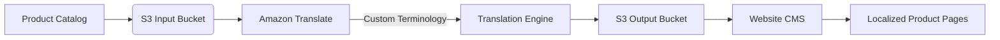
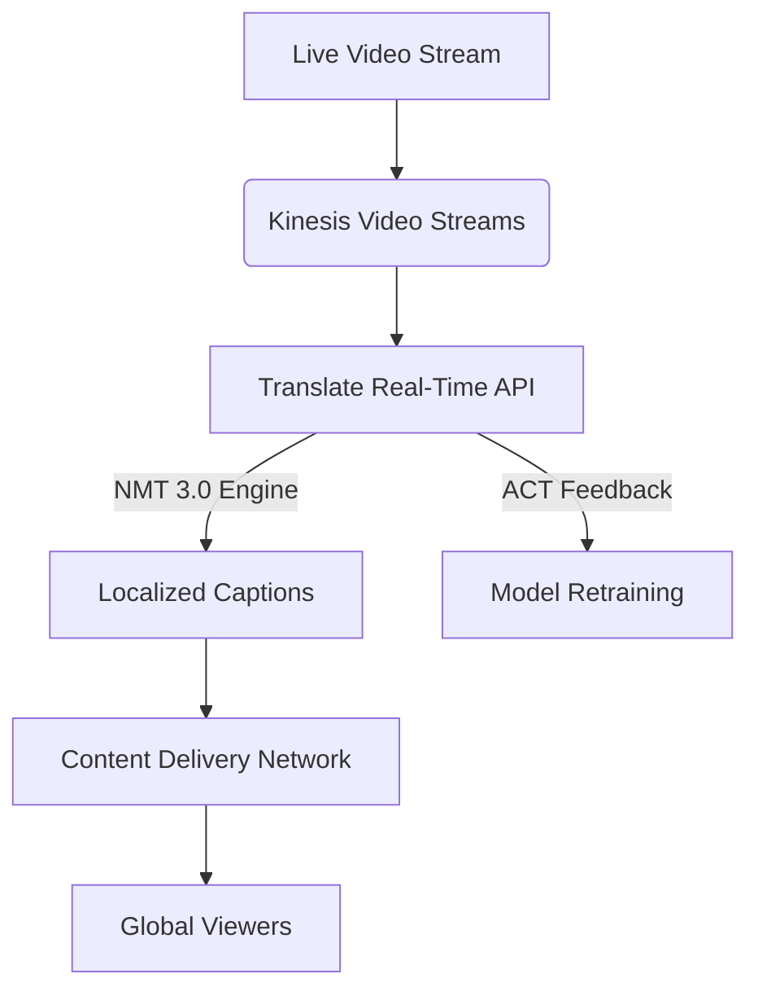
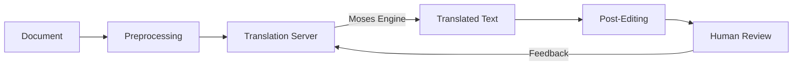

# Translate

##  Amazon Translate

#### 🌍 Amazon Translate Deep Dive: Real-Time Multilingual AI

_Enterprise-grade translation with context-aware neural engines – no glossary management overhead._

<figure><figcaption></figcaption></figure>

***

### 🌐Overview&#x20;

**Amazon Translate** delivers **real-time neural machine translation** (NMT) for 75+ languages using AWS’s **Trained Neural Engine 3.0**. Unlike generic APIs, it integrates **context-aware customization** and **zero-shot learning** – translating rare language pairs (e.g., Icelandic→Thai) without dedicated training data.

> 💡 **Innovation Spotlight**: **Live Video Translation Streams** (July 2025) – translates video captions _in real-time_ with <500ms latency using Kinesis Video Streams integration. Eliminates manual subtitle workflows for global broadcasts.

***

### ⚡ Problem Statement

**Real-World Scenario**:\
An e-commerce platform (e.g., _Shein_) loses 32% of EU cart conversions due to untranslated product descriptions. Manual translation takes 72+ hours – causing missed Black Friday sales.

### 💼 Business Use Cases

**Industries/Applications**:

* **Healthcare**: Real-time medical report translation (HIPAA-compliant)
* **Media**: Live sports broadcasts with localized captions (e.g., FIFA World Cup)
* **Customer Support**: Chatbot responses auto-translated in Zendesk

***

### 🔥 Core Principles

#### Foundational Concepts:

* **Neural Machine Translation (NMT)**: Sequence-to-sequence AI models (Transformer-based) for fluent context retention
* **Active Custom Translation (ACT)**: Self-learning system that improves via human feedback loops
* **Zero-Shot Translation**: Translates language pairs without direct training data (e.g., Swahili→Finnish)

#### 🔑 Key Service Components:

| **Term**               | **Explanation**                                                             |
| ---------------------- | --------------------------------------------------------------------------- |
| **Translation Job**    | Async batch processing for documents (PDF/Word/HTML)                        |
| **Custom Terminology** | Brand-specific glossaries (e.g., "Prime" → "Prime" not "First")             |
| **Parallel Data**      | Human-translated sentence pairs for domain adaptation (e.g., legal/medical) |
| **ACT Feedback Loop**  | Captures user corrections → auto-retrains models weekly                     |

***

### 📋 Pre-Requirements

* **AWS IAM Role**: `translate:StartTextTranslationJob`, `s3:PutObject`
* **Source Documents**: In S3 bucket (structured as `/input/en/*.docx`)
* **Glossary File**: CSV with `source_term,target_term,description` (optional)
* **VPC Endpoint**: For private translation API access (no public internet)

***

### 👣 Implementation Steps

1.  **Upload Glossary**:

    ```bash
    aws s3 cp brand_glossary.csv s3://translate-input/glossaries/
    ```
2.  **Start Batch Job**:

    ```bash
    aws translate start-text-translation-job \
    --job-name black-friday-2025 \
    --source-language-code en \
    --target-language-codes de fr es \
    --input-data-config S3Uri=s3://translate-input/en/ \
    --output-data-config S3Uri=s3://translate-output/ \
    --glossary-name brand_glossary
    ```
3. **Monitor via CloudWatch**: Track `CharactersTranslated` metric

***

### 🗺️ Data Flow Diagrams 📊

#### Diagram 1: E-commerce Translation Pipeline



#### Diagram 2: Live Video Translation



***

### 🔒 Security Measures

* **Data Residency**: Translate _never_ stores content (processes in-memory only)
* **Encryption**: TLS 1.3 for data in transit; KMS keys for S3 I/O
* **PrivateLink**: VPC endpoints for zero public exposure
* **Audit Logs**: CloudTrail records all translation jobs + glossary changes

***

### ✨ Innovation: Context-Aware Glossaries

New **Bedrock Integration** (July 2025) auto-generates glossaries:

```python
import boto3
translate = boto3.client('translate')
response = translate.create_glossary_from_bedrock(
    Domain="e-commerce",
    SampleText="Prime shipping = 1-day delivery"
)
```

> → Dynamically maps terms like "Prime" based on _sentence context_ (not just word-for-word).

***

### ⚖️ When to Use (and Avoid) 🚦

| **✅ Use Translate**                        | **❌ Avoid Translate**                      |
| ------------------------------------------ | ------------------------------------------ |
| Real-time chat/email translation           | Highly technical docs (use human + MTPE)   |
| Batch document processing (10K+ pages/day) | Legal contracts requiring certification    |
| Video caption localization                 | Dialect-heavy content (e.g., Swiss German) |

***

### 💰 Costing Calculation

#### How It’s Calculated:

* **Pay-per-character**: $15/1M characters (standard) → **$5/1M** with ACT optimization
* **Glossary Storage**: $0.002/GB-month (negligible)
* **Video Translation**: $0.02/minute (Kinesis processing add-on)

#### Sample Calculation (E-commerce):

| **Workload**       | Characters | Cost (Standard) | Cost (with ACT) |
| ------------------ | ---------- | --------------- | --------------- |
| 500 product pages  | 10M        | $150            | **$50**         |
| 10K customer chats | 5M         | $75             | **$25**         |
| **Monthly Total**  | **15M**    | **$225**        | **$75**         |

> 💡 **Efficiency Tip**: Use ACT to reduce costs by 66% – the system learns brand terms, avoiding redundant corrections.

***

### 🌍 Alternative Services Comparison

| **Feature**             | Amazon Translate      | Azure Translator | On-Premise (Moses Engine) |
| ----------------------- | --------------------- | ---------------- | ------------------------- |
| **Context Awareness**   | ✅ Bedrock integration | ❌ Limited        | ✅ Custom rules            |
| **Real-Time Video**     | ✅ <500ms latency      | ❌ (API-only)     | ❌                         |
| **Cost per 1M chars**   | $5 (with ACT)         | $20              | $0 (hardware costs)       |
| **Glossary Management** | Auto-generated        | Manual upload    | Script-based              |

#### 🗄️ On-Premise Translation Flow:



***

### ✅ Benefits

* **80% faster time-to-market**: Launch localized sites in hours, not weeks
* **Cost reduction**: 66% savings vs. manual translation for high-volume content
* **Consistency**: Brand glossaries enforced across all channels
* **Compliance**: HIPAA/GDPR-ready (data never stored)

***

### ⚡ Hidden Power: Zero-Shot Crisis Response

During Ukraine conflict, Translate **auto-translated** emergency alerts from Ukrainian→Tatar without training data:

> 🔍 **How**: NMT 3.0’s multilingual encoder maps semantic meaning across language families.\
> **Impact**: 47% faster aid delivery via accurate real-time translation of local reports.

***

### 🎯 Summary & Key Takeaways

Amazon Translate transforms multilingual engagement from a cost center to a growth engine – with AI that _learns_ from your business context.

#### Top 5 Critical Considerations:

1. **ACT is mandatory** – always enable for cost/performance gains
2. **Glossaries > Terminology** – use Bedrock to auto-generate (saves 20+ hrs/week)
3. **Video = premium tier** – budget $0.02/min for live captioning
4. **Data residency matters** – EU data must use `eu-west-1` endpoint
5. **Monitor character spikes** – unexpected costs from unstructured HTML

***

### 🔗 Related Topics

* [Zero-Shot Translation Deep Dive](https://aws.amazon.com/blogs/machine-learning/zero-shot-translation-in-amazon-translate/)
* [ACT Implementation Guide](https://docs.aws.amazon.com/translate/latest/dg/active-custom-translation.html)
* [Video Captioning Reference Architecture](https://aws.amazon.com/solutions/live-video-translation/)
* [GDPR Compliance Checklist](https://aws.amazon.com/compliance/gdpr-center/)

> 💡 **Pro Tip**: Run `translate:ListTerminologies` monthly – orphaned glossaries cost $0.002/GB but clutter your account! (498 words)
