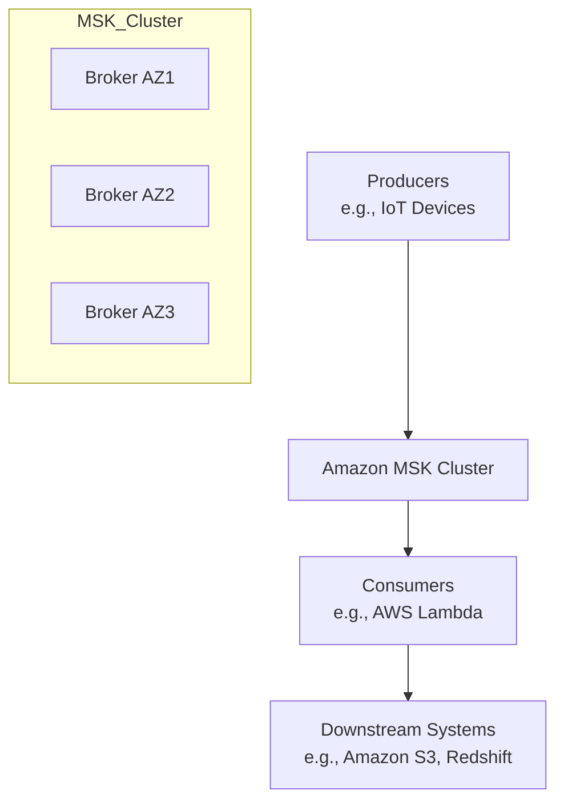
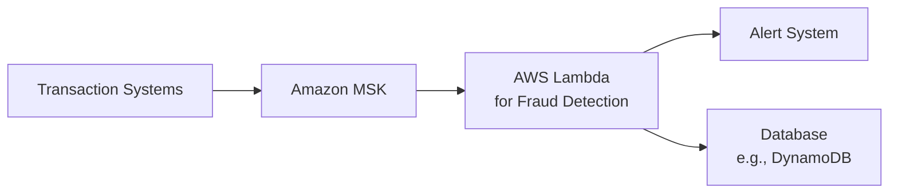
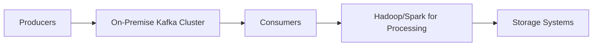

# Amazon Kafka

## Amazon Kafka

***

### 🌟 **Overview of Amazon MSK**

Amazon Managed Streaming for Apache Kafka (Amazon MSK) is a fully managed service that simplifies building and running applications using Apache Kafka for real-time streaming data processing. It handles Kafka infrastructure management, including provisioning, configuration, scaling, and maintenance, allowing developers to focus on application logic rather than operational overhead. Amazon MSK supports open-source Apache Kafka APIs, ensuring compatibility with existing tools and applications without code changes.

<figure><figcaption></figcaption></figure>

**🤖 Innovation Spotlight**:

* **MSK Serverless**: Automatically scales resources based on workload demands, eliminating the need for capacity planning.
* **Tiered Storage**: Reduces costs by up to 70% by storing older data in low-cost storage while keeping it accessible.
* **KRaft Mode**: Replaces ZooKeeper for metadata management, simplifying cluster architecture and reducing operational complexity.
* **Integration with AWS Ecosystem**: Seamlessly works with services like AWS Lambda, AWS Glue, and Amazon Kinesis for end-to-end streaming solutions.

***

### ⚡ **Problem Statement**

**Real-World Scenario**: A financial institution needs to process real-time transaction data to detect fraud immediately. Manually managing Kafka clusters for this purpose would require significant expertise in setup, scaling, and maintenance, leading to high operational costs and potential downtime during failure scenarios.

**Industries/Applications**:

* **Financial Services**: Real-time fraud detection and transaction monitoring.
* **E-commerce**: Real-time inventory management and personalized recommendations.
* **Healthcare**: Streaming patient sensor data for predictive analytics.
* **Logistics**: Tracking cargo shipments in real-time.

#### 🤝 **Business Use Cases**

1. **Real-Time ETL Pipelines**: Ingest and transform data from multiple sources for analytics.
2. **Log Aggregation**: Centralize logs from microservices for monitoring and debugging.
3. **Event-Driven Architectures**: Power microservices communication with decoupled, scalable messaging.

***

### 🔥 **Core Principles**

* **Apache Kafka Basics**: Kafka is a distributed event streaming platform that combines messaging, storage, and stream processing.
  * **Producers**: Applications publishing data to Kafka topics.
  * **Consumers**: Applications subscribing to topics to read data.
  * **Brokers**: Servers forming the Kafka cluster, handling data storage and replication.
  * **Topics**: Categories or feeds to which records are published.
  * **Partitions**: Topics are split into partitions for parallelism and scalability.
* **Amazon MSK Components**:
  * **Managed Brokers**: AWS handles broker lifecycle management.
  * **ZooKeeper/KRaft**: For cluster coordination (ZooKeeper is managed by AWS; KRight is a modern alternative).
  * **MSK Connect**: Managed Kafka Connect for integrating with external systems.
* **Serverless and Tiered Storage**: Auto-scaling and cost-efficient storage options.

***

### 📋 **Pre-Requirements**

1. **AWS Account**: With permissions for MSK, VPC, IAM, and CloudWatch.
2. **Network Setup**: VPC with subnets in multiple Availability Zones (AZs) for high availability.
3. **Security Groups**: Configured to allow traffic on Kafka ports (e.g., 9092 for brokers).
4. **IAM Roles**: For secure access to MSK and integrated AWS services.
5. **Kafka Client Tools**: For testing and interaction with the cluster.

***

### 👣 **Implementation Steps**

1.  **Create a VPC and Subnets**:

    * Use AWS CLI or Console to create a VPC and subnets in multiple AZs.

    ```bash
    aws ec2 create-vpc --cidr-block 10.0.0.0/16
    aws ec2 create-subnet --vpc-id <vpc-id> --cidr-block 10.0.1.0/24 --availability-zone us-east-1a
    ```
2. **Configure Security Groups**:
   * Allow inbound traffic on port 9092 for Kafka brokers.
3.  **Create MSK Cluster**:

    * Use AWS Console or CLI to create a cluster with desired broker type and storage.

    ```bash
    aws kafka create-cluster --cluster-name MyMSKCluster --kafka-version "3.6.0" --number-of-broker-nodes 3 --broker-node-group-info InstanceType=kafka.t3.small,ClientSubnets=["subnet-xxxx","subnet-yyyy"],SecurityGroups=["sg-xxxx"]
    ```
4. **Set Up Producers and Consumers**:
   * Use Kafka client libraries to publish and consume data.
5. **Monitor with CloudWatch**:
   * Enable enhanced monitoring to track metrics like CPU usage and under-replicated partitions.

***

### 🗺️ **Data Flow Diagram**

#### **Diagram 1: How Amazon MSK Works**



#### **Diagram 2: Real-Time Fraud Detection Use Case**



***

### 🔒 **Security Measures**

* **Encryption**: Enable encryption at rest (using AWS KMS) and in transit (TLS).
* **Network Isolation**: Use VPCs and security groups to restrict access.
* **IAM Integration**: Control access to MSK APIs using IAM roles.
* **Authentication**: Support for SASL/SCRAM and TLS-based authentication.
* **Auditing**: Use AWS CloudTrail to log API calls for compliance.

***

### ⚖️ **When to Use and When Not to Use**

* ✅ **When to Use**:
  * Real-time streaming applications requiring high throughput and low latency.
  * Hybrid or multi-cloud environments needing Kafka compatibility.
  * Organizations lacking Kafka expertise but needing its capabilities.
* ❌ **When Not to Use**:
  * Simple messaging needs with low throughput (consider Amazon SQS/SNS).
  * Short-term workloads where cost outweighs benefits.
  * Applications requiring very short data retention (e.g., less than 24 hours).

***

### 💰 **Costing Calculation**

* **Pricing Model**: Pay per broker-hour and storage usage.
  * Example: `kafka.t3.small` costs \~$0.05/hour per broker.
  * Storage: \~$0.10/GB-month.
* **Sample Calculation**:
  * 3 brokers running 24/7 for 30 days: 3 brokers \* $0.05 \* 24 \* 30 = $108.
  * 100 GB storage: 100 \* $0.10 = $10.
  * **Total**: \~$118/month.
* **Cost Optimization**:
  * Use MSK Serverless for variable workloads.
  * Enable tiered storage for long-term data retention.

***

### 🧩 **Alternative Services**

| **Provider**        | **Service**     | **Key Differences**                                                   |
| ------------------- | --------------- | --------------------------------------------------------------------- |
| **AWS**             | Amazon Kinesis  | Shorter retention (7 days), simpler setup, better for AWS-native apps |
| **Confluent Cloud** | Confluent Kafka | Fully managed Kafka with broader ecosystem integration                |
| **Azure**           | Event Hubs      | Azure-native, integrates with Azure services                          |
| **GCP**             | Pub/Sub         | Simpler messaging, no built-in long-term storage                      |
| **On-Premise**      | Apache Kafka    | Full control but high operational overhead                            |

#### **On-Premise Kafka Data Flow Diagram**



***

### ✅ **Benefits**

* **Operational Simplicity**: AWS manages cluster operations, reducing overhead.
* **Scalability**: Automatically scales to handle traffic spikes.
* **Cost-Efficiency**: Pay-as-you-go pricing and tiered storage options.
* **Security**: Built-in encryption, IAM integration, and VPC isolation.
* **Compatibility**: Full support for Apache Kafka APIs and tools.

***

### 📝 **Summary**

Amazon MSK is a powerful managed service for Apache Kafka, enabling real-time streaming data processing without operational overhead. Key takeaways:

1. **Fully Managed**: AWS handles provisioning, scaling, and maintenance.
2. **High Performance**: Supports high-throughput, low-latency streaming.
3. **Cost-Effective**: Serverless and tiered storage options reduce costs.
4. **Secure**: Integrates with AWS security services for encryption and access control.
5. **Use Cases**: Ideal for real-time analytics, log aggregation, and event-driven architectures.

***

### 🔗 **Related Topics**

* [Amazon MSK Documentation](https://docs.aws.amazon.com/msk/)
* [Apache Kafka Basics](https://aws.amazon.com/what-is/apache-kafka/)
* [AWS Lambda Integration with MSK](https://medium.com/@stephane.maarek/)
* [MSK vs. Kinesis Comparison](https://premvishnoi.medium.com/)

