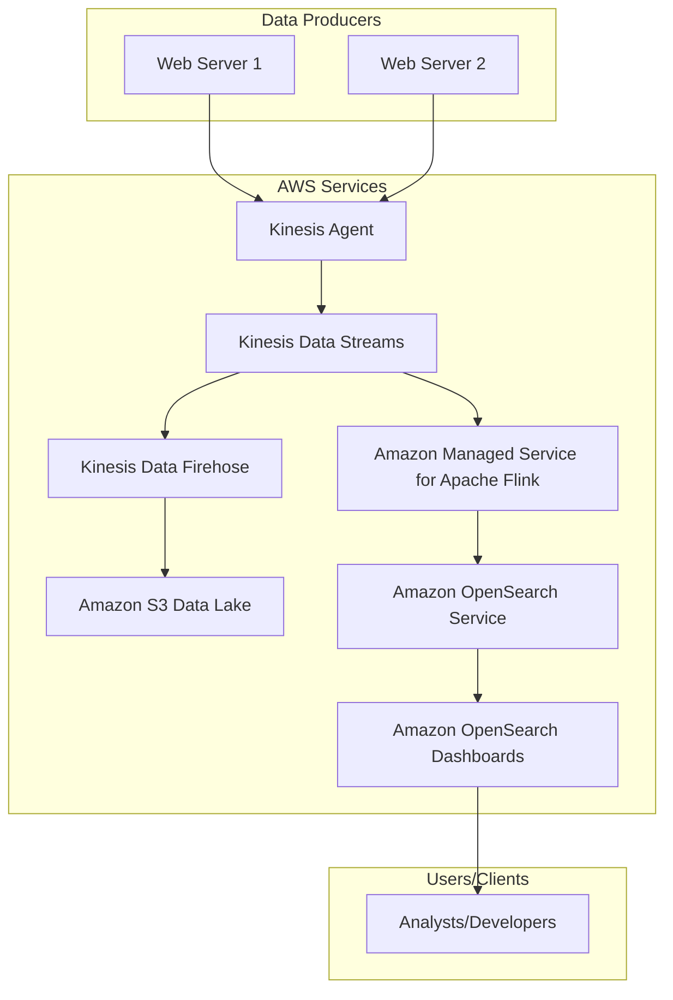
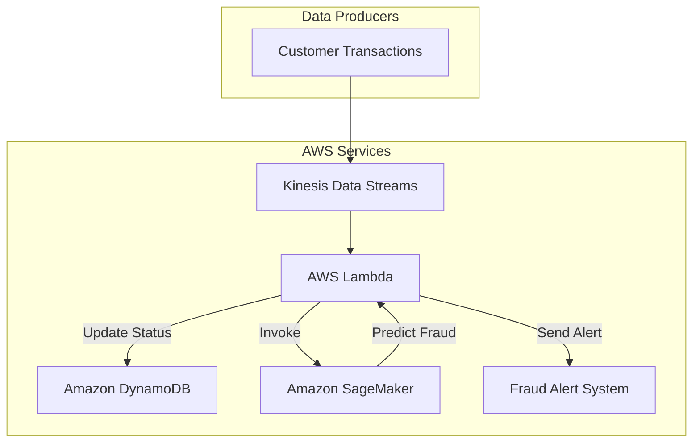
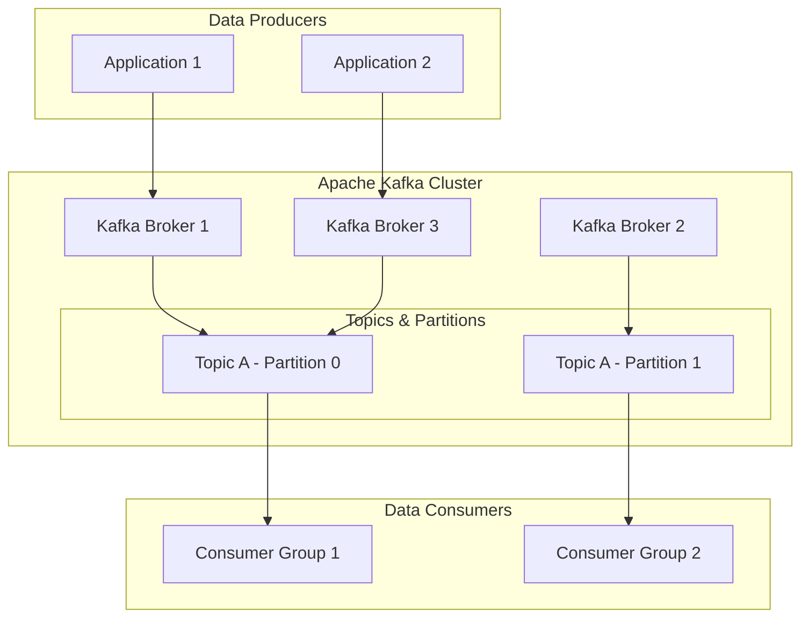

# Amazon Kinesis

***

#### Overview

<table data-header-hidden><thead><tr><th width="237.199951171875"></th><th></th></tr></thead><tbody><tr><td></td><td><strong>Amazon Kinesis</strong> is a fully managed, scalable, and durable service designed for real-time processing of streaming data. It allows you to ingest, buffer, and process vast amounts of data from diverse sources, enabling real-time analytics and applications. Instead of waiting for large batches of data to accumulate, Kinesis allows you to derive insights and react to events in near real-time.</td></tr></tbody></table>


Innovation Spotlight: The serverless nature of Kinesis Data Streams On-Demand and Kinesis Data Firehose allows for automatic scaling with a pay-per-use model, eliminating the need for manual shard management.  This simplifies real-time data ingestion for workloads with unpredictable or spiky traffic patterns, allowing organizations to focus on application logic rather than infrastructure provisioning.

***

#### Problem Statement & Business Use Cases

In many modern applications, data is generated continuously and in high volume from thousands of sources.<sup>6</sup> Traditional batch processing methods, which analyze data hours or days after it's created, are insufficient for scenarios that require immediate action or insight.

Real-world scenario: An e-commerce platform wants to detect fraudulent transactions in real-time. With millions of transactions occurring daily, it's impossible to manually review each one. A solution is needed that can analyze transactional data as it happens, flag suspicious activity, and potentially block the transaction before it completes.

Industries/Applications:

* E-commerce: Real-time fraud detection, personalized product recommendations, and live analytics dashboards.
* IoT: Monitoring data from sensors for predictive maintenance, smart home automation, and real-time asset tracking.
* Gaming: Analyzing player activity and in-game events to create live leaderboards, detect cheating, and offer real-time in-game promotions.
* Financial Services: Live stock market data analysis, fraud detection in credit card transactions, and algorithmic trading.
* Log Analytics: Ingesting and analyzing application and server logs in real time to monitor system health and troubleshoot issues.

***

#### Core Principles

The core principle behind Amazon Kinesis is the producer-consumer model where data producers push records to a Kinesis stream, and data consumers process these records in real time. The service is built on a distributed, shared-nothing architecture, ensuring high availability and scalability.

Core Services & Concepts:

* Kinesis Data Streams (KDS) 🛠️: A highly scalable and durable real-time data streaming service.
  * Producers: Applications, devices, or services that send data to a Kinesis Data Stream.
  * Consumers: Applications that read and process data from the stream.
  * Record: A single unit of data in a stream, consisting of a data blob, a partition key, and a sequence number.
  * Partition Key: A value used to group data records and map them to a specific shard. Records with the same partition key always go to the same shard.
  * Sequence Number: A unique identifier for each record, ensuring strict ordering within a shard.
  * Shards: The base throughput unit of a Kinesis Data Stream. Each shard provides a fixed capacity for data ingress and egress (e.g., 1 MB/s ingress, 2 MB/s egress). Scaling a stream involves adding or removing shards.<sup>24</sup> KDS offers two capacity modes:
    * Provisioned Mode: You manually specify the number of shards and pay for them on a per-hour basis.
    * On-Demand Mode: Kinesis automatically manages capacity and scales based on your traffic, and you pay for the data throughput you consume.
* Kinesis Data Firehose 🚒: A fully managed service for reliably loading streaming data into data lakes, data stores, and analytics services. It simplifies the data delivery process by handling batching, compression, transformation, and encryption.
* Amazon Managed Service for Apache Flink (formerly Kinesis Data Analytics) 📊: A service for processing and analyzing streaming data using standard SQL or Apache Flink. It enables you to build and run real-time applications that transform and analyze data streams without having to manage servers.
* Kinesis Video Streams 🎥: A service to securely stream video from connected devices to AWS for analytics, machine learning, and other processing. It can capture, store, and process video data for applications like security monitoring, facial recognition, and media analysis.

***

#### Pre-Requirements

Before implementation, ensure you have the following:

* AWS Account: A valid AWS account with administrative access.
* IAM Roles & Policies: An IAM role with permissions to create and manage Kinesis resources, as well as permissions for the data producers (e.g., EC2 instances, Lambda functions) and consumers (e.g., Lambda functions, Kinesis Data Analytics) to interact with Kinesis.
* AWS SDKs/Tools:
  * AWS SDK (Boto3 for Python, etc.): To programmatically interact with Kinesis APIs from your applications.
  * Kinesis Producer Library (KPL): A high-level library that simplifies producer logic, offering features like automatic retries and data aggregation.
  * Kinesis Agent: A pre-built, configurable agent to collect log and event data from sources and send it to Kinesis Data Streams or Kinesis Data Firehose.

***

#### Implementation Steps

Here's a step-by-step guide for a real-time log analytics solution using Kinesis:

1. Create a Kinesis Data Stream:
   * Navigate to the Kinesis console and choose Kinesis Data Streams.
   * Click Create data stream.
   * Provide a name (e.g., `webserver-logs-stream`).
   * Select the On-demand capacity mode for simplicity and automatic scaling.
   * Click Create data stream.
2. Configure Data Producers (e.g., Kinesis Agent on EC2):
   * On your web servers (EC2 instances), install and configure the Kinesis Agent.
   * Edit the agent's configuration file (`/etc/aws-kinesis/agent.json`) to specify the log files to be monitored and the Kinesis stream to send data to.
   *   Example configuration:

       JSON

       ```json
       {
         "cloudwatch.emitMetrics": true,
         "flows": [
           {
             "filePattern": "/var/log/httpd/access_log",
             "kinesisStream": "webserver-logs-stream"
           }
         ]
       }
       ```
   * Start the Kinesis Agent service.
3. Create a Kinesis Data Firehose Delivery Stream:
   * Go to the Kinesis console and choose Kinesis Data Firehose.
   * Click Create delivery stream.
   * Choose Amazon Kinesis Data Streams as the source and select the stream you created.
   * Select Amazon S3 as the destination.
   * Specify a new or existing S3 bucket (e.g., `kinesis-log-analytics-data`).
   * Enable data transformation with a Lambda function if needed (e.g., to parse JSON or remove sensitive data).
   * Review and create the delivery stream.
4. Create an Amazon Managed Service for Apache Flink Application:
   * In the Kinesis console, go to Analytics Applications.
   * Click Create application and choose SQL as the type.
   * Configure the source to be your `webserver-logs-stream`.
   * Write a SQL query to analyze the data (e.g., to count unique visitors every minute).
   * Configure the destination to send the query results to another Kinesis Data Firehose stream, an Amazon OpenSearch Service domain for visualization, or Amazon S3.

***

#### Data Flow Diagram

**Diagram 1: Real-time Log Analytics Pipeline**



<figure><figcaption></figcaption></figure>








**Diagram 2: Real-time Fraud Detection**



<figure><figcaption></figcaption></figure>







***

#### Security Measures

* IAM Roles with Least Privilege: Use IAM roles and policies to grant only the necessary permissions to producers and consumers to interact with Kinesis streams. For example, a producer role should only have `kinesis:PutRecord` permissions.
* Encryption:
  * Encryption at Rest: Enable server-side encryption with AWS Key Management Service (KMS) for Kinesis Data Streams.
  * Encryption in Transit: Kinesis APIs use HTTPS, ensuring data is encrypted during transit.
* VPC Endpoints: Use VPC endpoints for Kinesis to ensure traffic between your VPC and Kinesis stays within the AWS network, improving security and reducing data transfer costs.
* Network ACLs and Security Groups: Configure your network security to restrict access to the Kinesis endpoints.
* Monitoring and Auditing: Use AWS CloudWatch to monitor Kinesis metrics and AWS CloudTrail to log API calls for auditing purposes.

***

#### Serverless Data Ingestion with Kinesis Data Streams On-Demand

Kinesis Data Streams On-Demand is a groundbreaking feature that automates capacity management for your data streams. Unlike the traditional provisioned mode where you must manually manage shards, On-Demand mode automatically scales the throughput based on your workload. You no longer need to estimate traffic or use complex calculations to determine the right number of shards. This is particularly useful for new applications, workloads with unpredictable or spiky traffic, and developers who prefer a hands-off approach to infrastructure.

***

#### When to use and when not to use

When to Use Amazon Kinesis:

* Real-time Analytics: When you need to process data and generate insights within seconds or minutes.
* High-Volume Streaming: For applications that generate large, continuous streams of data from many sources, such as IoT devices or clickstreams.
* Event-Driven Architectures: As a central nervous system for your microservices, enabling loose coupling and asynchronous communication.
* Durability and Fault Tolerance: When data loss is unacceptable and you need a reliable buffer that can retain data for up to a year.
* Video and Media Processing: For securely ingesting and analyzing video streams from cameras.

When Not to Use Amazon Kinesis:

* Low-Volume or Batch Data: If your data arrives in small, infrequent batches, a service like AWS S3 with an event trigger for a Lambda function might be more cost-effective.
* Simple File Ingestion: If the primary goal is to simply move files to a data lake, AWS DataSync or a direct S3 upload might be a more straightforward solution.
* Transactional Systems: Kinesis is not a database. It is not suitable for transactional workloads that require complex queries or updates to individual records.

***

#### Costing Calculation

Kinesis pricing is based on the services used and their specific capacity modes.

* Kinesis Data Streams (Provisioned Mode):
  * Shard Hours: You are charged for the number of shards multiplied by the hours they are active.
  * PUT Payload Units: Charged per million PUT units. Each unit is a 25 KB record. A 30 KB record would be 2 units.
  * Data Retention: Additional charges apply for retaining data beyond the default 24 hours (up to 365 days).
  * Enhanced Fan-Out: An additional cost per consumer-shard-hour for dedicated throughput.
* Kinesis Data Streams (On-Demand Mode):
  * Data Ingestion: Charged per GB of data ingested.
  * Data Retrieval: Charged per GB of data retrieved.
  * No need to calculate shards or throughput.
* Kinesis Data Firehose:
  * Data Ingestion: Charged per GB of data ingested.
  * Data Transformation: Additional charges for data format conversion, dynamic partitioning, or using VPC delivery.

Efficient Cost Management:

* Choose the Right Capacity Mode: Start with On-Demand for new or unpredictable workloads.<sup>62</sup> Once traffic patterns are stable, evaluate if Provisioned mode would be more cost-effective.<sup>63</sup>
* Optimize Record Size: The PUT Payload Unit is a 25 KB block.<sup>64</sup> Consolidate smaller records into larger ones to minimize the number of PUT requests.<sup>65</sup>
* Manage Data Retention: Use extended data retention only when necessary, as it adds a recurring cost.

Sample Calculation (Kinesis Data Streams - Provisioned Mode):

* Scenario: A company processes 1,000 records per second, with each record being 20 KB. The stream runs for 30 days and has a single consumer.<sup>66</sup>
* Throughput Calculation:
  * Ingress: 1000 records/s \* 20 KB/record = 20,000 KB/s = 20 MB/s.
  * Shards Needed: One shard supports 1 MB/s ingress.<sup>67</sup> So, 20 shards are needed (20 MB/s / 1 MB/s per shard).
* Cost Breakdown (US-East, approximate pricing):
  * Shard Hours: 20 shards \* 24 hours/day \* 30 days = 14,400 shard hours.
  * Cost: 14,400 shard hours \* $0.015/shard-hour = $216.
  * PUT Payload Units: 1000 records/s \* 60 s/min \* 60 min/hr \* 24 hr/day \* 30 days = 2.592 billion records.
  * Each record is 20 KB, so it's 1 PUT unit (up to 25 KB).
  * Total PUT units: 2.592 billion.
  * Cost: (2,592,000,000 / 1,000,000) \* $0.014 = 2592 \* $0.014 = $36.29.
  * Total Monthly Cost: $216 + $36.29 = $252.29 (excluding data egress costs and extended retention).

***

#### Alternative Services

| Platform   | Alternative Service  | Key Comparison/Difference                                                                                                                                                          |
| ---------- | -------------------- | ---------------------------------------------------------------------------------------------------------------------------------------------------------------------------------- |
| AWS        | Amazon SQS           | SQS is a message queue, not a streaming service. It's for decoupling microservices with a pull-based model, but lacks the parallel processing and ordered data streams of Kinesis. |
| AWS        | Amazon MQ            | A managed message broker service for Apache ActiveMQ and RabbitMQ. Best for migrating existing applications that rely on standard message protocols.                               |
| Azure      | Azure Event Hubs     | A highly scalable data streaming platform and event ingestion service. Similar to Kinesis Data Streams in its ability to ingest millions of events per second.                     |
| GCP        | Google Cloud Pub/Sub | A fully managed real-time messaging service. It's a global service that decouples producers and consumers, offering a serverless approach to event streaming.                      |
| On-Premise | Apache Kafka         | A distributed event streaming platform. Provides high-throughput, fault-tolerant messaging. Requires manual setup and management of clusters, hardware, and scaling.               |

**On-Premise Apache Kafka Data Flow Diagram**



<figure><figcaption></figcaption></figure>







***

#### 12. Benefits

* Real-Time Insights: Enables immediate data analysis and decision-making, moving from reactive to proactive business strategies.
* Massive Scalability: Automatically scales to handle terabytes of data per hour from hundreds of thousands of sources.
* Fully Managed: Eliminates the operational overhead of managing servers, clusters, and infrastructure.<sup>68</sup>
* Durability: Data is stored durably and replicated across multiple Availability Zones, preventing data loss.<sup>69</sup>
* Cost-Effective: Pay-as-you-go pricing models (especially On-Demand) optimize costs for unpredictable workloads.<sup>70</sup>

***

#### Streamlining ETL with Kinesis Data Firehose Transformations

A modern and innovative use of Kinesis is to streamline your ETL (Extract, Transform, Load) processes for streaming data.<sup>71</sup> Kinesis Data Firehose can automatically transform incoming data using a Lambda function before it is delivered to its destination (e.g., S3).<sup>72</sup> This eliminates the need for a separate, downstream processing step for simple transformations, such as data enrichment, filtering, or format conversion. This approach reduces latency and complexity in the data pipeline, making the entire process more efficient and real-time capable.

***

#### Summary

Amazon Kinesis is a powerful and flexible platform for building real-time data streaming applications. Its suite of services—Data Streams, Data Firehose, Managed Service for Apache Flink, and Video Streams—offers a comprehensive solution for ingesting, processing, and analyzing data at any scale. This solution ensures real-time processing with minimal infrastructure overhead, enabling organizations to unlock the full potential of their streaming data.

What to keep in mind:

1. Understand Your Workload: Start with a clear understanding of your data volume, velocity, and processing needs to choose the right Kinesis service and capacity mode.
2. Shard Management: If using Provisioned mode, carefully estimate the required number of shards to balance cost and performance.
3. Partition Key Strategy: A good partition key is crucial for distributing data evenly across shards to prevent "hot shards" that can bottleneck your stream.
4. Producer and Consumer Logic: Implement robust retry logic for producers and fault-tolerant processing for consumers to ensure data integrity and pipeline reliability.
5. Monitoring is Key: Use CloudWatch to monitor metrics like `IncomingBytes` and `GetRecords.IteratorAgeMilliseconds` to ensure your consumers are keeping up with the data flow and to identify potential issues.

***

#### Related Topics

* AWS Lambda: A serverless compute service often used to process Kinesis data. [https://aws.amazon.com/lambda/](https://aws.amazon.com/lambda/)
* Amazon S3: A durable and scalable object storage service, a common destination for Kinesis Data Firehose. [https://aws.amazon.com/s3/](https://aws.amazon.com/s3/)
* Amazon Redshift: A fast, fully managed data warehouse, another popular destination for Kinesis. [https://aws.amazon.com/redshift/](https://aws.amazon.com/redshift/)
* Amazon OpenSearch Service: A managed service for Elasticsearch and Kibana, great for real-time log analytics with Kinesis. [https://aws.amazon.com/opensearch-service/](https://aws.amazon.com/opensearch-service/)
