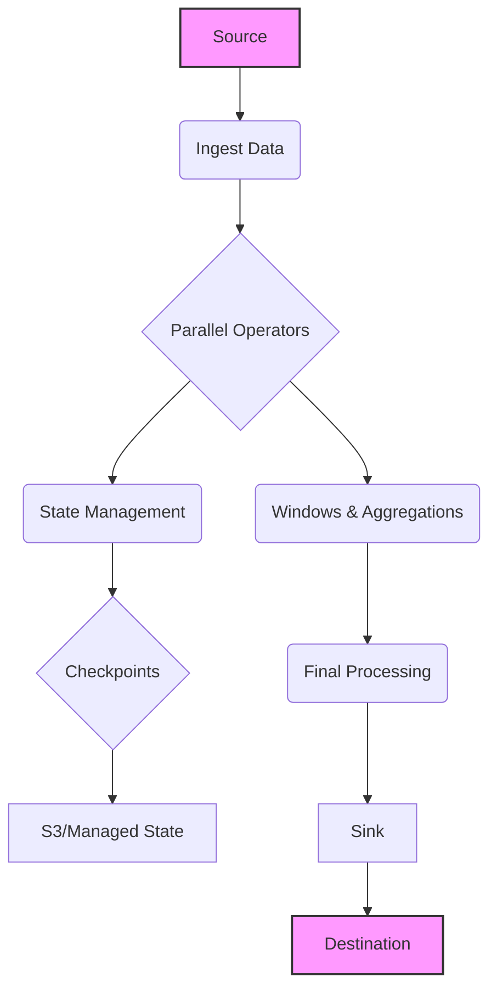
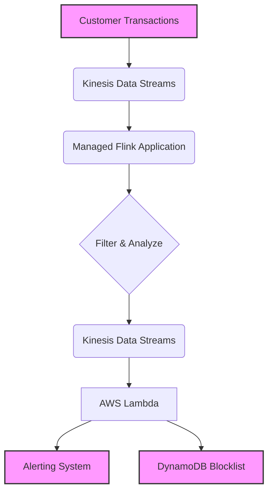
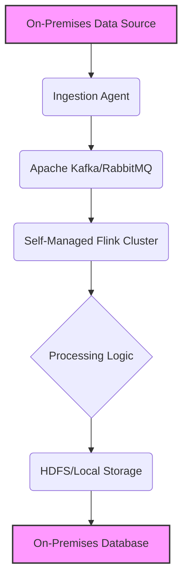

# Apache Flink

## Apache Flink

### 🌟 Overview

Amazon Managed Service for Apache Flink is a fully managed, serverless service that simplifies the process of building, managing, and running applications for real-time stream processing. It's built on the open-source Apache Flink framework, a powerful engine for stateful computations over data streams.

This service takes care of the underlying infrastructure—like provisioning compute resources, scaling, and fault tolerance—allowing you to focus on your application logic. You can use it to perform real-time analytics, continuous ETL (Extract, Transform, Load), and build event-driven applications with low latency.

<figure><figcaption></figcaption></figure>

**Innovation Spotlight** As of late 2024/early 2025, a key innovation for Amazon Managed Service for Apache Flink is the introduction of **in-place version upgrades**. This feature allows you to upgrade your running Flink application to a newer Apache Flink version without losing application state or needing to create a new application. It retains all application-related configurations, including snapshots, logs, metrics, and tags, significantly simplifying maintenance and reducing operational overhead. The service also continues to expand its support for various programming languages and connectors, including enhanced support for Python (PyFlink), making it more accessible to a wider range of developers.

***

### ⚡ Problem Statement 🤝Business Use Cases

A common business problem is real-time fraud detection for online transactions. A financial technology company needs to analyze millions of transactions as they happen to identify suspicious patterns, such as multiple small purchases from different locations in a short period. Waiting for a daily batch job to run would be too late, as the fraudulent activity would have already occurred.

Amazon Managed Service for Apache Flink solves this by providing a platform to process this data in real time. The service can ingest a continuous stream of transaction events and apply complex logic to each event, such as comparing a new transaction's location to the user's previous transaction history within a specific time window. If a suspicious pattern is detected, the application can immediately trigger an alert or even a temporary block on the account, preventing further fraud.

This solution is applicable across various industries:

* **e-Commerce**: Real-time inventory updates and personalized product recommendations.
* **Gaming**: Live leaderboards and user behavior analysis to detect cheating or create targeted offers.
* **IoT**: Monitoring sensor data from connected devices to detect anomalies or predict equipment failures.
* **Ad-Tech**: Real-time bidding and clickstream analysis for digital marketing campaigns.

***

### 🔥 Core Principles

The service operates on the core principles of stream processing:

* **High Throughput and Low Latency**: It can process millions of events per second with sub-second latency.
* **Stateful Processing**: Flink applications can maintain and manage state over time, which is crucial for use cases like sessionization, windowing, and anomaly detection. The service uses **checkpoints** (for automated fault tolerance) and **snapshots** (for manual backups and versioning) to ensure application state is preserved.
* **Exactly-Once Processing**: It guarantees that each event is processed exactly once, ensuring data consistency and accuracy, even in the event of failures.
* **Serverless and Auto-Scaling**: The underlying infrastructure is fully managed by AWS. The service automatically scales the number of **Kinesis Processing Units (KPUs)** based on the workload to handle fluctuating data volumes, so you don't have to manually provision or manage servers.

Associated Resources and Sub-services:

* **Managed Service for Apache Flink Applications**: The core resource where you deploy and run your Flink code. You can deploy applications using either the DataStream API (Java, Scala, Python) for low-level control or the SQL API for simplified data manipulation.
* **Managed Service for Apache Flink Studio Notebooks**: A web-based development environment based on Apache Zeppelin. It provides an interactive way to query and analyze streaming data using Flink SQL, making it easy for data analysts to get started without deep programming knowledge.

***

### 📋 Pre-Requirements

1. **IAM Role**: An IAM service role for the Flink application with permissions to read from the source stream (e.g., Kinesis Data Streams), write to a destination (e.g., S3, Kinesis Data Firehose), and access your application code in an S3 bucket.
2. **Input Data Stream**: A source for your streaming data, such as Amazon Kinesis Data Streams, Amazon MSK (Managed Streaming for Apache Kafka), or a Kinesis Data Firehose.
3. **Output Destination**: A sink where the processed data will be written. This could be Amazon S3 for archival, an Amazon OpenSearch Service domain for real-time dashboards, or another Kinesis Data Stream.
4. **Application Code**: Your Flink application code packaged as a JAR file (for Java/Scala) or a ZIP file (for Python), stored in an Amazon S3 bucket.

***

### 👣 Implementation Steps

Here's a simplified guide for a real-time fraud detection pipeline:

1. **Set up Input and Output Streams**:
   * Create an Amazon Kinesis Data Stream to ingest transaction data.
   * Create a second Amazon Kinesis Data Stream to output processed fraud alerts.
2. **Configure IAM Roles**:
   * Create an IAM role for your Flink application.
   * Attach a policy that grants `kinesis:GetRecords`, `kinesis:GetShardIterator`, `kinesis:ListShards`, and `kinesis:DescribeStream` permissions for the input stream, and `kinesis:PutRecord` and `kinesis:PutRecords` for the output stream.
   * Add a trust relationship for the `kinesisanalytics.amazonaws.com` service.
3. **Prepare Application Code**:
   * Write your Flink application logic (e.g., in Java). The code will read from the input stream, apply windowing logic to aggregate transactions per user over a 5-minute period, and filter for suspicious patterns (e.g., more than 10 transactions in that window).
   * Package your code into a JAR file.
   * Upload the JAR file to a dedicated Amazon S3 bucket.
4. **Create the Flink Application**:
   * Go to the Amazon Managed Service for Apache Flink console.
   * Choose "Create application" and give it a name.
   * Select the Flink runtime environment and specify the S3 location of your JAR file.
   * Configure the input stream to use the Kinesis Data Stream you created.
   * Configure the output stream to write results to your fraud alert stream.
5. **Run and Monitor**:
   * Start the application. The service will automatically provision resources and deploy your code.
   * Monitor the application's health and metrics (like KPU usage and latency) using Amazon CloudWatch. The Flink dashboard also provides granular insights.

***

### 🗺️ Data Flow Diagram

#### Diagram 1: Internal Flink Application Data Flow

#### Diagram 2: Real-time Fraud Detection Use Case Data Flow

***

### 🔒 Security Measures

* **IAM Least Privilege**: Use IAM roles with the minimum necessary permissions for your Flink application to access sources, sinks, and S3 buckets.
* **VPC Integration**: Run your Flink application within a Virtual Private Cloud (VPC) to keep it isolated from the public internet and secure its connections to other AWS services like Amazon MSK or Amazon Redshift.
* **Encryption**: Ensure data is encrypted both in transit and at rest. Kinesis Data Streams and S3 support encryption with AWS KMS. Flink also provides mechanisms to encrypt application state.
* **Monitoring and Logging**: Use Amazon CloudWatch to monitor application metrics and logs. Set up alarms to be notified of any anomalies or failures.

***

### When to Use and When Not to Use

✅ **When to use**:

* You need to perform stateful computations over streaming data (e.g., sessionization, windowing, or aggregations over time).
* You require exactly-once processing guarantees for data accuracy.
* You prefer a serverless, managed solution to avoid operational overhead.
* You have complex stream processing logic that goes beyond simple SQL queries (e.g., using Java, Scala, or Python).
* You need a highly scalable and fault-tolerant solution that can handle unpredictable data spikes.

❌ **When not to use**:

* Your data is at rest (batch processing) and does not require real-time analysis. Alternative services like AWS Glue or Amazon EMR are better suited for these workloads.
* Your stream processing needs are simple and can be handled by a simpler service like Amazon Kinesis Data Firehose (for simple data delivery) or a simple AWS Lambda function.
* Your team lacks experience with Apache Flink.
* You require a custom, highly specific Flink setup that is not supported by the managed service.

***

### 💰 Costing Calculation

Amazon Managed Service for Apache Flink is a pay-as-you-go service with no upfront costs. The primary cost drivers are:

1. **Kinesis Processing Units (KPUs)**: The compute resources used to run your application. A KPU is a combination of 1 vCPU and 4 GB of memory. You are charged an hourly rate per KPU.
2. **Running Application Storage**: Storage allocated for application state, with 50 GB assigned per KPU. You are charged per GB-month.
3. **Durable Application Backups**: Storage for snapshots used for disaster recovery or versioning. You are charged per GB-month.

**Sample Cost Calculation (US East - N. Virginia)**

* **Scenario**: A Flink application uses 4 KPUs, running 24/7 for a month (30 days). It uses 200 GB of running application storage (4 KPUs \* 50 GB).
* **KPU Cost**: (4 KPUs + 1 orchestration KPU) \* 24 hours/day \* 30 days/month \* $0.11/KPU-hour = $396.
  * Note: The service automatically adds an extra KPU for orchestration, so a 4-KPU application is billed for 5 KPUs.
* **Running Application Storage Cost**: 200 GB-month \* $0.10/GB-month = $20.00.
* **Total Monthly Cost**: $396 + $20 = **$416.00** (excluding data transfer and durable backup costs).

**Tips for Cost-Efficient Usage**:

* Use auto-scaling to match KPU usage with your workload, preventing over-provisioning during off-peak hours.
* Regularly monitor CloudWatch metrics to right-size your application's KPUs.
* Optimize your Flink application code to be more efficient, reducing the number of KPUs required.

***

### 🧩 Alternative Services

| Service                                         | Platform   | Key Differences                                                                                                                                                |
| ----------------------------------------------- | ---------- | -------------------------------------------------------------------------------------------------------------------------------------------------------------- |
| **Amazon Managed Service for Apache Flink**     | AWS        | Fully managed, serverless, and optimized for Apache Flink. Ideal for complex, stateful streaming jobs.                                                         |
| **AWS Kinesis Data Analytics for SQL** (Legacy) | AWS        | Was a managed service for simple SQL on streams, but is being phased out in favor of Managed Flink for SQL and Studio.                                         |
| **Amazon EMR (with Flink)**                     | AWS        | Provides a managed cluster for Flink, but you must manage the cluster itself. Offers more control and customization but has higher operational overhead.       |
| **Azure Stream Analytics**                      | Azure      | A fully managed PaaS for streaming analytics, primarily using a SQL-like language. Less flexible than Managed Flink for custom code.                           |
| **Google Cloud Dataflow**                       | GCP        | Fully managed service for both stream and batch processing, based on Apache Beam. Highly scalable and integrates well with other GCP services.                 |
| **On-Premise Flink Cluster**                    | On-Premise | Requires full management of the cluster (servers, networking, monitoring). Provides complete control but involves significant operational complexity and cost. |

**On-premise Flink Cluster Data Flow**

***

### ✅ Benefits

* **Serverless and Scalable**: Eliminates the need to manage infrastructure and automatically scales to meet demand.
* **Reliability**: Provides high availability with automatic failover and fault tolerance through checkpoints and snapshots.
* **Simplified Development**: Offers an interactive studio notebook experience with Flink SQL, making it accessible to a wider audience, and supports multiple programming languages.
* **Exactly-Once Guarantees**: Ensures data consistency and reliability for mission-critical applications.
* **Deep Integration**: Seamlessly connects with other AWS services, enabling the creation of end-to-end data pipelines.

***

### 📝 Summary

Amazon Managed Service for Apache Flink is a powerful, serverless platform for building real-time stream processing applications. It handles the operational heavy lifting of running Apache Flink, so you can focus on building sophisticated applications that provide immediate business value. Its core strength lies in its ability to handle complex, stateful computations with low latency and high reliability, making it an excellent choice for use cases like fraud detection and real-time analytics.

#### Key Points to Remember:

* It's a fully managed, serverless service for stream processing.
* Built on the open-source Apache Flink framework.
* Supports stateful, low-latency, and exactly-once processing.
* Priced based on KPU hours, running application storage, and durable backups.
* Excellent for real-time fraud detection, IoT analytics, and event-driven applications.
* Offers an easy-to-use Studio Notebook for Flink SQL development.
* The in-place version upgrade feature simplifies maintenance.

***

### 🔗 Related Topics & Resources

* **Amazon Kinesis Data Streams**: For real-time data ingestion.
* **Amazon Kinesis Data Firehose**: For delivering streaming data to destinations.
* **Amazon Managed Streaming for Apache Kafka (Amazon MSK)**: For running Apache Kafka clusters.
* **Amazon OpenSearch Service**: For real-time analytics and visualization of processed data.
* **AWS Lambda**: For serverless event-driven processing of Flink outputs.
* [Amazon Managed Service for Apache Flink Developer Guide](https://docs.aws.amazon.com/managed-flink/latest/java/what-is.html)
* [Apache Flink official website](https://flink.apache.org/)
