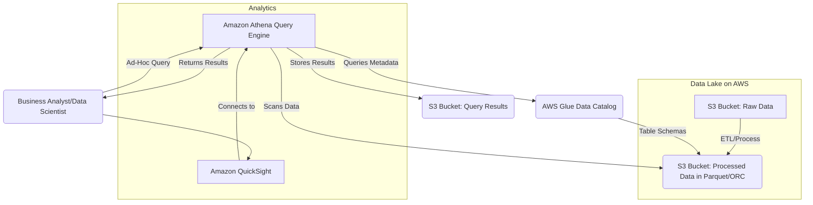
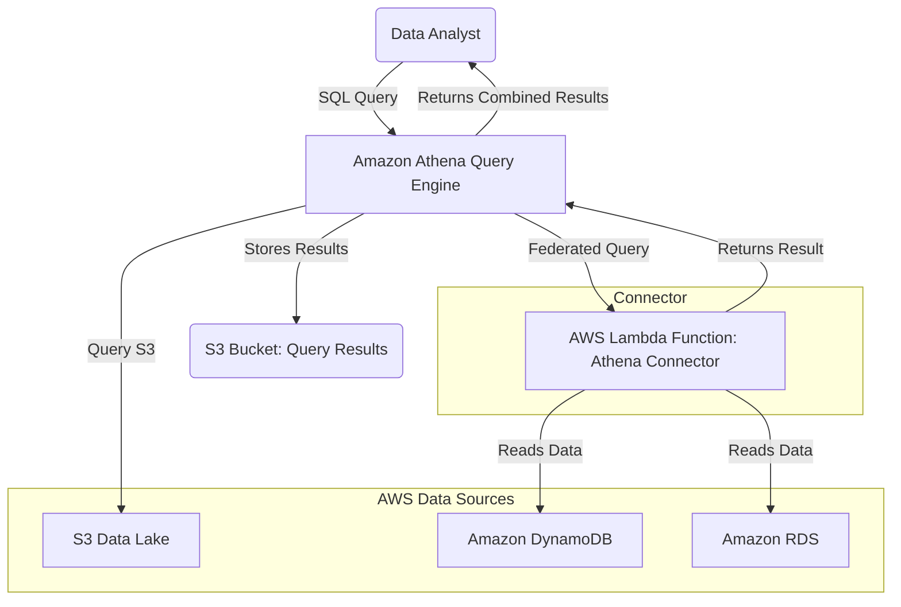
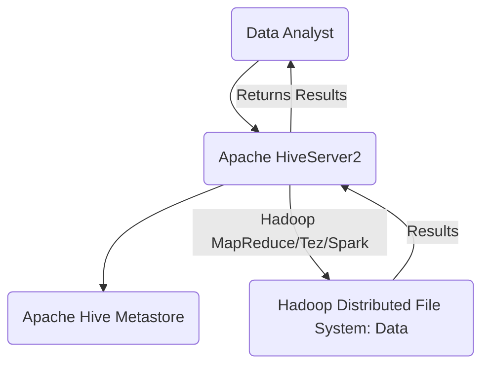

# Athena

## Amazon Athena

### 🌟 Overview: What is Amazon Athena?

Amazon Athena is a serverless, interactive query service that makes it easy to analyze data directly in Amazon S3 using standard SQL. It's designed for ad-hoc analysis, meaning you don't need to load data into a separate database, manage complex infrastructure, or set up data pipelines for every query. Instead, you simply point Athena at your data in S3, define a schema, and start querying. It uses the open-source **Presto** distributed query engine and is a core component of building a cost-effective and flexible data lake on AWS.

<figure><figcaption></figcaption></figure>

The true innovation of Athena lies in its **"query-in-place"** model. This is a paradigm shift from traditional data warehousing where you would first have to perform Extract, Transform, and Load (ETL) processes to move data into a rigid, structured database. With Athena, your data can remain in its native format (CSV, JSON, Parquet, etc.) in a low-cost, highly scalable S3 bucket. Athena's serverless architecture handles the heavy lifting of provisioning, managing, and scaling the compute resources required to run your queries, so you pay only for the data that Athena scans.

### # 🤖 Innovation Spotlight: Athena's Role in a Modern Data Lake

Today, Athena's innovation extends beyond just ad-hoc queries. It's a foundational service for modern data lakes, enabling data teams to:

> **Analyze Diverse Data Sources:** With **Athena Federated Query**, you can now query data from not only S3 but also other data sources like Amazon RDS, DynamoDB, and even on-premises databases using custom connectors. This allows you to combine data from different silos without complex ETL jobs.

> **Enable Data Mesh Architectures:** Athena facilitates a data mesh approach by allowing different business domains to own and serve their data in a decentralized manner, with Athena providing a unified query layer across all domains.

> **Support Advanced Analytics with Spark:** Amazon Athena now supports Apache Spark, allowing data engineers and data scientists to build complex data processing pipelines and perform machine learning tasks directly on their S3 data lake using familiar Python, Scala, and Java code.

***

### ⚡ Problem Statement

A multinational e-commerce company, "GlobalCart," stores terabytes of customer order data, website clickstream logs, and product catalog information in various formats (JSON, CSV, and Parquet) in an Amazon S3 data lake. The business analytics team needs to perform frequent, ad-hoc analysis to answer questions like:

* "What were the top 10 best-selling products in Europe last month?"
* "How did a new website feature affect user clickstream behavior in the last 24 hours?"
* "What is the average order value for customers who used a specific promotional code?"

Loading this massive, constantly changing dataset into a traditional data warehouse is time-consuming and expensive. The team needs a flexible, cost-effective solution that allows them to run quick, interactive queries without managing any infrastructure.

### 🤝 Business Use Cases

* **E-commerce & Retail:** Analyzing sales data, customer behavior, and marketing campaign effectiveness.
* **Gaming:** Analyzing player actions, in-game purchases, and event logs for game balancing and monetization.
* **IoT (Internet of Things):** Processing and analyzing time-series data from sensors to monitor equipment health and predict maintenance needs.
* **Media & Advertising:** Analyzing website traffic, user engagement, and ad performance to optimize content and advertising strategies.

***

### 🔥 Core Principles

* **Serverless and Pay-per-Query:** Athena is completely serverless. You don't manage any servers or clusters. You pay only for the amount of data scanned by your queries.
* **Data Lake Integration:** Athena is designed to work seamlessly with a **data lake** on Amazon S3. The data remains in S3, ensuring data governance, durability, and cost-effectiveness.
* **Standard SQL Interface:** Athena uses ANSI SQL, making it accessible to anyone with basic SQL knowledge. This democratizes data access and analysis across an organization.
* **Schema-on-Read:** Unlike a traditional database that requires a schema to be defined before data is loaded (**schema-on-write**), Athena uses a **schema-on-read** approach. You define the schema at query time, which is perfect for handling diverse, unstructured, or semi-structured data.
* **Performance and Optimization:** Athena leverages columnar formats like Parquet and ORC, as well as data partitioning, to significantly reduce the amount of data it needs to scan, leading to faster queries and lower costs.

### :man\_firefighter: Core Resources & Services

* **Amazon S3:** The primary data store for your data lake. Athena directly queries the files stored here.
* **AWS Glue Data Catalog:** This is the central repository for your metadata (table definitions, schemas, and locations). Athena uses the Glue Data Catalog to understand the structure of the data in your S3 bucket.
* **AWS Identity and Access Management (IAM):** Used to control access to Athena and the underlying S3 data.
* **Amazon Athena Workgroups:** Logical groups that allow you to isolate query execution, enforce cost limits, and control access for different teams or workloads.
* **Athena Federated Query:** A feature that allows Athena to run SQL queries across data stored in other data sources besides S3 using custom connectors (e.g., Lambda functions).

***

### 📋 Pre-Requirements

* **An AWS Account:** You need an active AWS account with the necessary permissions.
* **Amazon S3 Bucket:** A bucket to store your raw data and a separate bucket (or folder) for Athena's query results.
* **AWS Glue (Optional but Recommended):** Using an AWS Glue Crawler to automatically discover and catalog the schema of your data is highly recommended. It creates the table definitions in the Glue Data Catalog that Athena will use.

***

### 👣 Implementation Steps

1. **Set up an S3 Data Lake:**
   * Create a dedicated S3 bucket for your raw data (e.g., `s3://globalcart-datalake-raw`).
   * Create another S3 bucket for Athena query results (e.g., `s3://globalcart-athena-results`).
2. **Upload Data to S3:**
   * Place your raw data files (e.g., `orders.json`, `clickstream.csv`) into the appropriate S3 data lake folders.
   * For optimal performance and cost, convert your data to a columnar format like Parquet and partition it (e.g., by year, month, and day).
3. **Create a Glue Data Catalog (Automated):**
   * Navigate to the **AWS Glue** console.
   * Go to **Crawlers** and click **"Create crawler."**
   * Point the crawler to your S3 data lake bucket (`s3://globalcart-datalake-raw/orders`).
   * The crawler will analyze your data and automatically create a database and table in the Glue Data Catalog, inferring the schema.
4. **Configure Amazon Athena:**
   * Go to the **Amazon Athena** console.
   * The first time you use it, you'll be prompted to set up a query results location. Point this to your results S3 bucket (`s3://globalcart-athena-results`).
   * In the Query Editor, select the database and table that the AWS Glue Crawler created.
5. **Run Your First Query:**
   * You can now write and execute standard SQL queries.
   * For example: `SELECT product_id, SUM(quantity) FROM "globalcart_db"."orders_parquet" WHERE country = 'Europe' AND order_date >= '2025-08-01' GROUP BY product_id ORDER BY SUM(quantity) DESC LIMIT 10;`

***

### 🗺️ Data Flow Diagram

**Diagram 1: Ad-Hoc Query on S3 Data Lake**

**Diagram 2: Federated Query for Cross-Silo Analysis**

***

### 🔒 Security Measures

* **IAM Roles and Policies:** Adhere to the principle of least privilege. Create specific IAM roles for Athena users with permissions only to query a defined set of tables and buckets. Do not use the root user.
* **VPC Endpoints:** Use **VPC interface endpoints** for Athena to ensure that all query traffic between your VPC and Athena remains within the AWS network, without traversing the public internet.
* **Encryption:** Enforce end-to-end encryption.
  * **Encryption at Rest:** Enable **Server-Side Encryption (SSE)** on your S3 buckets (both for data and query results) using S3-managed keys (SSE-S3) or, for greater control, KMS keys (SSE-KMS).
  * **Encryption in Transit:** Athena encrypts data in transit when communicating with S3.
* **AWS Lake Formation:** For fine-grained access control on your data lake, integrate Athena with AWS Lake Formation. This allows you to define row-level and column-level security policies.
* **Audit Logging:** Enable AWS CloudTrail to log all API calls made to Athena and S3. This provides an audit trail for security and compliance purposes.

***

### ⚖️ When to Use and When Not to Use

### # ✅ When to use

* **Ad-hoc Queries:** Perfect for data analysts and data scientists who need to run infrequent, interactive queries on large datasets without setting up a dedicated data warehouse.
* **Log Analysis:** A great fit for analyzing application, web server, or VPC Flow Logs stored in S3.
* **Cost-Effective Analytics:** When your query volume is variable or unpredictable. Since you only pay for what you scan, it can be much more cost-effective than a continuously running data warehouse.
* **Data Lake Exploration:** The ideal tool for exploring and understanding the structure of raw data in your S3 data lake.

### # ❌ When not to use

* **High-Concurrency OLAP:** Not suitable for business intelligence dashboards that require sub-second query response times for a large number of concurrent users. A service like Amazon Redshift is better for this.
* **Transactional Workloads (OLTP):** Athena is not a transactional database. It does not support `UPDATE`, `INSERT`, or `DELETE` statements on existing data. It's an analytics engine.
* **ETL/Batch Processing:** For complex, scheduled, and large-scale data transformations, a service like **AWS Glue** or **Amazon EMR** would be more appropriate.
* **Real-time Analytics:** While fast, Athena is not for true real-time streaming analytics (e.g., ingesting and querying data with millisecond latency).

***

### 💰 Costing Calculation

Athena's pricing is straightforward: **$5 per terabyte (TB) of data scanned**.

* **How it's Calculated:** The cost is based on the uncompressed size of the data that Athena reads to execute your query. It's rounded up to the nearest megabyte, with a 10 MB minimum per query. There are no charges for DDL (Data Definition Language) statements like `CREATE TABLE` or `ALTER TABLE`.
* **Efficient Way of Handling Cost:** The key to managing Athena costs is to **reduce the amount of data scanned**.
  * **Data Partitioning:** Organize your S3 data by logical partitions (e.g., `s3://bucket/year=2025/month=09/day=07/`). When you query, use a `WHERE` clause on the partition key, and Athena will only scan the specific partitions you need.
  * **Columnar Formats:** Store your data in formats like **Apache Parquet** or **ORC**. These formats allow Athena to read only the columns required by your query, not the entire row. This can result in significant cost savings.
  * **Compression:** Compress your data files (e.g., Gzip, Snappy). This reduces the physical size of the data in S3 and, consequently, the amount of data that Athena has to scan.
* **Sample Calculation:**
  * Scenario: You have 10 TB of raw CSV data in S3.
  * Query 1: Running a query on this unoptimized data requires scanning the full 10 TB.
    * Cost: $5/TB \* 10 TB = **$50.00**
  * Scenario 2: You convert the 10 TB of data to Parquet, which reduces the size by 75% to 2.5 TB. You also partition the data by `year` and `month`. A new query only needs data from the last month, which is 100 GB (0.1 TB) of uncompressed data.
    * Cost: $5/TB \* 0.1 TB = **$0.50**

This simple example shows how optimizing your data format and partitioning can lead to a 100x cost reduction.

***

### 🧩 Alternative Services in AWS/Azure/GCP/On-Premise

| Service                        | Platform         | Key Comparison/Difference                                                                                                                                                                                     |
| ------------------------------ | ---------------- | ------------------------------------------------------------------------------------------------------------------------------------------------------------------------------------------------------------- |
| **Amazon Redshift**            | AWS              | A fully managed, petabyte-scale data warehouse for business intelligence (BI) and reporting. It is not serverless and requires cluster management. Excellent for high-concurrency, fast-response dashboards.  |
| **Amazon EMR**                 | AWS              | A managed cluster platform that runs big data frameworks like Apache Spark, Hadoop, and Hive. EMR is for complex, large-scale ETL and batch processing, not for simple ad-hoc SQL queries.                    |
| **Azure Synapse Analytics**    | Azure            | A unified analytics service that combines data warehousing, data integration, and big data analytics. It offers both serverless SQL pools (similar to Athena) and dedicated SQL pools.                        |
| **Google BigQuery**            | GCP              | A serverless, highly scalable, and cost-effective multi-cloud data warehouse. It's a close competitor to Athena and Redshift, known for its incredible speed and cost-effectiveness on massive datasets.      |
| **Trino/Presto (Self-hosted)** | On-Premise/Cloud | Open-source distributed SQL query engine. You have full control over the infrastructure, but you are responsible for provisioning, managing, and scaling the clusters. This is the engine Athena is based on. |
| **Apache Hive**                | On-Premise/Cloud | A data warehouse software project built on top of Hadoop. It provides a SQL-like interface to query data. Requires significant infrastructure management and is typically slower than modern alternatives.    |

### 🗄️On-Premise Alternative Data Flow (Apache Hive)

* **Description:** A user connects to the HiveServer2, which processes the SQL query. The Hive Metastore stores the table definitions. The query is translated into a batch processing job (e.g., MapReduce or Spark) that runs on the data stored in HDFS. This is a much heavier, management-intensive process compared to Athena.

***

### ✅ Benefits

* **Cost-Effective:** Pay only for what you query, with no upfront costs or minimum fees.
* **Serverless:** No infrastructure to manage, provision, or scale. AWS handles all of it.
* **High Performance:** Provides fast query results, especially when data is partitioned and in a columnar format.
* **Scalability:** Automatically scales compute resources to meet query demands.
* **Flexibility:** Works with various data formats (CSV, JSON, Parquet, ORC, etc.) and allows for schema-on-read.
* **Integration:** Deeply integrated with other AWS services like S3, Glue, and QuickSight, making it a perfect component of a modern data lake.

***

### 📝 Summary

Amazon Athena is a powerful, serverless query engine that simplifies the process of analyzing data in your S3 data lake. By using a pay-per-query model and a schema-on-read approach, it provides a flexible and cost-effective solution for ad-hoc analysis, especially for logs and large, unstructured datasets. Its core strength lies in allowing data analysts to explore data in place, without the overhead of a traditional data warehouse. The key to success with Athena is to optimize your data format and partitioning to minimize the amount of data scanned, directly impacting both performance and cost.

### # Top 5 Things to Keep in Mind:

1. **Optimize your data first:** Always prioritize converting your data to columnar formats (Parquet, ORC) and partitioning it. This is the single most important factor for cost and performance.
2. **No DML operations:** Remember, Athena is for analytics. You cannot use it to `UPDATE`, `INSERT`, or `DELETE` existing data.
3. **Glue Data Catalog is your friend:** Leverage AWS Glue Crawlers to automatically manage your table schemas. This saves you from tedious manual work.
4. **Security is paramount:** Use IAM policies and Lake Formation to enforce the principle of least privilege, ensuring users can only access the data they need to.
5. **Not for everything:** While powerful, Athena isn't a silver bullet. Use dedicated data warehouses like Redshift for high-concurrency BI dashboards and services like AWS Glue for complex ETL.

***

### 🔗 Related Topics

* [Amazon S3 Documentation](https://aws.amazon.com/s3/)
* [AWS Glue Documentation](https://aws.amazon.com/glue/)
* [Amazon Redshift Documentation](https://aws.amazon.com/redshift/)
* [AWS Big Data Blog](https://aws.amazon.com/blogs/big-data/)
* [Amazon Athena Federated Query](https://www.google.com/search?q=https://aws.amazon.com/blogs/big-data/amazon-athena-federated-query-a-technical-deep-dive/)
